# balloonui

**Language:** English | [中文](README.md)

A no-HWND DUI (DirectUI) control library for Windows desktop apps, shipped
together with several full-feature demos and an all-controls showcase window
(DuiGallery). Built with Visual Studio 2022 + WTL 10.1 + Win32 API — no
external dependencies, works out of the box.

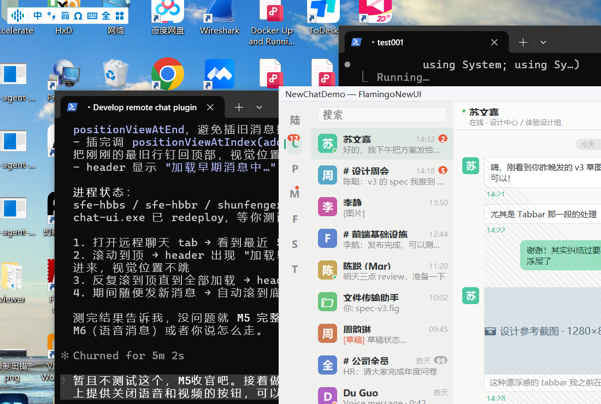

---

## What problem does this library solve

In traditional Win32/WTL apps every control is its own HWND, which causes:

- HWND counts explode on complex UIs, hurting repaint and event routing;
- Translucency, animation, and custom-drawn effects are awkward (child
  HWNDs occlude each other's DCs);
- High-DPI adaptation has to be done per-control.

balloonui takes the **"one HWND for the host, every child is pure DUI"**
approach:

- A single `DuiHost` owns the only HWND; the entire control tree lives
  inside its client area;
- Child controls derive from `DuiControl`, have no HWND of their own, and
  bubble events to the parent window through `WM_DUI_NOTIFY`;
- Even the controls that depend on the system IME are **no exception**: the
  plain text box `DuiEdit` and the rich-text control `DuiRichEdit` are both
  windowless — they drive the system RichEdit text-layout engine directly
  and supply the IME context and caret themselves, so both are ordinary
  members of the DUI tree. The library no longer provides any facility for
  attaching a real window to the control tree: every control is painted by
  the library itself, is clipped by its parent container, and takes part in
  the same paint order.

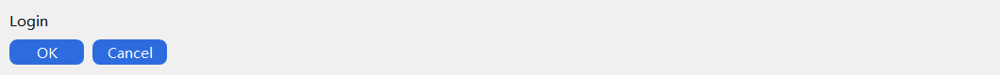

---

## Control overview

The library ships with 30+ controls, grouped into seven categories under
`balloonui/Controls/`:

| Category | Controls |
|---|---|
| Basic | `DuiLabel` `DuiButton` `DuiAvatar` `DuiBadge` `DuiSeparator` `DuiGroupBox` `DuiToast` |
| Input | `DuiEdit` `DuiRichEdit` `DuiSearchBox` `DuiSpinBox` `DuiComboBox` `DuiSlider` `DuiSwitch` |
| List / container | `DuiListBox` `DuiVirtualList` `DuiTreeView` `DuiTab` `DuiTabPage` `DuiMenu` `DuiMenuBar` |
| Layout | `DuiLayout` (`DuiVBox` / `DuiHBox` / `DuiGrid`) `DuiDock` `DuiSplitter` |
| Feedback | `DuiProgressBar` `DuiToolTip` `DuiPopupHost` `DuiEmojiPanel` |
| Media | `DuiGif` `DuiImageOle` |
| Window / system | `DuiFrameWindow` `DuiScrollBar` |

### Buttons: brand color + multiple forms

`DuiButton` in PushButton mode defaults to brand blue `#2D6CDF` with an 8px
corner radius; hover / pressed / disabled states are derived automatically.
The same `DuiButton` class also acts as Checkbox / Radio / Icon, sharing
the same click, focus, and hit-test plumbing.


### Input: windowless, native IME, composite controls

The plain text box `DuiEdit` is a subclass of the rich-text control
`DuiRichEdit`. Neither creates a child window: they drive the system
RichEdit text-layout engine directly and own the IME context, the caret,
and the scroll bars, which is what lets them be overlapped by other
controls, live inside scroll containers, use a transparent background, and
grow with their content. Password, multi-line and read-only are plain
property bits that can be toggled at any time, with no destroy-and-rebuild.
On top of the base class, `DuiEdit` adds what a plain text box needs:
Enter does not insert a line break in single-line mode, inline icon gutters
on the left and right, a password reveal toggle, and vertical centering of
single-line text.

`DuiSearchBox`, `DuiSpinBox`, and `DuiComboBox` are composite controls
built on top of the text box.

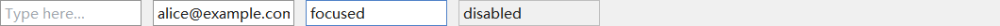


### List / tree: four-quadrant rendering + frozen columns

`DuiTreeView` doubles as a single-level multi-column table and a
multi-level tree. Each column supports 6 cell types
(TEXT / ICON / IMAGE / CHECKBOX / PROGRESS / HYPERLINK), with frozen left
N columns / top N rows, click-to-sort headers, and inline cell editing —
enough to drive a Task-Manager-class data view.

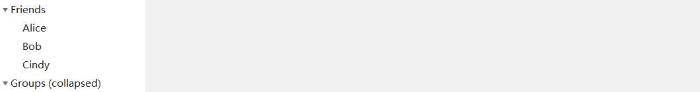
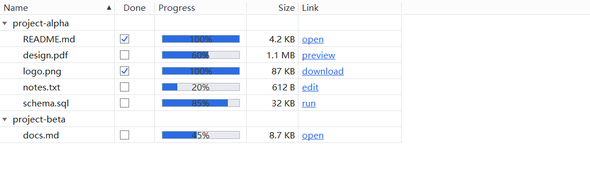
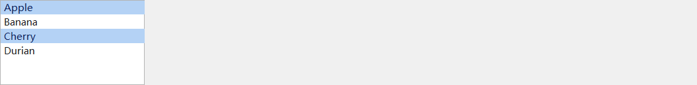

### Layout: declarative + multiple shapes

VBox / HBox / Grid cover the usual linear / grid layouts; Dock provides
"top / bottom / left / right + center fill" IDE-style docking; Splitter
gives you a draggable separator. Layouts can be built imperatively with
chained `AddChild` calls, or declaratively in XML and handed to
`DuiXmlBuilder`.


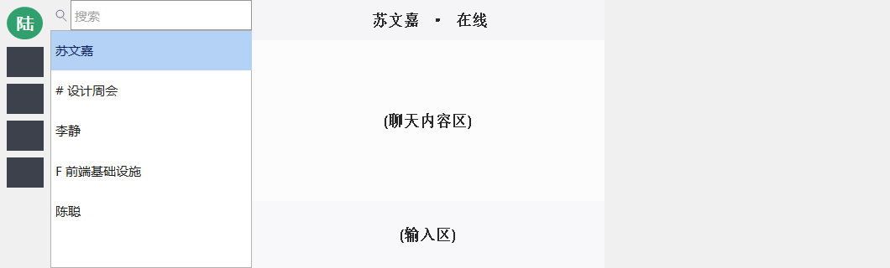
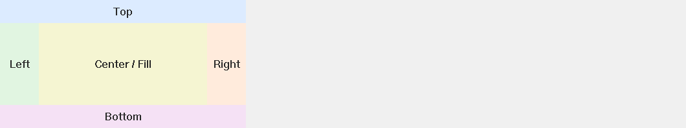

### Tab: horizontal + vertical + auto page swap

`DuiTab` is a pure tab strip (it only tracks "selected"); `DuiTabPage`
sits on top of `DuiTab` and manages the show/hide of multiple content
pages for you.

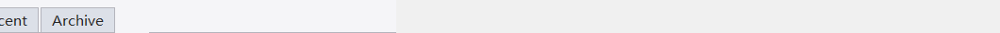
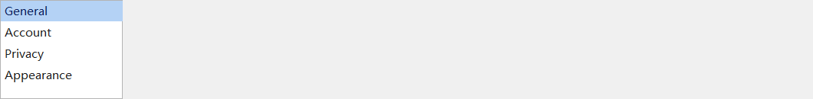

### Feedback: progress bar / popup / emoji panel

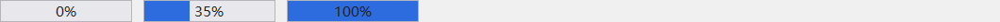


---

## Top-level window: DuiFrameWindow

`DuiFrameWindow` provides a complete borderless top-level window: a
9-grid stretched background, a custom-drawn title bar, min / max / close
buttons, `WM_NCHITTEST`-driven corner resize, and a layout-hosted client
area. Parsing one `<frame-window>` XML snippet with
`DuiXmlBuilder::FromFrameXml` gives you both the window configuration and
the client-area control tree (see "Quick start" below).

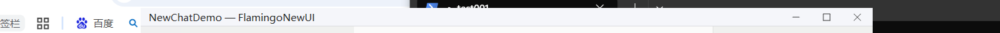
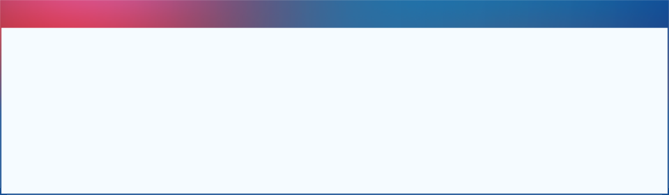
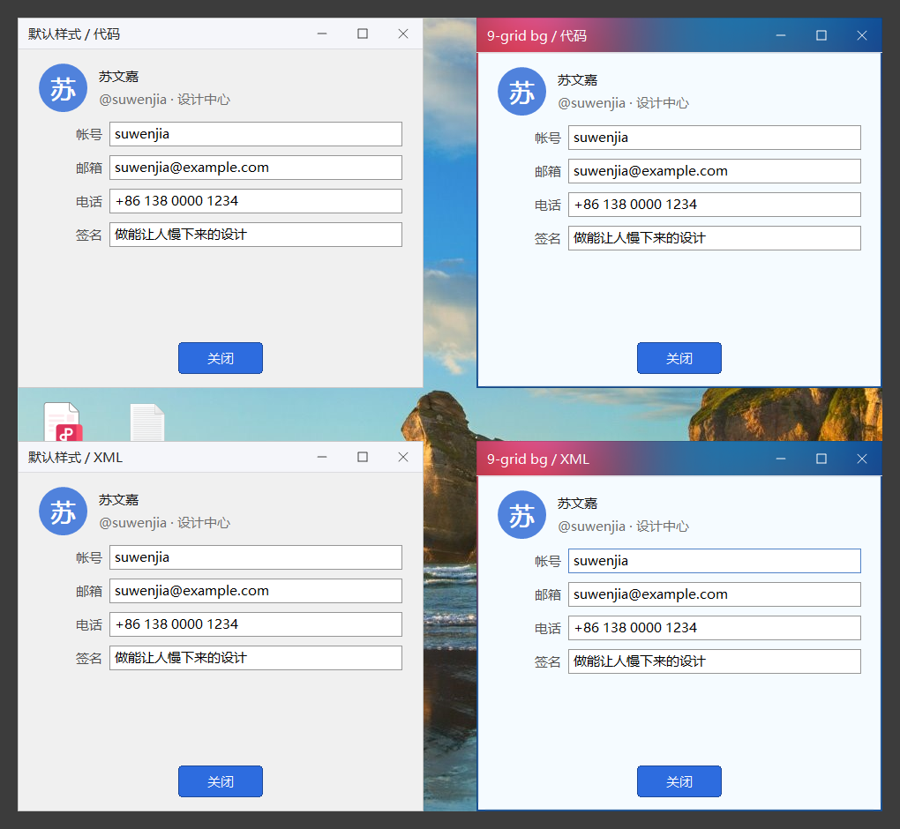

---

## GDI+ anti-aliasing

Non-axis-aligned shapes (triangles, diamonds, arrows, circles, diagonal
lines) MUST go through the helpers in `DuiPaintAA`
(`DuiAA::FillPolygon` / `DuiAA::FillEllipse` / `DuiAA::DrawLine`), which
internally use GDI+ with anti-aliasing enabled. Plain GDI `Polygon` /
`Ellipse` / `LineTo` produce visible jaggies on diagonals and are banned
inside the library.

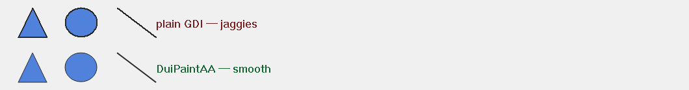

---

## Theme and palette

`DuiTheme` / `DuiResMgr` centrally manage colors, fonts, and spacing.
The default UI font is **Microsoft YaHei 9pt**. The face name and size are
kept by `DuiTheme`; a host can switch them for the UI language with
`DuiTheme::Inst().SetDefaultFontFace()` / `SetDefaultFontPt()` (preferably at
startup, before creating controls: UI already shown picks up the change only
when it repaints). Fonts are cached per face and DPI in `DuiResMgr`, and every
control fetches them through `DuiControl::GetDefaultFont()` with the DPI of its
own window, so text resizes when a window moves to a monitor with a different
scale.


---

## Declarative XML layout

Complex UIs can be described as a short XML snippet and handed to
`DuiXmlBuilder`, which parses it into a control tree — no more long
chains of `AddChild`:

```xml
<frame-window title="Settings" min-w="480" min-h="240">
  <vbox padding="12" gap="8">
    <label text="Account settings" fixedHeight="24"/>
    <hbox gap="8" fixedHeight="28">
      <label text="Username" fixedWidth="60"/>
      <edit id="101" fixedWidth="240"/>
    </hbox>
    <button id="102" text="Save" fixedWidth="96" fixedHeight="32" alignCross="near"/>
  </vbox>
</frame-window>
```

A few conventions that are easy to get wrong: `id` is a number (event
handlers tell controls apart by it; 1–3 are taken by the title bar's
minimize / maximize / close buttons); spacing between children is `gap`;
sizes are `fixedWidth` / `fixedHeight`, and a width inside a vertical box
(or a height inside a horizontal box) also needs `alignCross`, otherwise
the control is stretched; the window's own size is set in code with
`ResizeClient`.

Every built-in tag maps to a built-in control class; business code can
extend the dispatch table through `CustomFactory`.

---

## Feature Strip (compile-time tree-shaking)

`BalloonUiFeatures.h` exposes fine-grained `BUI_DISABLE_XXX` macros so
that business code can compile only the controls it actually uses,
excluding the unused `.cpp` files from the build entirely — which
shrinks the final exe / DLL noticeably. Dependency consistency (for
example, disabling `SCROLLBAR` also forces `LISTBOX` / `TREEVIEW` off;
`EDIT` requires `RICHTEXT`, because `DuiEdit` derives from `DuiRichEdit`)
is enforced inside the header via `#if/#error`, so you can't end up
with a silently half-built library.

See the header comments in `balloonui/BalloonUiFeatures.h` and the
"Feature Strip" section in `docs/guides.html` for details.

---

## Bundled projects

| Project | Path | Description |
|---|---|---|
| balloonui | `balloonui/` | The library itself: `balloonui.vcxproj` builds a DLL, `balloonui_static.vcxproj` a static library |
| DuiGallery | `DuiGallery/` | All-controls showcase window — every control has its own page |
| NewChatDemo | `NewChatDemo/` | Full chat-UI demo (XML layout + custom controls) |
| CloudMelodyDesktop | `CloudMelodyDesktop/` | Desktop music player demo (multi-page + media assets) |
| XChat | `XChat/` | Demo modelled on a popular chat app's PC client (login, multi-view main panel, settings) |
| DemoTaskManager | `DemoTaskManager/` | Task-Manager-style demo (multi-column TreeView + multi Tab) |
| DemoChatBubble | `DemoChatBubble/` | Chat-bubble control demo |
| DemoCircularProgress | `DemoCircularProgress/` | Circular progress ring demo |
| DemoFileTypeIcon | `DemoFileTypeIcon/` | File-type icon demo |
| DemoNinePatchBg | `DemoNinePatchBg/` | 9-grid background stretching demo |
| DemoTextBadgeTile | `DemoTextBadgeTile/` | Text-badge tile demo |
| DemoTreeViewLargeData | `DemoTreeViewLargeData/` | TreeView large-data performance demo |

Open `Demos.sln` at the root to load the DLL build of the library and every
demo above at once. The static-library project
`balloonui/balloonui_static.vcxproj` is not in it; reference it from your own
solution.

### Demo screenshots

NewChatDemo / CloudMelodyDesktop / Task Manager demonstrate full
application-level capability:


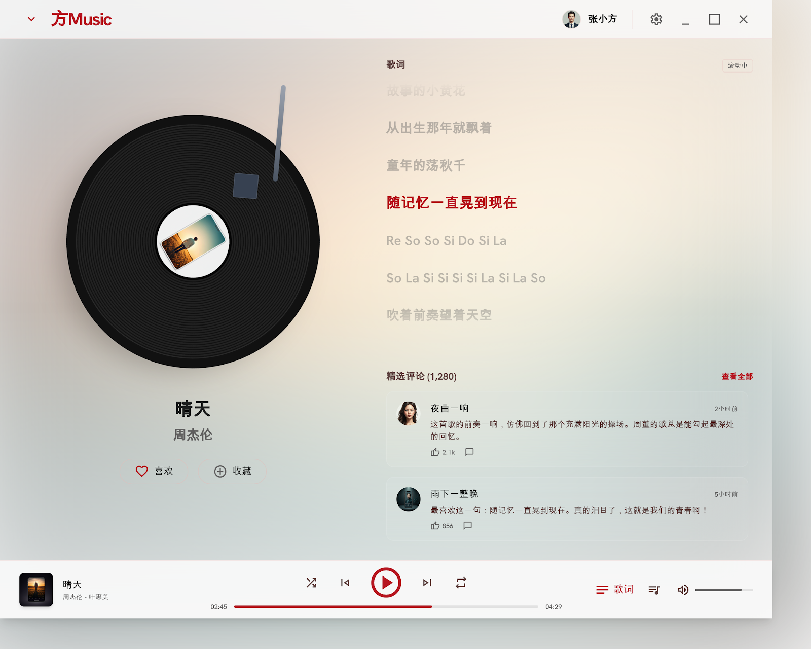
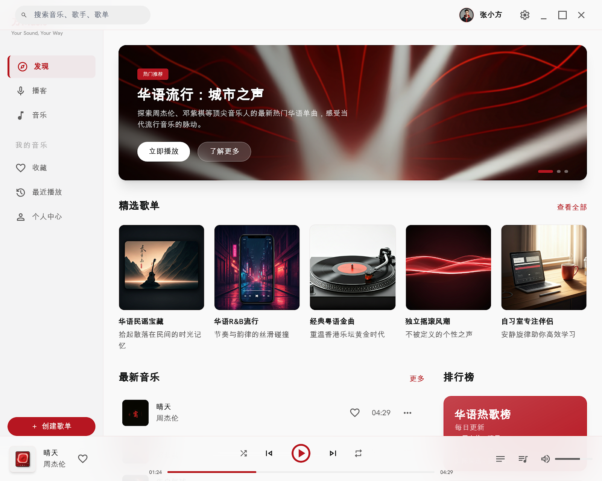
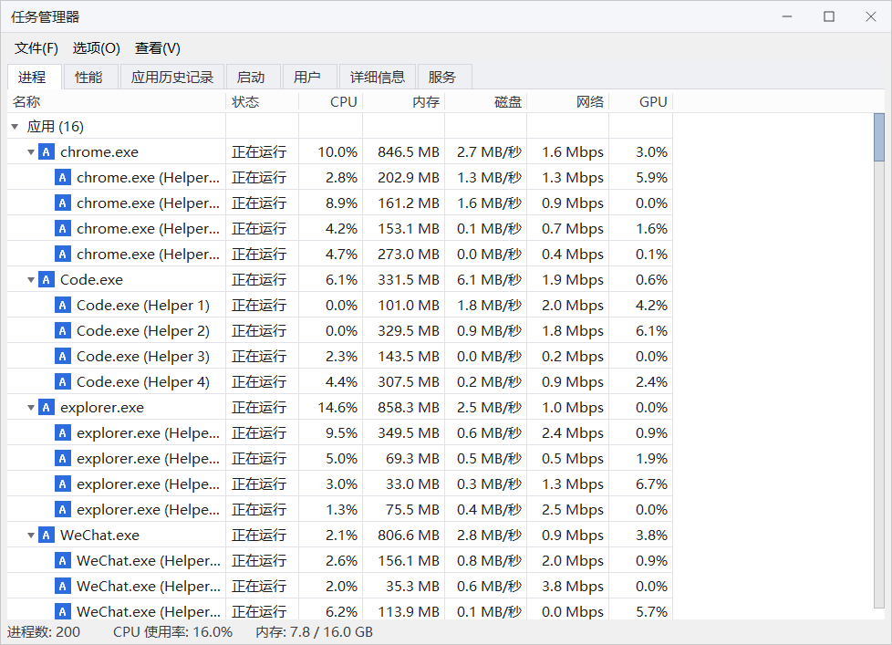
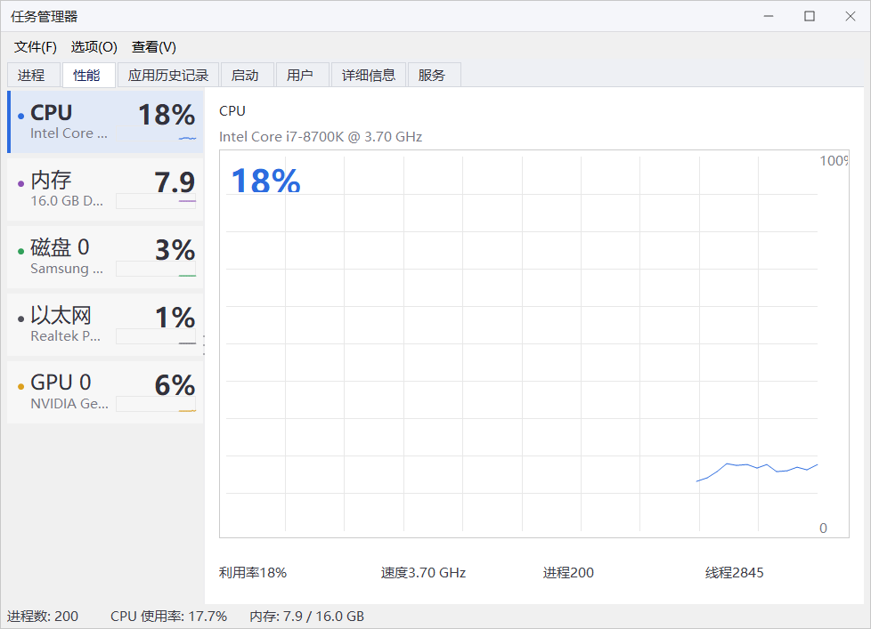

Smaller demos illustrate single controls or single element types:

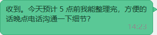
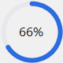


---

## Build requirements

- Visual Studio 2022 (VS 2019 also works, downgrade the toolset yourself)
- WTL 10.1 (a copy is bundled under `wtl10.1/`)
- Platform: **Win32 (x86/x64)**, Debug / Release both fine
- Target OS: Windows 7 and above

---

## Quick start

```cpp
#include "balloonui/DuiXmlBuilder.h"
#include "balloonui/Controls/Window/DuiFrameWindow.h"

using namespace balloonwjui;

// Button id used in the XML. 1-3 are taken by the title bar's minimize /
// maximize / close buttons, so application controls must not use them.
const UINT kIdOk = 101;

// Main window. Control notifications arrive as WM_DUI_NOTIFY on the window
// itself: wParam is the control id, lParam is a DuiNotify*.
class HelloFrame : public DuiFrameWindow
{
public:
    BEGIN_MSG_MAP(HelloFrame)
        MESSAGE_HANDLER(WM_DUI_NOTIFY, OnDuiNotify)
        CHAIN_MSG_MAP(DuiFrameWindow)
    END_MSG_MAP()

    LRESULT OnDuiNotify(UINT, WPARAM, LPARAM lParam, BOOL& bHandled)
    {
        const DuiNotify* n = reinterpret_cast<const DuiNotify*>(lParam);
        if (n->code == DUIN_CLICK && n->ctrlId == kIdOk)
        {
            PostMessage(WM_CLOSE);
            return 0;
        }
        // Hand everything else back: DuiFrameWindow handles the title bar buttons
        bHandled = FALSE;
        return 0;
    }
};

// Create the window (e.g. in WinMain, after WTL's _Module is initialized):
const char* kXml =
    "<frame-window title=\"Hello\" min-w=\"320\" min-h=\"200\">"
    "  <vbox padding=\"16\" gap=\"8\">"
    "    <label text=\"Hello, balloonui!\" fixedHeight=\"24\"/>"
    "    <button id=\"101\" text=\"OK\" fixedWidth=\"88\" fixedHeight=\"32\" alignCross=\"near\"/>"
    "  </vbox>"
    "</frame-window>";

DuiFrameWindowConfig cfg;
std::unique_ptr<DuiControl> root = DuiXmlBuilder::FromFrameXml(kXml, cfg);

HelloFrame frame;
frame.Create(NULL, CWindow::rcDefault, _T("Hello"), WS_OVERLAPPEDWINDOW);
frame.ApplyConfig(cfg);                    // window attributes apply after Create
frame.SetClientContent(std::move(root));   // the subtree inside <frame-window> is the client area
frame.ResizeClient(320, 200);              // whole-window size, title bar included
frame.ShowWindow(SW_SHOW);
```

For richer examples, open the DuiGallery project — every control can be
triggered there in isolation, with all its states reachable from the UI.

---

## Tests

The library's unit tests live in `balloonui/Tests/` and are compiled into the
DuiGallery project (`Debug|Win32`). On startup the Debug build of
`Bin/DuiGallery.exe` runs every case and writes the results to
`%TEMP%\DuiGallery_tests.log`: one `[summary] ... passed=N failed=M` line per
group, failing cases prefixed with `[FAIL]`. You never need to look at the
window — start it, wait for the log, then end the process.
`SystemCaretLeavesNoPixelsOnScreen` in `DuiRichEditCaretTests` captures the
real screen; in an environment without a visible screen (such as a hidden
desktop) it reports `screen capture failed`.

---

## Directory layout

```
balloonui/ (repository root)
├── balloonui/                    Library source
│   ├── Controls/                 Seven category subdirs
│   ├── Tests/                    Unit / integration tests (built into DuiGallery)
│   ├── BalloonUiApi.h            DLL import / export macros
│   ├── BalloonUiFeatures.h       Compile-time feature strip
│   ├── DuiHost / DuiControl / DuiLayout / DuiTheme ...   kernel
│   ├── balloonui.vcxproj         DLL build
│   └── balloonui_static.vcxproj  Static-library build
├── DuiGallery/                   All-controls showcase
├── NewChatDemo/                  Chat UI demo
├── CloudMelodyDesktop/           Music player demo
├── XChat/                        Chat-app PC client demo
├── Demo*/                        Small single-purpose demos
├── docs/
│   ├── guides.html / guides_en.html          Companion guide (source)
│   ├── guides.md / guides_en.md              Markdown version, generated by html_to_md.py
│   ├── windowless-richedit*.md               Design and test notes for the windowless rich edit
│   └── images/                               Documentation assets
├── wtl10.1/                      Bundled WTL 10.1 (with its ReadMe.html)
├── Bin/                          Output directory
├── clear.bat                     Removes build output (git clean -fdX)
└── Demos.sln                     Loads the DLL build and every demo
```

---

## Full user guide

A more in-depth manual (16 chapters + an appendix, covering the control
reference, XML layout, event routing, custom-drawn controls, full layout
examples, the 9-grid background, the Feature Strip, three case studies,
and a glossary):

- Markdown (renders natively on GitHub and similar platforms)
  - English: [`docs/guides_en.md`](docs/guides_en.md)
  - 中文: [`docs/guides.md`](docs/guides.md)
- HTML (with a left sidebar + scrollspy; best opened in a local browser)
  - English: [`docs/guides_en.html`](docs/guides_en.html)
  - 中文: [`docs/guides.html`](docs/guides.html)

---

## License

Anyone may use this library for free, including commercial use. No
attribution is required. No fees of any kind.

Source code, demos, and documentation assets are provided **AS IS**.
The author accepts no liability for any consequences arising from use.
Bug reports and suggestions are welcome, but the author is under no
obligation to respond.
