# balloonui User Guide

**Language:** English | [中文](guides.md)

<a id="overview"></a>

## 1. Overview

<a id="overview-purpose"></a>

### 1.1 What balloonui is / what it's for

balloonui is a **DUI (DirectUI) UI library** for Windows desktop apps. "DirectUI" means: the entire UI uses a single real HWND, and every control is a <u>logical object</u> (`DuiControl`) that the library paints directly to the host window's HDC — instead of the Win32 "one HWND per control" model. This architecture was first used internally by Microsoft in Windows XP / Office / Live Messenger, and later widely adopted by Chinese desktop vendors (Tencent QQ / Weixin PC, NetEase, Thunder) and many open-source projects (DuiLib, SOUI, Sciter).

Typical scenarios (every demo bundled in this repo is built on balloonui):

- **Message-stream / IM apps** (XChat — a Weixin look-alike, NewChatDemo, DemoChatBubble): three-pane layout (left nav + middle list + right content), custom chat bubbles / file cards / emoji panels, and a RichEdit input field with emoji and image insertion.
- **Consumer-style multi-page apps** (CloudMelodyDesktop music app "FangMusic"): card grids, media player, Now-Playing, per-pixel-alpha desktop-lyrics overlay, full-screen immersive mode, and a playback-time-driven UI.
- **Utility / management UIs** (DemoTaskManager Task-Manager look-alike, DuiGallery control showcase): "information-dense" pages packed with menus / tabs / tables / trees / lists / settings items.
- **Visual demos / single controls** (DemoCircularProgress, DemoFileTypeIcon, DemoNinePatchBg, DemoTextBadgeTile, DemoTreeViewLargeData): each demo focuses on one control or one custom-paint technique (GDI+ anti-aliasing, 9-grid stretching, virtual list, file-type icon, ...).

Not a good fit: 3D / high-throughput video rendering (use D3D / Media Foundation), "system settings"-style windows that must match native platform chrome exactly (use WinUI / WPF), or cross-platform desktop (use Qt / Flutter / Tauri).

<a id="overview-advantages"></a>

### 1.2 Why pick balloonui — comparison with similar solutions

| Dimension | balloonui | Native Win32 / WTL / MFC | Qt / WPF / WinUI | Web Hybrid (CEF / Electron) |
| --- | --- | --- | --- | --- |
| **HWND count** | 1 (host); everything else is a logical node | One HWND per control — hundreds to thousands in a complex window | WPF/WinUI: 1; Qt: depends on widget type | 1 (embedded WebView) |
| **Startup / memory cost** | Extremely low (DLL ~1 MB); a frame starts in < 100 ms | Low | WPF: medium; WinUI: heavier | High (Chromium core ~100 MB) |
| **UI freedom** | **Very high** — subclass any control and override `OnPaint_` to draw anti-aliased bubbles, circular buttons, gradient covers directly | Constrained by the system theme; custom drawing needs OWNERDRAW + subclassing — high engineering cost | Stylesheets / templates are flexible, but heavier | CSS is unlimited, but rendering goes through GPU compositing — high hardware usage |
| **Layout description** | Declarative XML (`<hbox>`/`<vbox>`/`<grid>` etc.); custom-tag factories pluggable | Pure code (CreateWindow + manual coordinates) or static .rc dialogs — hard to make responsive | XAML / QML — powerful but steep learning curve | HTML + CSS |
| **IME / Chinese input** | Native (via the HWND-hosted EDIT / RichEdit exceptions, `DuiEditHost`) | Native | Native (mature) | Native |
| **DPI awareness** | Per-Monitor V2 — one line to opt in | Doable, but requires hand-wiring `WM_DPICHANGED` end-to-end | WPF/WinUI: built-in; Qt: version-dependent | WebView handles it |
| **External dependencies** | Just ATL / WTL 9.0 + GDI / GDI+ / comctl32 / richedit (all OS-provided) | None | Needs .NET runtime / Qt shared libs | Embeds full Chromium |
| **Cross-platform** | No (Windows only) | No | Yes | Yes |

**The typical reason to pick balloonui**: your product runs on Windows desktop, the UI needs heavy visual customization (QQ / Weixin / NetEase-Music-style non-system controls), and you don't want to pull in a full Qt / Chromium / .NET stack. You want to keep a native C++ toolchain, a tiny startup binary, and low memory usage. You're also willing to compose UI in ATL/WTL-style C++ and accept "Windows-only" reach.

<a id="overview-features"></a>

### 1.3 Technical highlights

30+ controls, with these key design choices:

- **Single-HWND model**: the entire UI tree shares one real window (`DuiHost`); all child controls are logical nodes (`DuiControl`) and do not create HWNDs — so the control count is not bounded by the GDI handle limit.
- **HWND-Hosted exceptions**: text controls that need IME (`DuiEditHost` / `DuiRichEditHost`) embed a real EDIT/RichEdit via the `HwndHostControl` adapter.
- **Double-buffered painting**: `DuiHost` has a built-in offscreen DC; controls paint directly to that HDC — flicker-free.
- **Declarative XML layout**: `DuiXmlBuilder` parses XML into a control tree; you can register a custom-tag factory to inject custom-drawn nodes.
- **Event bubbling**: child controls call `NotifyParent(DUIN_*, extra)` to bubble up a `WM_DUI_NOTIFY`.
- **Per-Monitor V2 DPI awareness**: one line — `DuiDpi::OptInPerMonitorV2()`.
- **Unified GDI+ anti-aliasing**: `DuiPaintAA::FillEllipse / FillPolygon / DrawLine` — every non-axis-aligned shape (circle / triangle / diagonal line) goes through the same API.
- **Zero-extra-dependency build**: only ATL/WTL 9.0, GDI, GDI+, comctl32, richedit.

<a id="how-to-use"></a>

## 2. How to use balloonui

### 2.1 Linking modes

balloonui builds into `balloonui.dll` + `balloonui.lib` (the import lib). Consumers have two options:

| Mode | Usage | When to pick |
| --- | --- | --- |
| **Dynamic link** | Define `BUI_USE_DLL`, link `balloonui.lib`, and ship `balloonui.dll` alongside the exe. | Regular business apps, demos (e.g. NewChatDemo) |
| **Static embed** | Don't define the macro; ClCompile `balloonui/*.cpp` (including `Controls/`) straight into the exe. | Test harnesses (e.g. DuiGallery, which needs to poke at internal state) |

> **How it works:** `BalloonUiApi.h` defines a tri-state macro `BUI_API`:
>
> - Building the DLL: `BUI_BUILD_DLL` → `__declspec(dllexport)`
> - Consuming the DLL: `BUI_USE_DLL` → `__declspec(dllimport)`
> - Static embed: neither defined → the macro expands to nothing

### 2.2 Project setup (VS 2022 vcxproj)

```
<ClCompile>
  <AdditionalIncludeDirectories>
    ..\balloonui;..\Source\wtl9.0;%(AdditionalIncludeDirectories)
  </AdditionalIncludeDirectories>
  <PreprocessorDefinitions>BUI_USE_DLL;%(PreprocessorDefinitions)</PreprocessorDefinitions>
</ClCompile>
<Link>
  <AdditionalLibraryDirectories>..\Bin;%(AdditionalLibraryDirectories)</AdditionalLibraryDirectories>
  <AdditionalDependencies>balloonui.lib;gdiplus.lib;comctl32.lib;%(AdditionalDependencies)</AdditionalDependencies>
</Link>
```

### 2.3 Minimal runnable program

```
#include <atlbase.h>
#include <atlapp.h>
extern CAppModule _Module;
#include <atlwin.h>

#include "DuiDpi.h"
#include "DuiXmlBuilder.h"
#include "Controls/DuiFrameWindow.h"

CAppModule _Module;

int WINAPI _tWinMain(HINSTANCE hInst, HINSTANCE, LPTSTR, int nCmdShow)
{
    balloonwjui::DuiDpi::OptInPerMonitorV2();
    ::OleInitialize(NULL);
    AtlInitCommonControls(ICC_BAR_CLASSES);
    _Module.Init(NULL, hInst);

    balloonwjui::DuiFrameWindow frame;
    frame.SetTitle(_T("Hello balloonui"));
    frame.SetButtons(true, true, true);
    frame.Create(NULL, CWindow::rcDefault, _T("Hello"), WS_OVERLAPPEDWINDOW, 0);

    // Client area: load from XML, or build in code.
    auto root = balloonwjui::DuiXmlBuilder::FromString(
        "<vbox padding=\"16\" gap=\"8\">"
        "  <label text=\"Hello, balloonui\" fixedHeight=\"22\"/>"
        "  <button id=\"100\" text=\"OK\" fixedHeight=\"32\"/>"
        "</vbox>");
    frame.SetClientContent(std::move(root));

    frame.ResizeClient(400, 200);
    frame.CenterWindow();
    frame.ShowWindow(nCmdShow);

    MSG msg;
    while (::GetMessage(&msg, NULL, 0, 0))
    {
        ::TranslateMessage(&msg);
        ::DispatchMessage(&msg);
    }
    _Module.Term();
    ::OleUninitialize();
    return (int)msg.wParam;
}
```

### 2.4 Receiving child-control events

Whenever a control triggers an interaction (e.g. a button click), it sends a `WM_DUI_NOTIFY`: the message's `lParam` is a `DuiNotify*` containing `code` (`DUIN_CLICK` etc.) + `ctrlId`. By default `DuiHost` sends the notification **to the HWND parent**; when the host is itself the top-level window (`DuiFrameWindow`), `SendNotify` automatically routes back to its own WM_DUI_NOTIFY handler.

```
BEGIN_MSG_MAP(MyDialog)
    MESSAGE_HANDLER(WM_DUI_NOTIFY, OnDuiNotify)
END_MSG_MAP()

LRESULT OnDuiNotify(UINT, WPARAM, LPARAM lParam, BOOL&)
{
    auto* n = reinterpret_cast<balloonwjui::DuiNotify*>(lParam);
    if (n->code == DUIN_CLICK && n->ctrlId == 100)
    {
        ::MessageBox(m_hWnd, _T("OK pressed"), _T("Demo"), MB_OK);
    }
    return 0;
}
```

<a id="xml-layout"></a>

## 3. XML layout system

`DuiXmlBuilder::FromString(xml [, customFactory])` parses an XML string into a `DuiControl` tree (excluding the top-level frame; for that, see [§11 `FromFrameXml`](#frame-window-xml)). This section is the complete reference for **all built-in tags + common attributes + the custom factory**.

<a id="xml-tag-overview"></a>

### 3.1 Built-in tags at a glance (17 of them)

| Tag | Class | Category | One-line purpose |
| --- | --- | --- | --- |
| `<vbox>` | DuiVBox | Layout | Lay out children vertically |
| `<hbox>` | DuiHBox | Layout | Lay out children horizontally |
| `<grid>` | DuiGrid | Layout | Fixed rows × cols grid |
| `<splitter>` | DuiSplitter | Layout | 2-pane draggable splitter (first two children = pane 0/1) |
| `<groupbox>` | DuiGroupBox | Layout | Titled rounded-border container (first child = content) |
| `<label>` | DuiLabel | Static | Plain text label |
| `<separator>` | DuiSeparator | Static | Horizontal/vertical separator line |
| `<avatar>` | DuiAvatar | Static | Avatar / circular / initials fallback / status dot |
| `<badge>` | DuiBadge | Static | Red unread count / short tag |
| `<progress>` | DuiProgressBar | Static | Determinate / marquee progress bar |
| `<button>` | DuiButton | Interactive | push / icon / checkbox / radio — four flavors |
| `<slider>` | DuiSlider | Interactive | Numeric slider |
| `<switch>` | DuiSwitch | Interactive | iOS-style rounded pill switch (150 ms animation) |
| `<edit>` | DuiEditHost | HWND | HWND-hosted single-/multi-line EDIT |
| `<richedit>` | DuiRichEditHost | HWND | HWND-hosted rich text (images / links / IME) |
| `<searchbox>` | DuiSearchBox | HWND | Search box with magnifier + clear button (wraps an EDIT) |
| `<spinbox>` | DuiSpinBox | HWND | Integer spinner (wraps an EDIT) |
| `<treeview>` | DuiTreeView | List | Hierarchical tree / multi-column table hybrid (XML only declares `<column>`s; nodes are added from C++) |

**HWND**-category controls embed a real HWND (OS-native EDIT / RICHEDIT). After construction, the caller must call `EnsureCreated(hostHwnd)` once *after* the host HWND is ready (see [§3.4](#xml-ensure-created)). All other categories are HWND-less pure DUI controls, usable as soon as constructed.

<a id="xml-common-attrs"></a>

### 3.2 Common attributes (supported on every tag)

| Attribute | Type | Meaning |
| --- | --- | --- |
| `id` | UINT > 0 | Calls `SetCtrlId`; becomes `n.ctrlId` when the child fires `WM_DUI_NOTIFY`, so the parent's handler can tell which control sent the event. |
| `fixedWidth` | int (px) | If parent is `<hbox>`: fixed main-axis width. Otherwise: cross-axis width. |
| `fixedHeight` | int (px) | If parent is `<vbox>`: fixed main-axis height. Otherwise: cross-axis height. |
| `weight` | int | Main-axis flex weight; leftover space is split proportionally to the sum of all children's weights. `fixedWidth/Height` and `weight` are mutually exclusive (the former wins). |
| `margin` | int (px) | Outer margin on all four sides (same value; for per-side differences use the parent container's `gap` + `padding`). |
| `alignCross` | "fill" \\| "center" \\| "near" \\| "far" (aliases: "start"/"end"/"top"/"bottom"/"left"/"right") | Cross-axis alignment. Default `fill` (fills the cross axis; in that case `fixedWidth/Height` in the cross direction is <u>ignored</u>). To actually shrink the control to its cross-axis `fixedCross` (hbox child's fixedHeight, vbox child's fixedWidth) and center it, you must explicitly set `alignCross="center"` (or `near`/`far`). |

**Combining fixedCross with alignCross**:
just writing `fixedHeight="22"` inside an hbox will <u>not</u> shrink the control to 22 px tall — because alignCross defaults to `fill`, which ignores fixedCross and stretches the control to the full hbox height. To actually constrain the cross-axis size and center it, you must pair it with `alignCross="center"`:

```
<hbox fixedHeight="32">
  <label text="Keep chat history" weight="1"/>
  <!-- switch is 56×22; centered inside a 32-tall hbox with 5px top/bottom padding -->
  <switch fixedWidth="56" fixedHeight="22" alignCross="center"/>
</hbox>
```

**Attribute conventions**: colors are always `"r,g,b"` triples (0–255); rectangles / paddings / margins accept either `"l,t,r,b"` 4-tuples or a single value `"n"` (same on all 4 sides); booleans: `"true"/"1"/"yes"` count as true, everything else as false; any <u>omitted</u> attribute = the corresponding setter is not called, and the control keeps its constructor default.

<a id="xml-tag-detail"></a>

### 3.3 Per-tag attribute reference

<a id="xml-vbox-hbox-grid"></a>

#### 3.3.1 `<vbox>` / `<hbox>` / `<grid>` — layout containers

| Attribute | Type | Meaning / default |
| --- | --- | --- |
| `padding` | int or "l,t,r,b" | Inner padding on all 4 sides. Default 0. |
| `gap` | int (px) | Spacing between children (row gap for vbox, column gap for hbox, both for grid). Default 0. |
| `rows` | int | **grid only**: row count. Default 1. |
| `cols` | int | **grid only**: column count. Default 1. |

Children fill in declaration order; the common `fixedWidth/Height/weight` attributes determine each child's main-axis size.

```
<vbox padding="20" gap="10">
  <label text="Name" fixedHeight="22"/>
  <edit  placeholder="Enter your name" fixedHeight="32"/>
  <hbox gap="8" fixedHeight="36">
    <control weight="1"/>            <!-- elastic spacer -->
    <button text="Cancel" fixedWidth="80"/>
    <button text="OK"     fixedWidth="80" id="100"/>
  </hbox>
</vbox>
```

<a id="xml-splitter"></a>

#### 3.3.2 `<splitter>` — DuiSplitter (2-pane split)

| Attribute | Type | Meaning / default |
| --- | --- | --- |
| `orientation` | "vertical" \\| "horizontal" | Splitter-bar direction. **"vertical"** (default) = the bar runs <u>vertically</u>, the two panes sit side-by-side; **"horizontal"** = the bar runs horizontally, the two panes are stacked top/bottom. |
| `bar-thickness` | int (px) | Splitter-bar thickness. Default 4. |
| `min-size-0` | int (px) | Pane 0 main-axis minimum size (the drag stops at this value). Default 40. |
| `min-size-1` | int (px) | Pane 1 main-axis minimum size. Default 40. |
| `split-px` | int (px) | Pane 0 initial size (absolute pixels). Takes priority over split-fraction. |
| `split-fraction` | float 0..1 | Pane 0 initial size as a fraction of the container's main axis (e.g. "0.3"). Only honored when `split-px` is absent. |

**Children**: the first two children are automatically used as pane 0 / pane 1; <u>any extras are ignored</u>. Each pane is usually a `<vbox>`/`<hbox>` or some business control.

**Event**: when the user finishes dragging and releases the mouse, a `DUIN_VALUECHANGED` is fired (`extra` = pane 0's current pixel size).

```
<splitter id="200" orientation="vertical" bar-thickness="6" split-px="240">
  <vbox padding="8">...left pane content...</vbox>
  <vbox padding="8">...right pane content...</vbox>
</splitter>
```

<a id="xml-groupbox"></a>

#### 3.3.3 `<groupbox>` — DuiGroupBox (titled border container)

| Attribute | Type | Meaning / default |
| --- | --- | --- |
| `title` | string | Title text shown at the top. |
| `title-color` | "r,g,b" | Title text color. Default RGB(60,60,80). |
| `border-color` | "r,g,b" | Rounded border color. Default RGB(200,200,208). |
| `corner-radius` | int (px) | Corner radius. Default 6. |
| `title-strip-height` | int (px) | Height of the title strip (content begins below it). Default 24. |
| `padding` | int or "l,t,r,b" | Padding on all 4 sides of the content area relative to the border. Default 12. |

**Children**: the first child = content (installed via `SetContent`); extras are ignored. Usually a `<vbox>` or `<grid>` holding several form rows.

```
<groupbox title="Account" padding="12,8,12,12">
  <vbox gap="6">
    <hbox gap="6" fixedHeight="28">
      <label text="Username" fixedWidth="64"/>
      <edit  weight="1" placeholder="alice"/>
    </hbox>
    <hbox gap="6" fixedHeight="28">
      <label text="Email"    fixedWidth="64"/>
      <edit  weight="1" placeholder="user@example.com"/>
    </hbox>
  </vbox>
</groupbox>
```

<a id="xml-label"></a>

#### 3.3.4 `<label>` — DuiLabel

| Attribute | Type | Meaning / default |
| --- | --- | --- |
| `text` | string | Display text (supports `&` mnemonic). |
| `textColor` | "r,g,b" | Font color. Default black. |

No native event (pure drawing). Font and text alignment go through `SetTextAlign / SetFont` in C++; XML does not expose these yet.

<a id="xml-separator"></a>

#### 3.3.5 `<separator>` — DuiSeparator

| Attribute | Type | Meaning / default |
| --- | --- | --- |
| `orientation` | "horizontal" \\| "vertical" | Line direction. Default horizontal. |
| `color` | "r,g,b" | Line color. Default RGB(220,220,224). |
| `thickness` | int (px) | Line thickness. Default 1. |
| `inset` | int (px) | How many pixels to inset on each end along the line direction. Default 0. |

No event. Typical use: separating two groups of toolbar buttons inside an hbox/vbox (with inset for a slightly shorter, more refined look).

<a id="xml-avatar"></a>

#### 3.3.6 `<avatar>` — DuiAvatar

| Attribute | Type | Meaning / default |
| --- | --- | --- |
| `name` | string | Name → automatically derives up to 2 CJK characters / uppercase letters as the fallback initials ("Su Wenjia" → "SW", "Alice Smith" → "AS"). |
| `fallback-bg-color` | "r,g,b" | Background color of the circle / rounded rect when no image is set. Default brand blue RGB(45,108,223). |
| `initials-color` | "r,g,b" | Initials text color in fallback mode. Default white. |
| `shape` | "circle" \\| "round-rect" | Shape. Default circle. |
| `corner-radius` | int (px) | Honored only when shape is round-rect. Default 8. |
| `status` | "none" \\| "online" \\| "away" \\| "busy" \\| "offline" | Bottom-right status dot (green/yellow/red/gray). Default none. |

**Bitmap loading is out of XML scope**: Avatar takes a caller-owned `HBITMAP`; XML does not support `image="path"` (to avoid pulling in implicit GDI+ loading logic). After the builder returns the root, the caller finds the avatar node and calls `av->SetBitmap(hbm)` directly. Common pattern: "show the fallback first, then async-fetch the avatar and fill it in."

No event (pure drawing).

<a id="xml-badge"></a>

#### 3.3.7 `<badge>` — DuiBadge

| Attribute | Type | Meaning / default |
| --- | --- | --- |
| `count` | int | Unread count. 0 → hidden (when `hide-when-empty=true`); 1–99 → shows the number; 100+ → shows "99+". <u>Takes priority over text</u>. |
| `text` | string | Raw text (up to 4 chars). Only honored when `count` is not set. |
| `bg-color` | "r,g,b" | Background color. Default red RGB(220,60,60). |
| `text-color` | "r,g,b" | Text color. Default white. |
| `hide-when-empty` | bool | Whether to draw nothing at all when text/count is empty/0. Default true. |

No event.

<a id="xml-progress"></a>

#### 3.3.8 `<progress>` — DuiProgressBar

| Attribute | Type | Meaning / default |
| --- | --- | --- |
| `min` | int | Lower bound. Default 0. |
| `max` | int | Upper bound. Default 100. |
| `value` | int | Current value (clamped to [min, max]). The XML phase does not fire notify. Default 0. |
| `text` | string | Override text (hardcoded). |
| `show-percent` | bool | When text is empty, whether to display "NN%". Default true. |
| `vertical` | bool | true = top-to-bottom. Default false (left-to-right). |
| `marquee` | bool | true = indeterminate progress (moving stripe); the caller must periodically call `SetMarqueePhase()`. Default false. |
| `bg-color` | "r,g,b" | Background color. Default RGB(232,232,236). |
| `fill-color` | "r,g,b" | Fill color (the completed portion). Default brand blue. |
| `border-color` | "r,g,b" | Border color. Default RGB(180,180,188). |
| `text-color` | "r,g,b" | Override-text color. Default RGB(30,30,30). |

**Event**: `DUIN_VALUECHANGED` (`extra` = new value) — fires only on `SetPos(v, true)`; the XML parsing phase always calls `SetPos(v, false)` (`notify=false`), so there's no "fires once at startup."

<a id="xml-button"></a>

#### 3.3.9 `<button>` — DuiButton

| Attribute | Type | Meaning / default |
| --- | --- | --- |
| `text` | string | Button text (supports `&` mnemonic). |
| `buttonType` | "push" \\| "icon" \\| "checkbox" \\| "radio" | Button flavor. Default push (brand-blue solid rounded). · icon = compact with an icon; · checkbox = left-side checkbox; · radio = radio button (same-group exclusivity among siblings; call `SetRadioGroup(gid)` from C++). |

**Events**:

| code | When it fires | extra |
| --- | --- | --- |
| `DUIN_CLICK` | All button flavors — on mouse-up inside the button | 0 |
| `DUIN_VALUECHANGED` | When a checkbox / radio's checked state changes | new state (0 = unchecked / 1 = checked) |

<a id="xml-slider"></a>

#### 3.3.10 `<slider>` — DuiSlider

| Attribute | Type | Meaning / default |
| --- | --- | --- |
| `min` / `max` | int | Value range. Default 0 / 100. |
| `value` | int | Initial value. XML phase uses notify=false. Default 0. |
| `line-size` | int | Step size for arrow keys / mouse wheel / track click. Default 1. |
| `vertical` | bool | true = vertical (value increases top → bottom). Default false. |
| `track-height` | int (px) | Track thickness. Default 4. |
| `thumb-size` | int (px) | Thumb diameter. Default ~14 (radius 7). |
| `track-color` | "r,g,b" | Track unfilled-segment color. Default RGB(220,220,226). |
| `fill-color` | "r,g,b" | Track filled-segment color. Default brand blue. |
| `thumb-color` | "r,g,b" | Thumb color. Default white. |
| `tick-frequency` | int | Tick interval (in value units). 0 = no ticks. Default 0. |
| `tick-color` | "r,g,b" | Tick color. Default RGB(150,150,160). |

**Event**: `DUIN_VALUECHANGED` (`extra` = new value) — fires on drag / track click / wheel / keyboard adjustment.

<a id="xml-switch"></a>

#### 3.3.11 `<switch>` — DuiSwitch

| Attribute | Type | Meaning / default |
| --- | --- | --- |
| `checked` | bool | Initial checked state. XML phase fires no notify and runs no animation. Default false (off). |
| `animated` | bool | Whether mouse/keyboard toggles play a 150 ms animation. Default true. Does <u>not</u> affect the explicit `animated` parameter on `SetChecked(_, animated)`. |
| `on-color` | "r,g,b" | Pill background color in the on state. Default RGB(7,193,96) (Weixin green). |
| `off-color` | "r,g,b" | Pill background color in the off state. Default RGB(229,229,229) (light gray). |
| `knob-color` | "r,g,b" | Knob color. Default RGB(255,255,255) (white). |

**Animation dependency:** the toggle is driven by `DuiAnimMgr` — the host must periodically call `balloonwjui::DuiAnimMgr::Inst().TickAll(::GetTickCount())` (typically a 16 ms `WM_TIMER` pulse) to see the intermediate frames. `DuiGallery`'s `GalleryFrame` already wires this up; a business app's main dialog / top-level frame must add the same pulse. Without it the final state is still correct — there's just no animated transition.

**Event**: `DUIN_VALUECHANGED` (`extra` = 1 (on) / 0 (off)) — fires when the user toggles via mouse click / Space / Enter; programmatic `SetChecked()` calls do <u>not</u> fire it, matching `DuiButton` checkbox behavior.

<a id="xml-edit"></a>

#### 3.3.12 `<edit>` — DuiEditHost

| Attribute | Type | Meaning / default |
| --- | --- | --- |
| `placeholder` | string | Placeholder hint shown when empty. |
| `password` | bool | Password mode (displays ●). Default false. |
| `multiline` | bool | Multi-line editing. Default false. |

**EnsureCreated constraint**: `<edit>` embeds a real EDIT HWND; you must call `edit->EnsureCreated(hostHwnd)` after the host HWND is ready before it is actually created. See [§3.4](#xml-ensure-created).

**Events**:

| code | When it fires |
| --- | --- |
| `DUIN_VALUECHANGED` | EN_CHANGE — text changed (on every character input) |
| `DUIN_SETFOCUS` | EN_SETFOCUS |
| `DUIN_KILLFOCUS` | EN_KILLFOCUS |

<a id="xml-richedit"></a>

#### 3.3.13 `<richedit>` — DuiRichEditHost

| Attribute | Type | Meaning / default |
| --- | --- | --- |
| `placeholder` | string | Placeholder hint when empty. |
| `read-only` | bool | Read-only. Default false. |
| `max-length` | int | Maximum character count. 0 = unlimited (default). |
| `multi-line` | bool | Multi-line (must be set before EnsureCreated; default true is fine — RichEdit is mostly used multi-line). |
| `word-wrap` | bool | Word wrap. Also pre-Create. Default true. |
| `text-color` | "r,g,b" | Default text color. Default RGB(30,30,30). |
| `bg-color` | "r,g,b" | Background color. Default white. |
| `auto-url-detect` | bool | Auto-detect URLs and underline them in blue. Default false. Once detected, clicking the URL fires `DUIN_RE_LINKCLICK`. |
| `margins` | "l,t,r,b" | EDIT inner margins. Default 4,2,4,2. |

**Events**: the 3 events from `<edit>` plus `DUIN_RE_LINKCLICK` (fires on URL click when `auto-url-detect=true`; `extra` is an `ENLINK*`).

Rich-text / RTF / image / blockquote insertion requires calling specific C++ methods; XML does not expose them. EnsureCreated works the same as `<edit>`.

<a id="xml-searchbox"></a>

#### 3.3.14 `<searchbox>` — DuiSearchBox

| Attribute | Type | Meaning / default |
| --- | --- | --- |
| `placeholder` | string | Placeholder hint when empty. |
| `read-only` | bool | Read-only. Default false. |
| `max-length` | int | Maximum character count. Default 0 (unlimited). |
| `glyph-strip-width` | int (px) | Width of the left-side magnifier area. Default 24. |
| `clear-strip-width` | int (px) | Width of the right-side "×" clear-button area. Default 22. |

**Event**: `DUIN_VALUECHANGED` — fires on text change or when × clears the field.

EnsureCreated works the same as `<edit>` (searchbox embeds a `DuiEditHost` child).

<a id="xml-spinbox"></a>

#### 3.3.15 `<spinbox>` — DuiSpinBox

| Attribute | Type | Meaning / default |
| --- | --- | --- |
| `min` / `max` | int | Value range. Default 0 / 100. |
| `value` | int | Initial value. XML phase uses notify=false. Default 0. |
| `step` | int > 0 | Delta per ▲▼ click. Default 1. |
| `wrap` | bool | true = wrap around (max → min); false = clamp. Default false. |
| `spin-strip-width` | int (px) | Width of the right-side ▲▼ strip. Default 18. |

**Event**: `DUIN_VALUECHANGED` (`extra` = new value) — fires on ▲▼ click. To commit user-typed text from the EDIT, the caller should hook `DUIN_KILLFOCUS` and do `SetValue(_ttoi(GetEdit()->GetText()))`.

EnsureCreated works the same as `<edit>` (spinbox embeds a `DuiEditHost` child).

<a id="xml-treeview"></a>

#### 3.3.16 `<treeview>` — DuiTreeView (XML only configures columns)

XML only declares columns; nodes (`AddRoot` / `AddChild`) must be added from C++, because nodes typically change at runtime and aren't worth expressing in XML (see [§7 DuiTreeView](#DuiTreeView)). With <u>no</u> `<column>` declared the control stays in single-column mode (no header).

| <treeview> attribute | Type | Meaning / default |
| --- | --- | --- |
| `row-height` | int (px) | Row height. Default 28. |
| `header-height` | int (px) | Header strip height in multi-column mode. Default 26. |
| `indent` | int (px) | Per-level indent. Default 18. |
| `frozen-cols` | int | Pin the first N columns to the left (no horizontal scroll). Default 0. |
| `frozen-rows` | int | Pin the first N visible rows to the top (no vertical scroll). Default 0. |
| `editable` | bool | Global editing gate. Default false (read-only). |
| `zebra` | bool | Zebra striping on even rows. Default false. |

| <column> attribute | Type | Meaning / default |
| --- | --- | --- |
| `title` | string | Column title (shown in the header). |
| `width` | int (px) | Initial column width. Default 120. |
| `min-width` | int (px) | Minimum column width (neither drag nor auto-fit can go smaller). Default 40. |
| `align` | left / center / right | Cell text alignment. Default left. |
| `sortable` | bool | When true, clicking the column title fires `DUITVN_COLUMNCLICK`. Default true. |
| `editable` | bool | Per-column editing gate (only effective with `<treeview editable="true">`). Default true. |

```
<treeview id="100" frozen-cols="1" editable="true">
    <column title="Name"     width="200" min-width="80"  align="left"/>
    <column title="Done"     width="70"  min-width="50"  align="center"/>
    <column title="Progress" width="160" min-width="90"/>
    <column title="Size"     width="90"  min-width="60"  align="right"/>
    <column title="Link"     width="180" min-width="80"  editable="false"/>
</treeview>
```

**Events / cell types / editing gates** are documented in [§7 DuiTreeView](#DuiTreeView).

<a id="xml-ensure-created"></a>

### 3.4 EnsureCreated convention for HWND-hosted controls

The 4 HWND-category tags (`<edit>` / `<richedit>` / `<searchbox>` / `<spinbox>`) embed a real EDIT/RICHEDIT child HWND. Those HWNDs need an <u>already-created parent HWND</u> to `CreateWindow` against; during XML parsing the control isn't attached to a host yet, so the builder **does not** create the child HWNDs proactively.

The correct wiring order:

1. `FromString(xml)` returns the root (the control tree is built, but HWND-category controls are still <u>bare DUI controls</u>).
2. `host.SetRoot(std::move(root))` or `frame.SetClientContent(...)` — attach the tree to the host.
3. The host must already be `Create(...)`'d, so `m_hWnd` is valid.
4. Walk the root, find every HWND-category control, and call `EnsureCreated(host.m_hWnd)` on each. You can use `FindChildById(id)` to fetch a pointer, or write your own visitor.

```
auto root = balloonwjui::DuiXmlBuilder::FromString(xml);
host.SetRoot(std::move(root));               // host must already be Create'd

// Locate the edit with id=100 and materialize its real HWND
auto* edit = static_cast<balloonwjui::DuiEditHost*>(
    host.GetRoot()->FindControlById(100));
if (edit)
{
    edit->EnsureCreated(host.m_hWnd);
}
```

HWND-category controls without `EnsureCreated` won't crash, but the <u>real EDIT control won't appear</u> (it stays a bare DUI node with placeholder drawing), and the user can't type into it.

<a id="xml-comments"></a>

### 3.5 XML parser limits

| Supported | Not supported |
| --- | --- |
| Comments `<!-- ... -->` (in the prolog or between children; `>` inside is fine) | DOCTYPE / entity references / CDATA |
| Processing instruction `<?xml ... ?>` | XML namespaces `xmlns:foo` (parsed as a bare tag) |
| UTF-8 / UTF-16 (the LPCWSTR overload converts to UTF-8 internally) | Other encodings such as GBK / Big5 (convert to UTF-8 first) |
| UTF-8 BOM (strip it on the caller side; see `LoadXmlFromExeDir` in DemoNinePatchBg/main.cpp) | — |
| Whitespace tolerated (any \r\n \t between tags) | Entities such as `&amp;` / `&quot;` inside attribute values (taken literally) |

<a id="xml-custom-factory"></a>

### 3.6 Custom tags / custom-paint layout (CustomFactory)

Any unrecognized tag (anything outside the 16 built-in tags in §3.1) is dispatched to the caller-registered `CustomFactory`. You can inject any custom-drawn control there, and that control can have children too (the custom control's `Layout()` manages their positions — this is what "custom-paint layout" means):

```
auto fac = [](const balloonwjui::DuiXmlBuilder::Node& n)
              -> std::unique_ptr<balloonwjui::DuiControl>
{
    if (n.tag == "my-bubble")
    {
        auto b = std::make_unique<MyBubble>();
        auto it = n.attrs.find("text");
        if (it != n.attrs.end())
        {
            b->SetText(ToCString(it->second));
        }
        return b;
    }
    return nullptr;        // Tell the builder to skip the unknown tag (siblings still parse)
};
auto root = balloonwjui::DuiXmlBuilder::FromString(xml.c_str(), fac);
```

Typical use cases:

- **Complex controls with their own model** (ListBox / TreeView / ComboBox / Tab+TabPage / Menu / ToolTip / Gif / ImageOle / Dock / EmojiPanel / PopupHost) — these are not in the 16 built-in tags, so the app registers its own tag through a factory. For example, `<contact-list>` can parse into a `DuiListBox` plus the app's own model bridge.
- **Custom-drawn business cards** (chat bubbles, file-transfer bars, conversation rows) — the factory creates the app's own `DuiControl` subclass; XML children become children (the builder recursively builds them and AddChild's them).

See [§8 Custom-drawn controls](#custom-controls) for 4 complete examples.

<a id="styles"></a>

## 4. Theme & styles

Every control comes with its default style baked into the constructor — Microsoft YaHei 9 pt font, brand blue (for PushButton), unified corner radii, etc. The common style-override entry points:

| Level | API | Affects |
| --- | --- | --- |
| Global font | `DuiResMgr::Inst().GetDefaultFont()` | Default UI font for every control |
| Theme colors | Constants in the `DuiTheme` namespace | Brand color, status colors (online / away / red) |
| Per-control | Each Set* method (see per-control sections) | This instance only |

**Default UI style**:

- Font: **Microsoft YaHei 9 pt** (GB2312) — provided by `DuiResMgr`
- Corner radius: button 8 px, bubble 8 px, chip 9–11 px
- Brand colors: `#2D6CDF` (blue), `#4CC7A1` (green — default for DuiAvatar / DuiBadge)
- I-beam cursor appears automatically over EditHost / RichEditHost
- All non-axis-aligned shapes (circles, diagonals, polygons) are drawn with anti-aliasing via `DuiPaintAA`

<a id="class-hierarchy"></a>

## 5. Class hierarchy

Internally balloonui has two independent inheritance chains, plus a handful of "standalone service / manager" classes. Understanding these two chains answers common questions like "do I need `SetRoot`?" and "why can't I `AddChild` to a `DuiMenu`?".

### 5.1 Control chain — the `DuiControl` family

Every "logical control" (no HWND, participates only in paint / hit-test / event) derives from `DuiControl`. They share one real window drawn by their parent `DuiHost`.

```
DuiControl                      // Logical-node base (no HWND)
│
├── HwndHostControl            // Adapter that embeds a real HWND
│   ├── DuiEditHost              // Real EDIT, IME-friendly
│   └── DuiRichEditHost          // Real RICHEDIT_CLASS
│
├── DuiLayout                  // Abstract container base
│   ├── DuiVBox                  // Vertical box
│   ├── DuiHBox                  // Horizontal box
│   └── DuiGrid                  // rows × cols grid
│
├── DuiDock                      // Top/bottom/left/right + center fill
├── DuiSplitter                  // Draggable splitter bar
├── DuiTabPage                   // Multi-page container
│
├── // — Basic controls —
├── DuiLabel                     // Text / link
├── DuiButton                    // PushButton/Checkbox/Radio/Icon
├── DuiBadge                     // Red dot / numeric badge
├── DuiAvatar                    // Avatar + status dot
├── DuiSeparator                 // Horizontal/vertical 1px separator
├── DuiGroupBox                  // Titled group box
│
├── // — Input —
├── DuiSearchBox                 // M7+: now inherits from DuiEditHost as a thin preset
├── DuiSpinBox                   // Embeds an EDIT by aggregation (not inheritance)
├── DuiSlider                    // Horizontal/vertical slider
├── DuiSwitch                    // iOS-style rounded pill switch (150 ms animation)
├── DuiProgressBar               // Progress bar
├── DuiComboBox                  // Dropdown picker
│
├── // — List & navigation —
├── DuiListBox                   // Single/multi-select list
├── DuiVirtualList               // Callback-driven virtual list
├── DuiTreeView                  // Hierarchical tree
├── DuiTab                       // Horizontal tab strip
│
├── // — Feedback & overlays (non-popup parts) —
├── DuiEmojiPanel                // Emoji panel (embedded inside a popup)
│
├── // — Media —
├── DuiGifControl                // GIF playback
│
└── // — Scrolling —
    ├── DuiScrollBar             // Standalone scrollbar
    └── DuiScrollView            // Built-in scroll container
```

**Note**: `DuiSpinBox` embeds a real EDIT, but does so by <u>aggregation</u> (it does not inherit from HwndHostControl) — for the DUI parts (the up/down triangles), aggregation reads cleaner. `DuiSearchBox` originally did the same, but as of M7+ it has been refactored to <u>inherit from DuiEditHost</u> as a thin preset — once DuiEditHost grew a [native left/right inline-icon API](#DuiEditHost-IconApi), the magnifier / × could be installed as icons directly, which is leaner than reimplementing paint / Layout / HitTest.

### 5.2 Real-window chain — the `DuiHost` family

Every "real Win32 window" derives from `DuiHost`. `DuiHost` itself derives from ATL's `CWindowImpl`, so you can use the ATL idioms `Create` / `SubclassWindow` / `m_hWnd` directly.

```
ATL CWindowImpl<DuiHost, CWindow>
│
└── DuiHost                    // One real HWND, hosts a DuiControl tree
    │
    ├── DuiFrameWindow           // Top-level borderless + custom title bar + 3 buttons
    └── DuiPopupHost             // Floating popup (dropdown / menu host / emoji panel host)
```

Key facts:

- **`DuiHost` is a <u>container</u> for `DuiControl`, not a subclass of it.** Attach the control tree to the host via `SetRoot(unique_ptr<DuiControl>)`.
- **One `DuiHost` per real HWND**. Common case: 1 host for the main dialog; any popup (menu, dropdown, tooltip) gets its own host.
- `DuiFrameWindow` is a subclass of `DuiHost`: **do not call `SetRoot` on it directly**; use `SetClientContent(...)`, because the frame already owns the root internally to render the title bar + three buttons.

### 5.3 Standalone service classes (not in either chain above)

| Class | Role | Relationship |
| --- | --- | --- |
| `DuiMenu` | Right-click / command menu | Internally owns its own `DuiMenuPopup` (a popup HWND); show via `PopupAt(pt, owner)`. **Not** a `DuiControl`; cannot be `AddChild`'d to any parent control. |
| `DuiToolTipMgr` | Hover-tip manager | Singleton. `Register(ctrl, text)` binds a `DuiControl*` to its tooltip text; the tip auto-floats on hover. |
| `DuiAnim` / `DuiDoubleAnim` | Animation value generator | Timed interpolator; the caller applies the output value to any property. |
| `CDuiImageOle` | RichEdit inline image | Implements the `IOleObject` family; loaded by RichEdit through OLE. |
| `CImageEx` | Image resource | Derives from ATL `CImage`; adds caching and load helpers. Managed by `DuiResMgr`. |
| `DuiResMgr` | Resource manager | Singleton. Unified font, image cache, and DPI notifications. |

### 5.4 Namespace

The entire library lives in the `balloonwjui` namespace. The `Dui` prefix is kept as a grep anchor (and to visually distinguish from the legacy `CSkin*` tree), even though everything is already namespaced. Sub-namespaces: `balloonwjui::DuiAA` (anti-aliased drawing), `balloonwjui::DuiDpi` (DPI helpers), `balloonwjui::DuiTheme` (color tokens), `balloonwjui::DuiMnemonic` (`&` mnemonic keys), etc.

<a id="event-routing"></a>

## 6. Event handling & routing

This section answers the two most frequently asked questions:

1. **Where do I put event-handling code?** — In the WTL/ATL message map of the <u>real-window class that contains the `DuiHost`</u>, handling `WM_DUI_NOTIFY`.
2. **What's the exact routing path?** — The control calls `NotifyParent(code, extra)` → the host wraps it in a `DuiNotify` struct → `SendMessage(parentHWND, WM_DUI_NOTIFY, ctrlId, &notify)`.

<a id="event-routing-flow"></a>

### 6.1 Routing path

```
┌─────────────────────────────────────────────────────────────────┐
│  Control code                                                   │
│  void DuiButton::OnLButtonUp(...) {                             │
│      ...                                                        │
│      NotifyParent(DUIN_CLICK);     // in the DuiControl base    │
│  }                                                              │
└──────┬──────────────────────────────────────────────────────────┘
       │
       ▼
┌─────────────────────────────────────────────────────────────────┐
│  DuiControl::NotifyParent(code, extra)                          │
│   → DuiHost::SendNotify(this, code, extra)                      │
│   → Build DuiNotify { code, ctrlId, pCtrl, extra }                │
│   → ::SendMessage(targetHWND, WM_DUI_NOTIFY,                       │
│                    ctrlId, (LPARAM)&notify);                     │
│                                                                 │
│   targetHWND = ::GetParent(host) ? : host (loop back to self)   │
└──────┬──────────────────────────────────────────────────────────┘
       │
       ▼
┌─────────────────────────────────────────────────────────────────┐
│  Your window class                                              │
│  class MyDlg : public CDialogImpl<MyDlg> {                       │
│      BEGIN_MSG_MAP(MyDlg)                                       │
│          MESSAGE_HANDLER(WM_DUI_NOTIFY, OnDuiNotify)             │
│      END_MSG_MAP()                                              │
│      LRESULT OnDuiNotify(UINT, WPARAM, LPARAM lp, BOOL&) {       │
│          auto* n = (balloonwjui::DuiNotify*)lp;                 │
│          // ↓↓↓ Your dispatch code goes here ↓↓↓                │
│      }                                                          │
│  };                                                             │
└─────────────────────────────────────────────────────────────────┘
```

The `DuiNotify` struct (in `DuiNotify.h`):

```
struct DuiNotify {
    UINT       code;     // DUIN_CLICK / DUIN_VALUECHANGED / DUITN_CLOSE / ...
    UINT       ctrlId;   // The id set by SetCtrlId (XML id="..." attribute)
    DuiControl*pCtrl;    // Pointer to the triggering control (may be null)
    LPARAM     extra;    // Control-specific extra value (see each control's "Events" table)
};
```

<a id="event-routing-where"></a>

### 6.2 Where to put the handler

Depends on how you're using `DuiHost`:

| Usage pattern | Class that owns the handler | HWND that receives the event |
| --- | --- | --- |
| **Child-window host** `m_host.Create(m_hWnd, ...)` | The dialog / frame-window class that owns `m_host` | `::GetParent(host)` = your dialog HWND |
| **SubclassWindow** `m_host.SubclassWindow(m_hWnd)` | Same as above — the host and the dialog share one HWND | The dialog's own HWND |
| **Top-level DuiFrameWindow** (no parent) | The subclass you derive from `DuiFrameWindow` | When `GetParent` is null, **the event loops back to the host itself** — just add a `WM_DUI_NOTIFY` handler in your subclass |
| **Popup DuiPopupHost** | The class that owns the HWND passed to `popup->SetOwner(ownerHwnd)` | The popup has no parent; events go to the owner |
| **DuiMenu** | The class that owns the `ownerHwnd` passed to `PopupAt(pt, ownerHwnd)` | Same as above |

**Three common misconceptions**:

① You don't need to "bind a callback" on each control. The entire host tree shares one `WM_DUI_NOTIFY` channel; `n->ctrlId` tells you which control fired.

② `SetCtrlId` (or the XML `id` attribute) is mandatory — otherwise every event arrives with `ctrlId=0` and you can't distinguish them.

③ The control tree has no HWND of its own, so you <u>cannot</u> write `BEGIN_MSG_MAP` for a `DuiButton` — message maps only go in the <u>real-window class</u> (a `DuiHost` subclass / the host dialog).

<a id="event-routing-dispatch"></a>

### 6.3 Recommended dispatch pattern

For dialogs with many events, the cleanest layout is a two-level switch: group by `ctrlId` first, then branch on `code`:

```
// Keep all control IDs in one enum to avoid scattered magic numbers
enum : UINT {
    IDC_NICKNAME      = 100,
    IDC_PASSWORD      = 101,
    IDC_REMEMBER      = 102,
    IDC_LOGIN         = 103,
    IDC_FORGOT        = 104,
    IDC_FRIENDLIST    = 200,
    IDC_TAB_MAIN      = 300,
};

class LoginDlg : public CDialogImpl<LoginDlg>
{
public:
    enum { IDD = IDD_LOGIN };

    BEGIN_MSG_MAP(LoginDlg)
        MESSAGE_HANDLER(WM_INITDIALOG,    OnInitDialog)
        MESSAGE_HANDLER(WM_DUI_NOTIFY,    OnDuiNotify)
    END_MSG_MAP()

private:
    balloonwjui::DuiHost m_host;

    LRESULT OnInitDialog(UINT, WPARAM, LPARAM, BOOL&)
    {
        m_host.SubclassWindow(m_hWnd);
        m_host.SetRoot(BuildLoginUi());     // Each control's SetCtrlId uses the enum above
        return 0;
    }

    LRESULT OnDuiNotify(UINT, WPARAM, LPARAM lp, BOOL&)
    {
        auto* n = reinterpret_cast<balloonwjui::DuiNotify*>(lp);

        switch (n->ctrlId)
        {
        case IDC_NICKNAME:
        case IDC_PASSWORD:
            // Any text-field change → re-evaluate whether "Login" should be enabled
            if (n->code == DUIN_VALUECHANGED) UpdateLoginEnabled();
            break;

        case IDC_REMEMBER:
            // Checkbox toggle
            if (n->code == DUIN_VALUECHANGED) m_remember = (n->extra != 0);
            break;

        case IDC_LOGIN:
            if (n->code == DUIN_CLICK) DoLogin();
            break;

        case IDC_FORGOT:
            if (n->code == DUIN_CLICK) ShowForgotDialog();
            break;

        case IDC_FRIENDLIST:
            if (n->code == DUIN_VALUECHANGED) OnFriendSelected((int)n->extra);
            else if (n->code == DUIN_DBLCLK)  OpenChatWith((int)n->extra);
            else if (n->code == balloonwjui::DuiListBox::DUITN_CHECKED)
                                              OnFriendChecked((int)n->extra);
            break;

        case IDC_TAB_MAIN:
            if (n->code == DUIN_VALUECHANGED) m_tabPage->SetActivePage((int)n->extra);
            else if (n->code == balloonwjui::DuiTab::DUITN_CLOSE)
                                              CloseTabAt((int)n->extra);
            break;
        }
        return 0;
    }

    void DoLogin()             { /* ... */ }
    void UpdateLoginEnabled()  { /* ... */ }
    void ShowForgotDialog()    { /* ... */ }
    void OnFriendSelected(int) { /* ... */ }
    void OpenChatWith(int)     { /* ... */ }
    void OnFriendChecked(int)  { /* ... */ }
    void CloseTabAt(int)       { /* ... */ }
    bool m_remember = false;
};
```

**Key points**:

- `n->extra`'s meaning depends on the code (consult each control's "Events" table). `DUIN_CLICK` is usually 0; `DUIN_VALUECHANGED` is usually the new value or new index; `DUITN_CLOSE` is the index being closed; and so on.
- You can flip the dispatch: branch by `n->code` first, then by `n->ctrlId` — handy for things like "log every click globally."
- The handler <u>must not</u> synchronously delete the control that fired the event (`n->pCtrl`) — it would return into a stack frame already executing inside that control and crash. To delete it asynchronously, `PostMessage(WM_USER+...)` to yourself.

<a id="event-routing-frame"></a>

### 6.4 Event loopback for top-level DuiFrameWindow

`DuiFrameWindow` is a top-level window with no HWND parent. When `DuiHost::SendNotify` detects `::GetParent(m_hWnd) == NULL`, it **sends `WM_DUI_NOTIFY` to the host itself**, so all you need is a message map in your `DuiFrameWindow` subclass:

```
class MyMainWindow : public balloonwjui::DuiFrameWindow
{
public:
    BEGIN_MSG_MAP(MyMainWindow)
        MESSAGE_HANDLER(WM_DUI_NOTIFY, OnDuiNotify)
        // DuiFrameWindow itself handles some messages (title-bar hit-testing,
        // caption buttons, etc.); chain those through with CHAIN_MSG_MAP:
        CHAIN_MSG_MAP(balloonwjui::DuiFrameWindow)
    END_MSG_MAP()

    LRESULT OnDuiNotify(UINT, WPARAM, LPARAM lp, BOOL&)
    {
        auto* n = (balloonwjui::DuiNotify*)lp;
        // Handle your client-area control events
        return 0;
    }
};
```

**You don't need to handle the min/max/close button events** — internally `DuiFrameWindow` translates their `DUIN_CLICK` into `WM_SYSCOMMAND` (`SC_MINIMIZE / SC_MAXIMIZE / SC_RESTORE / SC_CLOSE`). To prevent closing, handle `WM_CLOSE`.

<a id="event-routing-popup"></a>

### 6.5 Popup / menu event routing

Popup windows (`DuiPopupHost` / `DuiMenu`) are not in the main window's subtree — they're <u>independent top-level windows</u>. You must explicitly designate the event recipient:

```
// DuiPopupHost: custom popup (dropdown, emoji panel, ...)
auto popup = std::make_unique<balloonwjui::DuiPopupHost>();
popup->SetContent(BuildEmojiPanel());
popup->SetOwner(m_hWnd);          // events go back to this HWND
popup->SetAnchor(button->GetRect(), balloonwjui::DuiPopupHost::AnchorBelow);
popup->Show();
// Your dialog's OnDuiNotify will receive events from controls inside the popup;
// n->ctrlId is the child control's SetCtrlId.

// DuiMenu: right-click / command menu
balloonwjui::DuiMenu menu;
menu.AddItem(IDM_OPEN,  _T("Open"),   _T("Ctrl+O"));
menu.AddItem(IDM_SAVE,  _T("Save"),   _T("Ctrl+S"));
menu.AddSeparator();
menu.AddItem(IDM_DEL,   _T("Delete"), _T("Del"), /*danger*/ true);
menu.PopupAt(pt, m_hWnd);          // events go back to m_hWnd
// Your OnDuiNotify receives DUIN_CLICK with n->ctrlId = IDM_OPEN / IDM_SAVE / IDM_DEL
```

<a id="event-routing-cheatsheet"></a>

### 6.6 Cheatsheet: where to find each control's event list

Every control's "Events" subsection lists:

- **code** (base code `DUIN_*` or control-specific `DUITN_* / DUITVN_* / DUIN_RE_*`)
- **Trigger** (which user actions / which programmatic writes fire it)
- **extra (LPARAM)** meaning

The table below shows which controls fire events vs. which are purely render/container/engine:

| Event-firing controls | No events (render-only / container / engine) |
| --- | --- |
| DuiButton, DuiLabel (link mode), DuiEditHost, DuiRichEditHost, DuiSearchBox, DuiSpinBox, DuiSlider, DuiProgressBar, DuiComboBox, DuiListBox, DuiTreeView, DuiTab, DuiTabPage, DuiSplitter, DuiScrollBar, DuiEmojiPanel, DuiMenu | DuiVBox / DuiHBox / DuiGrid / DuiDock / DuiTabPage*container, DuiBadge, DuiAvatar, DuiSeparator, DuiGroupBox, DuiGifControl, DuiImageOle, DuiHost, DuiFrameWindow*shell, DuiPopupHost*shell, DuiToolTipMgr, DuiResMgr, DuiDpi, DuiPaintAA, DuiTheme, DuiNotify |

<a id="control-catalog"></a>

## 7. Control catalog

DuiVBox

DuiHBox

DuiGrid

DuiSplitter

DuiDock

DuiLabel

DuiButton

DuiBadge

DuiAvatar

DuiSeparator

DuiGroupBox

DuiEditHost

DuiRichEditHost

DuiSearchBox

DuiSpinBox

DuiSlider

DuiComboBox

DuiListBox

DuiVirtualList

DuiTreeView

DuiTab

DuiTabPage

DuiMenu

DuiPopupHost

DuiToolTip

DuiProgressBar

DuiEmojiPanel

DuiGif

DuiImageOle

DuiHost

DuiFrameWindow

DuiScrollBar

<a id="control-hosting"></a>

### 7.0 Rendering entry & parent containers

Every DuiControl <u>must</u> be attached to some `DuiHost`'s subtree before it can be rendered — DuiHost owns the <u>single real HWND</u>, and the entire DUI subtree is drawn in its client area. Each control section below has a "**Typical parent: ...**" line, answering "what container should this control hang under"; ultimately every leaf reaches `host.GetRoot()`.

```
HWND (top-level window / a region inside a legacy dialog)
└─ DuiHost ──────────────  ← the single real HWND
   │  GetRoot() / SetRoot()
   │
   └─ Layout container (DuiVBox / DuiHBox / DuiGrid / DuiSplitter / DuiGroupBox / DuiDock)
      ├─ Leaf controls (DuiButton / DuiLabel / DuiAvatar / DuiSlider / ...)
      ├─ HWND-hosted controls (DuiEditHost / DuiRichEditHost / DuiSearchBox / DuiSpinBox) + EnsureCreated
      ├─ Lists / Tabs (DuiListBox / DuiTreeView / DuiTab + DuiTabPage)
      └─ Nested layout containers (VBox holding HBox holding Grid ...)
```

There are 3 ways to attach a DuiHost to the OS — the snippets in each control section <u>do not repeat</u> the host-creation code; refer to one of the three minimal skeletons below:

#### ① Regular HWND hosting (embed inside a region of a legacy dialog)

Give `DuiHost` a parent HWND and it draws inside that HWND's client area. Common scenario: embedding a DUI region inside an existing WTL / MFC dialog.

```
balloonwjui::DuiHost host;
host.Create(parentHwnd, CWindow::rcDefault, _T("Panel"), WS_CHILD | WS_VISIBLE);

auto vbox = std::unique_ptr<balloonwjui::DuiVBox>(new balloonwjui::DuiVBox());
// vbox->AddChild(...);  ← add your leaf controls here (see each section's snippet)
host.SetRoot(std::move(vbox));
```

#### ② Top-level window (DuiFrameWindow)

Standalone top-level window with a built-in title bar, border, and min/max/close caption buttons. Use `SetClientContent` to install the client area.

```
balloonwjui::DuiFrameWindow frame;
frame.Create(NULL, CWindow::rcDefault, _T("MyApp"), WS_OVERLAPPEDWINDOW);
frame.SetTitle(_T("My Window"));

auto vbox = std::unique_ptr<balloonwjui::DuiVBox>(new balloonwjui::DuiVBox());
// vbox->AddChild(...);
frame.SetClientContent(std::move(vbox));

frame.ShowWindow(SW_SHOW);
```

#### ③ Transient popup (DuiPopupHost)

Carrier for menus / EmojiPanel / custom popups. The first call to `Show(anchorRect, ownerHwnd)` lazily creates the popup HWND; anchorRect is in <u>screen coordinates</u>, and the popup positions itself relative to it.

```
balloonwjui::DuiPopupHost popup;
auto vbox = std::unique_ptr<balloonwjui::DuiVBox>(new balloonwjui::DuiVBox());
// vbox->AddChild(...);
popup.SetContent(std::move(vbox));

RECT anchor = ...;  // e.g. parent button's rect in screen coords
popup.Show(anchor, ownerHwnd);
```

#### XML path

The caller uses `balloonwjui::DuiXmlBuilder().FromString(xml)` to parse the XML string into a `std::unique_ptr<DuiControl>` root, then attaches it through one of the three entry points above:

```
const TCHAR* xml = _T(R"xml(
<vbox padding="12" gap="8">
    <label text="Username" />
    <edit  id="100" placeholder="Enter your name" />
    <button id="101" text="Login" buttonType="push" />
</vbox>
)xml");

auto root = balloonwjui::DuiXmlBuilder().FromString(xml);
host.SetRoot(std::move(root));            // entry ① — via host.SetRoot
// or frame.SetClientContent(std::move(root));   // entry ② — via frame.SetClientContent
// or popup.SetContent(std::move(root));         // entry ③ — via popup.SetContent
```

**EnsureCreated for HWND-hosted controls**: `DuiEditHost` / `DuiRichEditHost` / `DuiSearchBox` / `DuiSpinBox` each embed a real EDIT/RICHEDIT child HWND. After `host.Create` (i.e. once a real HWND exists), call `EnsureCreated(host.m_hWnd)` on each hosted control. See [§3.4](#xml-ensure-created).

## 7.1 Layout containers

<a id="DuiVBox"></a>

### DuiVBox  `[layout]`

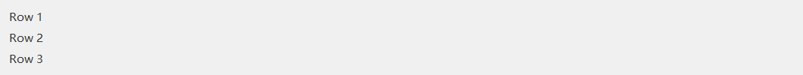

*Vertical box: 3 children, gap=8, padding=12.*

Vertical box. Children are laid out top-to-bottom in declaration order; each child either has a `fixedMain` (explicit height) or shares the remaining space according to its `weight`.

**Typical parent:** any DuiControl container (including other layout containers); the outermost one is rooted at `host.GetRoot()`.

#### Code-based creation

```
auto col = std::unique_ptr<balloonwjui::DuiVBox>(new balloonwjui::DuiVBox());
col->SetPadding(8);
col->SetGap(4);
col->AddChild(std::move(title),   balloonwjui::DuiLayout::Hint().Fixed(28));
col->AddChild(std::move(content), balloonwjui::DuiLayout::Hint().Weight(1));
col->AddChild(std::move(footer),  balloonwjui::DuiLayout::Hint().Fixed(32));
host.SetRoot(std::move(col));     // col as the top-level root; when nesting, use outer->AddChild(std::move(col), ...)
```

#### XML-based creation

```
<vbox padding="8" gap="4">
  <label text="Title" fixedHeight="28"/>
  <label text="Body"  weight="1"/>
  <button text="OK"   fixedHeight="32"/>
</vbox>
```

```
// caller side:
auto root = balloonwjui::DuiXmlBuilder().FromString(xml);
host.SetRoot(std::move(root));
```

#### Key API

| Method | Description |
| --- | --- |
| `SetPadding(int)` / `SetPadding(l,t,r,b)` | Inner padding |
| `SetGap(int)` | Spacing between children |
| `AddChild(child, Hint)` | Append a child + layout hint |
| `SetHint(child, Hint)` | Modify an existing child's layout hint |

#### Chained Hint construction

`Hint().Fixed(main, cross=-1).Weight(w).Margin(all).AlignM(...).AlignC(...)`

#### XML quick reference

|   |   |
| --- | --- |
| Tag | `<vbox padding="..." gap="...">...</vbox>` |
| Detailed attribute reference | [§3.3.1 vbox / hbox / grid](#xml-vbox-hbox-grid) |
| Events | None (the container is transparent to the WM_DUI_NOTIFY chain; child events bubble up normally) |

<a id="DuiHBox"></a>

### DuiHBox  `[layout]`

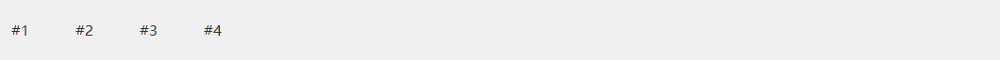

*Horizontal box: 4 children, gap=8, padding=12.*

Horizontal box. Same semantics as `DuiVBox`, with the main axis flipped to X. Common in toolbars and button rows.

**Typical parent:** any DuiControl container (including other layout containers); the outermost one is rooted at `host.GetRoot()`. The most common use is nested inside a VBox row as a "label + edit + button" utility row (see the example below).

#### Code-based creation

```
auto row = std::unique_ptr<balloonwjui::DuiHBox>(new balloonwjui::DuiHBox());
row->SetGap(6);
row->AddChild(std::move(label), balloonwjui::DuiLayout::Hint().Fixed(60));
row->AddChild(std::move(edit),  balloonwjui::DuiLayout::Hint().Weight(1));
row->AddChild(std::move(go),    balloonwjui::DuiLayout::Hint().Fixed(60));
vbox->AddChild(std::move(row),  balloonwjui::DuiLayout::Hint().Fixed(32));
```

#### XML-based creation

```
<hbox gap="6" fixedHeight="32">
  <label text="Name:" fixedWidth="60"/>
  <edit  id="100"      weight="1"/>
  <button text="Go"    fixedWidth="60"/>
</hbox>
```

```
// caller side (hbox is usually nested in a vbox, so attach the parsed
// result as a child of the outer vbox; attaching it as host root is also legal):
auto root = balloonwjui::DuiXmlBuilder().FromString(xml);
host.SetRoot(std::move(root));
```

#### Key API

|   |   |
| --- | --- |
| `SetPadding / SetGap` | Same as DuiVBox |
| `AddChild(child, Hint)` | Append a child + layout hint. Here `Hint.fixedMain` is the <u>fixed width</u> and `Hint.weight` shares the remaining width. |

#### XML quick reference

|   |   |
| --- | --- |
| Tag | `<hbox padding="..." gap="...">...</hbox>` |
| Detailed attribute reference | [§3.3.1 vbox / hbox / grid](#xml-vbox-hbox-grid) |
| Events | None (container is transparent) |

<a id="DuiGrid"></a>

### DuiGrid  `[layout]`

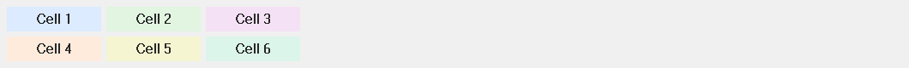

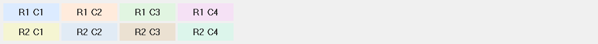

*Top: 2×3 equal-width grid. Bottom: 4×2 colored-grid example.*

Regular grid (rows × cols). Children fill row-major in declaration order.

**Typical parent:** any DuiControl container (including other layout containers); the outermost one is rooted at `host.GetRoot()`.

#### Code / XML

```
auto grid = std::make_unique<balloonwjui::DuiGrid>();
grid->SetGrid(2, 3);   // 2 rows, 3 columns
grid->SetGap(4);
for (auto& cell : cells) grid->AddChild(std::move(cell));
host.SetRoot(std::move(grid));        // grid as the top-level; when nesting, use outer->AddChild(std::move(grid), ...)
```

```
<grid rows="2" cols="3" gap="4">
  <label text="A"/><label text="B"/><label text="C"/>
  <label text="D"/><label text="E"/><label text="F"/>
</grid>
```

```
// caller side:
auto root = balloonwjui::DuiXmlBuilder().FromString(xml);
host.SetRoot(std::move(root));
```

#### Key API

|   |   |
| --- | --- |
| `SetGrid(rows, cols)` | Must be called before AddChild; defaults to 1×1. |
| `SetGap(int)` | Uniform gap between rows / columns. |
| `AddChild(...)` | Children fill row-major; anything beyond rows×cols is <u>not displayed and does not enable overflow scrolling</u>. |

#### XML quick reference

|   |   |
| --- | --- |
| Tag | `<grid rows="..." cols="..." gap="..." padding="...">...</grid>` |
| Detailed attribute reference | [§3.3.1 vbox / hbox / grid](#xml-vbox-hbox-grid) |
| Events | None (container is transparent) |

<a id="DuiSplitter"></a>

### DuiSplitter  `[DUI]`

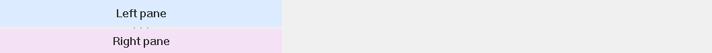

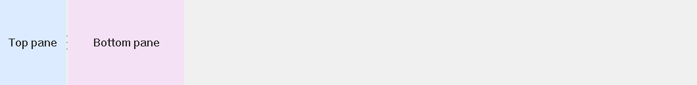

*Top: horizontal split (two side-by-side panes). Bottom: vertical split (two stacked panes). The bar between them is draggable.*

Horizontal / vertical draggable splitter bar. Dragging the mouse changes the size ratio of the two panes and fires `DUIN_VALUECHANGED`. Common use: adjusting the left/right pane widths in a chat window.

**Typical parent:** any DuiControl container (including other layout containers); the outermost one is rooted at `host.GetRoot()`. <u>The first two children become pane 0 / pane 1</u>; install them via `SetPane(idx, child)` rather than the generic AddChild.

#### Code-based creation

```
auto sp = std::make_unique<balloonwjui::DuiSplitter>();
sp->SetOrientation(balloonwjui::DuiSplitter::Vertical);   // Vertical bar / drag changes the X ratio
sp->SetRatio(0.3f);   // Left 30% / right 70%
sp->SetMinChild(120, 200);   // Min width for left / right pane
sp->SetPane(0, std::move(leftPane));
sp->SetPane(1, std::move(rightPane));
host.SetRoot(std::move(sp));     // Splitter as the whole window; when nesting, use outer->AddChild(std::move(sp), ...)
```

#### Events

| code | When it fires | extra (LPARAM) |
| --- | --- | --- |
| `DUIN_VALUECHANGED` | The user releases the mouse after a drag (live during dragging too, rate-limited by repaints) | Current `splitPx` (the main-axis pixel size of the left / top pane) |

Most apps don't need to listen to this event (the splitter has already adjusted the child areas); subscribe only when you want to persist the user-dragged ratio.

```
// In the parent dialog's OnDuiNotify: persist the user-dragged ratio
auto* n = (balloonwjui::DuiNotify*)lp;
if (n->ctrlId == IDC_MAIN_SPLITTER && n->code == DUIN_VALUECHANGED) {
    int splitPx = (int)n->extra;
    g_settings.SetInt(_T("MainSplitPx"), splitPx);   // Restore on next launch
}
```

#### Key API

|   |   |
| --- | --- |
| `SetOrientation(Vertical\|Horizontal)` | Splitter-bar direction. Vertical = the bar runs vertically, the panes sit side-by-side; Horizontal = the bar runs horizontally, the panes stack top/bottom. |
| `SetPane(idx, child)` | Install pane 0 or 1. <u>Do not</u> use the generic AddChild — the splitter requires explicit slot semantics. |
| `SetSplitPx(px) / SetSplitFraction(f)` | Initial split position (absolute px or 0..1 fraction). |
| `SetMinSizes(min0, min1)` | Per-pane main-axis minimum size (the drag stops there). |
| `SetBarThickness(px)` | Splitter-bar thickness, default 4. |

#### XML-based creation

```
<splitter orientation="vertical" split-px="240">
  <vbox padding="8"> ... </vbox>     <!-- pane 0 -->
  <vbox padding="8"> ... </vbox>     <!-- pane 1 -->
</splitter>
```

```
// caller side:
auto root = balloonwjui::DuiXmlBuilder().FromString(xml);
host.SetRoot(std::move(root));
```

#### XML quick reference

|   |   |
| --- | --- |
| Tag | `<splitter orientation="vertical" split-px="240"> <vbox/> <vbox/></splitter>` |
| Detailed attribute reference | [§3.3.2 splitter](#xml-splitter) |
| Events | `DUIN_VALUECHANGED` — on mouse release after a drag; `extra` = pane 0's current pixel size. |

<a id="DuiDock"></a>

### DuiDock  `[layout]`

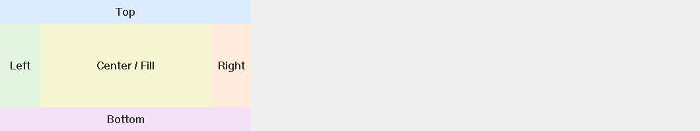

*Top / bottom / left / right / center-fill — five zones, color blocks indicate the docking direction.*

WPF-style docking layout: each child specifies `Top / Bottom / Left / Right / Fill`. Common in main-window frames with "top toolbar + bottom status bar + center client."

**Typical parent:** any DuiControl container (including other layout containers); the outermost one is rooted at `host.GetRoot()`. <u>A child without a dock-edge marker becomes the center area</u> (Fill); multiple children at the same edge stack from outside in, in declaration order.

#### Code-based creation

```
auto dock = std::make_unique<balloonwjui::DuiDock>();
dock->AddChildDocked(std::move(toolbar), balloonwjui::DuiDock::Top, 32);
dock->AddChildDocked(std::move(status),  balloonwjui::DuiDock::Bottom, 22);
dock->AddChildDocked(std::move(content), balloonwjui::DuiDock::Fill);
host.SetRoot(std::move(dock));    // Dock as the top-level; when nesting, use outer->AddChild(std::move(dock), ...)
```

## 7.2 Basic controls

<a id="DuiLabel"></a>

### DuiLabel  `[DUI]`

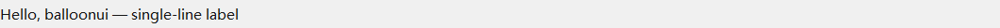

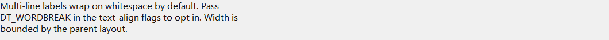

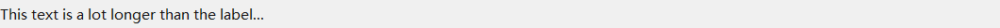


*Top to bottom: single line / multi-line wrap / trailing ellipsis / link default vs hover state.*

Static text + hyperlinks. Two modes:

- `ModeText` (default): plain text.
- `ModeLink`: underline + hover highlight + IDC_HAND cursor + clicking fires `DUIN_CLICK` or auto-`ShellExecute`'s the URL (`SetAutoNavigate`).

Supports **multi-line wrap** (`SetWordWrap(true)`) + **measure-height** (`MeasureHeight(width)`) — both are necessary for chat bubbles / streaming lists.

**Typical parent:** any layout container (VBox / HBox / Grid / GroupBox content area / Splitter pane / Dock child area).

#### Code-based creation

```
auto lbl = std::make_unique<balloonwjui::DuiLabel>();
lbl->SetText(_T("Welcome to balloonui"));
lbl->SetTextColor(RGB(40, 40, 40));
lbl->SetWordWrap(true);
int h = lbl->MeasureHeight(300);   // Height needed at width=300
vbox->AddChild(std::move(lbl), balloonwjui::DuiLayout::Hint().Fixed(h));

// Hyperlink
auto link = std::make_unique<balloonwjui::DuiLabel>();
link->SetMode(balloonwjui::DuiLabel::ModeLink);
link->SetText(_T("Open website"));
link->SetUrl (_T("https://example.com"));
link->SetAutoNavigate(true);
vbox->AddChild(std::move(link), balloonwjui::DuiLayout::Hint().Fixed(22));
```

#### XML-based creation

```
<vbox padding="12" gap="6">
    <label text="Hello world" textColor="40,40,40" fixedHeight="22"/>
</vbox>
```

```
// caller side:
auto root = balloonwjui::DuiXmlBuilder().FromString(xml);
host.SetRoot(std::move(root));
```

#### Key API

| Method | Description |
| --- | --- |
| `SetText(LPCTSTR)` / `GetText()` | Text content. |
| `SetMode(ModeText\|ModeLink)` | Switch between text / link mode. |
| `SetTextColor(COLORREF)` | Non-link text color. |
| `SetLinkColor / SetHoverColor / SetVisitedColor` | Link palette. |
| `SetWordWrap(bool)` | Enable DT_WORDBREAK auto-wrap. |
| `MeasureHeight(width)` | Return the height needed to render at the given width (DT_CALCRECT). |
| `SetUrl(LPCTSTR)` + `SetAutoNavigate(true)` | Auto-`ShellExecute` the URL on click. |
| `GetMnemonicChar()` | `"Open(&O)"` → `'o'` |

#### Events

| code | When it fires | extra (LPARAM) |
| --- | --- | --- |
| `DUIN_CLICK` | Only in `ModeLink`: the user left-clicks the text. `ModeText` fires nothing. When `SetAutoNavigate(true)` is set, the click no longer fires `DUIN_CLICK` — the URL opens directly via `ShellExecute`. | 0 |

```
// In the parent dialog's OnDuiNotify:
auto* n = (balloonwjui::DuiNotify*)lp;
if (n->ctrlId == IDC_FORGOT_LINK && n->code == DUIN_CLICK) {
    ShowForgotPasswordDialog();
}
```

#### XML quick reference

|   |   |
| --- | --- |
| Tag | `<label text="..." textColor="..."/>` |
| Detailed attribute reference | [§3.3.4 label](#xml-label) |
| Events | None in `ModeText`; in `ModeLink` with `SetAutoNavigate(false)`, fires `DUIN_CLICK`. |
| Notes | XML does not yet expose ModeLink / font / alignment and other advanced attributes; if you need them, grab the root the builder returns and call FindControlById + SetXxx yourself. |

<a id="DuiButton"></a>

### DuiButton  `[DUI]`


*Top: 4 flavors (PushButton / Checkbox / Radio / Icon). Bottom: PushButton in Normal / Hover / Pressed / Disabled.*

Four flavors:

| Style | Appearance / use |
| --- | --- |
| `StylePushButton` | Solid brand blue + 8 px rounded corners; the most common one. |
| `StyleCheckbox` | Square tick on the left + text; toggle via `SetCheck`. |
| `StyleRadio` | Like Checkbox but mutually exclusive within a group (`SetRadioGroup(gid)`). |
| `StyleIcon` | Icon on the left + text; compact (e.g. toolbar buttons). |

Supports **per-state background bitmaps** (`SetBgBitmap(normal, hover, pressed, disabled)`) + **9-grid stretching** (`SetBgInsets`). Bitmaps are caller-owned; the button neither copies nor releases them.

**Typical parent:** any layout container (VBox / HBox / Grid / GroupBox content area / Splitter pane / Dock child area).

#### Code-based creation

```
auto btn = std::make_unique<balloonwjui::DuiButton>();
btn->SetButtonType(balloonwjui::DuiButton::StylePushButton);
btn->SetText(_T("&Save"));        // & marks 'S' as the mnemonic
btn->SetCtrlId(IDC_SAVE);
vbox->AddChild(std::move(btn), balloonwjui::DuiLayout::Hint().Fixed(32));

// In the parent dialog's WM_DUI_NOTIFY:
//   if (n->code == DUIN_CLICK && n->ctrlId == IDC_SAVE) Save();
```

#### XML-based creation

```
<vbox padding="12" gap="8">
    <button id="100" text="Save"          buttonType="push"     fixedHeight="32"/>
    <button id="101" text="Show password" buttonType="checkbox"/>
    <button id="102" text="Light"         buttonType="radio"/>
    <button id="103" text="Dark"          buttonType="radio"/>
</vbox>
```

```
// caller side:
auto root = balloonwjui::DuiXmlBuilder().FromString(xml);
host.SetRoot(std::move(root));
```

#### Key API

| Method | Description |
| --- | --- |
| `SetButtonType / GetButtonType` | Switch between the four Styles. |
| `SetText / GetText` | The character after `"&X"` becomes the mnemonic. |
| `SetCheck(bool, notify=true)` / `IsChecked()` | Checkbox/Radio state. |
| `SetRadioGroup(int gid)` | Radios under the same parent with a non-zero gid form a mutually exclusive group. |
| `SetBgBitmap(n,h,p,d)` | Per-state background bitmaps (caller-owned). |
| `SetBgInsets(l,t,r,b)` | 9-grid slice insets. |
| `SetTextColor / SetTextAlign` | Text color and DT_* alignment. |
| `GetMnemonicChar()` | Extracts the character following `&`. |

#### Events

| code | When it fires | extra (LPARAM) |
| --- | --- | --- |
| `DUIN_CLICK` | All Styles — mouse pressed inside the button AND released inside (moving out then releasing does <u>not</u> fire). | 0 |
| `DUIN_VALUECHANGED` | Checkbox / Radio state changes. `SetCheck(_, true)` also fires it; `SetCheck(_, false)` does not. | new checked state: `1`=checked / `0`=unchecked |

```
// In the parent dialog:
LRESULT OnDuiNotify(UINT, WPARAM, LPARAM lp, BOOL&) {
    auto* n = (balloonwjui::DuiNotify*)lp;
    if (n->ctrlId == IDC_SAVE     && n->code == DUIN_CLICK)        DoSave();
    if (n->ctrlId == IDC_REMEMBER && n->code == DUIN_VALUECHANGED) m_remember = (n->extra != 0);
    return 0;
}
```

#### XML quick reference

|   |   |
| --- | --- |
| Tag | `<button id="..." text="..." buttonType="push\|icon\|checkbox\|radio"/>` |
| Detailed attribute reference | [§3.3.9 button](#xml-button) |
| Events | `DUIN_CLICK` (all Styles); `DUIN_VALUECHANGED` (Checkbox / Radio toggle, extra = 0/1). |
| Notes | XML does not yet expose SetRadioGroup / SetBgBitmap / SetTextColor and other advanced setters; if you need them, grab the root and use FindControlById to set them yourself. |

<a id="DuiBadge"></a>

### DuiBadge  `[DUI]`


*Left → right: red dot / number / "99+" / custom brand color.*

Unread-message red dot / numeric badge, typically overlaid on the top-right of an avatar or icon. `SetCount(0)` hides it; `SetCount(-1)` shows a plain red dot; `>= 1` shows the number ("99+" past 99).

**Typical parent:** two patterns —

  ① Normal leaf: nest inside any layout container (VBox / HBox / Grid, ...) as a stand-alone numeric badge;

  ② <u>Corner overlay</u>: the <u>parent control</u> (DuiAvatar / DuiTab / DuiButton, ...) owns the DuiBadge as a child and <u>explicitly positions</u> its rect to the top-right corner inside its own OnPaint / Layout — not laid out automatically by a layout container, but positioned by the parent based on its "top-right corner" geometry.

#### Code-based creation

```
// Pattern ①: nested in a layout container as a normal leaf
auto badge = std::make_unique<balloonwjui::DuiBadge>();
badge->SetCount(unread);             // 0 hides; 1-99 shows the number; 100+ shows "99+"
badge->SetBgColor(RGB(220, 60, 60));
badge->SetTextColor(RGB(255, 255, 255));
hbox->AddChild(std::move(badge), balloonwjui::DuiLayout::Hint().Fixed(20));

// Pattern ②: as an avatar corner badge (parent = DuiAvatar subclass, positioned in its own Layout())
//   m_badge is a member of DuiAvatar; override Layout() to place badge rect at the top-right corner:
//     RECT av = GetRect();
//     m_badge->SetRect(RECT{ av.right - 18, av.top - 4, av.right + 4, av.top + 14 });
```

#### Key API

|   |   |
| --- | --- |
| `SetText(LPCTSTR)` | Raw text (at most 4 chars are shown; the rest is truncated). |
| `SetCount(int)` | Integer count, automatically converted to text: 0 → hidden; 1-99 → number; 100+ → "99+". |
| `SetBgColor / SetTextColor` | Background / text color (default: white on red). |
| `SetHideWhenEmpty(bool)` | Whether empty text skips drawing entirely (default true). |
| `IsShowing()` | Whether the badge currently draws. |
| `FormatCount(int)` [static] | Pure helper: turns N into "" / "99+" / "". |

#### XML-based creation

```
<hbox padding="8" gap="4">
    <badge count="3"   bg-color="220,60,60"/>
    <badge text="NEW"  bg-color="40,140,80"/>
</hbox>
```

```
// caller side:
auto root = balloonwjui::DuiXmlBuilder().FromString(xml);
host.SetRoot(std::move(root));
```

#### XML quick reference

|   |   |
| --- | --- |
| Tag | `<badge count="3" bg-color="220,60,60"/>` or `<badge text="NEW" bg-color="40,140,80"/>` |
| Detailed attribute reference | [§3.3.7 badge](#xml-badge) |
| Events | None (pure drawing). |

<a id="DuiAvatar"></a>

### DuiAvatar  `[DUI]`


*Left to right: circular bitmap / rounded-rect bitmap / initials fallback (English + CJK) / 4 status dots (online / away / busy / offline).*

Avatar: circular / rounded rectangle + optional status dot (online / away / busy / offline). Two modes:

- With `HBITMAP`: draws the source bitmap directly (caller-owned, not copied).
- Without an image: solid background + auto-derived 1–2 character initials ("Alice Smith" → "AS").

**Typical parent:** any layout container (VBox / HBox / Grid / GroupBox content area / Splitter pane / Dock child area). The most common use is in a contact-row HBox (avatar + name + status badge).

#### Code-based creation

```
auto av = std::make_unique<balloonwjui::DuiAvatar>();
av->SetName(_T("Alice Smith"));        // Shows "AS" when no image is set
av->SetBitmap(hBmp);                   // Uses the image when present
av->SetShape(balloonwjui::DuiAvatar::ShapeCircle);
av->SetStatus(balloonwjui::DuiAvatar::StatusOnline);
hbox->AddChild(std::move(av), balloonwjui::DuiLayout::Hint().Fixed(48));   // Contact row
```

#### Key API

|   |   |
| --- | --- |
| `SetBitmap(HBITMAP)` | Source bitmap (nullptr falls back to initials). |
| `SetName(LPCTSTR)` | Name used to derive the initials. |
| `SetShape(ShapeCircle\|ShapeRoundRect)` | Shape. |
| `SetCornerRadius(int)` | Corner radius for rounded-rect shape. |
| `SetStatus(StatusNone\|Online\|Away\|Busy\|Offline)` | Bottom-right status dot. |
| `SetFallbackBgColor / SetInitialsColor` | Colors used in fallback mode. |
| `ComputeInitials(name)` [static] | Pure helper that extracts the initials. |

#### XML-based creation

```
<hbox padding="8" gap="8">
    <avatar id="200" name="Alice Smith" shape="circle" status="online" fixedWidth="48"/>
    <label  text="Alice Smith" weight="1"/>
</hbox>
```

```
// caller side:
auto root = balloonwjui::DuiXmlBuilder().FromString(xml);
// After parsing, fetch the avatar node and attach the bitmap (XML does not support image="path"):
if (auto* av = static_cast<balloonwjui::DuiAvatar*>(root->FindControlById(200))) {
    av->SetBitmap(LoadAvatarBitmap(...));
}
host.SetRoot(std::move(root));
```

#### XML quick reference

|   |   |
| --- | --- |
| Tag | `<avatar name="..." shape="circle" status="online"/>` |
| Detailed attribute reference | [§3.3.6 avatar](#xml-avatar) |
| Events | None (pure drawing). |
| Notes | XML does <u>not</u> support `image="path"` (HBITMAP loading is left to the caller); after the builder returns, call `av->SetBitmap(hbm)` yourself to attach the image. |

<a id="DuiSeparator"></a>

### DuiSeparator  `[DUI]`

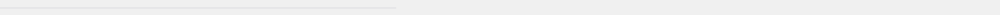


*Top: horizontal 1 px separator. Bottom: vertical separator paired with labels on each side.*

1 px horizontal / vertical line; common for separating menu items and grouping panels.

**Typical parent:** any layout container (VBox / HBox / Grid / GroupBox content area / Splitter pane / Dock child area). A horizontal separator usually sits between two content blocks in a VBox; a vertical one usually sits between two tool groups in an HBox.

#### Code-based creation

```
auto sep = std::make_unique<balloonwjui::DuiSeparator>();
sep->SetOrientation(balloonwjui::DuiSeparator::Vertical);
sep->SetColor(RGB(220, 220, 224));
sep->SetThickness(1);
sep->SetInset(4);                  // 4 px inset on each end
hbox->AddChild(std::move(sep), balloonwjui::DuiLayout::Hint().Fixed(1));   // 1 px wide, fills the row height
```

#### Key API

|   |   |
| --- | --- |
| `SetOrientation(Horizontal\|Vertical)` | Line direction. Horizontal = horizontal line (default), Vertical = vertical line. |
| `SetColor(COLORREF)` | Line color. Default RGB(220,220,224). |
| `SetThickness(int)` | Line thickness (perpendicular to the line). Default 1, clamped to >= 1. |
| `SetInset(int)` | How many pixels to inset on each end along the line direction (a subtle shorter look). Default 0. |

#### XML-based creation

```
<hbox padding="8" gap="8" fixedHeight="32">
    <button text="Cut"  fixedWidth="60"/>
    <button text="Copy" fixedWidth="60"/>
    <separator orientation="vertical" inset="4" fixedWidth="1"/>
    <button text="Paste" fixedWidth="60"/>
</hbox>
```

```
// caller side:
auto root = balloonwjui::DuiXmlBuilder().FromString(xml);
host.SetRoot(std::move(root));
```

#### XML quick reference

|   |   |
| --- | --- |
| Tag | `<separator orientation="vertical" color="..." thickness="1" inset="4"/>` |
| Detailed attribute reference | [§3.3.5 separator](#xml-separator) |
| Events | None (pure drawing + mouse-transparent). |

<a id="DuiGroupBox"></a>

### DuiGroupBox  `[DUI]`

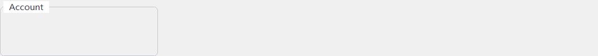

*Titled group box; any nested children allowed.*

Titled, bordered group box. The child can be any DuiControl.

**Typical parent:** any DuiControl container (including other layout containers); the outermost one is rooted at `host.GetRoot()`. <u>The first child becomes the content area</u>; install it via `SetContent(std::move(inner))` instead of the generic AddChild — groupbox accepts only one content child, so wrap multiple controls in a VBox/HBox first.

#### Code-based creation

```
auto gb = std::make_unique<balloonwjui::DuiGroupBox>();
gb->SetTitle(_T("User preferences"));
gb->SetTitleColor(RGB(80, 80, 80));
gb->SetPadding(12);
auto inner = std::make_unique<balloonwjui::DuiVBox>();
// ... add form rows to inner ...
gb->SetContent(std::move(inner));    // ★ single content child, do not use AddChild
vbox->AddChild(std::move(gb), balloonwjui::DuiLayout::Hint().Weight(1));
```

#### Key API

|   |   |
| --- | --- |
| `SetTitle / SetTitleColor` | Title text + color. |
| `SetBorderColor / SetCornerRadius` | Border color + corner radius (default 6 px). |
| `SetTitleStripHeight(px)` | Title strip height (default 24; content begins below it). |
| `SetPadding(int) / SetPadding(l,t,r,b)` | 4-side padding from the border to the content (default 12). |
| `SetContent(unique_ptr<DuiControl>)` | Install or replace the <u>single</u> content child (the old one is destroyed). |

#### XML-based creation

```
<groupbox title="User preferences" padding="12">
    <vbox gap="8">
        <label  text="Nickname"/>
        <edit   id="200" placeholder="Required"/>
        <label  text="Email"/>
        <edit   id="201" placeholder="user@example.com"/>
    </vbox>
</groupbox>
```

```
// caller side:
auto root = balloonwjui::DuiXmlBuilder().FromString(xml);
host.SetRoot(std::move(root));
```

#### XML quick reference

|   |   |
| --- | --- |
| Tag | `<groupbox title="..." padding="..."> <vbox/></groupbox>` (the first child automatically becomes the content) |
| Detailed attribute reference | [§3.3.3 groupbox](#xml-groupbox) |
| Events | None (pure drawing + forwards hit-test to the content). |

## 7.3 Input

<a id="DuiEditHost"></a>

### DuiEditHost  `[HWND-hosted]`

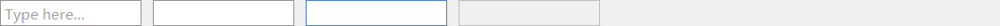

*Left → right: placeholder (empty) / filled / focused / disabled. Off-screen snapshots may clip the EDIT text, but the actual runtime is fine.*

Plain-text single-/multi-line edit control. **Because IME input is required**, it embeds a real EDIT HWND internally (via the `HwndHostControl` adapter).

**Typical parent:** any layout container (VBox / HBox / Grid / GroupBox content area / Splitter pane / Dock child area). <u>After attaching, you still need to call</u> `edit->EnsureCreated(host.m_hWnd)` once the host HWND is ready, before the child EDIT HWND is actually created (see [§3.4](#xml-ensure-created)).

#### Code-based creation

```
auto edit = std::make_unique<balloonwjui::DuiEditHost>();
edit->SetCtrlId(100);
edit->SetPlaceholder(_T("Enter username"));
edit->SetMultiLine(false);
edit->SetPassword(false);
balloonwjui::DuiEditHost* editRaw = edit.get();
vbox->AddChild(std::move(edit), balloonwjui::DuiLayout::Hint().Fixed(28));

// Call once after host.Create(...):
editRaw->EnsureCreated(host.m_hWnd);
```

#### XML-based creation

```
<vbox padding="12" gap="6">
    <edit id="100" placeholder="Enter username" fixedHeight="28"/>
    <edit id="101" password="true"              fixedHeight="28"/>
    <edit id="102" multiline="true"             weight="1"/>
</vbox>
```

```
// caller side (note EnsureCreated):
auto root = balloonwjui::DuiXmlBuilder().FromString(xml);
host.SetRoot(std::move(root));
// Once the host HWND is ready, call EnsureCreated once on each <edit> node:
for (UINT id : { 100u, 101u, 102u }) {
    if (auto* e = static_cast<balloonwjui::DuiEditHost*>(host.GetRoot()->FindControlById(id)))
        e->EnsureCreated(host.m_hWnd);
}
```

|   |   |
| --- | --- |
| `SetText / GetText` | Text content (synced with the EDIT). |
| `SetPlaceholder` | Gray hint shown when the field is empty. |
| `SetPassword(bool)` | Password mode (shows *). |
| `SetMultiLine(bool)` | Multi-line. |
| `SetReadOnly / SetMaxLength` | Read-only / length limit. |

#### Events

| code | When it fires | extra (LPARAM) |
| --- | --- | --- |
| `DUIN_VALUECHANGED` | EDIT content changed (responds to every `EN_CHANGE` — IME committing each character, clipboard paste, user typing). Call `GetText()` in the handler to read the latest value. | 0 |
| `DUIN_SETFOCUS` | EDIT received keyboard focus (`EN_SETFOCUS`). | 0 |
| `DUIN_KILLFOCUS` | EDIT lost focus (`EN_KILLFOCUS`); good place for "commit / validate / clear placeholder state." | 0 |

Common form pattern: validate live in `DUIN_VALUECHANGED` and disable the submit button accordingly; persist the temporary input to the model in `DUIN_KILLFOCUS`.

```
// In the parent dialog's OnDuiNotify:
auto* n = (balloonwjui::DuiNotify*)lp;
if (n->ctrlId == IDC_NICKNAME) {
    if (n->code == DUIN_VALUECHANGED) {
        // Live validation
        CString s = m_editNickname->GetText();
        m_btnLogin->SetEnabled(!s.IsEmpty() && s.GetLength() <= 32);
    }
    else if (n->code == DUIN_KILLFOCUS) {
        // Persist
        m_model.nickname = m_editNickname->GetText();
    }
}
```

**EnsureCreated convention**: DuiEditHost embeds a real EDIT HWND; you must call `edit->EnsureCreated(host->m_hWnd)` once after the host HWND is ready before it's actually created. On the XML path the builder does <u>not</u> do this for you; the caller must use `FindControlById` to find the node and call it. See [§3.4 EnsureCreated convention](#xml-ensure-created).

#### XML quick reference

|   |   |
| --- | --- |
| Tag | `<edit id="..." placeholder="..." password="false" multiline="false"/>` |
| Detailed attribute reference | [§3.3.12 edit](#xml-edit) |
| Events | `DUIN_VALUECHANGED` / `DUIN_SETFOCUS` / `DUIN_KILLFOCUS` |

<a id="DuiEditHost-IconApi"></a>

#### Inline icons + background + border (all off by default, zero regression)

You can drop icons into the EDIT's left / right gutter; common uses: magnifier on the left of a search box, `@` on the left of an email field, 👁 on the right of a password field. The EDIT text area <u>automatically avoids the gutter</u> (Layout shrinks the EDIT HWND by the gutter width), so text never overlaps the icon. Combined with `SetBgColor` (so the EDIT background blends into the container's rounded gray fill) and `SetShowBorder(false)` (to drop the default 1 px border), this produces "icons floating inside a pill-shaped gray fill with no visible EDIT boundary."

**Style illustration** (left: default; middle: left magnifier + gray fill, borderless; right: right × clear):

<svg width="660" height="42" viewbox="0 0 660 42" xmlns="http://www.w3.org/2000/svg" font-family="Microsoft YaHei,Segoe UI,sans-serif">

      <rect x="0" y="5" width="200" height="32" fill="#FFFFFF" stroke="#D0D0D0"></rect>
      <text x="8" y="25" font-size="12" fill="#999">Enter username</text>


      <rect x="220" y="5" width="200" height="32" rx="16" ry="16" fill="#F3F3F4"></rect>
      <circle cx="236" cy="21" r="6" fill="none" stroke="#8C8C8C" stroke-width="1.5"></circle>
      <line x1="240" y1="25" x2="244" y2="29" stroke="#8C8C8C" stroke-width="1.5" stroke-linecap="round"></line>
      <text x="256" y="25" font-size="12" fill="#999">Search music, videos, podcasts...</text>


      <rect x="440" y="5" width="200" height="32" rx="16" ry="16" fill="#F3F3F4"></rect>
      <text x="452" y="25" font-size="12" fill="#333">Typed query</text>
      <line x1="618" y1="15" x2="628" y2="25" stroke="#8C8C8C" stroke-width="1.5" stroke-linecap="round"></line>
      <line x1="628" y1="15" x2="618" y2="25" stroke="#8C8C8C" stroke-width="1.5" stroke-linecap="round"></line>
    </svg>

*Three typical uses of the EDIT's inline icons. The middle and right images are both the same DuiEditHost instance, configured via `SetIcon(LeftIcon, ...)` and `SetIcon(RightIcon, ...)` respectively.*

##### API

|   |   |
| --- | --- |
| `SetIcon(slot, gutterW, painter)` | Core API. `slot` = `LeftIcon` / `RightIcon`; `gutterW` is the icon's px width (0 = remove); `painter` is a `std::function<void(HDC, const RECT&)>` in which the caller draws the icon into the given RECT using any GDI / GDI+ API. |
| `SetIconBitmap(slot, gutterW, hbm)` | Convenience overload: use an HBITMAP as the icon. The caller owns the HBITMAP. The internal painter centers it inside the RECT via BitBlt (no scaling). |
| `SetIconGlyph(slot, gutterW, glyph, color)` | Convenience overload: use a Unicode character as the icon, drawn centered with the default font (Microsoft YaHei 9 pt). Common choices: `_T("🔍")` / `_T("@")`. |
| `ClearIcon(slot)` | Equivalent to `SetIcon(slot, 0, nullptr)` — the gutter collapses and the text area expands. |
| `SetIconClickable(slot, b)` | Default `false` (the icon is decorative; clicks pass through to set the EDIT caret). When `true`, clicks inside the gutter are consumed by this control and fire `DUIEN_LEFT_ICON_CLICK` / `DUIEN_RIGHT_ICON_CLICK` to the parent host. |
| `SetBgColor(c)` | Controls both (1) the background color the DUI side fills in the margin around the EDIT during OnPaint, and (2) the Win32 EDIT control's own background (propagated through WM_CTLCOLOREDIT into `HwndHostControl::SetCtlBgColor`). Default `RGB(255,255,255)`. |
| `SetShowBorder(b)` | Whether to draw the 1 px border. Default `true`. Turn off when embedding the EDIT inside a container that already has rounded corners (e.g. a pill-shaped SearchBox), so the EDIT's square border doesn't clash with the container's rounded outline. |

##### Events

| code | When it fires | extra |
| --- | --- | --- |
| `DUIEN_LEFT_ICON_CLICK` <small>(= `DUIN_CUSTOM + 1`)</small> | After `SetIconClickable(LeftIcon, true)`, on a left-click inside the left gutter. | 0 |
| `DUIEN_RIGHT_ICON_CLICK` <small>(= `DUIN_CUSTOM + 2`)</small> | Same on the right. | 0 |

**Interaction with the eye-toggle button (`SetShowEyeToggle`)**: the right icon and the password eye-toggle button share the right gutter. When `password=true` and `SetShowEyeToggle(true)`, `SetIcon(RightIcon, ...)`'s draw / hit-test on the right is ignored — the eye-toggle wins. The left icon is unaffected and can coexist with the eye-toggle.

##### Usage: search pill

```
// No need to subclass DuiEditHost — regular construction is enough:
auto edit = std::make_unique<balloonwjui::DuiEditHost>();
edit->SetPlaceholder(_T("Search music, videos, podcasts..."));
edit->SetBgColor(RGB(0xF3, 0xF3, 0xF4));   // Match the outer pill gray fill
edit->SetShowBorder(false);                // Drop the 1 px border
edit->SetIcon(balloonwjui::DuiEditHost::LeftIcon, 32,
    [](HDC hdc, const RECT& rc) {
        int gx = (rc.left + rc.right) / 2;
        int gy = (rc.top + rc.bottom) / 2;
        const COLORREF c = RGB(140, 140, 140);
        const int r = 6;
        RECT circle = { gx - r, gy - r - 1, gx + r, gy + r - 1 };
        balloonwjui::DuiAA::FillEllipse(hdc, circle, CLR_INVALID, c, 1.5f);
        balloonwjui::DuiAA::DrawLine(hdc, gx + 3, gy + 3, gx + 7, gy + 7,
                                      c, 1.5f);
    });
// The outer container paints the rounded pill gray fill itself (see PaintHelpers::FillRoundedRect)
```

##### Usage: clickable × clear

```
edit->SetIconGlyph(balloonwjui::DuiEditHost::RightIcon, 24,
                    _T("✕"), RGB(140, 140, 140));
edit->SetIconClickable(balloonwjui::DuiEditHost::RightIcon, true);

// Routing in the parent dialog's OnDuiNotify:
auto* n = (balloonwjui::DuiNotify*)lp;
if (n->ctrlId == IDC_SEARCH
    && n->code == balloonwjui::DuiEditHost::DUIEN_RIGHT_ICON_CLICK)
{
    edit->SetText(_T(""));    // Clear
}
```

<a id="DuiRichEditHost"></a>

### DuiRichEditHost  `[HWND-hosted]`


*RichEdit chrome (with border). For the runtime rich-text appearance, see the RTF demo page.*

Rich-text editor (built on `RICHEDIT_CLASS`). Supports:

- RTF serialization: `SaveRTF/LoadRTF` + plain-text `SaveText/LoadText`.
- Paste filtering: `SetPasteAsPlainTextDefault(true)` or `PasteAsPlainText()`.
- Find: `FindText / FindAndSelect` (forward/backward, case-sensitive, whole-word, wrap-around).
- OLE image insertion (paired with `DuiImageOle`).

**Typical parent:** any layout container (VBox / HBox / Grid / GroupBox content area / Splitter pane / Dock child area). <u>After attaching you must still call</u> `re->EnsureCreated(host.m_hWnd)` once the host HWND is ready. `multi-line` / `word-wrap` / `password` must be set before EnsureCreated (baked-in style); changing them later requires destroying and recreating the HWND.

#### Code-based creation

```
auto re = std::make_unique<balloonwjui::DuiRichEditHost>();
re->SetMultiLine(true);
re->SetPasteAsPlainTextDefault(true);   // Ctrl+V auto-pastes plain text only
re->LoadText(_T("Default content..."));
balloonwjui::DuiRichEditHost* reRaw = re.get();
vbox->AddChild(std::move(re), balloonwjui::DuiLayout::Hint().Weight(1));

// Call once after host.Create(...):
reRaw->EnsureCreated(host.m_hWnd);

// Find
CHARRANGE r;
if (reRaw->FindAndSelect(_T("foo"), 0, /*forward*/true,
                          /*caseSensitive*/false, /*wholeWord*/false,
                          /*wrap*/true)) { /* selected */ }

// Persist
CStringA rtf;
reRaw->SaveRTF(rtf);    // with formatting
CString plain;
reRaw->SaveText(plain); // plain text
```

#### XML-based creation

```
<vbox padding="8">
    <richedit id="300" multi-line="true" word-wrap="true" auto-url-detect="true" weight="1"/>
</vbox>
```

```
// caller side:
auto root = balloonwjui::DuiXmlBuilder().FromString(xml);
host.SetRoot(std::move(root));
// Call EnsureCreated once after the host HWND is ready:
if (auto* re = static_cast<balloonwjui::DuiRichEditHost*>(host.GetRoot()->FindControlById(300)))
    re->EnsureCreated(host.m_hWnd);
```

#### Events

| code | When it fires | extra (LPARAM) |
| --- | --- | --- |
| `DUIN_VALUECHANGED` | RichEdit content changed (every `EN_CHANGE`). | 0 |
| `DUIN_SETFOCUS` / `DUIN_KILLFOCUS` | Focus in / out. | 0 |
| `DUIN_RE_LINKCLICK` | User clicks an auto-detected URL (needs `SetAutoUrlDetect(true)` first). `EN_LINK` is auto-forwarded as this notification. | The original `EN_LINK`'s `lParam` (points to an `ENLINK`; provides position / text). |

```
// In the parent dialog:
auto* n = (balloonwjui::DuiNotify*)lp;
if (n->ctrlId == IDC_RE && n->code == DUIN_RE_LINKCLICK) {
    auto* el = (ENLINK*)n->extra;
    CString url = re->GetTextRange(el->chrg);
    ::ShellExecute(NULL, _T("open"), url, NULL, NULL, SW_SHOWNORMAL);
}
```

**EnsureCreated**: same as DuiEditHost — call `re->EnsureCreated(hostHwnd)` once the host HWND is ready. `multi-line` / `word-wrap` must be set before EnsureCreated (baked-in style); changing them later requires destroying and recreating the HWND.

#### XML quick reference

|   |   |
| --- | --- |
| Tag | `<richedit id="..." placeholder="..." multi-line="true" word-wrap="true" auto-url-detect="true"/>` |
| Detailed attribute reference | [§3.3.13 richedit](#xml-richedit) |
| Events | `DUIN_VALUECHANGED` / `DUIN_SETFOCUS` / `DUIN_KILLFOCUS` / `DUIN_RE_LINKCLICK` |
| Notes | RTF serialization / image insertion / blockquote / find and other advanced features are only exposed in C++; XML does not cover them. |

<a id="DuiSearchBox"></a>

### DuiSearchBox  `[HWND-hosted]`

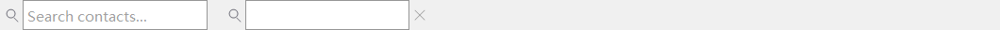

*Left: empty state shows the placeholder. Right: once you type, an × clear button appears on the right.*

Compact search box with a magnifier icon + placeholder. Fires `DUIN_VALUECHANGED` as you type.

**Implementation: as of M7+, refactored into a thin preset of `DuiEditHost`** — DuiSearchBox now <u>inherits</u> from DuiEditHost. The ctor installs the left magnifier via DuiEditHost's [inline-icon API](#DuiEditHost-IconApi); it listens to EN_CHANGE to show the right × when the text is non-empty and hide it when empty; it intercepts OnIconClicked_(RightIcon) to consume the click and SetText(""). Before the refactor it was ~250 lines of aggregation + custom paint; afterward it's ~80 lines. <u>Zero API surface change for callers</u>: `SetGlyphStripWidth` / `SetClearStripWidth` / `IsClearShowing` / `GetClearRect` / `GetEdit` all retain their semantics (GetEdit now returns `this`, because this class <u>is</u> the EDIT).

**Typical parent:** any layout container (VBox / HBox / Grid / GroupBox content area / Splitter pane / Dock child area). <u>After attaching you must still call</u> `sb->EnsureCreated(host.m_hWnd)` once the host HWND is ready (inherited from DuiEditHost). Common placement: at the top of a contact / file list.

#### Code-based creation

```
auto sb = std::make_unique<balloonwjui::DuiSearchBox>();
sb->SetCtrlId(IDC_SEARCH_CONTACTS);
sb->SetPlaceholder(_T("Search contacts..."));
sb->SetDebounceMs(200);    // Input debounce (multiple keystrokes within 200 ms coalesce into one notify)
balloonwjui::DuiSearchBox* sbRaw = sb.get();
vbox->AddChild(std::move(sb), balloonwjui::DuiLayout::Hint().Fixed(28));

// Call once after host.Create(...):
sbRaw->EnsureCreated(host.m_hWnd);
```

#### XML-based creation

```
<vbox padding="6">
    <searchbox id="400" placeholder="Search contacts..." max-length="64" fixedHeight="28"/>
</vbox>
```

```
// caller side:
auto root = balloonwjui::DuiXmlBuilder().FromString(xml);
host.SetRoot(std::move(root));
if (auto* sb = static_cast<balloonwjui::DuiSearchBox*>(host.GetRoot()->FindControlById(400)))
    sb->EnsureCreated(host.m_hWnd);
```

#### Events

| code | When it fires | extra (LPARAM) |
| --- | --- | --- |
| `DUIN_VALUECHANGED` | EDIT content changed (coalesced through `SetDebounceMs`). Clicking the right × clear button also fires it once (the value becomes empty). | 0 (use `GetText()` to read the latest value). |

```
// In the parent dialog's OnDuiNotify: incrementally filter the contact list
auto* n = (balloonwjui::DuiNotify*)lp;
if (n->ctrlId == IDC_SEARCH_CONTACTS && n->code == DUIN_VALUECHANGED) {
    CString q = m_searchBox->GetText();
    m_friendList->ApplyFilter(q);   // App helper: filter list items by text
}
```

**EnsureCreated**: embeds a DuiEditHost; call `sb->EnsureCreated(hostHwnd)` once the host HWND is ready.

#### XML quick reference

|   |   |
| --- | --- |
| Tag | `<searchbox id="..." placeholder="..." max-length="64"/>` |
| Detailed attribute reference | [§3.3.14 searchbox](#xml-searchbox) |
| Events | `DUIN_VALUECHANGED` — text changed (including via the × clear); ctrlId is the searchbox's id (automatically re-stamped from the inner EDIT). |

<a id="DuiSpinBox"></a>

### DuiSpinBox  `[HWND-hosted]`


*EDIT on the left + ↑↓ increment/decrement buttons on the right.*

Numeric input field + small up/down increment buttons.

**Typical parent:** any layout container (VBox / HBox / Grid / GroupBox content area / Splitter pane / Dock child area). <u>After attaching you must still call</u> `spin->EnsureCreated(host.m_hWnd)` once the host HWND is ready (it embeds a DuiEditHost).

#### Code-based creation

```
auto spin = std::make_unique<balloonwjui::DuiSpinBox>();
spin->SetCtrlId(IDC_FONT_SIZE);
spin->SetRange(0, 100);
spin->SetValue(50);
spin->SetStep(5);
balloonwjui::DuiSpinBox* spinRaw = spin.get();
vbox->AddChild(std::move(spin), balloonwjui::DuiLayout::Hint().Fixed(28));

// Call once after host.Create(...):
spinRaw->EnsureCreated(host.m_hWnd);
```

#### XML-based creation

```
<vbox padding="8">
    <spinbox id="500" min="0" max="999" value="100" step="5" fixedHeight="28"/>
</vbox>
```

```
// caller side:
auto root = balloonwjui::DuiXmlBuilder().FromString(xml);
host.SetRoot(std::move(root));
if (auto* sp = static_cast<balloonwjui::DuiSpinBox*>(host.GetRoot()->FindControlById(500)))
    sp->EnsureCreated(host.m_hWnd);
```

#### Events

| code | When it fires | extra (LPARAM) |
| --- | --- | --- |
| `DUIN_VALUECHANGED` | User clicks ↑↓ / types a valid number into the EDIT / scrolls the wheel; `SetValue(_, true)` also fires once (programmatic write); `SetValue(_, false)` does not. | The new value (`(int)n->extra`). |

```
// In the parent dialog's OnDuiNotify: adjust the font size
auto* n = (balloonwjui::DuiNotify*)lp;
if (n->ctrlId == IDC_FONT_SIZE && n->code == DUIN_VALUECHANGED) {
    int newSize = (int)n->extra;
    m_chatList->SetFontSize(newSize);
}
```

**EnsureCreated**: embeds a DuiEditHost; call `sp->EnsureCreated(hostHwnd)` once the host HWND is ready. <u>When the user types into the EDIT</u>, the value does not auto-sync to m_value — the caller must commit it by calling `SetValue(_ttoi(GetEdit()->GetText()))` inside the EDIT's `DUIN_KILLFOCUS`.

#### XML quick reference

|   |   |
| --- | --- |
| Tag | `<spinbox id="..." min="0" max="999" value="100" step="5"/>` |
| Detailed attribute reference | [§3.3.15 spinbox](#xml-spinbox) |
| Events | `DUIN_VALUECHANGED` — ▲▼ click fires it; extra = new value. Committing typed input is up to the caller. |

<a id="DuiSlider"></a>

### DuiSlider  `[DUI]`


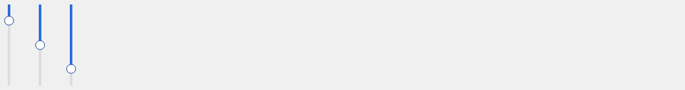

*Top: horizontal slider at 0% / 50% / 100% / disabled. Bottom: vertical, 3 positions.*

Horizontal / vertical slider. Dragging the thumb fires `DUIN_VALUECHANGED` live.

**Typical parent:** any layout container (VBox / HBox / Grid / GroupBox content area / Splitter pane / Dock child area).

#### Code-based creation

```
auto sl = std::make_unique<balloonwjui::DuiSlider>();
sl->SetCtrlId(IDC_VOLUME);
sl->SetOrientation(balloonwjui::DuiSlider::Horizontal);
sl->SetRange(0, 100);
sl->SetValue(60);
sl->SetTickInterval(10);   // Ticks
hbox->AddChild(std::move(sl), balloonwjui::DuiLayout::Hint().Weight(1));
```

#### Events

| code | When it fires | extra (LPARAM) |
| --- | --- | --- |
| `DUIN_VALUECHANGED` | Dragging the thumb (live, continuous) / clicking the track / ←→↑↓ / Home/End / PageUp/Down / wheel; `SetPos(_, true)` programmatic writes also fire. | New position `(int)n->extra`. |

```
// In the parent dialog's OnDuiNotify: volume slider
auto* n = (balloonwjui::DuiNotify*)lp;
if (n->ctrlId == IDC_VOLUME && n->code == DUIN_VALUECHANGED) {
    int v = (int)n->extra;          // 0..100
    m_audio.SetVolume(v / 100.0f);
    m_lblVolume->SetText(CString().Format(_T("%d%%"), v));
}
```

#### Key API

|   |   |
| --- | --- |
| `SetRange(min, max) / SetPos(v, notify)` | Value range + current value; auto-clamps. |
| `SetLineSize(int)` | Step size for keyboard / wheel / track click (default 1). |
| `SetVertical(bool)` | Vertical = value increases top → bottom (matches Win32 ScrollBar). |
| `SetTrackHeight / SetThumbSize` | Track thickness / thumb diameter. |
| `SetTrackColor / SetFillColor / SetThumbColor` | Color overrides (default light gray / brand blue / white). |
| `SetTickFrequency(int)` | One tick every n value-units; 0 = no ticks. |

#### XML-based creation

```
<hbox padding="8" gap="8" fixedHeight="32">
    <label  text="Volume" fixedWidth="60"/>
    <slider id="600" min="0" max="100" value="40" line-size="5" tick-frequency="10" weight="1"/>
</hbox>
```

```
// caller side:
auto root = balloonwjui::DuiXmlBuilder().FromString(xml);
host.SetRoot(std::move(root));
```

#### XML quick reference

|   |   |
| --- | --- |
| Tag | `<slider id="..." min="0" max="100" value="40" line-size="5" tick-frequency="10"/>` |
| Detailed attribute reference | [§3.3.10 slider](#xml-slider) |
| Events | `DUIN_VALUECHANGED` — drag / track click / wheel / keyboard / SetPos(_, true) fires it; extra = new value (int). |

<a id="DuiSwitch"></a>

### DuiSwitch  `[DUI]`


*Left to right: off (light-gray pill) / on (Weixin-green pill) / disabled-off / disabled-on.*

iOS-style rounded pill toggle for a single boolean state — more "switchy" than a Checkbox, with clearer color contrast. Toggles with a 150 ms ease-out-cubic animation — the knob slides from one side to the other while the pill background fades from the off color to the on color.

**Typical parent:** any layout container (VBox / HBox / Grid / GroupBox content area / Splitter pane / Dock child area). Commonly seen at the end of settings rows ("Notifications / Auto-download / Keep chat history") or in the group-chat sidebar's "Mute notifications" entry.

#### Code-based creation

```
auto sw = std::make_unique<balloonwjui::DuiSwitch>();
sw->SetCtrlId(IDC_MUTE_NOTIF);
sw->SetChecked(true, /*animated=*/false, /*notify=*/false);   // Init without animation / without notify
hbox->AddChild(std::move(sw), balloonwjui::DuiLayout::Hint().Fixed(46));
```

#### Events

| code | When it fires | extra (LPARAM) |
| --- | --- | --- |
| `DUIN_VALUECHANGED` | When mouse click / Space / Enter toggles the state; does <u>not</u> include programmatic `SetChecked()` calls (consistent with DuiButton checkbox). | 1 (on) / 0 (off) |

```
// In the parent dialog's OnDuiNotify: mute notifications
auto* n = (balloonwjui::DuiNotify*)lp;
if (n->ctrlId == IDC_MUTE_NOTIF && n->code == DUIN_VALUECHANGED) {
    bool on = (n->extra != 0);
    m_settings.SetMute(on);
}
```

#### Key API

|   |   |
| --- | --- |
| `SetChecked(bool, bool animated=true, bool notify=false)` | Sets the checked state; the explicit `animated` argument always wins (not affected by the global SetAnimated switch), which is convenient for "set the value instantly right now" init paths. |
| `IsChecked() / GetProgress()` | Current state + current 0..1 animation progress (climbs from 0 to 1 during off → on). |
| `SetAnimated(bool)` | Default animation switch for mouse/keyboard toggles; default true. Turn off to make toggles snap immediately and save CPU. |
| `SetOnColor / SetOffColor / SetKnobColor` | Color overrides (defaults: Weixin green RGB(7,193,96) / light gray RGB(229,229,229) / white). |

#### Animation driver

DuiSwitch drives the knob animation through `balloonwjui::DuiAnimMgr` + `DuiDoubleAnim`. The host must periodically call `DuiAnimMgr::Inst().TickAll(::GetTickCount())` to see intermediate frames — the typical pattern is for the top-level frame to `SetTimer(id, 16)` in `OnCreate`, call `TickAll` in `OnTimer`, and `KillTimer` + `DuiAnimMgr::Inst().Clear()` in `OnDestroy`. `DuiGallery`'s `GalleryFrame` already wires this pulse as a reference implementation.

For business dialogs that haven't wired the pulse: `SetChecked` still snaps the state to the endpoint immediately (the `animated=false` path), just without the animated transition.

#### XML-based creation

```
<hbox padding="8" gap="8" fixedHeight="32">
    <label  text="Mute notifications" weight="1"/>
    <switch id="700" checked="false" fixedWidth="46" fixedHeight="24"/>
</hbox>
```

```
// caller side:
auto root = balloonwjui::DuiXmlBuilder().FromString(xml);
host.SetRoot(std::move(root));
```

#### XML quick reference

|   |   |
| --- | --- |
| Tag | `<switch id="..." checked="false" animated="true" on-color="7,193,96"/>` |
| Detailed attribute reference | [§3.3.11 switch](#xml-switch) |
| Events | `DUIN_VALUECHANGED` — mouse / Space / Enter toggle fires it; extra = 1 (on) / 0 (off); `SetChecked()` does not fire it. |

<a id="DuiComboBox"></a>

### DuiComboBox  `[DUI]`

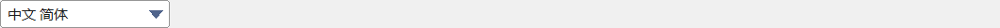

*Collapsed state shows the current selection + a triangle on the right.*

Dropdown picker. Two flavors: read-only (click to pop the dropdown) / editable (type-to-filter — requires `SetIncrementalSearch(true)`).

**Typical parent:** any layout container (VBox / HBox / Grid / GroupBox content area / Splitter pane / Dock child area). The editable flavor embeds an EDIT child, so after attaching you must call `cb->EnsureCreated(host.m_hWnd)` once the host HWND is ready (required for editable mode only; can be skipped for read-only).

#### Code-based creation

```
auto cb = std::make_unique<balloonwjui::DuiComboBox>();
cb->SetCtrlId(IDC_FRUIT);
cb->AddItem(_T("Apple"));
cb->AddItem(_T("Banana"));
cb->AddItem(_T("Cherry"));
cb->SetEditable(true);
cb->SetIncrementalSearch(true);
cb->SetIncrementalSearchSubstring(true);   // Substring match (default false = prefix only)
cb->SetIncrementalSearchCaseSensitive(false);
balloonwjui::DuiComboBox* cbRaw = cb.get();
hbox->AddChild(std::move(cb), balloonwjui::DuiLayout::Hint().Fixed(160));

// Editable mode: call once after host.Create(...):
cbRaw->EnsureCreated(host.m_hWnd);
```

|   |   |
| --- | --- |
| `AddItem / RemoveAt / Clear` | Item operations. |
| `GetCount / GetItemText(idx)` | Query. |
| `SetCurSel(idx) / GetCurSel()` | Current selection. |
| `SetEditable(bool)` | Whether input is allowed. |
| `SetIncrementalSearch(bool)` | Type-to-filter the dropdown. |
| `ComputeFilteredIndices(query)` | Pure helper: returns the real-index list after filtering. |

#### Events

| code | When it fires | extra (LPARAM) |
| --- | --- | --- |
| `DUIN_VALUECHANGED` | User picks an item from the dropdown; `SetCurSel(_, true)` programmatic selection also fires it; `SetCurSel(_, false)` does not. | New selected index `(int)n->extra`. |

In editable mode (`SetEditable(true)`), type-to-filter only hides / shows dropdown items internally — it does <u>not</u> fire any extra event; only the final selection of an item fires `DUIN_VALUECHANGED`. To monitor the typing process, use `DuiSearchBox` instead.

```
// In the parent dialog's OnDuiNotify: language switch
auto* n = (balloonwjui::DuiNotify*)lp;
if (n->ctrlId == IDC_LANGUAGE && n->code == DUIN_VALUECHANGED) {
    int idx = (int)n->extra;
    static const LPCTSTR codes[] = { _T("en"), _T("zh-CN"), _T("ja") };
    SetUiLocale(codes[idx]);
}
```

XML does not yet natively support `<combobox>` (the item list + editable mode involves a nested EDIT node); for an XML description, use `DuiXmlBuilder::CustomFactory`.

## 7.4 List & navigation

<a id="DuiListBox"></a>

### DuiListBox  `[DUI]`

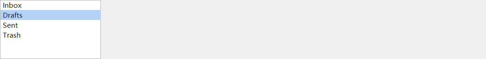

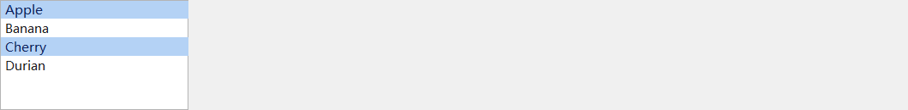

*Left: single-select mode ("Drafts" selected). Right: multi-select mode ("Apple" and "Cherry" selected).*

Simple scrolling list. Supports single / multi select, customizable row height, optional checkboxes / drag reorder. <u>All items are stored inside the control itself (`std::vector<Item>`)</u> — meaning N rows hold N string copies. Past ~10k rows, consider [DuiVirtualList](#DuiVirtualList) below.

**Typical parent:** any layout container (VBox / HBox / Grid / GroupBox content area / Splitter pane / Dock child area). <u>Long lists are usually wrapped in a `DuiScrollView`</u> to scroll when content overflows — DuiListBox itself does not have a built-in scrollbar.

**When to skip DuiListBox in favor of DuiVirtualList:**

      Row count ≥ 10k — the memory of holding a vector + the O(N) shift on insert/delete starts to bite.
      Row content comes from an external data source (database / business model) and you don't want a second copy inside the UI control.
      Each row needs complex custom drawing (chat bubbles / multi-line cards) that a plain-string `SetItemText` API can't express.

#### Code-based creation

```
auto lb = std::make_unique<balloonwjui::DuiListBox>();
lb->SetCtrlId(IDC_SESSION_LIST);
for (auto& s : items) lb->AddItem(s);
lb->SetSelectMode(balloonwjui::DuiListBox::Multi);
lb->SetItemHeight(28);
lb->SetCurSel(0);

// Wrap in a DuiScrollView so a long list can scroll:
auto sv = std::make_unique<balloonwjui::DuiScrollView>();
balloonwjui::DuiListBox* lbRaw = lb.get();
sv->SetContent(std::move(lb));
sv->SetContentHeight(lbRaw->GetCount() * lbRaw->GetItemHeight());
vbox->AddChild(std::move(sv), balloonwjui::DuiLayout::Hint().Weight(1));
```

#### Events

| code | When it fires | extra (LPARAM) |
| --- | --- | --- |
| `DUIN_VALUECHANGED` | Current selection changed (fires in both single and multi-select mode). | New selected index (in multi-select mode this is the index of the most recent operation). |
| `DUIN_DBLCLK` | Double-click on an item (typically used as the "open conversation" / Enter-equivalent action). | Index of the double-clicked item. |
| `DuiListBox::DUITN_CHECKED` | In multi-select + checkbox mode (`SetShowCheckboxes(true)`), when the user toggles an item's checkbox. | Item index; call `IsItemChecked(idx)` for the new state. |
| `DuiListBox::DUITN_REORDERED` | After `SetDragReorderEnabled(true)`, when a drag reorder completes. | New index (the destination position of the dragged item). |

```
// In the parent dialog's OnDuiNotify: conversation list
auto* n = (balloonwjui::DuiNotify*)lp;
if (n->ctrlId == IDC_SESSION_LIST) {
    int idx = (int)n->extra;
    switch (n->code) {
    case DUIN_VALUECHANGED:
        // Selection changed — load that conversation's chat history
        OpenSession(m_sessionList->GetItemParam(idx));
        break;
    case DUIN_DBLCLK:
        // Double-click — show conversation details
        ShowSessionDetail(idx);
        break;
    case balloonwjui::DuiListBox::DUITN_CHECKED:
        // Multi-select checkbox toggle — used for "mark batch as read"
        UpdateBatchSelection();
        break;
    }
}
```

<a id="DuiVirtualList"></a>

### DuiVirtualList  `[DUI]`

A true virtual list: <u>holds no row data itself</u>; the caller supplies a "row count + how to paint each row" callback, and the control invokes it on demand. Mouse / keyboard / selection / scroll behavior matches [DuiListBox](#DuiListBox) exactly, but memory usage = O(visible rows + the control's fixed overhead), <u>independent</u> of dataset size.

**Typical parent:** any layout container (VBox / HBox / Grid / GroupBox content area / Splitter pane / Dock child area). <u>It manages its own scrollbar</u> (built-in `DuiScrollBar`); you should not wrap it in `DuiScrollView`.

#### Use cases

- **Chat history / message log**: 100k messages in a single conversation is common, each needing its own bubble / avatar / timestamp layout. DuiListBox's plain-text API can't express this, and copying 100k `CString`s is wasteful.
- **Large-dataset background lists**: log viewers, monitoring metric lists, recent-conversation lists. The data already lives in your `std::vector` / `std::deque`; no need to hand a duplicate to the control.
- **Rows that need complex custom painting**: rows have more than text — avatars, badges, status dots, unread counts. DuiVirtualList's paint callback hands the entire row's HDC to the caller; draw whatever you want.

#### How it works

In three sentences:

1. **No data storage**. The control only stores: row count `m_rowCount`, row height `m_rowH`, current selection `m_curSel`, hover row `m_hoverIdx`, and the scrollbar. Zero per-row content cache.
2. **Each frame, only paint the rows visible in the viewport**. In `OnPaint`: `int firstVisible = scrollPos / m_rowH; int lastVisible = firstVisible + RowsVisible() + 1; // +1 for the partial last row for (int i = firstVisible; i < lastVisible; ++i) { RECT rcRow = { ..., top - scrollPos + i * m_rowH, ... }; m_paint(m_paintUser, hdc, i, rcRow, isSelected, isHover); // callback } ` The viewport holds ~30 rows; each frame calls the callback ~30 times — completely <u>independent</u> of whether `m_rowCount` is 10k or 10M.
3. **The control owns selection / hover state; the caller owns row content**. The callback signature is `(hdc, rowIndex, rowRect, selected, hover)` — given these 5 parameters, the caller fetches record `i` from its own data source, chooses the background / highlight based on selected/hover, and paints the content within `rowRect`.

#### Compared with DuiListBox

|  | DuiListBox | DuiVirtualList |
| --- | --- | --- |
| Data ownership | `std::vector<Item>` inside the control | <u>None</u> — caller supplies a callback |
| Typical ceiling | ~5k rows (beyond that, memory + insertion cost is noticeable) | ~tens of millions (the bottleneck is scrollbar precision, not the control) |
| Per-row content API | Plain text + LPARAM business id + optional checkbox | Caller paints the whole row (HDC + RECT); draw anything |
| Insert / remove a row | O(N) shift (vector middle insert / erase) | Caller manages business data; the control only needs `SetRowCount(n)` |
| Scrollbar | Needs an outer `DuiScrollView` | Built-in, self-managed |
| Multi-select | Supported (`SetSelectMode(Multi)` + optional checkbox) | <u>Single-select only</u> (just `m_curSel`; no multi-select API) |
| Drag reorder | Supported (`SetDragReorderEnabled`) | Not supported (the control doesn't know rows' real identities, so it can't reorder them at the UI layer) |

Picking the right one: <u>simple text lists with ≤ a few thousand rows</u> → DuiListBox; <u>tens of thousands of rows / per-row custom painting / data already lives in a model</u> → DuiVirtualList.

#### API at a glance

| Call | Meaning |
| --- | --- |
| `SetRowCount(n)` | Declare the dataset's row count; refreshes the scroll range when it changes. |
| `SetRowHeight(h)` | Per-row pixel height (default 28). |
| `SetPaintRowCallback(fn, user)` | **Required**. Per-row paint callback. |
| `SetRowClickCallback(fn, user)` | Optional. Fires on single / double click; `isDoubleClick` distinguishes them. |
| `SetCurSel(idx, notify=true)` | Programmatically set the selected row; usually the caller doesn't call this directly — the control responds to mouse / keyboard. |
| `EnsureVisible(idx)` | Scroll so row `idx` is visible (used for "jump to latest message" and similar). |
| `GetCurSel() / GetRowCount() / GetScrollPos()` | State queries. |

#### Code example 1: chat history (typical scenario)

100k chat messages live in the app's `std::deque<ChatMsg>`. Each message needs an avatar + bubble + timestamp.

```
struct ChatMsg
{
    CString  senderName;
    CString  content;
    HBITMAP  avatarBmp;
    SYSTEMTIME timestamp;
    bool     isOutgoing;     // outgoing → drawn on the right; incoming → drawn on the left
};

class ChatHistoryView
{
public:
    void Build(balloonwjui::DuiVBox* parent, std::deque<ChatMsg>* model)
    {
        m_model = model;

        auto vlist = std::unique_ptr<balloonwjui::DuiVirtualList>(new balloonwjui::DuiVirtualList());
        vlist->SetCtrlId(IDC_CHAT_HISTORY);
        vlist->SetRowHeight(64);                           // avatar 48 + top/bottom padding
        vlist->SetRowCount((int)model->size());

        // user pointer points back to the business model; cast it in the callback
        vlist->SetPaintRowCallback(&ChatHistoryView::PaintRow, this);
        vlist->SetRowClickCallback(&ChatHistoryView::OnRowClick, this);

        m_vlist = vlist.get();
        parent->AddChild(std::move(vlist), balloonwjui::DuiLayout::Hint().Weight(1));

        // Default: scroll to the bottom (latest message)
        if (!model->empty())
        {
            m_vlist->EnsureVisible((int)model->size() - 1);
        }
    }

    // Appending a new message: just update the model, refresh the row count, scroll to bottom
    void OnNewMessage(const ChatMsg& msg)
    {
        m_model->push_back(msg);
        m_vlist->SetRowCount((int)m_model->size());
        m_vlist->EnsureVisible((int)m_model->size() - 1);
    }

private:
    // ---- Static trampolines forwarding to member functions ----
    static void PaintRow(void* user, HDC hdc, int rowIndex,
                         const RECT& rcRow, bool selected, bool hover)
    {
        static_cast<ChatHistoryView*>(user)->PaintMsg(hdc, rowIndex, rcRow, selected, hover);
    }
    static void OnRowClick(void* user, int rowIndex, bool isDoubleClick)
    {
        static_cast<ChatHistoryView*>(user)->HandleClick(rowIndex, isDoubleClick);
    }

    void PaintMsg(HDC hdc, int rowIndex, const RECT& rcRow,
                  bool selected, bool hover)
    {
        if (rowIndex < 0 || rowIndex >= (int)m_model->size()) { return; }
        const ChatMsg& m = (*m_model)[rowIndex];

        // 1. Row background (the control doesn't draw this — the caller decides)
        COLORREF bg = RGB(255, 255, 255);
        if (selected)   { bg = RGB(180, 210, 245); }
        else if (hover) { bg = RGB(232, 240, 252); }
        ::SetBkColor(hdc, bg);
        ::ExtTextOut(hdc, 0, 0, ETO_OPAQUE, &rcRow, _T(""), 0, nullptr);

        // 2. Avatar
        RECT rcAvatar = { rcRow.left + 8, rcRow.top + 8,
                          rcRow.left + 8 + 48, rcRow.top + 8 + 48 };
        DrawBitmapInto(hdc, rcAvatar, m.avatarBmp);

        // 3. Bubble + text
        RECT rcBubble = { rcAvatar.right + 8, rcRow.top + 8,
                          rcRow.right - 8, rcRow.bottom - 8 };
        DrawBubble(hdc, rcBubble, m.content, m.isOutgoing);

        // 4. Timestamp (top-right corner)
        TCHAR tsBuf[32];
        FormatTime(m.timestamp, tsBuf);
        DrawTimestamp(hdc, rcBubble, tsBuf);
    }

    void HandleClick(int rowIndex, bool isDoubleClick)
    {
        if (isDoubleClick)
        {
            ShowMessageDetail((*m_model)[rowIndex]);
        }
    }

    balloonwjui::DuiVirtualList* m_vlist = nullptr;
    std::deque<ChatMsg>*         m_model = nullptr;
};
```

**Key points**:

- **Appending one message** does not need an `InsertItem` — after the app `push_back`s, just call `SetRowCount(n)`. The control will naturally paint the new row on its next OnPaint.
- **Static trampolines** are because the callback signature is a C function pointer (not `std::function` — avoids DLL-boundary ABI issues). The `user` parameter is the standard workaround for the fact that C function pointers can't capture `this`.
- **The caller paints the row background**: the control hands you the `selected` / `hover` states, but it does not force a specific color or selection style. If you want "highlight outgoing messages gold + selection turns orange," every degree of freedom is yours.

#### Code example 2: million-row read-only log viewer

Extreme case. The log file is mmap'd into memory; per-line offsets are recorded in an array.

```
class LogViewer
{
public:
    void Open(LPCTSTR path, balloonwjui::DuiVBox* parent)
    {
        m_lines = MmapAndIndexLines(path);   // App side: returns vector<LineRef>{offset, len}

        auto v = std::unique_ptr<balloonwjui::DuiVirtualList>(new balloonwjui::DuiVirtualList());
        v->SetRowHeight(20);
        v->SetRowCount((int)m_lines.size());     // Even at 10M rows, this is just setting a number
        v->SetPaintRowCallback(&LogViewer::Paint, this);
        m_v = v.get();
        parent->AddChild(std::move(v), balloonwjui::DuiLayout::Hint().Weight(1));
    }

    void JumpToLine(int n) { m_v->EnsureVisible(n); m_v->SetCurSel(n); }

private:
    static void Paint(void* user, HDC hdc, int row, const RECT& rc, bool sel, bool hover)
    {
        auto* self = static_cast<LogViewer*>(user);
        if (row < 0 || row >= (int)self->m_lines.size()) { return; }

        // Row background
        COLORREF bg = sel ? RGB(255, 235, 130) : (hover ? RGB(245, 245, 245) : RGB(255, 255, 255));
        HBRUSH hbr = ::CreateSolidBrush(bg);
        ::FillRect(hdc, &rc, hbr);
        ::DeleteObject(hbr);

        // Read this line's bytes directly from the mmap view (zero copy) and DrawText
        const auto& line = self->m_lines[row];
        ::SetTextColor(hdc, RGB(40, 40, 40));
        ::SetBkMode(hdc, TRANSPARENT);
        RECT rcText = { rc.left + 4, rc.top, rc.right - 4, rc.bottom };
        ::DrawTextA(hdc, self->m_mapped + line.offset, line.len, &rcText,
                    DT_LEFT | DT_VCENTER | DT_SINGLELINE | DT_NOPREFIX);
    }

    balloonwjui::DuiVirtualList* m_v = nullptr;
    const char*                  m_mapped = nullptr;
    std::vector<LineRef>         m_lines;
};
```

This viewer's memory cost for opening a 1 GB log (~15M lines) is ≈ 1 GB (mmap itself) + `vector<LineRef>` at 12 bytes × 15M ≈ 180 MB. The control itself holds ~1 KB of state. <u>Switch to DuiListBox</u> and the `CString`s inside `m_items` alone would consume another 1 GB (with 1–2 heap allocations per row) — likely an immediate OOM.

#### Events

| code | When it fires | extra (LPARAM) |
| --- | --- | --- |
| `DUIN_VALUECHANGED` | Current selected row changed (fires on mouse click / keyboard Up-Down; `SetCurSel(_, true)` programmatic writes also fire). | New selected row index; -1 = cleared. |

Note: single / double click is delivered through the `SetRowClickCallback` callback, <u>not</u> via `WM_DUI_NOTIFY` — clicks are too tightly coupled to a "row" (the rowIndex must be passed in), so a callback is more direct. If you'd rather route everything through notify, just call `NotifyParent` inside your callback.

#### Pitfalls / things to watch

- **Data ↔ UI sync is the caller's responsibility**. After the app removes row 5 it must call `SetRowCount` to inform the control; otherwise `m_curSel` and the rowIndex passed to the callback will drift out of sync with the real data. Recommended: wrap a "app-side Add / Remove → auto-sync" helper (see `OnNewMessage` in the chat example).
- **Accessing the model in the callback must be thread-safe**. OnPaint runs on the UI thread, but if another thread of the caller writes into the model (an IM backend receiving messages), the caller must lock the model's read access — the control has no idea about your locks.
- **Do not do expensive work inside the callback**. The callback fires ~30 times per frame; a single callback above 1 ms will stutter on scroll. Complex row layout should be precomputed in the app's model (row height, text-wrap positions, ...) so the callback only makes GDI calls.
- **There is no "row LPARAM" concept**. The caller always gets only `rowIndex`; business identity must be mapped on your side (e.g. `m_lines[rowIndex].id`) — that's the price of being "virtual."

<a id="DuiTreeView"></a>

### DuiTreeView  `[DUI]`

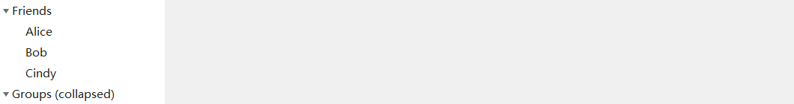

*"Friends" expanded (children visible); "Groups" collapsed.*

Hierarchical list with expand / collapse. Two modes: <u>single-column</u> (default) = classic tree view; <u>multi-column</u> (after calling `AddColumn`) = tree + table hybrid, with header drag / sort / frozen panes / 6 cell types / cell-level selection / in-place Text editing.

**Typical parent:** any layout container (VBox / HBox / Grid / GroupBox content area / Splitter pane / Dock child area). <u>Single-column mode</u> needs an outer `DuiScrollView` to scroll when content is long; <u>multi-column mode</u> manages its own horizontal + vertical scrollbars and can be attached directly.

#### Single-column mode

Don't call `AddColumn`. Each row is `[▶ glyph][indent][icon][label][...][status dot]`: no header, no horizontal scroll; rely on an outer `DuiScrollView` to scroll.

```
auto tv = std::make_unique<balloonwjui::DuiTreeView>();
int gFriends = tv->AddRoot(_T("Friends"));
int idAlice  = tv->AddChild(gFriends, _T("Alice"));
tv->SetItemStatusColor(idAlice, RGB(64, 200, 96));    // Online-green
tv->Expand(gFriends);
tv->SetCurSel(idAlice);

// Wrap in a DuiScrollView so a long tree can scroll:
auto sv = std::make_unique<balloonwjui::DuiScrollView>();
balloonwjui::DuiTreeView* tvRaw = tv.get();
sv->SetContent(std::move(tv));
sv->SetContentHeight(tvRaw->GetContentHeight());
vbox->AddChild(std::move(sv), balloonwjui::DuiLayout::Hint().Weight(1));
```

#### Multi-column mode

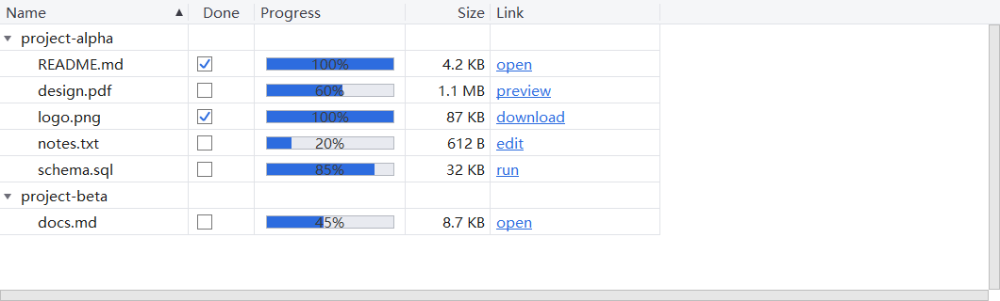

*5-column layout: Name (the tree column, frozen-cols=1, initially sorted ascending with a ▲ glyph) / Done (CheckBox cell) / Progress (ProgressBar cell + percent) / Size (right-aligned Text) / Link (Hyperlink, blue underlined). Two roots project-alpha / project-beta each expanded with children.*

Calling `AddColumn` switches into multi-column mode: a fixed top header (drag column width / click to sort / double-click to auto-fit / right-click → `DUITVN_HEADER_RCLICK`), with a 4-quadrant layout below that supports `SetFrozenColumns/SetFrozenRows` (Excel-style). The control manages <u>both</u> horizontal and vertical scrollbars itself — even without an outer DuiScrollView, it scrolls.

**Cell types:**

| Type | Call | Display | Default interaction |
| --- | --- | --- | --- |
| `CELL_TEXT` | `SetCellText(id, col, text)` | Single-line text | F2 / double-click → in-place EDIT* |
| `CELL_ICON` | `SetCellIcon(id, col, hbm)` | Centered 18×18 small icon | None |
| `CELL_IMAGE` | `SetCellImage(id, col, hbm)` | Larger image scaled to column width | None |
| `CELL_CHECKBOX` | `SetCellChecked(id, col, b)` | Box + ✓ | Click to toggle* → `DUITVN_CHECKED` |
| `CELL_PROGRESS` | `SetCellValue(id, col, 0..100)` | Progress bar + percent text | Click / drag to change value* → `DUITVN_VALUECHANGED_CELL` |
| `CELL_HYPERLINK` | `SetCellLink(id, col, text, url)` | Blue underlined text | Click fires `DUITVN_LINKCLICK` (always) |

* Gated by the <u>edit gates</u>: `SetEditable(true)` global switch + `SetColumnEditable(col, b)` per-column switch. <u>Default false</u> (read-only). Hyperlink is not gated.

**Selection model:** in multi-column mode selection granularity = cell. `GetCurSelCell()` returns `{itemId, col}`. Ctrl+click for multi-select / Shift+click for range select → iterate with `GetSelectedCellCount()`+`GetSelectedCell(n)`. The active cell is drawn with a 1 px brand-blue border + a 1 px inner white border (cell focus rect).

**Column-width behavior:** `SetColumnMinWidth` sets the minimum (default 40 px); the last column does <u>not</u> auto-stretch (so the scrollbar has room); double-clicking the header column-divider triggers <u>auto-fit</u> (based on the visible cells' actual text widths); column drag-reorder is <u>not</u> supported.

**Visual details:** `SetZebra(bool)` defaults off; hover highlights the whole row; the cell focus rect is 1 px blue + 1 px inner white; text overflow trails with an ellipsis.

#### Code usage (multi-column)

The block below is the DuiGallery `Build_TreeView` multi-column implementation (in `DuiGallery/Pages.cpp`) corresponding to the screenshot above; copy-and-modify-ready.

```
auto tree = std::unique_ptr<DuiTreeView>(new DuiTreeView());
tree->SetCtrlId(901);

// Column layout.
int colName = tree->AddColumn(_T("Name"),     200, 80, DT_LEFT);
int colDone = tree->AddColumn(_T("Done"),      70, 50, DT_CENTER);
int colProg = tree->AddColumn(_T("Progress"), 160, 90, DT_LEFT);
int colSize = tree->AddColumn(_T("Size"),      90, 60, DT_RIGHT);
int colLink = tree->AddColumn(_T("Link"),     180, 80, DT_LEFT);

tree->SetFrozenColumns(1);              // Pin the Name column to the left (no horizontal scroll)
tree->SetEditable(true);                // Allow Text double-click editing
tree->SetSortIndicator(colName, +1);    // Initially ascending by Name (only paints the glyph)

struct Row {
    LPCTSTR name;  bool done;  int progress;
    LPCTSTR size;  LPCTSTR link;  LPCTSTR url;
};
const Row rows[] = {
    { _T("README.md"),  true,  100, _T("4.2 KB"), _T("open"),     _T("https://example.com/readme") },
    { _T("design.pdf"), false,  60, _T("1.1 MB"), _T("preview"),  _T("https://example.com/design") },
    { _T("logo.png"),   true,  100, _T("87 KB"),  _T("download"), _T("https://example.com/logo")   },
    { _T("notes.txt"),  false,  20, _T("612 B"),  _T("edit"),     _T("https://example.com/notes")  },
    { _T("schema.sql"), false,  85, _T("32 KB"),  _T("run"),      _T("https://example.com/sql")    },
};

int gProj = tree->AddRoot(_T("project-alpha"));
for (auto& r : rows) {
    int id = tree->AddChild(gProj, r.name);    // col 0 = Name
    tree->SetCellChecked(id, colDone, r.done);
    tree->SetCellValue  (id, colProg, r.progress);
    tree->SetCellText   (id, colSize, r.size);
    tree->SetCellLink   (id, colLink, r.link, r.url);
}
// Second root

int gAnother = tree->AddRoot(_T("project-beta"));
int idDoc = tree->AddChild(gAnother, _T("docs.md"));
tree->SetCellChecked(idDoc, colDone, false);
tree->SetCellValue  (idDoc, colProg, 45);
tree->SetCellText   (idDoc, colSize, _T("8.7 KB"));
tree->SetCellLink   (idDoc, colLink, _T("open"), _T("https://example.com/docs"));

vbox->AddChild(std::move(tree), balloonwjui::DuiLayout::Hint().Weight(1));
```

#### XML usage (column definitions only)

Nodes (`AddRoot` / `AddChild`) must be added from C++; XML can only declare columns, since nodes change at runtime and aren't worth expressing in XML.

```
<vbox padding="0">
    <treeview id="100" row-height="28" header-height="26"
              frozen-cols="1" editable="true" zebra="false">
        <column title="Name"     width="200" min-width="80"  align="left"   sortable="true"  editable="true"/>
        <column title="Done"     width="70"  min-width="50"  align="center"/>
        <column title="Progress" width="160" min-width="90"  align="left"/>
        <column title="Size"     width="90"  min-width="60"  align="right"/>
        <column title="Link"     width="180" min-width="80"  align="left"   editable="false"/>
    </treeview>
</vbox>
```

```
// caller side (nodes still added from C++; XML only configures the columns):
auto root = balloonwjui::DuiXmlBuilder().FromString(xml);
host.SetRoot(std::move(root));
auto* tree = static_cast<balloonwjui::DuiTreeView*>(host.GetRoot()->FindControlById(100));
int gProj = tree->AddRoot(_T("project-alpha"));
// ... continue with AddChild + SetCellXxx, same as the code-usage block above
```

#### Events

Two event payload kinds: <u>row-level events</u> use `extra = itemId (int)`; <u>cell- / header-level events</u> use `extra = DuiTreeView::DuiTreeCellNotify*` (lifetime is only the duration of the `SendMessage` call stack — if the parent needs to keep the value, deep-copy the `text` field).

| code | When it fires | extra |
| --- | --- | --- |
| `DUIN_CLICK` | Left-click on a node. | itemId |
| `DUIN_DBLCLK` | Double-click on a node (when CELL_TEXT is double-clicked with editable=on, the in-place EDIT opens and this event does not bubble). | itemId |
| `DUIN_VALUECHANGED` | Current selection changed. | New itemId / -1 |
| `DUITVN_EXPAND_TOGGLED` | Expand / collapse completed. | itemId |
| `DUITVN_RCLICK` | Right-click on a row (does not change selection). | itemId |
| `DUITVN_HEADER_RCLICK` | Right-click on a multi-column header title. | `DuiTreeCellNotify*` (col) |
| `DUITVN_BLANK_RCLICK` | Right-click on the blank area of the multi-column body. | `DuiTreeCellNotify*` (itemId=-1, col=-1) |
| `DUITVN_COLUMNCLICK` | Click on a multi-column header title = sort intent (the library does not sort data; the app sorts then calls `SetSortIndicator`). | `DuiTreeCellNotify*` (col, ascending) |
| `DUITVN_CHECKED` | CheckBox cell toggled. | `DuiTreeCellNotify*` (itemId, col, checked) |
| `DUITVN_VALUECHANGED_CELL` | ProgressBar cell value changed via drag. | `DuiTreeCellNotify*` (value) |
| `DUITVN_LINKCLICK` | Hyperlink cell clicked (always fires; not gated by editable). | `DuiTreeCellNotify*` (text=URL) |
| `DUITVN_CELLEDITED` | Text cell in-place EDIT committed (Enter / focus lost). | `DuiTreeCellNotify*` (text=new text) |

```
// Multi-column mode OnDuiNotify
auto* n = (balloonwjui::DuiNotify*)lp;
if (n->ctrlId != IDC_PROJ_TREE) return 0;
using TV = balloonwjui::DuiTreeView;

switch (n->code) {
case TV::DUITVN_COLUMNCLICK: {
    auto* c = (TV::DuiTreeCellNotify*)n->extra;
    SortRowsByColumn(c->col, c->ascending);     // App-side sort
    m_tree->SetSortIndicator(c->col, c->ascending ? +1 : -1);
    break;
}
case TV::DUITVN_LINKCLICK: {
    auto* c = (TV::DuiTreeCellNotify*)n->extra;
    ::ShellExecute(nullptr, _T("open"), c->text, nullptr, nullptr, SW_SHOW);
    break;
}
case TV::DUITVN_CHECKED: {
    auto* c = (TV::DuiTreeCellNotify*)n->extra;
    PersistDoneState(c->itemId, c->checked);
    break;
}
case TV::DUITVN_CELLEDITED: {
    auto* c = (TV::DuiTreeCellNotify*)n->extra;
    SaveCellText(c->itemId, c->col, c->text);
    break;
}
}
```

#### Performance characteristics

**What is dirty-rect row clipping?**

The "dirty rect" is the hint Windows hands to the control during `WM_PAINT`: "<u>only this rectangle actually needs to be repainted this time</u>." Whether the window was occluded and re-exposed, the scrollbar moved by one row, or `InvalidateRect` proactively marked a region dirty, in each case the dirty rect contains only the small area that really changed (for example, scrolling by one row marks only the newly exposed row strip). Windows also uses `BitBlt` / `ScrollWindowEx` under the hood to translate already-painted content to its new position, so the control only needs to paint the "newly exposed strip."

If a row-based control doesn't use this information, it will run the paint loop over all N rows (even when only ~30 fit on screen) on every `WM_PAINT`; even though GDI itself clips out-of-viewport drawing calls, the C++-level loop cost has already been paid. <u>Dirty-rect row clipping</u> turns the dirty rect's `top` / `bottom` back into "rows from index X to index Y":

```
// Assume row r covers y ∈ [yOrigin + r * rowH, yOrigin + (r+1) * rowH).
// Then the row-index range to paint is:
int rowFrom = max(0,        (rcDirty.top    - yOrigin) / rowH);
int rowTo   = min(rowCount, (rcDirty.bottom - yOrigin + rowH - 1) / rowH);
for (int r = rowFrom; r < rowTo; ++r) { ... }
```

This way, whether the list has 100 rows or 1M rows, each frame loops only over the **~30 rows** actually visible in the viewport. The rendering cost is <u>decoupled</u> from the row count and depends only on viewport size.

**Note**: dirty-rect row clipping addresses the "<u>render</u>" cost (each-frame OnPaint); it is <u>not</u> the same thing as a virtual list. It still requires all rows' <u>data</u> to be loaded into memory (DuiTreeView's `m_nodes` is a `std::vector<Node>` that holds everything). If even "hold every row" is too expensive, you need a true virtual list — see [DuiVirtualList](#DuiVirtualList) above.

**DuiTreeView's specific strategy:** nodes are stored in a flat `std::vector<Node>` plus a `m_visible` array (indices of currently expanded/visible rows). Each frame's repaint walks only `m_visible`; subtrees of collapsed nodes never enter the traversal. Both modes implement dirty-rect row clipping: translate Windows's `rcDirty` back into the row-index range that needs painting, and skip rows outside the viewport. Multi-column mode additionally clips per-quadrant (TL/TR/BL/BR — see the multi-column figure above), so the frozen panes and the scrolling region don't interfere with each other.

**There is no DuiVirtualTree.** balloonui currently only has a virtual <u>flat</u>-list (DuiVirtualList); there is no virtual <u>tree</u>. The reason is that tree-shaped data has to compute parent/child visibility + indentation, which doesn't map cleanly onto a callback-style API. If your tree has hundreds of thousands of nodes, the recommended approach today is incremental loading (app-side lazy-expand: `AddChild` only on first expand) + collapsing uninteresting subtrees when needed (children below a `Collapse`'d node don't enter the dirty-rect loop).

**Measured tiers (2.4 GHz CPU, Debug Win32, reference values; Release optimizes better):**

| Node count | Single-column | Multi-column |
| --- | --- | --- |
| ≤ 1k | Smooth | Smooth |
| 1k – 5k | Smooth | Smooth |
| 5k – 20k | Smooth (dirty-rect clipping saves the day) | Smooth (dirty-rect clipping saves the day) |
| 20k – 50k | Scrolling may drop frames | Scrolling may drop frames; painting the selection state slows down noticeably when many cells are selected |
| > 50k | Not recommended directly | Not recommended directly |

**Rendering cost: only paint the rows visible in the viewport**. The core clipping logic of `PaintBody` (the `paintQuadrant` lambda entry in `balloonui/Controls/List/DuiTreeView.cpp`):

```
// Per quadrant, narrow the row-index range by the dirty rect: paint only those
// rows whose y range intersects (rcDirty ∩ rcQuad). Skipping this step would make
// the BR quadrant loop the full m_visible × m_columns every frame — the dominant
// bottleneck at tens of thousands of rows.
//
// yOriginAbs = the absolute y value of "row 0" in this quadrant's coordinate system.
//   · Frozen-row quadrants TL / TR: = body.top
//   · Scrolling-row quadrants BL / BR: = body.top - m_scrollY
// Row r occupies y ∈ [yOriginAbs + r*m_rowH, yOriginAbs + (r+1)*m_rowH).
int yLo = (rcDirty.top    > rcQuad.top)    ? rcDirty.top    : rcQuad.top;
int yHi = (rcDirty.bottom < rcQuad.bottom) ? rcDirty.bottom : rcQuad.bottom;
if (yHi <= yLo) { return; }

int relLo = yLo - yOriginAbs;
int relHi = yHi - yOriginAbs;
int visLo = (relLo >= 0) ? (relLo / m_rowH) : 0;
int visHi = (relHi >= 0) ? ((relHi + m_rowH - 1) / m_rowH) : 0;
if (visLo > rowFrom) { rowFrom = visLo; }
if (visHi < rowTo)   { rowTo   = visHi; }
if (rowFrom >= rowTo) { return; }
```

In practice, scrolling a 10k-row multi-column tree gives single-frame OnPaint times of ≈ 1–4 ms, with peaks ≤ 10 ms — consistent with the ~30 rows the viewport can hold. The dirty-rect height (typically only a few dozen px when scrolling by one row) is further compressed by Windows's own `ScrollWindowEx`, so most scrolls repaint only a narrow strip.

**Known bottlenecks not covered by dirty-rect clipping:**

- **Insert / delete / expand-collapse is O(N)**: `AddRoot`/`AddChild`/`Remove`/`SetExpanded` internally each call `RebuildVisible` once (a full sweep of `m_nodes`). Bulk-loading N rows is O(N²): 10k rows ≈ 1 s, 30k rows ≈ 10 s. One-shot tree construction is fine for normal use; for "live-append log" patterns with continuous inserts, batch on the caller side and do one `Clear`+rebuild.
- **Cell-level multi-select uses linear scans**: every painted cell scans `m_selCells` to see if it's in the selection. 30 rows × 5 columns × 100 selected cells in the viewport ≈ 15k comparisons per frame is still fine; if the user selects thousands of cells, frame rate drops. Replace `m_selCells` with a hash table if needed.
- **Nodes are in a flat `vector<Node>`**: deleting a subtree removes a contiguous range from the middle, triggering element shifts; scenarios with frequent delete / move will see O(N) jitter.

#### Stress-test demo: DemoTreeViewLargeData

The repo ships a multi-column large-data stress demo. Path: `flamingoclient/DemoTreeViewLargeData/`; built binary: `Bin/DemoTreeViewLargeData.exe`. After launching, six buttons across the top — "Insert 1k / 10k / 30k rows / Clear / Expand all / Collapse all" — and a status bar below showing live:

```
Rows: N  |  Last OnPaint: X.XX ms (dirty-rect height H px)
        |  Last 60 frames avg/peak: A.AA / P.PP ms
```

The status row is refreshed by a 200 ms `WM_TIMER`; `OnPaint` timing comes from a subclass `TimedTreeView` that wraps a `QueryPerformanceCounter` around `DuiTreeView::OnPaint` and writes into a 60-slot ring buffer. Full source: `DemoTreeViewLargeData/main.cpp`.

**To verify dirty-rect clipping actually kicks in** (A/B comparison):

1. Run the demo, click "Insert 10k rows," and record the scrolling "avg/peak" (reference: ~1–3 ms / ~5–10 ms).
2. In `DuiTreeView.cpp`, at the `paintQuadrant` lambda entry, comment out the "intersect rcDirty and rcQuad on the y-axis" block (the 6 variables `yLo / yHi / relLo / relHi / visLo / visHi` + the 4 ifs); rebuild only `balloonui.dll` (you don't need to touch the demo).
3. Re-run the demo and scroll the same 10k rows — "avg/peak" climbs to the 30–80 ms / 80+ ms range, with visible lag.

<a id="DuiTab"></a>

### DuiTab  `[DUI]`

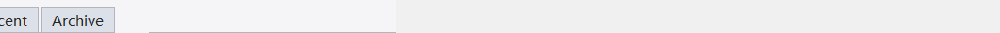

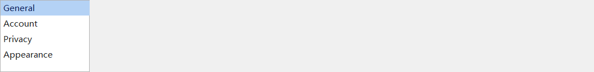

*Top: horizontal tab strip (Friends/Groups/Recent/Archive, second one selected). Bottom: settings-style vertical navigation (implemented with DuiListBox).*

Horizontal tab strip. `AddTab(title)` appends an item; clicking switches + fires `DUIN_VALUECHANGED` (extra = new selected index).

**Typical parent:** any layout container (VBox / HBox / Grid / GroupBox content area / Splitter pane / Dock child area). <u>Usually at the top of a `DuiVBox`</u> with a `DuiTabPage` below to switch content (paired through the same ctrlId notification).

#### Code-based creation

```
auto tab = std::make_unique<balloonwjui::DuiTab>();
tab->SetCtrlId(IDC_MAIN_TAB);
tab->AddTab(_T("Files"));
tab->AddTab(_T("Edit"));
tab->AddTab(_T("View"));
tab->SetCurSel(0, /*notify*/false);
vbox->AddChild(std::move(tab), balloonwjui::DuiLayout::Hint().Fixed(28));
```

#### Events

| code | When it fires | extra (LPARAM) |
| --- | --- | --- |
| `DUIN_VALUECHANGED` | User switches tabs; `SetCurSel(_, true)` programmatic switches also fire it. | New selected index |
| `DuiTab::DUITN_CLOSE` | User clicks the × button on a closeable tab. **This notification does <u>not</u> remove the tab**; the parent decides — e.g. may need to prompt "confirm closing unsaved." | Index of the tab requested to close |
| `DuiTab::DUITN_DROPDOWN` | User clicks the dropdown arrow on a dropdown tab. | Tab index (the parent pops a `DuiMenu`) |
| `DuiTab::DUITN_REORDERED` | After `SetReorderEnabled(true)`, when a drag reorder completes. | New index |

```
// In the parent dialog's OnDuiNotify: the full tab behavior
auto* n = (balloonwjui::DuiNotify*)lp;
if (n->ctrlId == IDC_MAIN_TAB) {
    int idx = (int)n->extra;
    switch (n->code) {
    case DUIN_VALUECHANGED:
        m_tabPage->SetActivePage(idx);
        break;
    case balloonwjui::DuiTab::DUITN_CLOSE:
        if (CanCloseSession(idx)) m_tab->RemoveTab(idx);
        break;
    case balloonwjui::DuiTab::DUITN_DROPDOWN:
        ShowTabDropdownMenu(idx);   // App pops its own menu
        break;
    case balloonwjui::DuiTab::DUITN_REORDERED:
        m_sessionOrder.MoveItem(/*from=*/m_lastDragIdx, /*to=*/idx);
        break;
    }
}
```

<a id="DuiTabPage"></a>

### DuiTabPage  `[layout]`

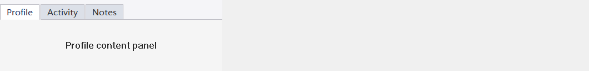

*Top DuiTab + bottom content area combination; switching tabs swaps content.*

Multi-page container: each page is any DuiControl subtree; `SetActivePage(i)` switches which one is shown.

**Typical parent:** any layout container (VBox / HBox / Grid / GroupBox content area / Splitter pane / Dock child area). <u>Usually placed directly below a `DuiTab`</u> and paired with it; on its own it behaves like a "container that shows the child at SetCurSel."

#### Code-based creation

```
auto tp = std::make_unique<balloonwjui::DuiTabPage>();
tp->SetCtrlId(IDC_TABPAGE);
tp->AddPage(BuildFilesPage());
tp->AddPage(BuildEditPage());
tp->SetActivePage(0);
vbox->AddChild(std::move(tp), balloonwjui::DuiLayout::Hint().Weight(1));
// The DuiTab was already added to vbox above; DuiTabPage follows it and fills the remaining space
```

Commonly paired with `DuiTab`: route the tab's `DUIN_VALUECHANGED` into `tabPage->SetActivePage(extra)`.

#### Events

| code | When it fires | extra (LPARAM) |
| --- | --- | --- |
| `DUIN_VALUECHANGED` | Current active page changed (also fires on programmatic `SetActivePage`). | New active-page index |

```
// Typical usage: the DuiTab's DUIN_VALUECHANGED drives the DuiTabPage's page switch
auto* n = (balloonwjui::DuiNotify*)lp;
if (n->ctrlId == IDC_TAB && n->code == DUIN_VALUECHANGED) {
    m_tabPage->SetActivePage((int)n->extra);
}
// IDC_TABPAGE's own DUIN_VALUECHANGED usually doesn't need to be handled — the
// reverse notification from SetActivePage is mainly for peripheral logic like
// "persist the user's most recent page index".
```

<a id="DuiMenu"></a>

### DuiMenu  `[popup]`

Right-click / command menu. Supports shortcut-key text column, checked state, submenus (auto-expand on hover), danger items (red text), and separators.

**Typical parent:** <u>not attached</u> to a parent DuiControl — call `PopupAt(pt, ownerHwnd)` to pop up at screen coordinates; it creates its own popup HWND and auto-destroys on selection / focus loss. The owner HWND is the event recipient (usually the current dialog).

#### Code usage

```
// Inside some right-click event handler:
balloonwjui::DuiMenu m;
m.AddItem(IDM_OPEN,   _T("Open"),       _T("Ctrl+O"));
m.AddItem(IDM_SAVE,   _T("Save"),       _T("Ctrl+S"));
m.AddSeparator();
m.AddItem(IDM_DELETE, _T("Delete"),     _T("Del"), /*danger*/ true);

POINT pt; ::GetCursorPos(&pt);
m.PopupAt(pt, m_hWnd);    // m is a stack object; the local destructs after the menu closes
// owner (m_hWnd) receives WM_DUI_NOTIFY: code=DUIN_CLICK, ctrlId=IDM_OPEN
```

**No XML path**: DuiMenu is popped through an imperative API; there's no "attach to control tree" step, so it does not participate in the XML builder. To describe menu items in a config file, write the parsing on the app side.

#### Events

| code | When it fires | extra (LPARAM) |
| --- | --- | --- |
| `DUIN_CLICK` | User picks a menu item; the menu closes automatically. Disabled items don't fire; separators aren't clickable. | 0 (the item id is given by `n->ctrlId` — the first argument to `AddItem`). |

The event target is the `owner` HWND passed to `PopupAt(pt, owner)` (not necessarily the window that triggered the right-click) — usually the main dialog.

```
// Pop the menu (inside some right-click event):
POINT pt; ::GetCursorPos(&pt);
balloonwjui::DuiMenu m;
m.AddItem(IDM_OPEN, _T("Open"), _T("Ctrl+O"));
m.AddItem(IDM_SAVE, _T("Save"), _T("Ctrl+S"));
m.PopupAt(pt, m_hWnd);

// The parent dialog's OnDuiNotify receives the menu event:
auto* n = (balloonwjui::DuiNotify*)lp;
if (n->code == DUIN_CLICK) {
    switch (n->ctrlId) {
    case IDM_OPEN: DoOpen(); break;
    case IDM_SAVE: DoSave(); break;
    }
}
```

<a id="DuiMenuBar"></a>

### DuiMenuBar  `[list]`

Persistent menu bar (the horizontal File / Edit / View strip inside a host's client area), built from a sequence of **items**. Each item is associated with a `DuiMenu` as its dropdown. On click / Alt-activate, this control calls `DuiMenu::TrackPopupEx` to pop the dropdown.

**Typical parent:** `DuiVBox` (one row at the top of the window, `fixedHeight=24`). Can be constructed directly from the `<menu-bar>` XML tag.

#### Visuals

- Transparent background; hover cell `#E5E5E5`; active (dropdown open) cell `#D7E3F4` light blue.
- Default row height 24 px; per-item width = text width + 8 px on each side (no fixed item width).
- Mnemonic underline (the F in `&F`) is <u>shown only in the Alt-active state</u>.

#### Mouse-move switching between items while active

In Win10 style, a menu bar has a signature interaction: "once a dropdown is open, moving the mouse onto a neighboring item auto-switches (closes the old one and pops the new)." This control implements that via `DuiMenu::SetSwitchZones` + `TrackPopupEx`: register the "other items' rects" as the popup's switch zones; the popup polls the mouse position every 30 ms and, on a hit, closes and reports the zone idx back; the menu bar's local loop immediately pops the dropdown on the new item based on that idx. Synchronously blocking, just like a normal `DuiMenu::TrackPopup`.

#### Code usage

```
auto bar = std::make_unique<balloonwjui::DuiMenuBar>();
bar->SetCtrlId(IDC_MENUBAR);
bar->AppendItem(IDM_FILE,    _T("File(&F)"),    &m_fileMenu);
bar->AppendItem(IDM_OPTIONS, _T("Options(&O)"), &m_optionsMenu);
bar->AppendItem(IDM_VIEW,    _T("View(&V)"),    &m_viewMenu);
parent->AddChild(std::move(bar), DuiLayout::Hint().Fixed(24));

// Parent OnDuiNotify:
//   case DUIN_VALUECHANGED:                  // A menu item was chosen
//       HandleMenuChosen((UINT)n.extra);     // extra = chosen menu item id
//       break;
//   case DuiMenuBar::DUIMBN_DROPDOWN_OPEN:   // (for debugging / telemetry)
//       Log("dropdown opened on bar idx %d", (int)n.extra);
//       break;
```

#### XML usage

```
<menu-bar id="100" item-height="24">
  <menu-item id="101" text="File(&amp;F)"/>
  <menu-item id="102" text="Options(&amp;O)"/>
  <menu-item id="103" text="View(&amp;V)"/>
</menu-bar>
```

XML does not support declaring the <u>menu-item contents</u> (`DuiMenu` is a transient popup triggered by events). On the app side in C++, you `new DuiMenu` + `AppendItem` to build each menu instance, then call `bar->SetDropdown(idx, &menu)` to bind it to the corresponding bar item.

#### Events

| code | When it fires | extra (LPARAM) |
| --- | --- | --- |
| `DUIN_VALUECHANGED` | The user picked an item from some dropdown; dismissed does not fire it. | The chosen item's menu id (the `nID` passed to `DuiMenu::AppendItem`). |
| `DUIMBN_DROPDOWN_OPEN` | About to pop a bar item's dropdown. | Bar item index |
| `DUIMBN_DROPDOWN_CLOSE` | The dropdown just closed (whether or not anything was chosen, including switching). | Bar item index |

#### Keyboard

- `Alt` + mnemonic letter → directly open the matching item's dropdown (the host must forward `WM_SYSKEYDOWN` to `bar->ProcessAltKey(vk)`).
- While a dropdown is open, `Esc` / `Enter` / item clicks are handled by the popup itself (that's `DuiMenu` behavior).

## 7.5 Feedback & overlays

<a id="DuiPopupHost"></a>

### DuiPopupHost  `[popup]`

Auto-positioned floating window; its inside is still a DuiControl subtree. Common uses: dropdowns, emoji panels, custom tooltips.

**Typical parent:** <u>a top-level HWND carrier</u> (a transient floating window); it is not embedded inside a parent DuiControl — the parent control pops it on demand. Menus / EmojiPanel / custom popups are all built on top of it. The caller does `popup.SetContent(std::move(content))` to install content, then `popup.Show(anchorRect, ownerHwnd)` to display (the first Show lazily creates the HWND; anchorRect is in screen coordinates).

#### Code usage

```
// In the emoji button's OnClick handler:
RECT anchorScreen;
m_emojiBtn->GetRect(anchorScreen);
::ClientToScreen(m_hWnd, (LPPOINT)&anchorScreen);
::ClientToScreen(m_hWnd, ((LPPOINT)&anchorScreen) + 1);

m_pop.SetContent(BuildEmojiPanel());
m_pop.Show(anchorScreen, m_hWnd);     // owner = m_hWnd; events bubble to the dialog
```

**No XML path**: the popup itself (border / shadow / anchor) goes through C++; its internal content subtree <u>can</u> be parsed by `builder.FromString(...)` and handed to `SetContent`.

#### Events

The popup itself does not fire events — it's just a floating shell. <u>Its internal `Content` child controls</u>' events bubble through `WM_DUI_NOTIFY` to the popup's owner HWND (the one passed to `SetOwner(hwnd)`) as usual. So the app still receives `DUIN_CLICK` / `DUIN_VALUECHANGED` etc. — routing is transparent.

<a id="DuiToolTip"></a>

### DuiToolTip  `[popup]`

Hover tooltip text. Through the singleton `DuiToolTipMgr`, register a control + text; after hovering for a moment the tip auto-appears, and disappears when the mouse moves away.

**Typical parent:** <u>not attached</u> to a parent DuiControl — the singleton `DuiToolTipMgr` owns it; the parent control is merely the "registered" target; hover timing and popup show/hide are managed by the manager, and the app does not need to receive events.

#### Code usage

```
// After the button is already added to the layout, register:
vbox->AddChild(std::move(button), balloonwjui::DuiLayout::Hint().Fixed(32));
balloonwjui::DuiToolTipMgr::Inst().Register(buttonRaw, _T("Save the file"));

// When no longer needed:
balloonwjui::DuiToolTipMgr::Inst().Unregister(buttonRaw);
```

**No XML path**: tooltips are registered via an imperative API; there's no "attach to control tree" step, so they don't participate in the XML builder.

#### Events

Fires no events. The tooltip is one-way display: once registered, the manager handles hover timing and show/hide on its own; the app receives no notifications.

<a id="DuiProgressBar"></a>

### DuiProgressBar  `[DUI]`

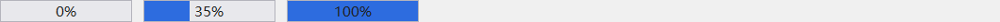

*Left → right: 0% / 35% / 100%. Percent text can be overlaid.*

Progress bar. Horizontal / vertical, with optional percent text and an indeterminate (marquee) mode.

**Typical parent:** any layout container (VBox / HBox / Grid / GroupBox content area / Splitter pane / Dock child area). Common placement: inside a file-transfer / background-task row.

#### Code-based creation

```
auto pb = std::make_unique<balloonwjui::DuiProgressBar>();
pb->SetCtrlId(IDC_DOWNLOAD_PROGRESS);
pb->SetRange(0, 100);
pb->SetValue(35);
pb->SetShowText(true);
pb->SetMarquee(false);   // true = indeterminate progress
hbox->AddChild(std::move(pb), balloonwjui::DuiLayout::Hint().Weight(1));
```

#### Events

| code | When it fires | extra (LPARAM) |
| --- | --- | --- |
| `DUIN_VALUECHANGED` | `SetPos(_, true)` programmatic writes; `SetPos(_, false)` doesn't fire. No user-interaction source (the progress bar is not draggable). | New position |

```
// You usually just write via SetPos; OnDuiNotify isn't needed. Use it only when
// some third-party code (e.g. a download thread) routes updates to the UI via NotifyParent:
auto* n = (balloonwjui::DuiNotify*)lp;
if (n->ctrlId == IDC_DOWNLOAD_PROGRESS && n->code == DUIN_VALUECHANGED) {
    int pct = (int)n->extra;
    m_lblDownload->SetText(CString().Format(_T("Downloading %d%%"), pct));
}
```

#### Key API

|   |   |
| --- | --- |
| `SetRange(min, max) / SetPos(v, notify)` | Value range + current progress; clamped to the range. |
| `SetText(LPCTSTR) / SetShowPercent(bool)` | Override-text priority: non-empty m_text → show text; otherwise showPercent=true → show "NN%"; otherwise show nothing. |
| `SetVertical(bool)` | true = top-to-bottom; false = left-to-right (default). |
| `SetMarquee(bool) / SetMarqueePhase(int)` | Indeterminate progress (moving stripe). <u>The caller must drive phase with a timer</u>; the control does not animate by itself. |
| `SetBgColor / SetFillColor / SetBorderColor / SetTextColor` | Color overrides. |

#### XML-based creation

```
<hbox padding="8" gap="6" fixedHeight="24">
    <label    text="Downloading" fixedWidth="80"/>
    <progress id="700" min="0" max="100" value="40" show-percent="true" weight="1"/>
</hbox>
```

```
// caller side:
auto root = balloonwjui::DuiXmlBuilder().FromString(xml);
host.SetRoot(std::move(root));
```

#### XML quick reference

|   |   |
| --- | --- |
| Tag | `<progress min="0" max="100" value="40" show-percent="true"/>` |
| Detailed attribute reference | [§3.3.8 progress](#xml-progress) |
| Events | `DUIN_VALUECHANGED` — when `SetPos(_, true)` changes the value; the XML phase always uses notify=false so it does not fire there. |

<a id="DuiEmojiPanel"></a>

### DuiEmojiPanel  `[popup]`


*The panel defaults to an 8-column grid + a category tab on top (this is an off-screen snapshot; actual emoji glyphs are visible at runtime).*

Emoji panel: a category tab strip on top + an 8-column grid below. Clicking an emoji fires `DUIN_CLICK` with extra = the emoji index.

**Typical parent:** any layout container (VBox / HBox / Grid / GroupBox content area / Splitter pane / Dock child area) when used as an always-on panel; the most common use is to embed it inside a `DuiPopupHost` — the parent pops the popup to show the panel when the emoji button is clicked.

#### Code usage (popup, the common case)

```
// Hold the popup as a member of the parent dialog:
balloonwjui::DuiPopupHost m_emojiPopup;

// Emoji button OnClick:
auto ep = std::make_unique<balloonwjui::DuiEmojiPanel>();
ep->SetCtrlId(IDC_EMOJI_PANEL);
ep->AddCategory(_T("😀"), GetSmileyCodepoints());
ep->AddCategory(_T("🐾"), GetAnimalCodepoints());
m_emojiPopup.SetContent(std::move(ep));

RECT anchor;
m_emojiBtn->GetRect(anchor);
::ClientToScreen(m_hWnd, (LPPOINT)&anchor);
::ClientToScreen(m_hWnd, ((LPPOINT)&anchor) + 1);
m_emojiPopup.Show(anchor, m_hWnd);
```

#### Code usage (always-on panel)

```
// Or attach directly to a layout container as a persistent panel:
auto ep = std::make_unique<balloonwjui::DuiEmojiPanel>();
ep->AddCategory(_T("😀"), GetSmileyCodepoints());
vbox->AddChild(std::move(ep), balloonwjui::DuiLayout::Hint().Fixed(280));
```

#### Events

| code | When it fires | extra (LPARAM) |
| --- | --- | --- |
| `DUIN_VALUECHANGED` | User clicks an emoji in the grid. | Emoji index (within the currently active category). |

```
// In the parent dialog's OnDuiNotify: insert the emoji into the chat input
auto* n = (balloonwjui::DuiNotify*)lp;
if (n->ctrlId == IDC_EMOJI_PANEL && n->code == DUIN_VALUECHANGED) {
    int emojiIdx = (int)n->extra;
    CString tag;
    tag.Format(_T("[emoji:%d]"), emojiIdx);   // App-side placeholder string
    m_inputBox->ReplaceSel(tag);
    m_emojiPopup->Hide();
}
```

## 7.6 Media

<a id="DuiGif"></a>

### DuiGif  `[DUI]`

GIF animation playback. Supports local paths and in-memory frames; auto-refreshes per the frame delays.

**Typical parent:** any layout container (VBox / HBox / Grid / GroupBox content area / Splitter pane / Dock child area), same as a regular leaf. Common uses: small animations inside chat bubbles, loading spinners.

#### Code-based creation

```
auto gif = std::make_unique<balloonwjui::DuiGif>();
gif->LoadFromFile(_T("emoji_dance.gif"));
gif->Play();      // / Pause / Stop
hbox->AddChild(std::move(gif), balloonwjui::DuiLayout::Hint().Fixed(48));
```

<a id="DuiImageOle"></a>

### DuiImageOle  `[DUI]`

An OLE image object embedded inside RichEdit. Once inserted into `DuiRichEditHost`, the image is serialized / scrolled along with the text. Commonly used for "insert emoji" in chat windows.

**Typical parent:** <u>not</u> a layout child — it's a RichEdit OLE object; the app calls `richEdit->InsertImage(...)` to inline-insert it into the `DuiRichEditHost` text stream, where it lives alongside regular characters and participates in scrolling / selection / copy-paste.

#### Code usage

```
// After richEdit has been added to a layout and EnsureCreated has been called:
HBITMAP hBmp = LoadEmojiBitmap(_T("smiley.png"));
richEdit->InsertImage(hBmp);     // Inline-insert at the current caret position
```

## 7.7 Window & host

<a id="DuiHost"></a>

### DuiHost

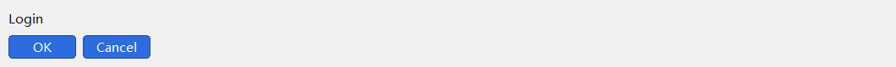

*A simple subtree: the root VBox contains a title + a row of buttons.*

The real-window host for an entire DUI tree. Two usage modes:

- **Child-window mode**: `m_host.Create(hParent, rcClient, ..., WS_CHILD | WS_VISIBLE, 0)` followed by `SetRoot(...)`. Common for embedding DUI inside a dialog.
- **SubclassWindow mode**: `m_host.SubclassWindow(m_hWnd)` turns an existing dialog as a whole into the DuiHost.

**Typical parent:** <u>a top-level HWND container</u>; not embedded inside a parent DuiControl. The caller invokes `host.Create(parentHwnd, rcDefault, name, dwStyle)` to create it (`parentHwnd = NULL` = top-level window; `= HWND` = embedded in some region of a legacy dialog); the DUI subtree is attached via `host.GetRoot()->AddChild(...)` or `host.SetRoot(std::move(root))`.

#### Code usage

```
class MyDlg : public CDialogImpl<MyDlg> {
    balloonwjui::DuiHost m_host;
    LRESULT OnInitDialog(...) {
        m_host.SubclassWindow(m_hWnd);
        m_host.SetRoot(BuildUi());
        return 0;
    }
};
```

**Key API**: `SetRoot` / `SendNotify` / `SetDuiFocus` / `InvalidateDuiRect` / `GetDpi` / `SetBgImage` / `SetClientBorderColor`.

#### Client-area 1 px border — `SetClientBorderColor(COLORREF)`

Draws a 1 px outline around the whole client area. Specifically addresses the "no OS chrome, light client area, light desktop — can't see the window edge" case (typical = `DuiFrameWindow`).

| Value | Behavior |
| --- | --- |
| `CLR_INVALID` (default) | **Not drawn**. `DuiHost` defaults to this — subclassing an existing dialog does not magically add an extra outline. |
| A regular COLORREF | At the end of OnPaint, `FrameRect(rcClient, color)` draws the 1 px outline on top of every DUI control. |
| Any value + `SetBgImage` set | **Automatically skipped**. Reason: the 9-grid image already expresses the boundary (typically with rounded corners / shadow / decoration); overlaying a 1 px straight line would crop the rounded corners square. |

**Who needs to call it actively**:

- `DuiFrameWindow`: **set automatically in the constructor** to `RGB(200,200,200)` — usually nothing to do. To change the color: `SetClientBorderColor(...)`. To remove the border: `SetClientBorderColor(CLR_INVALID)`.
- Child-window mode / SubclassWindow-mode `DuiHost`: defaults to `CLR_INVALID` — the surrounding host dialog already provides chrome; **don't** turn it on.

**Color trade-offs**: lighter (`RGB(217,217,217)`, close to the Win11 system edge) is quiet; medium (`RGB(200,200,200)`, current default) is balanced; darker (`RGB(150,150,150)`) is prominent but visually heavy; pure black or the brand color is generally not recommended — too prominent and it looks like "a tag with an added outline."

#### Event-routing convention

Different inputs take different routes based on "who should feel the feedback":

| Input | Routing strategy | Notes |
| --- | --- | --- |
| Keyboard (`WM_CHAR` / `WM_KEYDOWN`) | **Focus first** | The current keyboard-focus control (`m_pFocus`) receives it. After Tab moves focus, typed characters land on the new focus. |
| Mouse click / move / enter / leave | **HitTest(mouse position)** | The deepest visible+enabled child at the hit point receives it. |
| Mouse wheel (`WM_MOUSEWHEEL`) | **HitTest(mouse position)** | Same path as click. Does <u>not</u> use focus — whichever scrolling container the mouse is over is the one that scrolls. This is the standard behavior on Web / macOS / Windows Explorer / Weixin PC. |

**Legacy bug fix**: an earlier `OnMouseWheel` used the `m_pFocus ? m_pFocus : HitTopMost(pt)` fallback, which caused the classic bug "after a list got focus from a click, moving the mouse elsewhere still scrolls the original list." The current implementation drops the focus-first path; callers don't need to do anything extra. If you really do want "the focus container takes over all wheel events" (e.g. a keyboard-driven content editor), override `OnMouseWheel` in your host subclass and force it through the `m_pFocus` branch.

<a id="DuiFrameWindow"></a>

### DuiFrameWindow

Borderless top-level window, with built-in:

- Custom-drawn **36 px-default** title bar + centered title text (configurable).
- 3 caption buttons in the top-right corner (minimize / maximize / close) — flat; in opaque mode: light-gray hover, Windows-red close hover; in transparent mode: brand-blue hover, soft-red close hover.
- When maximized, the middle button's glyph **auto-switches to restore (two-layer square)** — driven by `WM_SIZE` (`SIZE_MAXIMIZED/RESTORED`).
- A 1 px light-gray border around the client area (default on, `RGB(200,200,200)`) — so a frame without OS chrome is still visible on a light desktop; after calling `SetBgImage(...)`, the border is **automatically skipped**, letting the 9-grid image's own rounded corners / decoration define the edge.
- WM_NCCALCSIZE returns 0 to remove the system border, but WS_THICKFRAME is kept so Aero snap / minimize animations still work.
- WM_NCHITTEST automatically handles 8-direction resize edges (default 8 px, scaled by monitor DPI) and the HTCAPTION drag region.
- WM_GETMINMAXINFO limits the maximized window so it doesn't cover the taskbar.

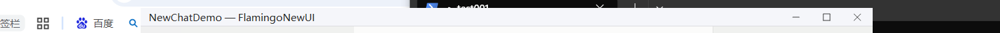

**Typical parent:** <u>a top-level HWND container</u>; not embedded inside a parent DuiControl — it embeds a `DuiHost`. The caller invokes `frame.Create(NULL, rcDefault, _T("title"), WS_OVERLAPPEDWINDOW)` + `frame.ShowWindow(...)`; the client-area content is attached via `frame.SetClientContent(std::move(root))` (the root is any DuiControl, most commonly a `DuiVBox`).

#### Usage

```
balloonwjui::DuiFrameWindow frame;
frame.SetTitle(_T("My App"));
frame.SetButtons(true, true, true);   // min, max, close — all three buttons
frame.SetTitleBarHeight(36);          // default 36 (min 18)
frame.SetMinSize(720, 480);
frame.SetResizable(true);
frame.Create(NULL, CWindow::rcDefault, _T("My App"),
             WS_OVERLAPPEDWINDOW, 0);
frame.SetClientContent(BuildClientUi());   // Note: do not call SetRoot directly
frame.ResizeClient(1080, 720);
frame.CenterWindow();
frame.ShowWindow(nCmdShow);
```

**Event routing**: caption buttons are auto-translated into `SC_MINIMIZE/SC_MAXIMIZE/SC_RESTORE/SC_CLOSE` through `OnDuiChildNotify` and forwarded to the OS — the app writes nothing.

#### Key API

|   |   |
| --- | --- |
| `SetTitle / SetIcon` | Title text / left-side icon. |
| `SetButtons(min, max, close)` | Which caption buttons are visible. |
| `SetTitleBarHeight(int)` | **Title-bar height, default 36 px**, minimum 18. Typical values: 32 (tighter, the old default), 36 (balanced, current default), 40 (pairs well with a 9-grid gradient title bar). |
| `SetBorderPx(int)` | **Resize-grip width, default 8 px** (96-dpi logical pixels; scaled at runtime by monitor DPI: 125% → 10 physical px, 150% → 12 physical px). Set to 0 = no edge-resize allowed. |
| `SetResizable(bool)` | Whether edge-resize is allowed. |
| `SetMinSize(w, h)` | Minimum window size. |
| `SetClientContent(unique_ptr<DuiControl>)` | The client-area root control — **do not** use SetRoot. |
| `SetTitleBarTransparent(bool)` | Transparent title bar (lets the 9-grid background's top decoration band show through). Pair with `SetTitleTextColor` + `SetCaptionGlyphColor` changed to white text/glyphs for dark gradients. See [§10 9-grid background image](#nine-patch-bg). |
| `SetTitleTextColor(COLORREF)` | Title text color, default `RGB(40,40,40)` dark gray. With a transparent title bar over a colored background, manually change to a contrasting color (usually white). |
| `SetCaptionGlyphColor(COLORREF)` | Default color (rest state) for the min/max/close glyphs. `CLR_INVALID` = use the default dark gray. In hover/press states, the cell "filled with a colored background" automatically uses white glyphs and is not affected by this. |
| `SetClientBorderColor(COLORREF)` | **Color of the 1 px client-area outline**. Inherited from `DuiHost`. `DuiFrameWindow`'s constructor defaults it to `RGB(200,200,200)`. Rules: color `CLR_INVALID` → not drawn; **once `SetBgImage(...)` is set → automatically skipped** (the 9-grid image expresses the boundary; overlaying a 1 px straight line would crop rounded corners square). Common values: `RGB(200,200,200)` default light gray; `RGB(180,180,180)` one notch darker for emphasis; `CLR_INVALID` to turn off entirely. |

#### Events

The `DUIN_CLICK` events from the three caption buttons (min / max / close) are **automatically translated** by `DuiFrameWindow` internally into `WM_SYSCOMMAND` (`SC_MINIMIZE / SC_MAXIMIZE / SC_RESTORE / SC_CLOSE`); the app <u>does not</u> need to listen for them. To block closing, handle `WM_CLOSE` as usual.

Client-area child-control events are routed via `WM_DUI_NOTIFY` to the frame window itself (i.e. `m_hWnd`) as usual.

#### Default visual comparison

The same client-area content (one `BuildBuddyInfoContent`) shown in four configurations side-by-side — rows are construction mode (top: pure C++ / bottom: XML-driven); columns are style (left: default / right: 9-grid bg):

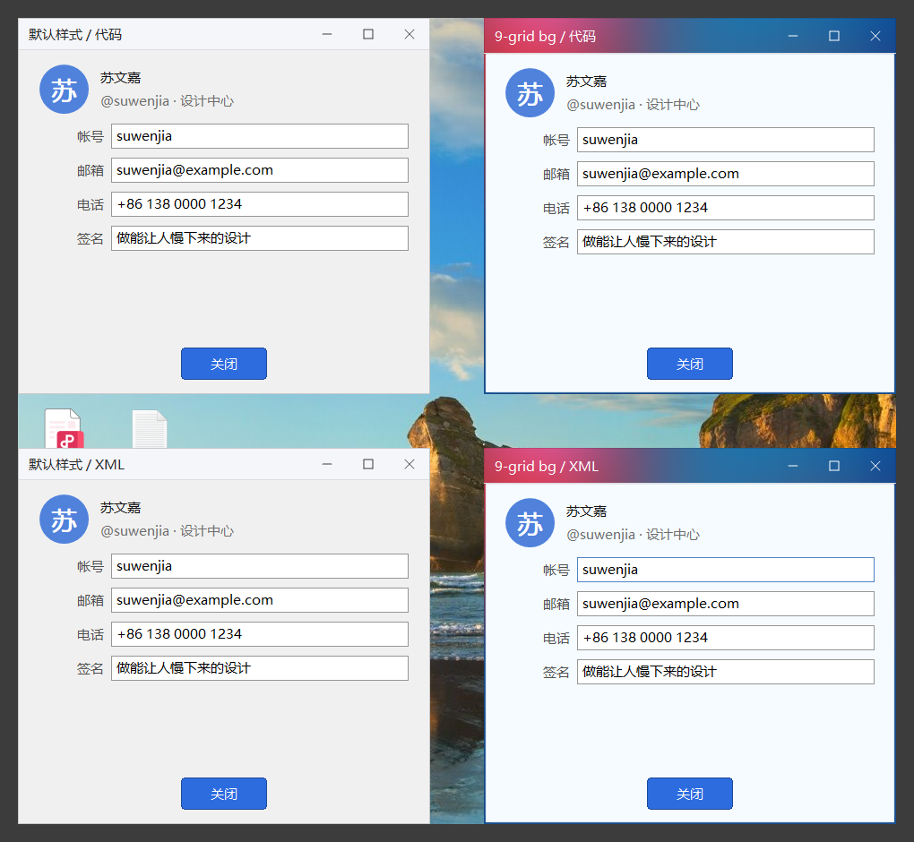

*Left column: default frame (36 px title bar + 1 px light-gray client border + light-gray client background). Right column: transparent title bar + 9-grid bg (border auto-skipped, letting the rounded image define the edge). Within each column, the two windows are pixel-identical apart from the title text.*

**Common adjustment combos**:

- **"I'll just use the default"**: change nothing, and you get the 36 px title bar + 1 px light-gray border + light-gray client area. Good for most business dialogs.
- **"I want it more compact"**: `SetTitleBarHeight(30)`. Minimum is 18; smaller and the title text crashes into the separator.
- **"I want a more prominent edge"**: `SetClientBorderColor(RGB(150,150,150))`. Beware: too dark and the window looks "heavy."
- **"No border at all"**: `SetClientBorderColor(CLR_INVALID)`. Common just before layering a bg image.
- **"I have a 9-grid bg"**: just call `SetBgImage(...)`; you don't need to manually disable the border — the library auto-skips it.

#### XML quick reference

|   |   |
| --- | --- |
| Tag | `<frame-window title="..." title-bar-height="40" title-bar-transparent="true" bg-image="..." bg-src-insets="..." bg-dst-insets="..."> <vbox/> <!-- client area --></frame-window>` |
| Detailed attribute reference | [§11 DuiFrameWindow XML config](#frame-window-xml) (a standalone major chapter — full schema, API, end-to-end walkthrough, common pitfalls) |
| Parsing entry | `DuiXmlBuilder::FromFrameXml(xml, cfg)` returns the client-area root and fills `cfg` at the same time; usage: `frame.Create(...) → frame.ApplyConfig(cfg) → SetClientContent(...)`. |
| Events | The three caption buttons are auto-translated to `WM_SYSCOMMAND` (the app doesn't need to listen); client-area children's WM_DUI_NOTIFY is routed to the frame's own m_hWnd. `WM_SIZE` drives the max → restore glyph switch internally. |

<a id="DuiScrollBar"></a>

### DuiScrollBar / DuiScrollView

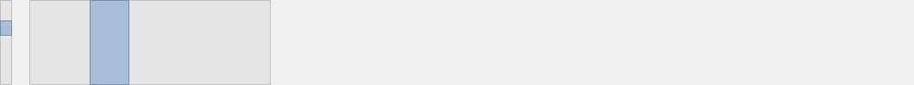

*Left: vertical scrollbar. Right: horizontal scrollbar. The thumb position follows SetPos.*

Standalone scrollbar + built-in scroll container. `DuiScrollView::SetContent(child)` installs the content; `SetContentHeight(h)` (or `SetAutoContentHeight(true)` to auto-measure) declares the scroll range.

**Typical parent:** `DuiScrollBar` is usually <u>not used directly</u> — `DuiScrollView` creates and manages one internally. If you really need to use it standalone (a custom view that manages its own scrollbar, or a built-in scrollbar that can't be wrapped by DuiScrollView), the typical parent is any layout container.

  `DuiScrollView`'s typical parent: any layout container (VBox / HBox / Grid / GroupBox content area / Splitter pane / Dock child area).

#### Code-based creation

```
auto sv = std::make_unique<balloonwjui::DuiScrollView>();
sv->SetContent(BuildLongVBox());
sv->SetContentHeight(2400);   // Total content height
sv->SetScrollBarWidth(12);
vbox->AddChild(std::move(sv), balloonwjui::DuiLayout::Hint().Weight(1));
```

#### Events

| code | When it fires | extra (LPARAM) |
| --- | --- | --- |
| `DUIN_VALUECHANGED` | User drags the thumb / clicks the track / wheel / keyboard (PgUp/PgDn/Home/End); `SetPos(_, true)` programmatic writes also fire. | New position (pixels). |

When embedded inside `DuiScrollView`, you usually don't need to subscribe — the scrollbar and content offset are already linked. Listen only when using `DuiScrollBar` standalone (not through ScrollView) and you need to handle the offset yourself.

#### auto-hide / fade-out

`DuiScrollBar` has a built-in auto-hide state machine: by default alpha=0 (invisible but still occupies its slot); after the caller triggers `TriggerShow()` it fades in to alpha=1, and if no new event arrives within 800 ms it auto-fades back to 0. Common usage: in a list control, call `TriggerShow()` on OnMouseMove / OnMouseWheel and `StartFadeOut()` on OnMouseLeave — the scrollbar is visible while the mouse is over the list and hides after a short delay when it leaves. The scrollbars embedded inside `DuiListBox` / `DuiVirtualList` already enable auto-hide by default; callers don't need extra configuration.

| Method | Meaning |
| --- | --- |
| `SetAutoHide(bool)` | Turn auto-hide on / off. Enabling drops alpha to 0 immediately; disabling raises it to 1 (always fully visible). |
| `IsAutoHide()` | Query whether auto-hide mode is currently active. |
| `TriggerShow()` | Immediately start the fade-in (200 ms in to 1.0) + reset the 800 ms idle timer. Call this on hover / wheel events. No-op when auto-hide is off. |
| `StartFadeOut()` | Cancel the idle timer and start the fade-out (300 ms out to 0). Call this on OnMouseLeave. No-op when auto-hide is off. |
| `SetAlpha(float)` / `GetAlpha()` | Directly set / query alpha, skipping the animation. 0 = fully transparent (OnPaint draws nothing); 1 = fully opaque. Normally not used — let the fade functions manage it. |

**Hook up a 60 Hz pulse**: auto-hide's fade is driven by `DuiAnimMgr`, which requires the host's frame to call `DuiAnimMgr::Inst().TickAll(GetTickCount())` from WM_TIMER. XChat's `XChatMainFrame` already runs a 16 ms timer as a 60 Hz pulse; reuse that pattern. If your frame doesn't run the pulse, the scrollbar will stay stuck at its initial alpha (no fade in or out).

```
// Enable auto-hide in a custom list control:
ctor() {
    auto sb = std::make_unique<balloonwjui::DuiScrollBar>(/*horizontal=*/false);
    sb->SetAutoHide(true);
    m_sb = sb.get();
    AddChild(std::move(sb));
}
bool OnMouseMove(POINT, UINT) override { if (m_sb) m_sb->TriggerShow(); ... }
bool OnMouseLeave()           override { if (m_sb) m_sb->StartFadeOut(); ... }
bool OnMouseWheel(POINT pt, short z, UINT mk) override {
    if (m_sb) {
        m_sb->TriggerShow();
        return m_sb->OnMouseWheel(pt, z, mk);
    }
    return false;
}
```

## 7.8 Engine & tools

<a id="DuiControl"></a>

### DuiControl — control base class

The base class of every DUI control. A logical node (no HWND), hosted by `DuiHost`. Subclass it to write a custom control.

#### Core virtual functions (override to customize behavior)

|   |   |
| --- | --- |
| `OnPaint(HDC, RECT)` | Paint this control. |
| `Layout(RECT)` | Lay out children inside the given available rect (default = m_rcItem = rcAvail). |
| `HitTest(POINT)` | Hit-test; returns the deepest visible+enabled child. |
| `OnMouseEnter/Leave/Move/Down/Up/DblClk` | Mouse events; return true to consume. |
| `OnChar / OnKeyDown` | Keyboard events. |
| `OnSetCursor(POINT)` | Return true to indicate SetCursor has been called. |

#### Common calls

|   |   |
| --- | --- |
| `AddChild / RemoveChild` | Subtree management. |
| `SetRect(RECT)` | Set position — auto Invalidate + invoke Layout. |
| `SetVisible / SetEnabled / SetTabStop` | State flags. |
| `Invalidate()` | Request a repaint of this control's rect. |
| `Capture / ReleaseCapture / SetFocus` | DUI-internal capture / focus (not Win32). |
| `NotifyParent(code, extra=0)` | Send WM_DUI_NOTIFY to the HWND parent. |

<a id="DuiResMgr"></a>

### DuiResMgr — resource manager

Singleton. Wraps `CSkinManager` (images) + the process-level default UI font (Microsoft YaHei 9 pt GB2312, lazily created and re-created on DPI change).

```
HFONT f = balloonwjui::DuiResMgr::Inst().GetDefaultFont();
::SelectObject(hdc, f);

// Called automatically by DuiHost on WM_DPICHANGED:
balloonwjui::DuiResMgr::Inst().SetDpi(newDpi);

CImageEx* img = balloonwjui::DuiResMgr::Inst().AcquireImage(_T("button_normal.png"));
```

<a id="DuiDpi"></a>

### DuiDpi — high-DPI support

A namespace with three (plus two) functions:

|   |   |
| --- | --- |
| `OptInPerMonitorV2()` | Call once early in WinMain to opt in to per-monitor v2 DPI awareness. |
| `GetSystemDpi()` | Primary monitor DPI (default 96). |
| `GetWindowDpi(HWND)` | Current DPI of the window (per-monitor v2 aware). |
| `Scale(logical, dpi)` | Logical px → device px. |
| `Unscale(device, dpi)` | Device px → logical px. |

<a id="DuiPaintAA"></a>

### DuiPaintAA — anti-aliased drawing helpers

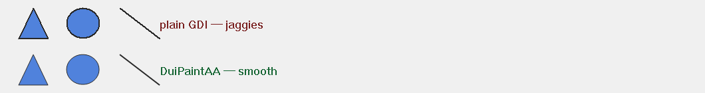

*Top row: native GDI Polygon / Ellipse / LineTo (visible jaggies on diagonals). Bottom row: DuiPaintAA::FillPolygon / FillEllipse / DrawLine (smooth).*

A namespace with three functions. Every non-axis-aligned shape (circle, diagonal line, polygon) must go through these, or it will alias.

```
POINT tri[3] = { {10, 2}, {18, 14}, {2, 14} };
balloonwjui::DuiAA::FillPolygon(hdc, tri, 3, RGB(45,108,223));
balloonwjui::DuiAA::FillEllipse(hdc, RECT{0,0,16,16}, RGB(220,40,40));
balloonwjui::DuiAA::DrawLine   (hdc, 0, 0, 100, 50, RGB(0,0,0), 1.5f);
```

GDI+ is initialized lazily on the first call (the token lives for the process lifetime). Axis-aligned rectangles can still use `::Rectangle / FillRect / RoundRect` (no diagonals → no aliasing).

<a id="DuiTheme"></a>

### DuiTheme — theme color tokens


*Left → right: brand / deep / online / away / busy / off. Default control colors read directly from these constants.*

A namespace of constants: brand color, status colors (online / away / red), ink colors (ink-1..4), surface colors, and so on. Used internally by controls as defaults; apps can reference them directly.

<a id="DuiNotify"></a>

### DuiNotify — event notifications

The lParam of `WM_DUI_NOTIFY` is a `DuiNotify*`:

```
struct DuiNotify {
    UINT       code;     // DUIN_CLICK / DUIN_VALUECHANGED / ...
    UINT       ctrlId;   // The triggering control's SetCtrlId
    DuiControl*pCtrl;    // Pointer to the triggering control
    LPARAM     extra;    // Control-specific extra data
};

enum {
    DUIN_CLICK         = 1,
    DUIN_VALUECHANGED  = 2,
    DUIN_TEXTCHANGED   = 3,
    DUIN_TEXTCOMMIT    = 4,
    DUIN_SELCHANGED    = 5,
    DUIN_HOVER         = 6,
    DUIN_RBUTTONUP     = 7,
    // ... see DuiNotify.h for the other codes
};
```

How a child fires it: `NotifyParent(DUIN_CLICK, 0);` — automatically routed through `DuiHost::SendNotify` to the HWND parent. When the host itself is a top-level window (e.g. `DuiFrameWindow`), the notification self-routes back to its own WM_DUI_NOTIFY handler.

---

<a id="custom-controls"></a>

## 8. Custom-drawn controls

balloonui's stock controls cover ~90% of common UI needs; the remaining 10% — for example **chat bubbles / file-type badges / progress rings / app-specific colored cards** — have distinctive designs with simple interactions and are the perfect fit for custom drawing. This chapter walks you through writing a custom-drawn control end-to-end, with 4 standalone runnable demos (in `Demos.sln` — one `.exe` per demo).

<a id="custom-when"></a>

### 8.1 When to custom-draw vs use a stock control

| Scenario | Recommendation |
| --- | --- |
| The design has a brand-specific shape (irregular geometry, special palette, gradient, ...) | **Custom-draw** |
| Need bulk rendering (e.g. a chat list with 1000 messages) | **Custom-draw** (so the HWND handle count doesn't explode) |
| High animation density / frame-rate sensitive | **Custom-draw** (direct control over OnPaint) |
| Just a regular button, list, tab, checkbox | **Use the stock control** (DuiButton / DuiListBox / DuiTab / ...) |
| Need IME input | **Use DuiEditHost / DuiRichEditHost** (HWND-hosted; custom drawing can't do IME) |

<a id="custom-steps"></a>

### 8.2 Minimum steps to write a custom-drawn DuiControl

1. **Inherit from `DuiControl`**; optionally define properties + setters.
2. **Override `OnPaint(HDC hdc, const RECT& rcDirty)`** — draw inside the `m_rcItem` rect. `hdc` is the host's double-buffer memory DC (already cleared to COLOR_BTNFACE by the parent control or filled with the parent's drawing).
3. **In each setter, call `Invalidate()`** to request a repaint — but only <u>when the value actually changed</u> (to avoid pointless paints).
4. **(Optional) Override mouse events** — `OnLButtonDown` / `OnLButtonUp` / `OnMouseMove` etc. return `true` to consume the event. When you need to trigger a business action, call `NotifyParent(DUIN_CLICK, extra);`.
5. **(Optional) Override `HitTest(POINT)`** when the control's shape is not a rectangle (circle / irregular), to tell the host which coordinates count as "hit." The default implementation is rectangular.
6. **(Optional) Implement `MeasureHeight(width)` and other measurement functions** — called by the parent layout when laying out adaptive heights.

Skeleton looks like this:

```
// MyControl.h
#pragma once
#include "DuiControl.h"

class MyControl : public balloonwjui::DuiControl
{
public:
    MyControl() = default;

    void SetText(LPCTSTR sz);
    void SetBgColor(COLORREF c);

    void OnPaint(HDC hdc, const RECT& rcDirty) override;
    bool OnLButtonUp(POINT pt, UINT mkFlags) override;

private:
    CString  m_text;
    COLORREF m_bgColor = RGB(45, 108, 223);
};

// MyControl.cpp
void MyControl::SetText(LPCTSTR sz)
{
    CString s = sz ? sz : _T("");
    if (m_text == s) return;          // Value unchanged → skip Invalidate
    m_text = s;
    Invalidate();                     // Tells the host to schedule a WM_PAINT
}

void MyControl::OnPaint(HDC hdc, const RECT&)
{
    HBRUSH br = ::CreateSolidBrush(m_bgColor);
    ::FillRect(hdc, &m_rcItem, br);
    ::DeleteObject(br);
    ::SetBkMode(hdc, TRANSPARENT);
    ::SetTextColor(hdc, RGB(255, 255, 255));
    HFONT f = balloonwjui::DuiResMgr::Inst().GetDefaultFont();
    HGDIOBJ oldF = ::SelectObject(hdc, f);
    RECT rc = m_rcItem;
    ::DrawText(hdc, m_text, -1, &rc, DT_CENTER | DT_VCENTER | DT_SINGLELINE);
    ::SelectObject(hdc, oldF);
}

bool MyControl::OnLButtonUp(POINT, UINT)
{
    NotifyParent(DUIN_CLICK);
    return true;
}
```

**Key conventions**:

① `m_rcItem` is this control's rectangle as computed by the parent layout (in host client-area coordinates); all drawing happens inside it — you don't need to handle coordinate offsets yourself.

② The default font always goes through `DuiResMgr::Inst().GetDefaultFont()` (Microsoft YaHei 9 pt GB2312); don't hardcode a LOGFONT.

③ Non-axis-aligned geometry (circles / triangles / diagonals) must go through `DuiPaintAA` or directly use `Gdiplus::Graphics + SetSmoothingMode(AntiAlias)`, or you'll get jaggies.

④ Use named constants for colors: `static const COLORREF kXxx = RGB(...)`, which makes it easy to later move them into `DuiTheme`.

<a id="custom-xml"></a>

### 8.3 Make your custom control XML-describable — DuiXmlBuilder + CustomFactory

`DuiXmlBuilder` parses an XML string into a **DuiControl tree**. It has native support for the built-in tags (`vbox` / `hbox` / `grid` / `dock` / `splitter` / `label` / `button` / `edit`, ...); for any unrecognized tag it hands the decision to the callback the caller registered via `CustomFactory` — that is the **only entry point** for plugging custom controls into the XML pipeline.

#### 8.3.1 DuiXmlBuilder API at a glance

| Method | Description |
| --- | --- |
| `static unique_ptr<DuiControl> FromString(LPCSTR xmlUtf8, const CustomFactory& = {})` | Main entry. XML must be UTF-8 (with or without BOM is fine). Returns the root control; `nullptr` on parse failure. |
| `static unique_ptr<DuiControl> FromString(LPCWSTR xmlW, const CustomFactory& = {})` | Convenience overload: internally converts the wide string to UTF-8 and calls the version above. |
| `static bool Parse(LPCSTR xmlUtf8, Node& outRoot)` | Low-level — runs only the XML lex/parse, does not construct controls. Use when you need to "inspect the AST first and decide whether to build" in advanced scenarios. |
| `static unique_ptr<DuiControl> Build(const Node& root, const CustomFactory& = {})` | Low-level — builds an existing `Node` AST into a control tree. `FromString` = `Parse` + `Build`. |

#### 8.3.2 Node AST shape

```
struct DuiXmlBuilder::Node
{
    std::string                         tag;       // Lower-cased tag name, e.g. "vbox" / "my-tile"
    std::map<std::string, std::string>  attrs;    // Attribute key-value pairs (values are raw UTF-8 strings)
    std::vector<Node>                   children; // Children (recursive)
};
```

Key fact: **attribute values are always UTF-8 byte sequences** (even when the XML source is UTF-16). Chinese / Japanese / emoji are all safe; but when handing to `CString` (which is a wide string in Unicode builds), you must transcode via `CA2W(s.c_str(), CP_UTF8)`.

#### 8.3.3 CustomFactory signature and invocation contract

```
using CustomFactory =
    std::function<std::unique_ptr<DuiControl>(const Node&)>;
```

| Contract | Description |
| --- | --- |
| **When it's called** | When the builder encounters a tag, it first checks the built-ins (vbox/hbox/...); if not in the built-in list → **your factory is called**. |
| **Return `nullptr`** | Means "I don't recognize this either" — the builder skips the node (along with its children). |
| **Return a non-null `unique_ptr`** | The builder treats it as this node's product. <u>It then automatically `Build()`s each `Node.children` and `AddChild()`s them onto this return value</u> — meaning a custom control can contain children without the factory having to recurse manually. |
| **Common attributes** | `id` / `fixedWidth` / `fixedHeight` / `weight` / `margin` are read uniformly by the builder during the parent container's `AddChild` (and written into `DuiLayout::Hint`). **The factory should not parse these itself**, or it will conflict with the builder. |
| **Thread** | Always executes synchronously on the same thread that called `FromString`. |
| **Exceptions** | Exceptions thrown from the factory propagate through the builder. In production, factories should be try-noexcept and return `nullptr` on parse failure. |

#### 8.3.4 Tag naming convention

To avoid collisions with future built-in tags, custom tags should:

- Use **kebab-case** (with hyphens), e.g. `chat-bubble` / `file-icon` / `my-search-input`. Built-in tags are single words with no hyphens — collision probability stays low.
- Use kebab-case or lowerCamelCase for attribute names (for documentation consistency).
- Compare tags **case-sensitively and exactly** (the builder lowercases internally, so `n.tag` received by your factory is always lowercase).

#### 8.3.5 Recommended style — factory template

```
// === 1) Tag design ===
//   <my-tile text="OK" bg-color="45,108,223" radius="6"/>
//
// === 2) factory ===
static std::unique_ptr<balloonwjui::DuiControl>
MyTileFactory(const balloonwjui::DuiXmlBuilder::Node& n)
{
    // Not a tag I handle → yield immediately
    if (n.tag != "my-tile")
    {
        return nullptr;
    }

    auto t = std::unique_ptr<MyTile>(new MyTile());

    // Small helper to fetch an attribute (returns nullptr if missing)
    auto attr = [&](const char* k) -> const std::string* {
        auto it = n.attrs.find(k);
        return (it != n.attrs.end()) ? &it->second : nullptr;
    };

    // String attribute — UTF-8 → CString
    if (auto* s = attr("text"))
    {
        t->SetText(CString(CA2W(s->c_str(), CP_UTF8)));
    }

    // Numeric attribute
    if (auto* s = attr("radius"))
    {
        t->SetCornerRadius(atoi(s->c_str()));
    }

    // RGB triplet "r,g,b"
    if (auto* s = attr("bg-color"))
    {
        int r, g, b;
        if (sscanf(s->c_str(), "%d,%d,%d", &r, &g, &b) == 3)
        {
            t->SetBgColor(RGB(r, g, b));
        }
    }

    // Bool attribute — recommended to accept "true" / "1" both as true
    if (auto* s = attr("disabled"))
    {
        bool b = (*s == "true" || *s == "1" || *s == "yes");
        t->SetEnabled(!b);
    }

    return t;
}
```

#### 8.3.6 Common attribute-parsing helpers (recommended to extract into a utility header)

These 5 attribute kinds cover almost every custom control — extract them as helpers to cut boilerplate in your factories:

```
namespace XmlAttr {

inline const std::string*
Find(const balloonwjui::DuiXmlBuilder::Node& n, const char* key)
{
    auto it = n.attrs.find(key);
    return (it != n.attrs.end()) ? &it->second : nullptr;
}

inline CString GetCString(const balloonwjui::DuiXmlBuilder::Node& n,
                          const char* key,
                          LPCTSTR defaultValue = _T(""))
{
    if (auto* s = Find(n, key))
    {
        return CString(CA2W(s->c_str(), CP_UTF8));
    }
    return defaultValue;
}

inline int GetInt(const balloonwjui::DuiXmlBuilder::Node& n,
                  const char* key, int defaultValue = 0)
{
    if (auto* s = Find(n, key))
    {
        return atoi(s->c_str());
    }
    return defaultValue;
}

inline bool GetBool(const balloonwjui::DuiXmlBuilder::Node& n,
                    const char* key, bool defaultValue = false)
{
    if (auto* s = Find(n, key))
    {
        return (*s == "true" || *s == "1" || *s == "yes");
    }
    return defaultValue;
}

inline COLORREF GetColor(const balloonwjui::DuiXmlBuilder::Node& n,
                         const char* key, COLORREF defaultValue = 0)
{
    if (auto* s = Find(n, key))
    {
        int r, g, b;
        if (sscanf(s->c_str(), "%d,%d,%d", &r, &g, &b) == 3)
        {
            return RGB(r, g, b);
        }
    }
    return defaultValue;
}

} // namespace XmlAttr

// === The factory therefore becomes very short ===
static std::unique_ptr<balloonwjui::DuiControl>
MyTileFactory(const balloonwjui::DuiXmlBuilder::Node& n)
{
    if (n.tag != "my-tile") return nullptr;
    auto t = std::unique_ptr<MyTile>(new MyTile());
    t->SetText        (XmlAttr::GetCString(n, "text"));
    t->SetBgColor     (XmlAttr::GetColor  (n, "bg-color", RGB(45,108,223)));
    t->SetCornerRadius(XmlAttr::GetInt    (n, "radius",   6));
    return t;
}
```

#### 8.3.7 Registering multiple factories — chain / composite pattern

`FromString` only accepts one `CustomFactory`. To support multiple sets of custom controls, wrap them in a "dispatching factory" that routes by tag:

```
auto fac = [](const balloonwjui::DuiXmlBuilder::Node& n)
    -> std::unique_ptr<balloonwjui::DuiControl>
{
    // Dispatch to a concrete factory based on tag
    if (n.tag == "my-tile")     return MyTileFactory(n);
    if (n.tag == "chat-bubble") return ChatBubbleFactory(n);
    if (n.tag == "file-icon")   return FileTypeIconFactory(n);
    return nullptr;             // Other unknown tags → builder skips
};

auto root = balloonwjui::DuiXmlBuilder::FromString(xmlUtf8, fac);
```

NewChatDemo and later apps collect every business control's factory inside a single factory method like `MakeChatFactory()` that returns a `CustomFactory` — one file, one source of truth, easy to maintain.

#### 8.3.8 Automatic child recursion — custom-drawn containers

Because the builder automatically `AddChild()`s the children onto whatever your factory returns, custom controls are naturally **containers**. Common usage:

```
// Tag design: <chat-list weight="1"> ... children are individual message items ... </chat-list>
class MyChatList : public balloonwjui::DuiControl
{
public:
    void Layout(const RECT& rcAvail) override
    {
        // Custom child layout — e.g. vertical stack + auto-measured heights
        m_rcItem = rcAvail;
        int y = rcAvail.top;
        for (auto& child : m_children)
        {
            int h = child->GetDesiredSize().cy;     // Or a custom MeasureHeight
            RECT r = { rcAvail.left, y,
                       rcAvail.right, y + h };
            child->SetRect(r);
            y += h + 6;
        }
    }
};

static auto ChatListFactory =
    [](const balloonwjui::DuiXmlBuilder::Node& n)
    -> std::unique_ptr<balloonwjui::DuiControl>
{
    if (n.tag != "chat-list") return nullptr;
    return std::unique_ptr<MyChatList>(new MyChatList());
    // The children (each <chat-bubble/> / <system-msg/> etc.) are automatically AddChild'd
    // into our MyChatList by the builder; Layout() then takes over the arrangement.
};
```

**Key point**: `Layout(rcAvail)` is a virtual provided by `DuiControl` — the parent container calls each child's `Layout()` during its own layout phase; the child can override it to arrange grandchildren itself. That is the essence of "custom-painted layout."

#### 8.3.9 Mixing with built-in tags

Custom controls can sit inside any built-in container:

```
const char* kXml =
    "<vbox padding=\"16\" gap=\"8\">"
    "  <label text=\"Action panel\" fixedHeight=\"24\"/>"
    "  <hbox gap=\"8\" fixedHeight=\"36\">"
    "    <my-tile text=\"Start\" bg-color=\"45,108,223\" weight=\"1\"/>"
    "    <my-tile text=\"Pause\" bg-color=\"220,170,60\"  weight=\"1\"/>"
    "    <my-tile text=\"Stop\"  bg-color=\"220,60,60\"   weight=\"1\"/>"
    "  </hbox>"
    "  <my-chat-list weight=\"1\"/>"
    "</vbox>";

auto fac = [](auto& n) -> std::unique_ptr<balloonwjui::DuiControl> {
    if (n.tag == "my-tile")      return MyTileFactory(n);
    if (n.tag == "my-chat-list") return MyChatListFactory(n);
    return nullptr;
};
auto root = balloonwjui::DuiXmlBuilder::FromString(kXml, fac);
host.SetRoot(std::move(root));
```

#### 8.3.10 Common pitfalls

| Symptom | Cause / fix |
| --- | --- |
| FromString returns nullptr | ① XML syntax error (unclosed tag / mismatched quotes). ② The root tag is unrecognized and the factory didn't claim it. Run `Parse(xml, &node)` first to confirm the AST is healthy. |
| Chinese text turns into garbage | Attribute values are UTF-8 bytes; `CString(s.c_str())` in a Unicode build performs an ANSI→Wide conversion and corrupts. You must use `CString(CA2W(s.c_str(), CP_UTF8))`. |
| fixedWidth / weight has no effect | ① The parent isn't a vbox/hbox/grid-style layout container. ② The factory parsed fixedWidth itself but didn't apply it anywhere — leave those attributes alone and let the builder handle them. |
| Children aren't being AddChild'd | The factory returned `nullptr`. After nullptr, the builder doesn't descend into that node's children. |
| AddChild order is wrong | The builder AddChild's strictly in XML appearance order; it doesn't reorder. If your Layout depends on a different order, either change the XML order or maintain your own index→child mapping. |
| Reusing the same XML multiple times fails | Each FromString builds a fresh control tree — safe. But if you cache some `DuiControl*` and then `SetRoot` a second tree, the old pointer becomes invalid (the old tree is destroyed). |

<a id="custom-examples"></a>

### 8.4 Four complete examples

The four examples below are standalone runnable projects in `Demos.sln`:

| Project | What it demonstrates | Source |
| --- | --- | --- |
| `DemoTextBadgeTile.exe` | The simplest custom paint — rounded rectangle + centered text. | `flamingoclient/DemoTextBadgeTile/` |
| `DemoCircularProgress.exe` | GDI+ anti-aliased ring + clamping setter. | `flamingoclient/DemoCircularProgress/` |
| `DemoChatBubble.exe` | Irregular shape (with a tail) + MeasureHeight + left/right alignment. | `flamingoclient/DemoChatBubble/` |
| `DemoFileTypeIcon.exe` | Data-driven palette + folded corner + hover feedback. | `flamingoclient/DemoFileTypeIcon/` |

Each demo shows both the **code path** and the **XML path**, and ships a `--capture-all <dir>` screenshot mode (the PNGs in this section were captured live from these demos).

<a id="ex-textbadge"></a>

### Example #1 — DemoTextBadgeTile

Rounded colored rectangle + centered text. The simplest custom-paint example; covers: building setters, `OnPaint` with GDI `RoundRect` + `DrawText`, and `OnLButtonUp` firing a click via `NotifyParent`.


*Default (brand blue)*


*SetBgColor=green*


*SetBgColor=amber*


*SetBgColor=red*


*Code-mode row: four differently-colored tiles laid out side-by-side.*


*XML mode: described with `<text-badge text=\"...\" bgColor=\"r,g,b\" radius=\"N\"/>`; three variants with different radius / palette.*

#### Key code snippets

```
// DemoTextBadgeTile.h
class DemoTextBadgeTile : public balloonwjui::DuiControl
{
public:
    void SetText(LPCTSTR sz);
    void SetBgColor(COLORREF c);
    void SetFgColor(COLORREF c);
    void SetCornerRadius(int r);
    void OnPaint(HDC hdc, const RECT& rcDirty) override;
    bool OnLButtonUp(POINT pt, UINT mkFlags) override;
private:
    CString  m_text;
    COLORREF m_bgColor = RGB( 45, 108, 223);
    COLORREF m_fgColor = RGB(255, 255, 255);
    int      m_radius  = 6;
};

// OnPaint body (DemoTextBadgeTile.cpp)
void DemoTextBadgeTile::OnPaint(HDC hdc, const RECT&)
{
    // 1) Rounded rectangle background: NULL_PEN so we don't draw a border, only the fill brush
    HBRUSH brBg  = ::CreateSolidBrush(m_bgColor);
    HGDIOBJ oldBr = ::SelectObject(hdc, brBg);
    HGDIOBJ oldPn = ::SelectObject(hdc, ::GetStockObject(NULL_PEN));
    ::RoundRect(hdc, m_rcItem.left, m_rcItem.top,
                m_rcItem.right, m_rcItem.bottom,
                m_radius * 2, m_radius * 2);
    ::SelectObject(hdc, oldBr);
    ::SelectObject(hdc, oldPn);
    ::DeleteObject(brBg);

    // 2) Centered text — using the library's default font
    if (m_text.IsEmpty()) return;
    HFONT hFont = balloonwjui::DuiResMgr::Inst().GetDefaultFont();
    HGDIOBJ oldFont = ::SelectObject(hdc, hFont);
    ::SetBkMode(hdc, TRANSPARENT);
    ::SetTextColor(hdc, m_fgColor);
    RECT rc = m_rcItem;
    ::DrawText(hdc, m_text, -1, &rc,
               DT_CENTER | DT_VCENTER | DT_SINGLELINE);
    ::SelectObject(hdc, oldFont);
    // The font is managed by DuiResMgr — do not DeleteObject
}
```

#### XML mode

```
<text-badge text="Save"   bgColor="45,108,223" radius="6"  fixedWidth="110"/>
<text-badge text="Cancel" bgColor="180,180,180" radius="2" fixedWidth="110"/>
```

<details class="full-code">
  <summary>Show full source (.h + .cpp + main.cpp's XML factory)</summary>
  <pre><code>// Full source: flamingoclient/DemoTextBadgeTile/
//   stdafx.h               — common ATL/WTL forwards
//   DemoTextBadgeTile.h    — class declaration
//   DemoTextBadgeTile.cpp  — setters + OnPaint + OnLButtonUp
//   CaptureMode.h/.cpp     — --capture-all mode (mark registration + offscreen PNG capture)
//   main.cpp               — creates DuiFrameWindow + multi-state layout +
//                            CustomFactory + CLI parsing

// === DemoTextBadgeTile.cpp (full setter set) ===
void DemoTextBadgeTile::SetText(LPCTSTR sz) {
    CString s = sz ? sz : _T(""); if (m_text == s) return;
    m_text = s; Invalidate();
}
void DemoTextBadgeTile::SetBgColor(COLORREF c) {
    if (m_bgColor == c) return; m_bgColor = c; Invalidate();
}
void DemoTextBadgeTile::SetFgColor(COLORREF c) {
    if (m_fgColor == c) return; m_fgColor = c; Invalidate();
}
void DemoTextBadgeTile::SetCornerRadius(int r) {
    if (r &lt; 0) r = 0; if (m_radius == r) return;
    m_radius = r; Invalidate();
}

// === XML factory in main.cpp ===
static std::unique_ptr&lt;DuiControl&gt;
TextBadgeFactory(const DuiXmlBuilder::Node&amp; n) {
    if (n.tag != "text-badge") return nullptr;
    auto t = std::unique_ptr&lt;DemoTextBadgeTile&gt;(new DemoTextBadgeTile());
    auto get = [&amp;](const char* k) -&gt; const std::string* {
        auto it = n.attrs.find(k);
        return it == n.attrs.end() ? nullptr : &amp;it-&gt;second;
    };
    if (auto* s = get("text"))    t-&gt;SetText(CString(CA2W(s-&gt;c_str(), CP_UTF8)));
    if (auto* s = get("bgColor")) { int r,g,b;
        if (sscanf(s-&gt;c_str(),"%d,%d,%d",&amp;r,&amp;g,&amp;b)==3) t-&gt;SetBgColor(RGB(r,g,b)); }
    if (auto* s = get("fgColor")) { int r,g,b;
        if (sscanf(s-&gt;c_str(),"%d,%d,%d",&amp;r,&amp;g,&amp;b)==3) t-&gt;SetFgColor(RGB(r,g,b)); }
    if (auto* s = get("radius"))  t-&gt;SetCornerRadius(atoi(s-&gt;c_str()));
    return t;
}
</code></pre>
</details>

<a id="ex-circprog"></a>

### Example #2 — DemoCircularProgress

A circular progress ring, 0..100%. New learning points: drawing directly with `Gdiplus::Graphics` + `SetSmoothingMode(AntiAlias)` to cover arc operations not exposed by `DuiPaintAA`; `SetPercent` demonstrates clamping + Invalidate only on change.

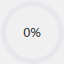

*0%*

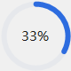

*33%*

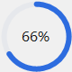

*66%*

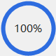

*100%*

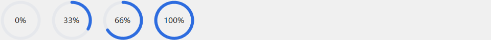

*Code mode: four progress values (0/33/66/100%).*


*XML mode: custom fillColor + thickness + showText.*

#### Key code snippets

```
// OnPaint body (DemoCircularProgress.cpp)
void DemoCircularProgress::OnPaint(HDC hdc, const RECT&)
{
    int w = m_rcItem.right - m_rcItem.left;
    int h = m_rcItem.bottom - m_rcItem.top;
    int diameter = (w < h ? w : h) - 2;
    int cx = (m_rcItem.left + m_rcItem.right) / 2;
    int cy = (m_rcItem.top + m_rcItem.bottom) / 2;

    float halfPen = m_thickness / 2.0f;
    float left = cx - diameter / 2.0f + halfPen;
    float top  = cy - diameter / 2.0f + halfPen;
    float side = diameter - m_thickness;

    // GDI+ with AA enabled → no aliasing on the arc
    Gdiplus::Graphics g(hdc);
    g.SetSmoothingMode(Gdiplus::SmoothingModeAntiAlias);

    // 1) Full gray track
    Gdiplus::Pen trackPen(Gdiplus::Color(255,
        GetRValue(m_trackColor), GetGValue(m_trackColor),
        GetBValue(m_trackColor)),
        (Gdiplus::REAL)m_thickness);
    g.DrawEllipse(&trackPen, left, top, side, side);

    // 2) Progress fill arc — clockwise from 12 o'clock
    if (m_percent > 0) {
        Gdiplus::Pen fillPen(Gdiplus::Color(255,
            GetRValue(m_fillColor), GetGValue(m_fillColor),
            GetBValue(m_fillColor)),
            (Gdiplus::REAL)m_thickness);
        fillPen.SetStartCap(Gdiplus::LineCapRound);
        fillPen.SetEndCap  (Gdiplus::LineCapRound);
        Gdiplus::REAL sweep = 3.6f * (Gdiplus::REAL)m_percent;
        g.DrawArc(&fillPen, left, top, side, side, -90.0f, sweep);
    }

    // 3) Center "%" text (GDI with the default font)
    if (m_showText) {
        HFONT f = balloonwjui::DuiResMgr::Inst().GetDefaultFont();
        HGDIOBJ oldF = ::SelectObject(hdc, f);
        ::SetBkMode(hdc, TRANSPARENT);
        ::SetTextColor(hdc, m_textColor);
        CString s; s.Format(_T("%d%%"), m_percent);
        RECT rc = m_rcItem;
        ::DrawText(hdc, s, -1, &rc,
                   DT_CENTER | DT_VCENTER | DT_SINGLELINE);
        ::SelectObject(hdc, oldF);
    }
}
```

#### XML mode

```
<circular-progress percent="75" fillColor="50,160,110"  fixedWidth="80"/>
<circular-progress percent="50" fillColor="220,170,60" thickness="10" fixedWidth="80"/>
<circular-progress percent="90" fillColor="100,80,200" showText="false" fixedWidth="80"/>
```

<details class="full-code">
  <summary>Show full setter set (DemoCircularProgress.cpp)</summary>
  <pre><code>// Every setter follows the same pattern: bounds check → return early if unchanged → otherwise update + Invalidate
void DemoCircularProgress::SetPercent(int p) {
    if (p &lt; 0) p = 0; if (p &gt; 100) p = 100;
    if (m_percent == p) return;
    m_percent = p; Invalidate();
}
void DemoCircularProgress::SetThickness(int t) {
    if (t &lt; 0) t = 0; if (m_thickness == t) return;
    m_thickness = t; Invalidate();
}
void DemoCircularProgress::SetTrackColor(COLORREF c) {
    if (m_trackColor == c) return; m_trackColor = c; Invalidate();
}
void DemoCircularProgress::SetFillColor(COLORREF c) {
    if (m_fillColor == c) return; m_fillColor = c; Invalidate();
}
// SetTextColor / SetShowText follow the same pattern
</code></pre>
</details>

<a id="ex-chatbubble"></a>

### Example #3 — DemoChatBubble

Chat bubble: rounded rectangle + triangular tail (irregular shape) + word wrap + timestamp. New learning points: **irregular custom drawing** (a triangle via GDI `Polygon`) + **measurement function** (`MeasureHeight(width)`, returns the height needed at the given width) + **left/right alignment switching** (a property change inverts the geometry).

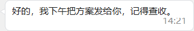

*side=in, short text + ts*

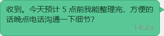

*side=out, long wrapping text + ts*

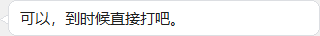

*side=in, no ts*

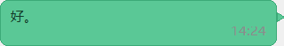

*side=out, very short text*

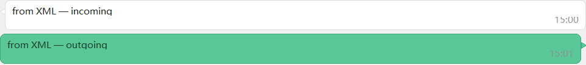

*XML mode: a pair built with `<chat-bubble side=\"in|out\" text=\"...\" ts=\"15:00\"/>`.*

#### Key code snippets

```
// PaintBubble: draw the bubble body (rounded rectangle) + the tail (triangle); returns the content rect
RECT DemoChatBubble::PaintBubble(HDC hdc) const
{
    // Bubble rect: subtract the tail width on the appropriate side
    RECT bubbleRc = m_rcItem;
    if (m_side == SideIn)  bubbleRc.left  += kTailWidth;
    else                   bubbleRc.right -= kTailWidth;

    // Palette: incoming = white background; outgoing = brand green
    COLORREF bg     = (m_side == SideOut) ? RGB( 90, 200, 150) : RGB(255, 255, 255);
    COLORREF border = (m_side == SideOut) ? RGB( 60, 170, 120) : RGB(220, 222, 226);

    // Draw the bubble body
    HBRUSH brBg = ::CreateSolidBrush(bg);
    HPEN   pen  = ::CreatePen(PS_SOLID, 1, border);
    HGDIOBJ oldB = ::SelectObject(hdc, brBg);
    HGDIOBJ oldP = ::SelectObject(hdc, pen);
    ::RoundRect(hdc, bubbleRc.left, bubbleRc.top,
                bubbleRc.right, bubbleRc.bottom,
                kRadius * 2, kRadius * 2);

    // Draw the tail: direction depends on side
    POINT tri[3];
    if (m_side == SideIn) {
        tri[0] = { bubbleRc.left,                bubbleRc.top + kTailOffsetY };
        tri[1] = { bubbleRc.left - kTailWidth,   bubbleRc.top + kTailOffsetY + kTailHeight / 2 };
        tri[2] = { bubbleRc.left,                bubbleRc.top + kTailOffsetY + kTailHeight };
    } else {
        tri[0] = { bubbleRc.right,               bubbleRc.top + kTailOffsetY };
        tri[1] = { bubbleRc.right + kTailWidth,  bubbleRc.top + kTailOffsetY + kTailHeight / 2 };
        tri[2] = { bubbleRc.right,               bubbleRc.top + kTailOffsetY + kTailHeight };
    }
    ::Polygon(hdc, tri, 3);

    ::SelectObject(hdc, oldB);
    ::SelectObject(hdc, oldP);
    ::DeleteObject(brBg);
    ::DeleteObject(pen);

    RECT inner = bubbleRc;
    ::InflateRect(&inner, -kPadX, -kPadY);
    return inner;
}

// MeasureHeight: given an available width, compute the total height the WORDBREAK-wrapped text takes
int DemoChatBubble::MeasureHeight(int availWidth) const
{
    int textW = availWidth - kTailWidth - kPadX * 2;
    if (textW < 1) textW = 1;

    HDC hdc = ::GetDC(NULL);
    HFONT f = balloonwjui::DuiResMgr::Inst().GetDefaultFont();
    HGDIOBJ oldF = ::SelectObject(hdc, f);
    RECT rc = { 0, 0, textW, 1 };
    ::DrawText(hdc, m_text, -1, &rc, DT_CALCRECT | DT_WORDBREAK | DT_LEFT);
    int textH = rc.bottom - rc.top;
    ::SelectObject(hdc, oldF);
    ::ReleaseDC(NULL, hdc);

    int total = textH + kPadY * 2;
    if (!m_ts.IsEmpty()) total += kMetaGap + kMetaH;
    int minH = kTailOffsetY + kTailHeight + kPadY;
    return total > minH ? total : minH;
}
```

#### XML mode

```
<vbox gap="6">
  <chat-bubble side="in"  text="from XML — incoming" ts="15:00" fixedHeight="50"/>
  <chat-bubble side="out" text="from XML — outgoing" ts="15:01" fixedHeight="50"/>
</vbox>
```

**Note**: in the XML description, the bubble height must be specified up front (`fixedHeight`) — the builder doesn't know the real wrapped height. The code path can compute `MeasureHeight(width)` first and then `AddChild(_, Hint().Fixed(h))`, which is more precise. The code path is the usual choice in chat-list scenarios.

<details class="full-code">
  <summary>Show full OnPaint (text + timestamp + palette)</summary>
  <pre><code>void DemoChatBubble::OnPaint(HDC hdc, const RECT&amp;)
{
    RECT inner = PaintBubble(hdc);

    COLORREF textColor = (m_side == SideOut)
        ? RGB( 20,  60,  40)
        : RGB( 30,  30,  30);

    HFONT f = balloonwjui::DuiResMgr::Inst().GetDefaultFont();
    HGDIOBJ oldF = ::SelectObject(hdc, f);
    ::SetBkMode(hdc, TRANSPARENT);
    ::SetTextColor(hdc, textColor);

    // Main text area: leave space for the timestamp line
    RECT textRc = inner;
    if (!m_ts.IsEmpty()) textRc.bottom -= (kMetaGap + kMetaH);
    ::DrawText(hdc, m_text, -1, &amp;textRc,
               DT_LEFT | DT_TOP | DT_WORDBREAK);

    // Timestamp: small gray text in the bottom-right corner
    if (!m_ts.IsEmpty()) {
        ::SetTextColor(hdc, RGB(140, 140, 140));
        RECT metaRc = { inner.left, inner.bottom - kMetaH,
                        inner.right, inner.bottom };
        ::DrawText(hdc, m_ts, -1, &amp;metaRc,
                   DT_RIGHT | DT_BOTTOM | DT_SINGLELINE);
    }
    ::SelectObject(hdc, oldF);
}
</code></pre>
</details>

<a id="ex-fileicon"></a>

### Example #4 — DemoFileTypeIcon

Colored file-extension badges (PDF / DOC / MP4 / ZIP / ...). New learning points: **data-driven palette** (ext → three-color table lookup) + **top-right folded-corner** (triangle shadow via Polygon) + **hover visual feedback** (OnPaint reads `IsHover()` directly).


*pdf*


*doc*

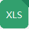

*xls*


*ppt*


*mp4*


*png*

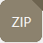

*zip*

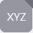

*unknown → gray*


*Code mode — 8 file types side-by-side.*

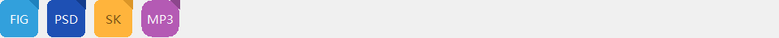

*XML mode — design-software extensions (fig/psd/sketch) + custom label + radius.*

#### Key code snippets

```
// Single source-of-truth palette table (DemoFileTypeIcon.cpp)
struct PaletteEntry { LPCTSTR ext; COLORREF bg; COLORREF fg; COLORREF fold; };
const PaletteEntry kPalettes[] = {
    { _T("pdf"),  RGB(232,  90,  90), RGB(255, 255, 255), RGB(180,  60,  60) },
    { _T("doc"),  RGB( 60, 130, 220), RGB(255, 255, 255), RGB( 30, 100, 180) },
    { _T("xls"),  RGB( 50, 160, 110), RGB(255, 255, 255), RGB( 30, 130,  90) },
    { _T("mp4"),  RGB(120,  80, 200), RGB(255, 255, 255), RGB( 90,  60, 170) },
    // ... see the source file
};

DemoFileTypeIcon::Palette DemoFileTypeIcon::LookupPalette(LPCTSTR ext)
{
    if (!ext || !*ext) return kDefault;
    CString needle = ext; needle.MakeLower();
    for (auto& e : kPalettes)
        if (needle == e.ext) return { e.bg, e.fg, e.fold };
    return kDefault;
}

// OnPaint: rounded background + folded-corner triangle + hover lift + text
void DemoFileTypeIcon::OnPaint(HDC hdc, const RECT&)
{
    Palette p = LookupPalette(m_ext);

    // On hover, lift every color one notch (IsHover() is maintained by the host on mouse-enter/leave)
    if (IsHover()) {
        auto lift = [](COLORREF c) {
            int r = GetRValue(c) + 20, g = GetGValue(c) + 20, b = GetBValue(c) + 20;
            if (r > 255) r = 255; if (g > 255) g = 255; if (b > 255) b = 255;
            return RGB(r, g, b);
        };
        p.bg = lift(p.bg); p.fold = lift(p.fold);
    }

    // 1) Rounded background
    HBRUSH brBg = ::CreateSolidBrush(p.bg);
    HGDIOBJ oldBr = ::SelectObject(hdc, brBg);
    HGDIOBJ oldPn = ::SelectObject(hdc, ::GetStockObject(NULL_PEN));
    ::RoundRect(hdc, m_rcItem.left, m_rcItem.top,
                m_rcItem.right, m_rcItem.bottom,
                m_radius * 2, m_radius * 2);
    ::SelectObject(hdc, oldBr); ::SelectObject(hdc, oldPn);
    ::DeleteObject(brBg);

    // 2) Top-right folded-corner triangle
    int sz = (m_rcItem.right - m_rcItem.left) / 4;
    if (sz > 14) sz = 14;
    if (sz >= 6) {
        POINT tri[3] = {
            { m_rcItem.right - sz, m_rcItem.top },
            { m_rcItem.right,      m_rcItem.top + sz },
            { m_rcItem.right,      m_rcItem.top },
        };
        HBRUSH brFold = ::CreateSolidBrush(p.fold);
        HGDIOBJ ob = ::SelectObject(hdc, brFold);
        HGDIOBJ op = ::SelectObject(hdc, ::GetStockObject(NULL_PEN));
        ::Polygon(hdc, tri, 3);
        ::SelectObject(hdc, ob); ::SelectObject(hdc, op);
        ::DeleteObject(brFold);
    }

    // 3) Centered label
    if (!m_label.IsEmpty()) {
        HFONT f = balloonwjui::DuiResMgr::Inst().GetDefaultFont();
        HGDIOBJ oldF = ::SelectObject(hdc, f);
        ::SetBkMode(hdc, TRANSPARENT);
        ::SetTextColor(hdc, p.fg);
        RECT rc = m_rcItem;
        ::DrawText(hdc, m_label, -1, &rc,
                   DT_CENTER | DT_VCENTER | DT_SINGLELINE);
        ::SelectObject(hdc, oldF);
    }
}
```

#### XML mode

```
<file-icon ext="fig"    fixedWidth="48"/>
<file-icon ext="sketch" label="SK" fixedWidth="48"/>       <!-- custom label overrides the default -->
<file-icon ext="mp3"    radius="14" fixedWidth="48"/>     <!-- larger radius → visually closer to a circle -->
```

<details class="full-code">
  <summary>Show setters and lookup logic</summary>
  <pre><code>void DemoFileTypeIcon::SetExt(LPCTSTR ext) {
    CString s = ext ? ext : _T("");
    s.MakeLower();
    if (m_ext == s) return;
    m_ext = s;
    // Auto-sync label to uppercase (the app can override with SetLabel later)
    m_label = s; m_label.MakeUpper();
    Invalidate();
}

void DemoFileTypeIcon::SetLabel(LPCTSTR t) {
    CString s = t ? t : _T("");
    if (m_label == s) return;
    m_label = s; Invalidate();
}

bool DemoFileTypeIcon::OnLButtonUp(POINT, UINT) {
    NotifyParent(DUIN_CLICK);   // The parent dialog handles "open the file"
    return true;
}

// Static helper exposed to tests and docs; ext is case-insensitive; nullptr/"" → kDefault
struct Palette { COLORREF bg; COLORREF fg; COLORREF fold; };
static Palette LookupPalette(LPCTSTR ext);
</code></pre>
</details>

<a id="custom-build"></a>

### 8.5 Build & run

All four demos live in `flamingoclient/Demos.sln`. Command-line build:

```
msbuild Demos.sln /p:Configuration=Debug /p:Platform=Win32 ^
        /t:DemoTextBadgeTile;DemoCircularProgress;DemoChatBubble;DemoFileTypeIcon

# Interactive run (to see the effect)
Bin\DemoTextBadgeTile.exe
Bin\DemoCircularProgress.exe
Bin\DemoChatBubble.exe
Bin\DemoFileTypeIcon.exe

# Capture mode (regenerate the images used in this section)
Bin\DemoTextBadgeTile.exe   --capture-all flamingoclient\docs\images
Bin\DemoCircularProgress.exe --capture-all flamingoclient\docs\images
Bin\DemoChatBubble.exe      --capture-all flamingoclient\docs\images
Bin\DemoFileTypeIcon.exe    --capture-all flamingoclient\docs\images
```

---

<a id="layouts"></a>

## 9. Full layout examples

This chapter walks through five complete demos of common UI layouts — **each rendered with real balloonui controls** (not mocks) — and provides equivalent XML for each. Screenshots come from DuiGallery's `Layouts` tab; rerun `DuiGallery.exe --capture-all flamingoclient\docs\images` to regenerate them.

The goal of this chapter is **"after reading, you can assemble a real window"** — focusing on the Hint usage (`Fixed`/`Weight`) for `DuiVBox/HBox/Dock/Splitter` + how to combine the stock controls (`DuiLabel`/`DuiEditHost`/`DuiButton`/`DuiListBox`/`DuiSearchBox`/`DuiAvatar`/`DuiComboBox`).

<a id="layout-skeleton-app"></a>

### 9.0 Common program skeleton (shared by all 5 examples)

The 5 layout examples only differ in their <u>client-area control tree</u>; the surrounding "create frame, show the window, pump the message loop, hook events" flow is identical. This section provides a complete, copy-ready WinMain template — frame creation / client-area loading / EDIT child-HWND creation / event hookup / exit cleanup — all in one place. Sections 9.1–9.5 below only list their own `BuildXxxRoot()` function + event-handling fragments and reference this skeleton.

#### 9.0.1 Project setup

- **Solution / project**: add an Application project to `flamingoclient/Demos.sln` (use the `DemoNinePatchBg.vcxproj` template), with `OutDir = ..\Bin\`.
- **Preprocessor**: `WIN32;_WINDOWS;BUI_USE_DLL;_CRT_SECURE_NO_WARNINGS` (`BUI_USE_DLL` makes `BUI_API` resolve to `__declspec(dllimport)` for linking against balloonui.dll).
- **Include directories**: `..\balloonui;..\Source\wtl9.0`
- **Linked libs**: `balloonui.lib;gdiplus.lib;comctl32.lib` (`AdditionalLibraryDirectories=..\Bin`)
- **Subsystem**: `Windows` (`SubSystem=Windows`, entry `WinMain`)
- **UTF-8 source**: `AdditionalOptions=/utf-8 /FS` (so Chinese `_T(...)` literals encode consistently)
- **Character set**: `Unicode` (`UNICODE` + `_UNICODE` auto-defined)

#### 9.0.2 Full WinMain (skeleton)

```
// main.cpp — every layout in 9.X uses this same skeleton

#include "stdafx.h"
#include "DuiDpi.h"
#include "DuiHost.h"
#include "DuiNotify.h"
#include "Controls/DuiFrameWindow.h"
#include "Controls/DuiLayout.h"
#include "Controls/DuiLabel.h"
#include "Controls/DuiButton.h"
#include "Controls/DuiEditHost.h"
// ...include other control headers as the example requires...

using namespace balloonwjui;

CAppModule _Module;     // WTL global; needed by CWindowImpl etc.

// === 1) Placeholder: the "build client-area tree" function for this example.
//     9.1 is BuildLoginRoot(), 9.2 is BuildFormRoot(), and so on.
//     The body is given in each 9.X subsection.
extern std::unique_ptr<DuiControl> BuildLoginRoot();

// === 2) Top-level window subclass, with message map + event dispatch.
class MainFrame : public DuiFrameWindow
{
public:
    BEGIN_MSG_MAP(MainFrame)
        MSG_WM_DESTROY(OnDestroy)              // Exit the message loop when the window closes
        MESSAGE_HANDLER(WM_DUI_NOTIFY, OnDuiNotify)
        CHAIN_MSG_MAP(DuiFrameWindow)
    END_MSG_MAP()

    // WM_DESTROY: single-frame process — closing = exit.
    void OnDestroy() { ::PostQuitMessage(0); }

    // Child-control event entry — dispatch by ctrlId to specific handlers.
    // See the "Event handling" sub-subsection in each 9.X for the actual handler code.
    LRESULT OnDuiNotify(UINT, WPARAM, LPARAM lp, BOOL& bHandled)
    {
        DuiNotify* n = (DuiNotify*)lp;
        // Example: handle login button IDC_LOGIN (see 9.1.3):
        //   if (n->ctrlId == IDC_LOGIN && n->code == DUIN_CLICK)
        //       OnLoginClicked();
        bHandled = FALSE;     // Let DuiFrameWindow handle unmatched events by default (caption buttons etc.)
        return 0;
    }
};

// === 3) WinMain: process entry. One-shot: DPI awareness, OLE init, frame creation,
//     client-area load, EnsureCreated on HWND-hosted controls, show, message loop.
int WINAPI _tWinMain(HINSTANCE hInst, HINSTANCE, LPTSTR, int nCmdShow)
{
    // a) Per-Monitor V2 DPI awareness — must run before any HWND is created.
    DuiDpi::OptInPerMonitorV2();

    // b) OLE / COM init (needed by OLE drag-drop, RichEdit, clipboard).
    ::OleInitialize(NULL);

    // c) WTL/ATL common controls + global module.
    AtlInitCommonControls(ICC_BAR_CLASSES);
    _Module.Init(NULL, hInst);

    // d) Top-level frame. MainFrame is a DuiFrameWindow subclass.
    MainFrame frame;
    frame.SetButtons(true, true, true);    // Show min / max / close
    frame.SetMinSize(480, 320);            // Minimum window size
    frame.SetResizable(true);

    // Actually create the HWND (any SetTitle before this line won't show in the taskbar,
    // because m_hWnd doesn't exist yet — see the SetTitle note in §7.7 DuiFrameWindow).
    if (!frame.Create(NULL, CWindow::rcDefault, _T("MyApp"),
                      WS_OVERLAPPEDWINDOW, 0))
    {
        _Module.Term();
        ::OleUninitialize();
        return 1;
    }
    frame.SetTitle(_T("Login"));           // Set title after Create

    // e) Load the client-area control tree (this example's BuildXxxRoot()).
    auto root = BuildLoginRoot();
    frame.SetClientContent(std::move(root));

    // f) EnsureCreated — if the client area contains DuiEditHost / DuiRichEditHost /
    //    DuiSearchBox / DuiSpinBox, call this once after the host HWND is ready to
    //    create their internal EDIT child HWNDs. See §3.4.
    //    Simple walk: take the root, find them by id / type, call one at a time.
    auto* clientRoot = frame.GetClientContent();
    if (auto* edit = (DuiEditHost*)clientRoot->FindControlById(100 /*username*/))
    {
        edit->EnsureCreated(frame.m_hWnd);
    }
    if (auto* edit = (DuiEditHost*)clientRoot->FindControlById(101 /*password*/))
    {
        edit->EnsureCreated(frame.m_hWnd);
    }

    // g) Show the window + run the message loop.
    frame.ResizeClient(800, 600);          // Target client-area size
    frame.CenterWindow();                  // Centered on screen
    frame.ShowWindow(nCmdShow);
    frame.UpdateWindow();

    MSG msg;
    while (::GetMessage(&msg, NULL, 0, 0))
    {
        ::TranslateMessage(&msg);
        ::DispatchMessage(&msg);
    }

    // h) Exit cleanup. frame lives on the stack; its destructor auto-DestroyWindows the HWND if still alive.
    _Module.Term();
    ::OleUninitialize();
    return (int)msg.wParam;
}
```

#### 9.0.3 Build & run

```
# Inside VS 2022:
# 1. Open flamingoclient\Demos.sln
# 2. Add the new project (or clone DemoNinePatchBg.vcxproj and rename it)
# 3. Pick Debug | Win32 → Build solution
# 4. Run Bin\MyApp.exe

# Command line (from flamingoclient\):
"%MSBuild%" Demos.sln /t:MyApp /p:Configuration=Debug /p:Platform=Win32
.\Bin\MyApp.exe
```

**Sections 9.1–9.5 below list only what is <u>unique to each example</u>**: the client-area builder function `BuildXxxRoot()`, the matching XML, and the event-handling fragments. WinMain is not repeated.

<a id="layout-login"></a>

### 9.1 Login dialog

The classic "vertically centered card" pattern: the outer HBox uses `Weight(1) | Fixed(W) | Weight(1)` to horizontally center, and the inner VBox stacks fields top-down.


*Logo + title + subtitle + username/password + checkbox + link + login button + version number.*

#### Code-based creation

```
using namespace balloonwjui;

// === Inner card ===
auto card = std::make_unique<DuiVBox>();
card->SetPadding(20);
card->SetGap(10);

// Logo (placeholder here — in real apps use DuiAvatar or DuiAsyncImage)
auto logo = std::make_unique<LogoTile>(_T("F"), RGB(50, 160, 110));
card->AddChild(std::move(logo), DuiLayout::Hint().Fixed(48));

// Title + subtitle
auto title = std::make_unique<DuiLabel>();
title->SetText(_T("FlamingoNewUI"));
title->SetTextAlign(DT_CENTER | DT_VCENTER | DT_SINGLELINE);
card->AddChild(std::move(title), DuiLayout::Hint().Fixed(28));

auto sub = std::make_unique<DuiLabel>();
sub->SetText(_T("Sign in"));
sub->SetTextColor(RGB(120, 120, 120));
sub->SetTextAlign(DT_CENTER | DT_VCENTER | DT_SINGLELINE);
card->AddChild(std::move(sub), DuiLayout::Hint().Fixed(20));

// Username / password
auto eUser = std::make_unique<DuiEditHost>();
eUser->SetPlaceholder(_T("Username / email"));
card->AddChild(std::move(eUser), DuiLayout::Hint().Fixed(32));

auto ePwd = std::make_unique<DuiEditHost>();
ePwd->SetPlaceholder(_T("Password"));
ePwd->SetPassword(true);
card->AddChild(std::move(ePwd), DuiLayout::Hint().Fixed(32));

// One row: "Remember me" + "Forgot password" link
auto opts = std::make_unique<DuiHBox>();
auto cb = std::make_unique<DuiButton>();
cb->SetButtonType(DuiButton::StyleCheckbox);
cb->SetText(_T("Remember me"));
auto link = std::make_unique<DuiLabel>();
link->SetText(_T("Forgot password?"));
link->SetMode(DuiLabel::ModeLink);
link->SetTextAlign(DT_RIGHT | DT_VCENTER | DT_SINGLELINE);
opts->AddChild(std::move(cb),   DuiLayout::Hint().Weight(1));
opts->AddChild(std::move(link), DuiLayout::Hint().Fixed(80));
card->AddChild(std::move(opts), DuiLayout::Hint().Fixed(24));

// Login button
auto bLogin = std::make_unique<DuiButton>();
bLogin->SetCtrlId(IDC_LOGIN);   // The parent OnDuiNotify receives DUIN_CLICK
bLogin->SetText(_T("Login"));
card->AddChild(std::move(bLogin), DuiLayout::Hint().Fixed(36));

// === Outer horizontal centering ===
auto root = std::make_unique<DuiHBox>();
root->AddChild(std::make_unique<DuiControl>(),
               DuiLayout::Hint().Weight(1));    // Left spacer
root->AddChild(std::move(card), DuiLayout::Hint().Fixed(320));
root->AddChild(std::make_unique<DuiControl>(),
               DuiLayout::Hint().Weight(1));    // Right spacer

frame.SetClientContent(std::move(root));
```

#### XML mode

```
<hbox>
  <control weight="1"/>          <!-- Left spacer for centering -->
  <vbox padding="20" gap="10" fixedWidth="320">
    <logo  fixedHeight="48"/>     <!-- App-side custom tag -->
    <label text="FlamingoNewUI" textAlign="center" fixedHeight="28"/>
    <label text="Sign in" textColor="120,120,120" textAlign="center" fixedHeight="20"/>
    <edit  id="100" placeholder="Username / email" fixedHeight="32"/>
    <edit  id="101" placeholder="Password" password="true" fixedHeight="32"/>
    <hbox fixedHeight="24">
      <button id="102" buttonType="checkbox" text="Remember me" weight="1"/>
      <label  id="103" text="Forgot password?" mode="link"
              textAlign="right" fixedWidth="80"/>
    </hbox>
    <button id="104" text="Login" fixedHeight="36"/>
  </vbox>
  <control weight="1"/>
</hbox>
```

#### 9.1.1 Full Build function

Wrap the C++ code above in a function that returns `unique_ptr<DuiControl>` so the `WinMain` from [§9.0](#layout-skeleton-app) can call it:

```
// Control ids (paired with the OnDuiNotify dispatch)
enum { IDC_USER = 100, IDC_PWD = 101, IDC_REMEMBER = 102,
       IDC_FORGOT = 103, IDC_LOGIN = 104 };

std::unique_ptr<DuiControl> BuildLoginRoot()
{
    using namespace balloonwjui;

    // Inner card (VBox)
    auto card = std::make_unique<DuiVBox>();
    card->SetPadding(20);
    card->SetGap(10);

    auto logo = std::make_unique<LogoTile>(_T("F"), RGB(50, 160, 110));
    card->AddChild(std::move(logo), DuiLayout::Hint().Fixed(48));

    auto title = std::make_unique<DuiLabel>();
    title->SetText(_T("FlamingoNewUI"));
    title->SetTextAlign(DT_CENTER | DT_VCENTER | DT_SINGLELINE);
    card->AddChild(std::move(title), DuiLayout::Hint().Fixed(28));

    auto sub = std::make_unique<DuiLabel>();
    sub->SetText(_T("Sign in"));
    sub->SetTextColor(RGB(120, 120, 120));
    sub->SetTextAlign(DT_CENTER | DT_VCENTER | DT_SINGLELINE);
    card->AddChild(std::move(sub), DuiLayout::Hint().Fixed(20));

    auto eUser = std::make_unique<DuiEditHost>();
    eUser->SetCtrlId(IDC_USER);
    eUser->SetPlaceholder(_T("Username / email"));
    card->AddChild(std::move(eUser), DuiLayout::Hint().Fixed(32));

    auto ePwd = std::make_unique<DuiEditHost>();
    ePwd->SetCtrlId(IDC_PWD);
    ePwd->SetPlaceholder(_T("Password"));
    ePwd->SetPassword(true);
    card->AddChild(std::move(ePwd), DuiLayout::Hint().Fixed(32));

    auto opts = std::make_unique<DuiHBox>();
    auto cb = std::make_unique<DuiButton>();
    cb->SetCtrlId(IDC_REMEMBER);
    cb->SetButtonType(DuiButton::StyleCheckbox);
    cb->SetText(_T("Remember me"));
    auto link = std::make_unique<DuiLabel>();
    link->SetCtrlId(IDC_FORGOT);
    link->SetText(_T("Forgot password?"));
    link->SetMode(DuiLabel::ModeLink);
    link->SetTextAlign(DT_RIGHT | DT_VCENTER | DT_SINGLELINE);
    opts->AddChild(std::move(cb),   DuiLayout::Hint().Weight(1));
    opts->AddChild(std::move(link), DuiLayout::Hint().Fixed(80));
    card->AddChild(std::move(opts), DuiLayout::Hint().Fixed(24));

    auto bLogin = std::make_unique<DuiButton>();
    bLogin->SetCtrlId(IDC_LOGIN);
    bLogin->SetText(_T("Login"));
    card->AddChild(std::move(bLogin), DuiLayout::Hint().Fixed(36));

    // Outer horizontal centering (HBox)
    auto root = std::make_unique<DuiHBox>();
    root->AddChild(std::make_unique<DuiControl>(), DuiLayout::Hint().Weight(1));
    root->AddChild(std::move(card), DuiLayout::Hint().Fixed(320));
    root->AddChild(std::make_unique<DuiControl>(), DuiLayout::Hint().Weight(1));
    return root;
}
```

#### 9.1.2 Event handling

Add this to `MainFrame::OnDuiNotify` from [§9.0](#layout-skeleton-app):

```
LRESULT MainFrame::OnDuiNotify(UINT, WPARAM, LPARAM lp, BOOL& bHandled)
{
    DuiNotify* n = (DuiNotify*)lp;
    bHandled = TRUE;

    switch (n->ctrlId)
    {
    case IDC_LOGIN:
        if (n->code == DUIN_CLICK)
        {
            // Read current values of the username / password EDITs
            auto* user = (DuiEditHost*)GetClientContent()->FindControlById(IDC_USER);
            auto* pwd  = (DuiEditHost*)GetClientContent()->FindControlById(IDC_PWD);
            DoLogin(user->GetText(), pwd->GetText());
        }
        return 0;

    case IDC_FORGOT:
        if (n->code == DUIN_CLICK)
        {
            ShowForgotPasswordDialog();
        }
        return 0;

    case IDC_REMEMBER:
        if (n->code == DUIN_VALUECHANGED)
        {
            g_settings.SetBool(_T("RememberMe"), n->extra != 0);
        }
        return 0;
    }
    bHandled = FALSE;
    return 0;
}
```

#### 9.1.3 Build & run

The WinMain is the [§9.0.2](#layout-skeleton-app) skeleton verbatim, with the `extern` declaration changed to `BuildLoginRoot()`; the EnsureCreated block already covers the two EDITs IDC_USER / IDC_PWD. Use `frame.SetTitle(_T("Login"))` + `ResizeClient(800, 600)` so the card is genuinely centered. Build / run as in §9.0.3.

<a id="layout-form"></a>

### 9.2 Form

"Right-aligned labels + flex editors" multi-row pattern + a bottom button group (a flex spacer pushes the buttons to the right).

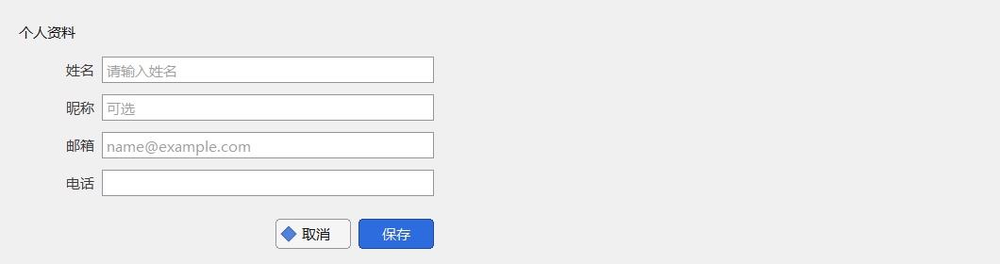

*4 fields + Cancel / Save buttons.*

#### Code-based creation

```
// Helper: one "label + edit" row
auto makeRow = [](LPCTSTR labelText, LPCTSTR placeholder) {
    auto row = std::make_unique<DuiHBox>();
    row->SetGap(8);
    auto l = std::make_unique<DuiLabel>();
    l->SetText(labelText);
    l->SetTextAlign(DT_RIGHT | DT_VCENTER | DT_SINGLELINE);
    auto e = std::make_unique<DuiEditHost>();
    if (placeholder) e->SetPlaceholder(placeholder);
    row->AddChild(std::move(l), DuiLayout::Hint().Fixed(80));   // Fixed label width
    row->AddChild(std::move(e), DuiLayout::Hint().Weight(1));   // Flex editor
    return row;
};

auto col = std::make_unique<DuiVBox>();
col->SetPadding(20);
col->SetGap(12);

auto title = std::make_unique<DuiLabel>();
title->SetText(_T("Profile"));
col->AddChild(std::move(title), DuiLayout::Hint().Fixed(28));

col->AddChild(makeRow(_T("Name"),     _T("Enter name")),
              DuiLayout::Hint().Fixed(28));
col->AddChild(makeRow(_T("Nickname"), _T("Optional")),
              DuiLayout::Hint().Fixed(28));
col->AddChild(makeRow(_T("Email"),    _T("name@example.com")),
              DuiLayout::Hint().Fixed(28));
col->AddChild(makeRow(_T("Phone"),    nullptr),
              DuiLayout::Hint().Fixed(28));

// Flex spacer — push the buttons to the bottom
col->AddChild(std::make_unique<DuiControl>(), DuiLayout::Hint().Weight(1));

// Bottom button group: a weight=1 left spacer pushes buttons to the right
auto buttons = std::make_unique<DuiHBox>();
buttons->SetGap(8);
buttons->AddChild(std::make_unique<DuiControl>(), DuiLayout::Hint().Weight(1));
auto bCancel = std::make_unique<DuiButton>();
bCancel->SetButtonType(DuiButton::StyleIcon);
bCancel->SetText(_T("Cancel"));
auto bOk = std::make_unique<DuiButton>();
bOk->SetText(_T("Save"));
buttons->AddChild(std::move(bCancel), DuiLayout::Hint().Fixed(80));
buttons->AddChild(std::move(bOk),     DuiLayout::Hint().Fixed(80));
col->AddChild(std::move(buttons), DuiLayout::Hint().Fixed(32));
```

#### XML mode

```
<vbox padding="20" gap="12">
  <label text="Profile" fixedHeight="28"/>

  <hbox fixedHeight="28" gap="8">
    <label text="Name" textAlign="right" fixedWidth="80"/>
    <edit id="100" placeholder="Enter name" weight="1"/>
  </hbox>
  <hbox fixedHeight="28" gap="8">
    <label text="Nickname" textAlign="right" fixedWidth="80"/>
    <edit id="101" placeholder="Optional" weight="1"/>
  </hbox>
  <hbox fixedHeight="28" gap="8">
    <label text="Email" textAlign="right" fixedWidth="80"/>
    <edit id="102" placeholder="name@example.com" weight="1"/>
  </hbox>
  <hbox fixedHeight="28" gap="8">
    <label text="Phone" textAlign="right" fixedWidth="80"/>
    <edit id="103" weight="1"/>
  </hbox>

  <control weight="1"/>            <!-- Flex spacer pushes buttons to the bottom -->

  <hbox fixedHeight="32" gap="8">
    <control weight="1"/>         <!-- Flex spacer pushes buttons to the right -->
    <button id="200" buttonType="icon" text="Cancel" fixedWidth="80"/>
    <button id="201" text="Save" fixedWidth="80"/>
  </hbox>
</vbox>
```

**Core pattern**: a `DuiControl` spacer with `Weight(1)` = "push the following children to the end of the container." This is balloonui's uniform technique for "right-align / bottom-align / center," much cleaner than absolute positioning.

#### 9.2.1 Full Build function

```
enum { IDC_NAME = 100, IDC_NICK = 101, IDC_EMAIL = 102, IDC_PHONE = 103,
       IDC_CANCEL = 200, IDC_SAVE = 201 };

std::unique_ptr<DuiControl> BuildFormRoot()
{
    using namespace balloonwjui;

    auto makeRow = [](LPCTSTR labelText, LPCTSTR placeholder, UINT editId) {
        auto row = std::make_unique<DuiHBox>();
        row->SetGap(8);
        auto l = std::make_unique<DuiLabel>();
        l->SetText(labelText);
        l->SetTextAlign(DT_RIGHT | DT_VCENTER | DT_SINGLELINE);
        auto e = std::make_unique<DuiEditHost>();
        e->SetCtrlId(editId);
        if (placeholder) e->SetPlaceholder(placeholder);
        row->AddChild(std::move(l), DuiLayout::Hint().Fixed(80));
        row->AddChild(std::move(e), DuiLayout::Hint().Weight(1));
        return row;
    };

    auto col = std::make_unique<DuiVBox>();
    col->SetPadding(20);
    col->SetGap(12);

    auto title = std::make_unique<DuiLabel>();
    title->SetText(_T("Profile"));
    col->AddChild(std::move(title), DuiLayout::Hint().Fixed(28));

    col->AddChild(makeRow(_T("Name"),     _T("Enter name"),         IDC_NAME),  DuiLayout::Hint().Fixed(28));
    col->AddChild(makeRow(_T("Nickname"), _T("Optional"),           IDC_NICK),  DuiLayout::Hint().Fixed(28));
    col->AddChild(makeRow(_T("Email"),    _T("name@example.com"),   IDC_EMAIL), DuiLayout::Hint().Fixed(28));
    col->AddChild(makeRow(_T("Phone"),    nullptr,                  IDC_PHONE), DuiLayout::Hint().Fixed(28));

    col->AddChild(std::make_unique<DuiControl>(), DuiLayout::Hint().Weight(1));

    auto buttons = std::make_unique<DuiHBox>();
    buttons->SetGap(8);
    buttons->AddChild(std::make_unique<DuiControl>(), DuiLayout::Hint().Weight(1));
    auto bCancel = std::make_unique<DuiButton>();
    bCancel->SetCtrlId(IDC_CANCEL);
    bCancel->SetButtonType(DuiButton::StyleIcon);
    bCancel->SetText(_T("Cancel"));
    auto bOk = std::make_unique<DuiButton>();
    bOk->SetCtrlId(IDC_SAVE);
    bOk->SetText(_T("Save"));
    buttons->AddChild(std::move(bCancel), DuiLayout::Hint().Fixed(80));
    buttons->AddChild(std::move(bOk),     DuiLayout::Hint().Fixed(80));
    col->AddChild(std::move(buttons), DuiLayout::Hint().Fixed(32));
    return col;
}
```

#### 9.2.2 Event handling

```
// MainFrame::OnDuiNotify dispatch:
case IDC_SAVE:
    if (n->code == DUIN_CLICK)
    {
        auto* root = GetClientContent();
        m_model.name  = ((DuiEditHost*)root->FindControlById(IDC_NAME ))->GetText();
        m_model.nick  = ((DuiEditHost*)root->FindControlById(IDC_NICK ))->GetText();
        m_model.email = ((DuiEditHost*)root->FindControlById(IDC_EMAIL))->GetText();
        m_model.phone = ((DuiEditHost*)root->FindControlById(IDC_PHONE))->GetText();
        SaveProfile(m_model);
        ::PostMessage(m_hWnd, WM_CLOSE, 0, 0);
    }
    return 0;
case IDC_CANCEL:
    if (n->code == DUIN_CLICK) ::PostMessage(m_hWnd, WM_CLOSE, 0, 0);
    return 0;

// Live-validate the email (fires on any EDIT input):
case IDC_EMAIL:
    if (n->code == DUIN_VALUECHANGED)
    {
        auto* edit = (DuiEditHost*)GetClientContent()->FindControlById(IDC_EMAIL);
        bool valid = ValidateEmail(edit->GetText());
        ((DuiButton*)GetClientContent()->FindControlById(IDC_SAVE))->SetEnabled(valid);
    }
    return 0;
```

#### 9.2.3 Build & run

WinMain uses the [§9.0.2](#layout-skeleton-app) skeleton; change the `extern` to `BuildFormRoot()`, and have the EnsureCreated block Create all 4 EDIT ids (IDC_NAME / NICK / EMAIL / PHONE). Use `SetTitle(_T("Profile"))`. Build command per §9.0.3.

<a id="layout-three-pane"></a>

### 9.3 Three-column main window

The classic desktop IM layout: 60 px left nav rail + 240 px middle list + flex right content. Weixin, Slack, and Discord all use this three-pane shape.

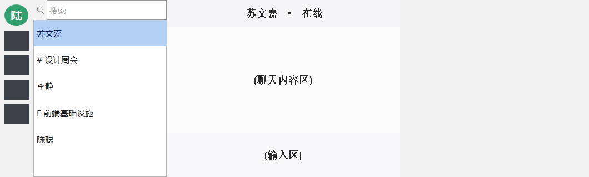

*Left 60 px Avatar + icon nav / middle 240 px DuiSearchBox + DuiListBox / right flex content.*

#### Code-based creation

```
auto root = std::make_unique<DuiHBox>();

// === Left: 60 px nav rail ===
auto rail = std::make_unique<DuiVBox>();
rail->SetPadding(8);
rail->SetGap(8);

auto avatar = std::make_unique<DuiAvatar>();
avatar->SetName(_T("L"));
avatar->SetFallbackBgColor(RGB(50, 160, 110));
rail->AddChild(std::move(avatar), DuiLayout::Hint().Fixed(40));

for (int i = 0; i < 4; ++i) {
    // In real apps, this is a DuiButton(StyleIcon) or a custom-drawn nav item
    auto btn = std::make_unique<DuiButton>();
    btn->SetButtonType(DuiButton::StyleIcon);
    btn->SetCtrlId(IDC_RAIL_BASE + i);
    rail->AddChild(std::move(btn), DuiLayout::Hint().Fixed(36));
}
root->AddChild(std::move(rail), DuiLayout::Hint().Fixed(60));

// === Middle: 240 px search + list ===
auto mid = std::make_unique<DuiVBox>();
auto search = std::make_unique<DuiSearchBox>();
search->SetCtrlId(IDC_SEARCH);
search->SetPlaceholder(_T("Search"));
mid->AddChild(std::move(search), DuiLayout::Hint().Fixed(36));

auto list = std::make_unique<DuiListBox>();
list->SetCtrlId(IDC_SESSION_LIST);
list->SetItemHeight(48);
list->AddItem(_T("Alice"));
list->AddItem(_T("# Design weekly"));
list->AddItem(_T("Bob"));
list->SetCurSel(0, false);
mid->AddChild(std::move(list), DuiLayout::Hint().Weight(1));
root->AddChild(std::move(mid), DuiLayout::Hint().Fixed(240));

// === Right: flex content (title bar + content + composer) ===
auto right = std::make_unique<DuiVBox>();
right->AddChild(BuildHeaderBar(),  DuiLayout::Hint().Fixed(48));
right->AddChild(BuildChatThread(), DuiLayout::Hint().Weight(1));
right->AddChild(BuildComposer(),   DuiLayout::Hint().Fixed(80));
root->AddChild(std::move(right), DuiLayout::Hint().Weight(1));
```

#### XML mode

```
<hbox>
  <!-- Left rail -->
  <vbox fixedWidth="60" padding="8" gap="8">
    <avatar name="L" fallbackColor="50,160,110" fixedHeight="40"/>
    <button id="200" buttonType="icon" fixedHeight="36"/>
    <button id="201" buttonType="icon" fixedHeight="36"/>
    <button id="202" buttonType="icon" fixedHeight="36"/>
    <button id="203" buttonType="icon" fixedHeight="36"/>
    <control weight="1"/>
  </vbox>

  <!-- Middle list -->
  <vbox fixedWidth="240">
    <search-box id="100" placeholder="Search" fixedHeight="36"/>
    <listbox    id="101" itemHeight="48" weight="1"/>
  </vbox>

  <!-- Right content -->
  <vbox weight="1">
    <header-bar  fixedHeight="48"/>       <!-- App-side custom tag -->
    <chat-thread weight="1"/>
    <composer    fixedHeight="80"/>
  </vbox>
</hbox>
```

**Upgrade path**: when the user needs to drag-resize the middle list width, wrap the middle and right segments in a `DuiSplitter` (`orientation=horizontal`) and give it an initial ratio with `SetRatio` — a one-line replacement.

#### 9.3.1 Full Build function

```
enum { IDC_RAIL_BASE = 200, IDC_SEARCH = 100, IDC_SESSION_LIST = 101 };

std::unique_ptr<DuiControl> BuildThreePaneRoot()
{
    using namespace balloonwjui;
    auto root = std::make_unique<DuiHBox>();

    // Left: 60 px nav rail
    auto rail = std::make_unique<DuiVBox>();
    rail->SetPadding(8); rail->SetGap(8);
    auto avatar = std::make_unique<DuiAvatar>();
    avatar->SetName(_T("L"));
    avatar->SetFallbackBgColor(RGB(50, 160, 110));
    rail->AddChild(std::move(avatar), DuiLayout::Hint().Fixed(40));
    for (int i = 0; i < 4; ++i)
    {
        auto btn = std::make_unique<DuiButton>();
        btn->SetButtonType(DuiButton::StyleIcon);
        btn->SetCtrlId(IDC_RAIL_BASE + i);
        rail->AddChild(std::move(btn), DuiLayout::Hint().Fixed(36));
    }
    rail->AddChild(std::make_unique<DuiControl>(), DuiLayout::Hint().Weight(1));
    root->AddChild(std::move(rail), DuiLayout::Hint().Fixed(60));

    // Middle: 240 px search + list
    auto mid = std::make_unique<DuiVBox>();
    auto search = std::make_unique<DuiSearchBox>();
    search->SetCtrlId(IDC_SEARCH);
    search->SetPlaceholder(_T("Search"));
    mid->AddChild(std::move(search), DuiLayout::Hint().Fixed(36));

    auto list = std::make_unique<DuiListBox>();
    list->SetCtrlId(IDC_SESSION_LIST);
    list->SetItemHeight(48);
    list->AddItem(_T("Alice"));
    list->AddItem(_T("# Design weekly"));
    list->AddItem(_T("Bob"));
    list->SetCurSel(0, false);
    mid->AddChild(std::move(list), DuiLayout::Hint().Weight(1));
    root->AddChild(std::move(mid), DuiLayout::Hint().Fixed(240));

    // Right: flex content (app-supplied BuildHeaderBar / Thread / Composer)
    auto right = std::make_unique<DuiVBox>();
    right->AddChild(BuildHeaderBar(),  DuiLayout::Hint().Fixed(48));
    right->AddChild(BuildChatThread(), DuiLayout::Hint().Weight(1));
    right->AddChild(BuildComposer(),   DuiLayout::Hint().Fixed(80));
    root->AddChild(std::move(right), DuiLayout::Hint().Weight(1));
    return root;
}
```

#### 9.3.2 Event handling

```
// MainFrame::OnDuiNotify dispatch:
case IDC_SEARCH:
    if (n->code == DUIN_VALUECHANGED)
    {
        auto* sb = (DuiSearchBox*)GetClientContent()->FindControlById(IDC_SEARCH);
        FilterContacts(sb->GetText());     // App helper: filter session list by query
    }
    return 0;

case IDC_SESSION_LIST:
    if (n->code == DUIN_VALUECHANGED)
    {
        // n->extra is the new selected row index; use the LPARAM to fetch the app's sessionId
        auto* lb = (DuiListBox*)GetClientContent()->FindControlById(IDC_SESSION_LIST);
        LPARAM sessionId = lb->GetItemParam((int)n->extra);
        SwitchToSession((int)sessionId);
    }
    return 0;

// The 4 rail buttons: IDC_RAIL_BASE + 0..3
default:
    if (n->ctrlId >= IDC_RAIL_BASE && n->ctrlId < IDC_RAIL_BASE + 4
        && n->code == DUIN_CLICK)
    {
        SwitchTab(n->ctrlId - IDC_RAIL_BASE);    // 0=Conversations / 1=Contacts / 2=Favorites / 3=Settings
    }
    return 0;
```

#### 9.3.3 Build & run

WinMain uses [§9.0.2](#layout-skeleton-app); change the `extern` to `BuildThreePaneRoot()`. The EnsureCreated block adds one line: `FindControlById(IDC_SEARCH)->EnsureCreated(frame.m_hWnd)` (SearchBox embeds one EDIT). Use `SetTitle(_T("Flamingo IM"))` + `ResizeClient(1100, 720)` so the three columns have enough room.

<a id="layout-settings"></a>

### 9.4 Settings page

A vertical nav on the left (implemented with `DuiListBox` — better than `DuiTab` for long lists) + a "label + control" configuration list on the right.

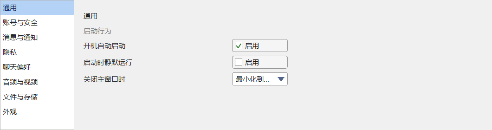

*8-item left nav + General page: auto-start / run silently / on closing main window.*

#### Code-based creation

```
auto root = std::make_unique<DuiHBox>();

// === Left: nav list ===
auto nav = std::make_unique<DuiListBox>();
nav->SetCtrlId(IDC_SETTINGS_NAV);
nav->SetItemHeight(32);
nav->AddItem(_T("General"));
nav->AddItem(_T("Account & security"));
nav->AddItem(_T("Messages & notifications"));
nav->AddItem(_T("Privacy"));
nav->AddItem(_T("Chat preferences"));
nav->AddItem(_T("Audio & video"));
nav->AddItem(_T("Files & storage"));
nav->AddItem(_T("Appearance"));
nav->SetCurSel(0, false);
root->AddChild(std::move(nav), DuiLayout::Hint().Fixed(160));

// === Right: vbox content ===
auto content = std::make_unique<DuiVBox>();
content->SetPadding(20);
content->SetGap(8);

auto h = std::make_unique<DuiLabel>();
h->SetText(_T("General"));
content->AddChild(std::move(h), DuiLayout::Hint().Fixed(28));

auto sub = std::make_unique<DuiLabel>();
sub->SetText(_T("Startup behavior"));
sub->SetTextColor(RGB(120, 120, 120));
content->AddChild(std::move(sub), DuiLayout::Hint().Fixed(20));

// Helper: one "label + right-side control" row
auto makeOption = [](LPCTSTR label, std::unique_ptr<DuiControl> right) {
    auto row = std::make_unique<DuiHBox>();
    auto l = std::make_unique<DuiLabel>();
    l->SetText(label);
    row->AddChild(std::move(l), DuiLayout::Hint().Weight(1));
    row->AddChild(std::move(right), DuiLayout::Hint().Fixed(120));
    return row;
};

auto cb1 = std::make_unique<DuiButton>();
cb1->SetButtonType(DuiButton::StyleCheckbox);
cb1->SetText(_T("Enable"));
cb1->SetCheck(true, false);
content->AddChild(makeOption(_T("Start at system boot"), std::move(cb1)),
                  DuiLayout::Hint().Fixed(28));

auto combo = std::make_unique<DuiComboBox>();
combo->AddString(_T("Minimize to tray"));
combo->AddString(_T("Exit the app"));
combo->SetCurSel(0, false);
content->AddChild(makeOption(_T("When closing the main window"), std::move(combo)),
                  DuiLayout::Hint().Fixed(28));

content->AddChild(std::make_unique<DuiControl>(),
                  DuiLayout::Hint().Weight(1));     // Flex spacer fills the rest

root->AddChild(std::move(content), DuiLayout::Hint().Weight(1));
```

#### XML mode

```
<hbox>
  <!-- Left nav -->
  <listbox id="100" fixedWidth="160" itemHeight="32">
    <!-- Note: listbox items must be added in code (AddItem); XML does not
         support <item> children yet — a future enhancement. -->
  </listbox>

  <!-- Right content -->
  <vbox weight="1" padding="20" gap="8">
    <label text="General" fixedHeight="28"/>
    <label text="Startup behavior" textColor="120,120,120" fixedHeight="20"/>

    <hbox fixedHeight="28">
      <label text="Start at system boot" weight="1"/>
      <button id="200" buttonType="checkbox" text="Enable" fixedWidth="120"/>
    </hbox>
    <hbox fixedHeight="28">
      <label text="When closing the main window" weight="1"/>
      <combo-box id="201" fixedWidth="120"/>
    </hbox>

    <control weight="1"/>
  </vbox>
</hbox>
```

#### 9.4.1 Full Build function

```
enum { IDC_SETTINGS_NAV = 100, IDC_AUTOSTART = 200, IDC_CLOSE_BEHAVIOR = 201 };

std::unique_ptr<DuiControl> BuildSettingsRoot()
{
    using namespace balloonwjui;
    auto root = std::make_unique<DuiHBox>();

    // Left: nav ListBox
    auto nav = std::make_unique<DuiListBox>();
    nav->SetCtrlId(IDC_SETTINGS_NAV);
    nav->SetItemHeight(32);
    nav->AddItem(_T("General"));
    nav->AddItem(_T("Account & security"));
    nav->AddItem(_T("Messages & notifications"));
    nav->AddItem(_T("Privacy"));
    nav->AddItem(_T("Chat preferences"));
    nav->AddItem(_T("Audio & video"));
    nav->AddItem(_T("Files & storage"));
    nav->AddItem(_T("Appearance"));
    nav->SetCurSel(0, false);
    root->AddChild(std::move(nav), DuiLayout::Hint().Fixed(160));

    // Right: content VBox
    auto content = std::make_unique<DuiVBox>();
    content->SetPadding(20); content->SetGap(8);

    auto h = std::make_unique<DuiLabel>();
    h->SetText(_T("General"));
    content->AddChild(std::move(h), DuiLayout::Hint().Fixed(28));

    auto sub = std::make_unique<DuiLabel>();
    sub->SetText(_T("Startup behavior"));
    sub->SetTextColor(RGB(120, 120, 120));
    content->AddChild(std::move(sub), DuiLayout::Hint().Fixed(20));

    auto makeOption = [](LPCTSTR label, std::unique_ptr<DuiControl> right) {
        auto row = std::make_unique<DuiHBox>();
        auto l = std::make_unique<DuiLabel>();
        l->SetText(label);
        row->AddChild(std::move(l), DuiLayout::Hint().Weight(1));
        row->AddChild(std::move(right), DuiLayout::Hint().Fixed(120));
        return row;
    };

    auto cb1 = std::make_unique<DuiButton>();
    cb1->SetCtrlId(IDC_AUTOSTART);
    cb1->SetButtonType(DuiButton::StyleCheckbox);
    cb1->SetText(_T("Enable"));
    cb1->SetCheck(true, false);
    content->AddChild(makeOption(_T("Start at system boot"), std::move(cb1)),
                      DuiLayout::Hint().Fixed(28));

    auto combo = std::make_unique<DuiComboBox>();
    combo->SetCtrlId(IDC_CLOSE_BEHAVIOR);
    combo->AddString(_T("Minimize to tray"));
    combo->AddString(_T("Exit the app"));
    combo->SetCurSel(0, false);
    content->AddChild(makeOption(_T("When closing the main window"), std::move(combo)),
                      DuiLayout::Hint().Fixed(28));

    content->AddChild(std::make_unique<DuiControl>(), DuiLayout::Hint().Weight(1));
    root->AddChild(std::move(content), DuiLayout::Hint().Weight(1));
    return root;
}
```

#### 9.4.2 Event handling

```
// MainFrame::OnDuiNotify dispatch:
case IDC_SETTINGS_NAV:
    if (n->code == DUIN_VALUECHANGED)
    {
        // In a real app this would swap the right-side panel via SetClientContent;
        // simplified example: just swap the right-side title
        int sel = (int)n->extra;
        SwitchSettingsPage(sel);
    }
    return 0;

case IDC_AUTOSTART:
    if (n->code == DUIN_VALUECHANGED)
    {
        bool enabled = (n->extra != 0);
        ConfigureAutoStart(enabled);
        g_settings.SetBool(_T("AutoStart"), enabled);
    }
    return 0;

case IDC_CLOSE_BEHAVIOR:
    if (n->code == DUIN_VALUECHANGED)
    {
        // n->extra >= 0: an item was picked from the popup; < 0: an editable typed value didn't match
        if ((int)n->extra >= 0)
        {
            g_settings.SetInt(_T("CloseBehavior"), (int)n->extra);
        }
    }
    return 0;
```

#### 9.4.3 Build & run

WinMain uses [§9.0.2](#layout-skeleton-app); change the `extern` to `BuildSettingsRoot()`. There are no EDITs, so the EnsureCreated block can be removed entirely. Use `SetTitle(_T("Settings"))`. Build command per §9.0.3.

<a id="layout-skeleton"></a>

### 9.5 Window skeleton (Dock)

The classic WPF / WinForms dock layout: top toolbar + bottom statusbar + left nav + center fill. `DuiDock` is designed for this case and is more intuitive than nesting VBox/HBox manually.

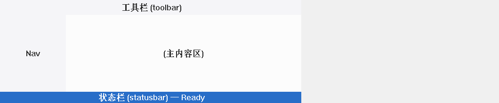

*Top toolbar (32 px) + bottom statusbar (24 px) + left nav (140 px) + center fill.*

#### Code-based creation

```
auto dock = std::make_unique<DuiDock>();

// Top 32 px toolbar
dock->AddDocked(BuildToolbar(),  DuiDock::DockTop,    32);

// Bottom 24 px statusbar
dock->AddDocked(BuildStatusbar(),DuiDock::DockBottom, 24);

// Left 140 px nav
dock->AddDocked(BuildLeftNav(),  DuiDock::DockLeft,  140);

// Center fill (must be added last; only one DockFill allowed)
dock->AddDocked(BuildContent(),  DuiDock::DockFill);

frame.SetClientContent(std::move(dock));
```

#### XML mode

```
<dock>
  <toolbar    dockSide="top"    dockSize="32"/>
  <statusbar  dockSide="bottom" dockSize="24"/>
  <left-nav   dockSide="left"   dockSize="140"/>
  <content    dockSide="fill"/>
</dock>
```

The order in which children are added to a DuiDock <u>matters</u>: earlier-added children take the outer ring; later-added ones take the inner ring. The final `DockFill` takes the remaining space. If you want the left nav to run all the way from top to bottom (rather than stopping between the toolbar and statusbar), swap the "left before top/bottom" order.

#### 9.5.1 Full Build function

```
std::unique_ptr<DuiControl> BuildSkeletonRoot()
{
    using namespace balloonwjui;
    auto dock = std::make_unique<DuiDock>();

    // Top toolbar: docking proceeds outer → inner; earlier-added wins the outer ring
    dock->AddDocked(BuildToolbar(),   DuiDock::DockTop,    32);

    // Bottom statusbar
    dock->AddDocked(BuildStatusbar(), DuiDock::DockBottom, 24);

    // Left nav (added after top/bottom, so it doesn't span the full window height
    //   — it stops between the toolbar's bottom and the statusbar's top. To make the nav
    //   run from top to bottom, move this line before top / bottom.)
    dock->AddDocked(BuildLeftNav(),   DuiDock::DockLeft,  140);

    // Center fill (added last; only one DockFill per dock)
    dock->AddDocked(BuildContent(),   DuiDock::DockFill);

    return dock;
}

// Sample implementations of BuildToolbar / BuildStatusbar / BuildLeftNav / BuildContent:
std::unique_ptr<balloonwjui::DuiControl> BuildToolbar()
{
    using namespace balloonwjui;
    auto bar = std::make_unique<DuiHBox>();
    bar->SetPadding(4); bar->SetGap(4);
    for (int i = 0; i < 5; ++i)
    {
        auto b = std::make_unique<DuiButton>();
        b->SetButtonType(DuiButton::StyleIcon);
        b->SetCtrlId(2000 + i);
        bar->AddChild(std::move(b), DuiLayout::Hint().Fixed(28));
    }
    return bar;
}

std::unique_ptr<balloonwjui::DuiControl> BuildStatusbar()
{
    auto bar = std::make_unique<balloonwjui::DuiLabel>();
    bar->SetText(_T("Ready"));
    bar->SetTextColor(RGB(120, 120, 120));
    return bar;
}

std::unique_ptr<balloonwjui::DuiControl> BuildLeftNav()
{
    auto nav = std::make_unique<balloonwjui::DuiListBox>();
    nav->SetCtrlId(3000);
    nav->AddItem(_T("Inbox"));
    nav->AddItem(_T("Sent"));
    nav->AddItem(_T("Drafts"));
    nav->SetCurSel(0, false);
    return nav;
}

std::unique_ptr<balloonwjui::DuiControl> BuildContent()
{
    return std::make_unique<balloonwjui::DuiLabel>();    // App-defined
}
```

#### 9.5.2 Event handling

```
// MainFrame::OnDuiNotify dispatch:
case 3000:    // Left nav listbox
    if (n->code == DUIN_VALUECHANGED)
    {
        SwitchView((int)n->extra);   // 0=Inbox / 1=Sent / 2=Drafts
    }
    return 0;

default:
    // 5 toolbar buttons IDC = 2000..2004
    if (n->ctrlId >= 2000 && n->ctrlId < 2005 && n->code == DUIN_CLICK)
    {
        OnToolbarCmd(n->ctrlId - 2000);
    }
    return 0;
```

#### 9.5.3 Build & run

WinMain uses [§9.0.2](#layout-skeleton-app); change the `extern` to `BuildSkeletonRoot()`. No EDITs, so the EnsureCreated block can be removed. Use `SetTitle(_T("Document browser"))` + `ResizeClient(1024, 720)`.

---

<a id="nine-patch-bg"></a>

## 10. 9-grid background image (DuiHost::SetBgImage)

Many desktop dialogs / windows want a **decorated** background image (rounded corners, a top gradient band, a shadow, border textures, ...). If you just `StretchBlt` the whole image, the rounded corners get squashed, the gradient band gets fat, and decorative lines distort. 9-grid (also known as nine-patch / nine-slice) solves this: slice the image by 4 insets into 9 cells, where **the four corners do not scale, the four edges stretch on one axis only, and the center stretches on both axes**.

balloonui exposes this for the entire host client area through `DuiHost::SetBgImage(HBITMAP, RECT insets)`. Any window deriving from `DuiHost` (`DuiFrameWindow` / `DuiPopupHost` / your own subclass) gets it with one call.

<a id="bg-concept"></a>

### 10.1 Concept diagram

Four insets slice the source bitmap into 9 cells. The source (left, 580×520) is 9-grid-rendered into any-size dst (right):

```
         source (580×520)                       dst (any size)
       +----+--------+----+               +----+----------------+----+
       | TL |   T    | TR |               | TL |        T       | TR |     ← 40 px top gradient
       +----+--------+----+               +----+----------------+----+
       | L  |   C    | R  |               | L  |                | R  |
       |    |        |    |    →          |    |        C       |    |     ← Center stretches on both axes
       |    |        |    |               |    |                |    |
       +----+--------+----+               +----+----------------+----+
       | BL |   B    | BR |               | BL |        B       | BR |     ← 10 px bottom border
       +----+--------+----+               +----+----------------+----+
        ← 10px →   ← 10px →
        ← left →   ← right →

   Per-cell rendering rule:
     TL / TR / BL / BR  →  1:1 BitBlt (no scaling)
     T  / B             →  Horizontal StretchBlt only (height unchanged)
     L  / R             →  Vertical StretchBlt only (width unchanged)
     C                  →  Two-axis StretchBlt
```

<a id="bg-api"></a>

### 10.2 API

Two overloads — pick by need:

```
// DuiHost.h
class BUI_API DuiHost : public CWindowImpl<DuiHost, CWindow>
{
public:
    // Single-inset overload — src == dst; 4 corners are 1:1 copied (classic 9-grid behavior).
    // Suited to source images with rounded corners / shadow / decoration in the corners —
    // they stay pixel-perfect at any dst size.
    //
    // hbm     : source bitmap (caller-owned; the host doesn't copy or release it,
    //           and the bitmap must outlive the host).
    //           nullptr → clear the background, fall back to the default COLOR_BTNFACE fill.
    // insets  : source-pixel left/top/right/bottom; defines the thickness of the four non-scaling corner regions.
    void    SetBgImage(HBITMAP hbm, const RECT& insets);

    // Dual-inset overload — source / destination insets specified independently. The 4 corners
    // also scale (src.thickness → dst.thickness).
    //
    // Typical use: a decoration band in the source (e.g. 70 px gradient) needs to be compressed
    // into a 40 px title bar:
    //   srcInsets = { 10, 70, 10, 10 };
    //   dstInsets = { 10, 40, 10, 10 };
    //   host.SetBgImage(hbm, srcInsets, dstInsets);
    //
    // When src == dst, this degrades to the single-inset behavior.
    void    SetBgImage(HBITMAP hbm,
                       const RECT& srcInsets,
                       const RECT& dstInsets);

    HBITMAP GetBgImage() const;
};
```

| Scenario | Which one |
| --- | --- |
| Source image has rounded corners / hard-edge decoration in the corners; needs pixel-perfect crispness | Single inset |
| Source decoration band's height ≠ desired render height ("compress the gradient to title-bar height") | Dual inset |
| Source is a solid-color border (corner scaling causes no visible loss) | Either; dual inset is more flexible |

<a id="bg-usage"></a>

### 10.3 Usage

```
// === main.cpp ===
balloonwjui::DuiFrameWindow frame;
frame.SetTitle(_T("BuddyInfo"));
frame.Create(NULL, CWindow::rcDefault, _T("BuddyInfo"),
             WS_OVERLAPPEDWINDOW, 0);

// Load the background PNG (caller owns the HBITMAP)
HBITMAP hbm = LoadBgPng(_T("BuddyInfoDlgBg.png"));

// 4 insets: pink-blue gradient band covers 40 px; 10 px borders on left/right/bottom
RECT insets = { 10 /*L*/, 40 /*T*/, 10 /*R*/, 10 /*B*/ };
frame.SetBgImage(hbm, insets);

frame.SetClientContent(BuildContent());
frame.ResizeClient(560, 480);   // No distortion when the user drags the window corner
frame.ShowWindow(SW_SHOW);

// Before exiting, SetBgImage(nullptr, {}) to detach, then DeleteObject(hbm).
```

<a id="bg-comparison"></a>

### 10.4 9-grid vs naive StretchBlt — one picture says it all

Both images below render the same 580×520 source into a ~970×280 destination. **The difference: 9-grid keeps the top gradient band at 40 px, the side borders at 10 px, and the corners crisp; naive StretchBlt scales the gradient band down to ~22 px and shrinks the corners along with it, deforming everything.**

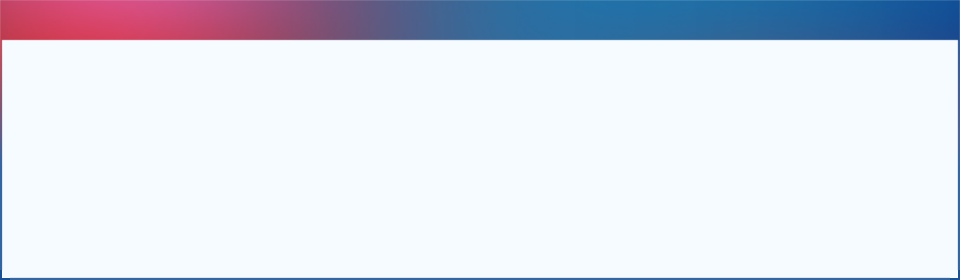

*9-grid (DuiHost::SetBgImage)*

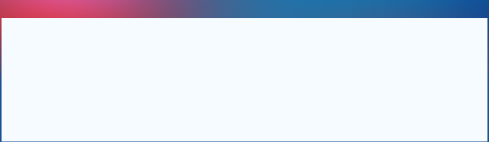

*Naive StretchBlt*

<a id="bg-resize"></a>

### 10.5 Three sizes — 9-grid never distorts

Same source image, 9-grid rendered at three different target sizes. The top gradient band **stays at 40 px tall** (never stretched horizontally or compressed vertically), and the left/right/bottom thin borders **stay at 10 px**. The white center panel stretches freely to host business controls.

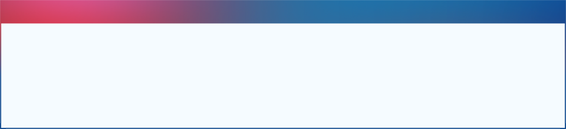

*Small (~970×220)*


*Medium (~970×280)*


*Large (~970×360)*

<a id="bg-impl"></a>

### 10.6 Implementation

balloonui has two internal layers:

```
DuiHost::OnPaint                       // Real-window paint entry
  ├─ EnsureBackBuffer(W, H)             // Prepare a 32bpp DIB offscreen DC
  ├─ if (m_hBgImage):
  │     DuiNinePatch::Draw(memDC, hbm,
  │                       rcClient, insets);      // 9-grid fills the whole client area
  ├─ else:
  │     FillRect(memDC, COLOR_BTNFACE);  // Default gray fill
  ├─ m_root->OnPaint(memDC, rcClient);   // Business controls paint on top of the bg
  ├─ if (m_clientBorderColor != CLR_INVALID
  │     && !m_hBgImage):
  │     FrameRect(memDC, rcClient,
  │               m_clientBorderColor);  // 1 px outline; skipped when a bg image is present
  └─ BitBlt offscreen → window DC        // One-shot swap, flicker-free
```

Note the "**and `!m_hBgImage`**" guard in the second-to-last step — this is the key coupling between `SetBgImage` and `SetClientBorderColor`: as soon as a bg image is set, the 1 px light-gray outline that `DuiFrameWindow` enables by default is **automatically suppressed**, letting the 9-grid image's own rounded corners / shadow / decoration define the boundary. The caller <u>does not</u> need to manually `SetClientBorderColor(CLR_INVALID)` before `SetBgImage`.

**`DuiNinePatch::Draw`** (in `balloonui/DuiNinePatch.cpp`) does:

1. **ClampInsets** — clamps the caller's insets to a legal range: `left + right ≤ srcW` and `top + bottom ≤ srcH`. On overflow, scales them down proportionally (so the corners don't overlap). Negative values are clamped to 0.
2. **ComputeCells** — math; produces 9 (srcRect, dstRect) pairs: `// Source split into 3 columns: [0, L), [L, srcW-R), [srcW-R, srcW) // Source split into 3 rows: [0, T), [T, srcH-B), [srcH-B, srcH) // dst is split into 3 columns / 3 rows the same way; the middle row's height // is max(0, dstH - T - B); the left column's width = L, right column's width = R are unchanged. // 9 combinations = 9 cells.` When a cell degenerates in dst (dstW < L+R or dstH < T+B), both src and dst are zeroed in that axis, and callers skip them via IsRectEmpty.
3. **Blit 9 cells** — a cell whose width/height is unchanged (the 4 corners) → `BitBlt`; a cell where height changes but width doesn't (left/right edges), width changes but height doesn't (top/bottom edges), or both change (center) → `StretchBlt(SRCCOPY)` or `AlphaBlend` (if the source is 32bpp with premultiplied alpha).

**Key invariant**: each of the 4 corners has src width = dst width = `L`/`R` and src height = dst height = `T`/`B`. So BitBlt is a <u>pixel-perfect</u> copy — never distorted. Stretching happens only on the edges/center, and only in restricted directions.

<a id="bg-pitfalls"></a>

### 10.7 Common pitfalls

| Symptom | Cause / fix |
| --- | --- |
| The whole image is stretched (it looks like nothing took effect) | insets are all 0 → there is no "no-scale" region. Check the RECT you passed in; left/top/right/bottom should be source-pixel values. |
| The 4 corners shrink or overlap | The insets sum exceeds the source size (`L+R > srcW` or `T+B > srcH`). `DuiNinePatch::ClampInsets` scales them down proportionally, but visually it may still not be what you wanted — change the source image or shrink the insets. |
| Background doesn't paint / black screen | The HBITMAP is 32bpp but with alpha=0. `StretchBlt(SRCCOPY)` copies the alpha and the host's BitBlt then treats it as transparent → black. Two fixes: ① force alpha=255 at load time; ② go through `Gdiplus::Bitmap::GetHBITMAP(bgColor, &hbm)` to pre-composite alpha into RGB (this is what the demo does). |
| When to release the HBITMAP | The caller owns it; it must outlive the host. The host's destructor doesn't touch it. Recommended: within its lifetime call only `SetBgImage(nullptr, {})` to detach; let the OS reclaim it at process exit. |
| Background hidden after inserting child controls | The children covered it. Children usually don't paint their own background (transparent), but some (DuiListBox / DuiEditHost) fill with a solid brush — give them `SetBgColor(transparent_marker)` or add padding between them. |

<a id="bg-titlebar"></a>

### 10.8 Using the gradient strip as the window's title bar (transparent title bar)

A common 9-grid background design has a colored decoration band / gradient / shadow at the top — visually this *is* the window's title bar. balloonui provides three APIs — `DuiFrameWindow::SetTitleBarTransparent` + `SetTitleTextColor` + `SetCaptionGlyphColor` — to use "the gradient strip directly as the title bar" with zero boilerplate.

**Key trick — source inset ≠ destination inset.**

The "decoration band" height in the source (e.g. 70 px gradient) usually doesn't match the desired visual title-bar height (e.g. 40 px). If you use a single inset (src=dst=40), the source's first 40 rows of gradient are 1:1 copied to the destination, and the remaining 30 rows of gradient get pushed into the middle region — leaving a dirty strip just below the title bar.

The right way: use the dual-inset overload of `SetBgImage` — `srcInsets.top=70` (cover the entire decoration band) and `dstInsets.top=40` (the title-bar height you want). 9-grid <u>proportionally compresses</u> the entire decoration band to 40 px; the gradient renders fully and the business area below stays clean.


*BuddyInfoDlg style: the pink-blue gradient band IS the window title bar — the title "Buddy info" is in white text and the three caption buttons use white glyphs over the gradient; below it sit the avatar / form / close button. The window is draggable-corner resizable.*

#### API

```
// DuiFrameWindow.h (excerpt)
class BUI_API DuiFrameWindow : public DuiHost
{
public:
    // Transparent title bar — don't paint our own background; let the top decoration
    // region of the host's SetBgImage(9-grid) serve directly as the title strip.
    void    SetTitleBarTransparent(bool b);
    bool    IsTitleBarTransparent() const;

    // Title text color (usually only needs changing with SetTitleBarTransparent(true) +
    // a colored background). Default ink-1 (40, 40, 40).
    void    SetTitleTextColor(COLORREF c);

    // Override color for min / max / close glyphs. CLR_INVALID = use the default dark gray.
    // The close button's hover-red-fill state forces a white glyph regardless of this override
    // (so it stays visible on the red fill).
    void    SetCaptionGlyphColor(COLORREF c);
};
```

#### Usage

```
balloonwjui::DuiFrameWindow frame;
frame.SetTitle(_T("Buddy info"));

// Key dimensions
const int kSrcGradientH = 69;   // Actual source-pixel height of the gradient band (measured)
const int kDstTitleBarH = 40;   // Title-bar height in the destination (the visual you want)

frame.SetTitleBarHeight   (kDstTitleBarH);   // Title-bar height = destination top inset
frame.SetTitleBarTransparent(true);          // Don't paint our own background
frame.SetTitleTextColor   (RGB(255, 255, 255));   // White text on the gradient
frame.SetCaptionGlyphColor(RGB(255, 255, 255));   // White caption glyphs
frame.SetButtons(true, true, true);
frame.SetMinSize(320, 240);
frame.SetResizable(true);

frame.Create(NULL, CWindow::rcDefault, _T("MyApp"), WS_OVERLAPPEDWINDOW, 0);

// 9-grid bg: source 69 px gradient band → destination 40 px title bar (proportional compression; gradient renders fully)
HBITMAP hbm = LoadBgPng(_T("BuddyInfoDlgBg.png"));
RECT srcInsets = { 10, kSrcGradientH, 10, 10 };
RECT dstInsets = { 10, kDstTitleBarH, 10, 10 };
frame.SetBgImage(hbm, srcInsets, dstInsets);

frame.SetClientContent(BuildBuddyInfoForm());   // The form starts at y=titleBarH
frame.ResizeClient(560, 520);
frame.CenterWindow();
frame.ShowWindow(SW_SHOW);
```

#### Key points

| Question | Answer |
| --- | --- |
| How does the gradient region become "draggable"? | No special setup — DuiFrameWindow maps the entire title bar (whatever m_titleH happens to be) to `HTCAPTION` by default; press and drag moves the window. |
| Where are the min/max/close buttons positioned? | Always at the top-right of the title bar, `kCaptionBtnW = 46` wide × the title-bar height. Even at SetTitleBarHeight(80), the buttons are 46×80 — the glyph is centered. |
| Contrast for the button glyph color | Use `SetCaptionGlyphColor(RGB(255,255,255))`. The close button's hover red-fill state forces a white glyph regardless of this override (so it stays visible on the red fill). |
| Where should the client-area content start? | The client-area root does <u>not</u> need top padding to leave room for the title bar — DuiFrameWindow has already split the client into title bar + content, and content begins at y=titleBarH. |
| Can the window be drag-resized at the corner? | Yes. `WS_OVERLAPPEDWINDOW` includes `WS_THICKFRAME`; combine with `SetResizable(true)` + `SetMinSize`. The key selling point: during drag-resize, 9-grid <u>doesn't distort the four corners</u>. |

<a id="bg-demo"></a>

### 10.9 Full demo

A standalone runnable demo lives at `flamingoclient/DemoNinePatchBg/`:

| File | Purpose |
| --- | --- |
| `main.cpp` | WinMain + load the PNG (via the GDI+ `GetHBITMAP` path, to avoid the alpha pitfall) + construct the BuddyInfo-style client area + one-line `SetBgImage` call. |
| `BgPaintTile.{h,cpp}` | A screenshot helper that paints either 9-grid or naive StretchBlt inside its own m_rcItem. <u>For capture mode only</u> — real apps just call `DuiHost::SetBgImage` directly. |
| `CaptureMode.{h,cpp}` | `--capture-all` offscreen rendering + PNG output, same pattern as the other 4 demos. |
| `BuddyInfoDlgBg.png` | Background source image (580×520). |

```
# Build
msbuild Demos.sln /p:Configuration=Debug /p:Platform=Win32 /t:DemoNinePatchBg

# Interactive mode — drag the corners to see 9-grid stay undistorted
Bin\DemoNinePatchBg.exe

# Capture mode — regenerate this section's images
Bin\DemoNinePatchBg.exe --capture-all flamingoclient\docs\images
```

---

<a id="frame-window-xml"></a>

## 11. DuiFrameWindow XML configuration (<frame-window>)

Every `DuiFrameWindow` property — title / title-bar height / transparency / text color / glyph color / the three buttons / client-area border / **9-grid bg image (including dual inset)** — can be configured through a single `DuiXmlBuilder::FromFrameXml` XML. The <u>client-area control tree</u> is still assembled via `FromString` from §3 / §6 or in C++ in the `BuildBuddyInfoContent()` style.

Comparison of the two modes:

|  | Pure C++ (legacy path) | XML-driven (new path) |
| --- | --- | --- |
| Frame configuration | A chain of `frame.SetXxx(...)` calls | `FromFrameXml(xml, cfg)` + `frame.ApplyConfig(cfg)` |
| BG image loading | Caller does `Gdiplus::Bitmap::GetHBITMAP` + `SetBgImage(hbm, src, dst)` and releases themselves | `bg-image="..."` attribute; `LoadBgImageFromFile` loads automatically + `frame` owns it + destructor releases it |
| Path base | Caller concatenates with `GetModuleFileName` | Relative paths resolve relative to the exe directory (`ResolveAssetPath`); absolute paths are used directly |
| Client-area root | Same — `SetClientContent(BuildXxx())` | Same — `FromFrameXml` can also build the root from the children inside `<frame-window>` and return it |

<a id="frame-xml-schema"></a>

### 11.1 Full schema

```
<frame-window
    title="Buddy info"

    title-bar-height="40"                 // int, default 36, min 18
    title-bar-transparent="true"          // bool, default false (title bar paints a light-gray background)
    title-text-color="255,255,255"        // "r,g,b", default RGB(40,40,40)
    caption-glyph-color="255,255,255"     // "r,g,b", color of min/max/close glyphs in the rest state

    has-min-button="true"                 // bool, default true
    has-max-button="true"                 // bool, default true
    has-close-button="true"               // bool, default true

    min-w="320" min-h="240"               // int, default 200 × 150
    resizable="true"                      // bool, default true
    border-px="8"                         // int, 96-dpi logical px, default 8
    client-border-color="200,200,200"     // "r,g,b" or "none"; DuiFrameWindow defaults to RGB(200,200,200)

    bg-image="BuddyInfoDlgBg.png"         // Path (absolute / relative to exe dir); empty = not set
    bg-src-insets="10,69,10,10"           // "l,t,r,b" or single value "n" (same on all 4 sides)
    bg-dst-insets="10,40,10,10">          // Same; omitted → degrades to src == dst (classic 9-grid)

  <vbox padding="24,16,24,16" gap="10">  // Client-area root (optional)
    ...                                    // vbox/hbox/label/button/edit + custom factory
  </vbox>
</frame-window>
```

#### Attribute conventions

- **Colors**: `"r,g,b"` triples (0–255). `client-border-color` also accepts `"none"` = `CLR_INVALID`, explicitly disabling the border (<u>when a bg image is present, the border is auto-skipped, so writing "none" is redundant</u>).
- **insets / margin (RECT)**: `"l,t,r,b"` 4-tuple, or a single value `"n"` (same on all 4 sides).
- **Booleans**: `"true"` / `"1"` / `"yes"` count as true, everything else as false.
- **Default**: any attribute <u>not written</u> = "not set" — `ApplyConfig` does not call the corresponding setter, and the frame keeps its default. Example: writing only `title` and leaving everything else default → equivalent to the "default style" window from §10.
- **bg-image path**: a path starting with `C:\` / `D:/` / `\\server\` / `//server/` is treated as absolute and used directly; everything else is treated as relative and resolved against the directory of `GetModuleFileName(NULL)` by `ResolveAssetPath`. `~`, environment variables, and the current cwd are <u>not</u> expanded (so cwd drift can't make the skin disappear).
- **bg-dst-insets omitted**: equivalent to `dst == src` (classic 9-grid, 4 corners 1:1, no scaling). For "compress the source decoration band into a smaller destination height" (like this demo compressing a 69 px gradient into a 40 px title bar), `bg-dst-insets` must be set explicitly.

<a id="frame-xml-api"></a>

### 11.2 API

```
// DuiXmlBuilder.h
struct DuiFrameWindowConfig
{
    Optional<CString>   title;
    Optional<int>       titleBarHeight;
    Optional<bool>      titleBarTransparent;
    Optional<COLORREF>  titleTextColor;
    Optional<COLORREF>  captionGlyphColor;
    Optional<bool>      hasMinButton;
    Optional<bool>      hasMaxButton;
    Optional<bool>      hasCloseButton;
    Optional<int>       minW;
    Optional<int>       minH;
    Optional<bool>      resizable;
    Optional<int>       borderPx;
    Optional<COLORREF>  clientBorderColor;   // CLR_INVALID = explicitly disable the border
    CString             bgImagePath;
    RECT                bgSrcInsets = { 0, 0, 0, 0 };
    Optional<RECT>      bgDstInsets;          // Not set → degrades to src == dst
};

class BUI_API DuiXmlBuilder
{
public:
    // Parses the <frame-window> top-level element; fills cfg and returns the
    // client-area control tree (built from the first child of <frame-window>);
    // returns nullptr if there is no child. The bg-image path is converted to
    // an absolute path here and written back to cfg.bgImagePath.
    static std::unique_ptr<DuiControl> FromFrameXml(LPCSTR  xmlUtf8,
                                                    DuiFrameWindowConfig& outConfig,
                                                    const CustomFactory& factory = {});
    static std::unique_ptr<DuiControl> FromFrameXml(LPCWSTR xmlW,
                                                    DuiFrameWindowConfig& outConfig,
                                                    const CustomFactory& factory = {});

    // Asset-path resolution. Absolute path → returned as-is; relative → concatenated
    // with the exe directory; empty → empty. Used internally by XML; also exposed
    // publicly so the app can call it (e.g. to load an icon inside a custom factory).
    static CString ResolveAssetPath(LPCTSTR userPath);
};

// Controls/DuiFrameWindow.h
class BUI_API DuiFrameWindow : public DuiHost
{
    ...
    // Apply cfg to the frame — every has_value() field calls the corresponding setter;
    // unset fields keep the frame's current value. The bg image goes through
    // LoadBgImageFromFile (the host owns the bitmap and releases it in the destructor).
    // Typically called after Create and before ShowWindow.
    void ApplyConfig(const DuiFrameWindowConfig& cfg);
    ...
};

// DuiHost.h (new)
// Convenience overloads to load from a file path — GDI+ load + host ownership + auto-release in destructor.
// Path is the caller's responsibility (absolute / relative is handled by the caller;
// the XML path goes through ResolveAssetPath before being passed in).
bool LoadBgImageFromFile(LPCTSTR path, const RECT& insets);
bool LoadBgImageFromFile(LPCTSTR path, const RECT& srcInsets, const RECT& dstInsets);
```

<a id="frame-xml-walkthrough"></a>

### 11.3 End-to-end walkthrough — DemoNinePatchBg right window

This demo's right window has been switched to the XML-driven path. The excerpt from `DemoNinePatchBg/main.cpp`:

```
// 1) Literal XML (could also be loaded from a file / resource)
const char* kFrameXml =
    "<frame-window"
    "  title=\"Buddy info (XML-driven)\""
    "  title-bar-height=\"40\""
    "  title-bar-transparent=\"true\""
    "  title-text-color=\"255,255,255\""
    "  caption-glyph-color=\"255,255,255\""
    "  bg-image=\"BuddyInfoDlgBg.png\""             // Relative to exe dir
    "  bg-src-insets=\"10,69,10,10\""
    "  bg-dst-insets=\"10,40,10,10\""
    "  client-border-color=\"none\""                // Redundant here (auto-skipped when a bg image is present)
    "  min-w=\"320\" min-h=\"240\""
    "  resizable=\"true\"/>";

// 2) Parse — cfg captures all attributes; the bg-image path has already been turned into an absolute path by ResolveAssetPath
DuiFrameWindowConfig cfg;
DuiXmlBuilder::FromFrameXml(kFrameXml, cfg);

// 3) Standard frame-creation flow
MainFrame frame;
frame.Create(NULL, CWindow::rcDefault, _T("DemoFrameThemed"),
             WS_OVERLAPPEDWINDOW, 0);
frame.ApplyConfig(cfg);                          // ★ One line applies every property + loads the bg image
frame.SetClientContent(BuildBuddyInfoContent());     // Client area is still assembled in C++ — could be FromString too
frame.ResizeClient(560, 520);
frame.ShowWindow(nCmdShow);
```

The four-window 2×2 comparison (DemoNinePatchBg.exe shows exactly this layout):


*Rows = configuration mode (top: pure C++ / bottom: XML-driven); columns = style (left: default / right: 9-grid bg). The <u>two windows in each column</u> are pixel-identical apart from the "/ code" vs "/ XML" suffix in the title — proving that the XML-driven path produces a window equivalent to the equivalent C++ calls.*

<a id="frame-xml-pitfalls"></a>

### 11.4 Common pitfalls / design trade-offs

| Question | Answer |
| --- | --- |
| Paths with non-ASCII / spaces | Write them verbatim in the UTF-8-encoded XML. `ResolveAssetPath` does not URL-encode; it concatenates literally with the exe dir, and the filesystem just needs to find the file. |
| bg-image relative path not found | `LoadBgImageFromFile` silently returns false, the frame doesn't attach a bg image, and it behaves like the "default style." Check whether the PNG was copied to the exe output directory. |
| Both bg-image and client-border-color set | OnPaint's `!m_hBgImage` check skips the border draw; `client-border-color` is harmless (writing `"none"` conveys the semantic "if I remove the bg image later, still don't draw a border"). |
| ApplyConfig after ShowWindow | Legal — each setter Invalidates / rebuilds the skeleton itself (`SetTitleBarHeight` rebuilds). Useful for "skin swap" at runtime. |
| I want the client area in XML too | Put a `<vbox>` child inside `<frame-window>` and `FromFrameXml` will build it and return it for `SetClientContent`. For complex client areas, prefer a separate XML file + `FromString` and keep the main frame XML to the frame chrome only — better readability. |
| bgImagePath is CString, not Optional | Intentional — an empty string IS "bg image not set"; "set but path is empty" can't be distinguished and is meaningless, so we drop the wrapper. |

---

<a id="feature-strip"></a>

## 12. Feature Strip (compile-time tree-shaking)

balloonui ships 28 controls + an XML builder. In real projects, however, most apps use only a subset (a chat client may not need `DuiTreeView`, a utility app may not need `DuiRichEditHost`, and so on). This section describes how to use <u>preprocessor macros</u> to exclude unused controls from compilation, shrinking the final `balloonui.dll` / `.lib`.

### 12.1 How it works

Each control's `.h` and `.cpp` are wrapped in `#if BUI_FEATURE_XXX`; turning the feature off → that control's source code is not compiled → the `.obj` is not produced → it doesn't end up in the lib / DLL. Meanwhile, `DuiXmlBuilder`'s tag dispatch is gated by the same macros: when a feature is off, the dispatch branch disappears, and encountering the corresponding tag takes the "miss" path: an `OutputDebugString` warning + return `nullptr`.

All switches are defined in `balloonui/BalloonUiFeatures.h`. <u>Default is fully on</u>; if the app writes nothing, everything is enabled. To turn a feature off: add `BUI_DISABLE_XXX` to the balloonui project's preprocessor definitions and rebuild balloonui.dll; at the same time add the same list to the business exe project (so the class declarations from `#include`'d headers match the DLL's exported symbols).

### 12.2 Switch reference

28 independent switches + 1 derived switch (GALLERY). Each `BUI_DISABLE_XXX` turns off the corresponding control; the table below groups controls by directory.

| Switch | Control | Effect when off | Dependents (also turned off) |
| --- | --- | --- | --- |
| `BUI_DISABLE_LAYOUT` | DuiVBox / DuiHBox / DuiGrid | **Not allowed** (foundational container; intercepted with `#error`). |  |
| `BUI_DISABLE_DOCK` | DuiDock | `<dock>` XML disabled | — |
| `BUI_DISABLE_SPLITTER` | DuiSplitter | `<splitter>` XML disabled | — |
| `BUI_DISABLE_LABEL` | DuiLabel | `<label>` XML disabled | — |
| `BUI_DISABLE_BUTTON` | DuiButton | `<button>` XML disabled | — |
| `BUI_DISABLE_AVATAR` | DuiAvatar | `<avatar>` XML disabled | — |
| `BUI_DISABLE_BADGE` | DuiBadge | `<badge>` XML disabled | — |
| `BUI_DISABLE_SEPARATOR` | DuiSeparator | `<separator>` XML disabled | — |
| `BUI_DISABLE_GROUPBOX` | DuiGroupBox | `<groupbox>` XML disabled | — |
| `BUI_DISABLE_EDIT` | DuiEditHost | `<edit>` XML disabled | SEARCHBOX, SPINBOX, COMBOBOX, TREEVIEW |
| `BUI_DISABLE_IMAGEOLE` | CDuiImageOle | Inline images in RichEdit unavailable | RICHEDIT |
| `BUI_DISABLE_RICHEDIT` | DuiRichEditHost | `<richedit>` XML disabled | — |
| `BUI_DISABLE_SEARCHBOX` | DuiSearchBox | `<searchbox>` XML disabled | — |
| `BUI_DISABLE_SPINBOX` | DuiSpinBox | `<spinbox>` XML disabled | — |
| `BUI_DISABLE_SLIDER` | DuiSlider | `<slider>` XML disabled | — |
| `BUI_DISABLE_SWITCH` | DuiSwitch | `<switch>` XML disabled | — |
| `BUI_DISABLE_SCROLLBAR` | DuiScrollBar | — | LISTBOX, TREEVIEW |
| `BUI_DISABLE_LISTBOX` | DuiListBox | `<listbox>` XML disabled | COMBOBOX |
| `BUI_DISABLE_COMBOBOX` | DuiComboBox | `<combobox>` XML disabled | — |
| `BUI_DISABLE_TREEVIEW` | DuiTreeView | `<treeview>` XML disabled | — |
| `BUI_DISABLE_TAB` | DuiTab | — | TABPAGE |
| `BUI_DISABLE_TABPAGE` | DuiTabPage | `<tab-page>` CustomFactory disabled | — |
| `BUI_DISABLE_MENU` | DuiMenu | Right-click menus / dropdowns unavailable | MENUBAR |
| `BUI_DISABLE_MENUBAR` | DuiMenuBar | `<menu-bar>` XML disabled; the persistent menu bar is unavailable | — |
| `BUI_DISABLE_PROGRESSBAR` | DuiProgressBar | `<progress>` XML disabled | — |
| `BUI_DISABLE_TOOLTIP` | DuiToolTipMgr | Hover tooltip bubbles unavailable | — |
| `BUI_DISABLE_POPUPHOST` | DuiPopupHost | — | — |
| `BUI_DISABLE_EMOJIPANEL` | DuiEmojiPanel | — | — |
| `BUI_DISABLE_GIF` | DuiGif | Animated images degrade to a static first frame | — |
| `BUI_DISABLE_FRAMEWINDOW` | DuiFrameWindow | `<frame-window>` + `FromFrameXml` disabled | — |
| `BUI_DISABLE_XMLBUILDER` | DuiXmlBuilder | `FromString` / `FromFrameXml` disabled (you must hand-write a C++ AddChild chain) | — |

The "dependents" column means: turning off this row's feature automatically also turns off these upstream features. For example, `BUI_DISABLE_EDIT` also removes SEARCHBOX / SPINBOX / COMBOBOX / TREEVIEW (because they all embed `DuiEditHost`). The file enforces this with `#if !defined(BUI_DISABLE_X) && defined(BUI_FEATURE_DEP)` chains.

### 12.3 Derived switch: BUI_FEATURE_GALLERY

`DuiGalleryDlg` + `DuiGalleryAutoStart` is a dev-only test entry (Debug startup auto-pops a window that browses every control demo). It <u>uses almost every control</u>, so BalloonUiFeatures.h derives a `BUI_FEATURE_GALLERY` switch automatically: it is 1 only when all 28 underlying features are on. Turning off any underlying feature → gallery is skipped entirely. This avoids GalleryDlg.cpp referencing missing symbols like RunAll().

### 12.4 Measured size differences

Methodology: build balloonui.dll with defaults (all features on) and record its size; then add 23 `BUI_DISABLE_*` macros to `balloonui.vcxproj`'s preprocessor (keeping LAYOUT + LABEL + BUTTON + EDIT + XMLBUILDER), rebuild, and record the size. VS 2022 + Win32.

| Configuration | balloonui.dll size | Remaining |
| --- | --- | --- |
| Debug, all on | 2,581,504 bytes (2.46 MB) | — |
| Debug, minimal (LAYOUT + LABEL + BUTTON + EDIT + XMLBUILDER only) | 2,004,992 bytes (1.91 MB) | **↓ 22.3%** |
| Release, all on | 295,424 bytes (288 KB) | — |
| Release, minimal | 151,552 bytes (148 KB) | **↓ 48.7%** |

Release mode benefits the most (48.7%) — Release lacks the feature-irrelevant "padding" that Debug info contributes, so the <u>pure code share</u> between features is higher, and the cut delivers a larger relative win. Debug mode benefits less (22.3%) because PDB / ASan / no-inline / etc. already take up many bytes.

### 12.5 App-side procedure

1. In `balloonui/balloonui.vcxproj`'s "Project Properties → C/C++ → Preprocessor → Preprocessor Definitions", add the features you want to turn off, semicolon-separated. Example: BUI_DISABLE_TREEVIEW;BUI_DISABLE_RICHEDIT;BUI_DISABLE_MENU;BUI_DISABLE_GIF
2. Rebuild balloonui (Release produces `Bin\balloonui.dll` + `balloonui.lib`; Debug similarly).
3. **Critical**: add the <u>same</u> preprocessor definitions to your business exe project. Otherwise the class declarations seen by the exe's `#include "Controls/.../DuiXxx.h"` won't match the DLL's exported symbols → link failure.
4. Rebuild the business exe and deploy the new `balloonui.dll` to the runtime directory.

If you link balloonui <u>statically</u> (`BUI_USE_DLL` not defined), the process is the same; the only difference is that the .lib is linked directly into the exe and no DLL needs deploying.

### 12.6 Tag-miss diagnostics

After turning off a feature, if the app's XML still contains the corresponding tag (e.g. TREEVIEW is disabled but the XML still has `<treeview>`), `DuiXmlBuilder` will:

1. First try the caller-registered `CustomFactory`; if the app registered the same tag, use the app's version;
2. Otherwise, print one line to the VS Output window (or DebugView): [balloonui] DuiXmlBuilder: unknown tag <treeview> (feature disabled or factory missing)
3. Return `nullptr` for that node (the parent's AddChild skips it). <u>It does not throw or abort</u>; Release still runs, just with one UI piece missing.

When diagnosing, route the OutputDebugString stream into DebugView (SysInternals) to find which XML fragment references the stripped tag.

### 12.7 Limits / known issues

- **DLL-mode rebuild**: in `BUI_USE_DLL` mode, balloonui is "built once, used by many exes," but this scheme requires the app to <u>itself</u> rebuild the DLL with BUI_DISABLE_* (one DLL per group of business exes). If different business apps on the same machine want different disable lists, build a separate DLL per app (or switch to static linkage).
- **Multiple exes sharing one balloonui.dll**: all sharing exes must use the same disable list. Otherwise the class declarations from `#include` on the exe side won't match the DLL's exported symbols.
- **Adding new controls**: when adding new controls to the library, the author must add a corresponding BUI_FEATURE_XXX switch to BalloonUiFeatures.h, wrap the control's .h/.cpp in `#if`, and gate the matching dispatch branch in DuiXmlBuilder.cpp. The switch table in §12.2 must be updated as well.
- **Unused "dependents" also disappear**: e.g. turning off EDIT automatically turns off TREEVIEW; if the app thinks "I don't use EditHost but I do want TreeView," that's not possible (TreeView embeds EditHost for inline cell editing). BalloonUiFeatures.h's `#error` blocks contradictory configurations.

---

<a id="demo-taskmgr"></a>

## 13. Case study: DemoTaskManager

`third_party/DemoTaskManager/` uses balloonui to clone the Win10 Task Manager UI; it is the most complete demo, stitching together many of the library's controls, the XML-driven path, custom-drawn controls, and event routing. This chapter walks through its structure — **with a focus on the layout**, because that is what newly onboarded developers most want to "copy from."


*Overall layout: **frame-window** (custom title bar) → **menu-bar** (File / Options / View) → **tab-page** (7 tabs) → content area → **status bar** (process count / CPU / memory).*

<a id="demo-taskmgr-stack"></a>

### 13.1 Library features used

| Category | Usage |
| --- | --- |
| Containers | `DuiVBox` / `DuiHBox` / `DuiSplitter` |
| Top-level window | `DuiFrameWindow` (XML-driven, full `title-bar-height` / `has-min/max/close-button` / `min-w/min-h` / `resizable` config) |
| Menus | `DuiMenuBar` persistent menu bar + `DuiMenu` dropdowns (with mouse-move switching) |
| Multi-tab | `DuiTabPage` with 7 pages (custom `<tab-page> / <tab-page-item>` tags handled by a `CustomFactory`) |
| Multi-column table | `DuiTreeView` in multi-column mode: all 6 tabs use it (tree / single-level / two-level / 14-column with frozen first column) |
| Table cell types | `CELL_TEXT` (default) / `CELL_CHECKBOX` (status column of the Startup tab); first column uses `SetItemIcon` for a letter logo |
| Header sort | `DUITVN_COLUMNCLICK` + app-side `SortByColumn(col, asc)` + `SetSortIndicator` |
| Right-click menu | Right-clicking a node on the Processes tab → `DuiMenu::TrackPopup` pops "End task / Go to details / ..." |
| Splitter | The Performance tab uses `DuiSplitter` (left sidebar / right detail, draggable) |
| Custom controls | `TaskMgrLineChart` (line chart) + `TaskMgrSidebarItem` (sidebar row) — both derive from `DuiControl`, **kept in the demo and not promoted to the library** |
| Theme / font | Every control uses `DuiResMgr::GetDefaultFont()` (Microsoft YaHei 9 pt); the letter logo is generated in memory via `MakeLetterBitmap` |
| Data-driven | 200 ms `WM_TIMER` → `demotaskmgr::Tick()` advances the mock data → status bar / process numbers / line chart / sidebar all refresh |
| Event routing | `WM_DUI_NOTIFY` handles menu bar / treeview sort / double-click / right-click; `WM_SYSKEYDOWN` forwards Alt+letter to the menu bar |

<a id="demo-taskmgr-files"></a>

### 13.2 File manifest

| File | Responsibility |
| --- | --- |
| `main.cpp` | Entry; the `TaskManagerFrame` main frame; 200 ms timer; all event routing (menu / tree sort / right-click / double-click / Alt mnemonics); `--screenshot <dir>` automated screenshot mode (generates every PNG in this chapter). |
| `taskmgr.xml` | Main framework XML: `frame-window` + `vbox` + `menu-bar` + `tab-page` (with 7 `tab-page-item`s) + status-bar `hbox` + `status-label` ×3. |
| `XmlFactory.h/.cpp` | `CustomFactory` entry: handles the three custom tags `<tab-page>` / `<tab-page-item>` / `<status-label>`; `TaskMgrXmlOuts` carries the pointers to the freshly built key controls back to main. |
| `MockData.h/.cpp` | Fixed-seed generation of 200 processes / 30 startup items / 150 services / 2 users; 5 ring buffers (CPU / memory / disk / network / GPU, 60 points each); the `MakeLetterBitmap` + `MakeLetterIcon` in-memory GDI icon generators. |
| `ProcessesPage.h/.cpp` | Processes tab: `DuiTreeView` in 7-column tree mode (three roots: Apps / Background / Windows); first-column letter logo; sorting preserves groups. |
| `PerformancePage.h/.cpp` | Performance tab: `DuiSplitter` + 5 sidebar items + custom line chart + 4-column stats; contains the two custom-drawn subclasses `TaskMgrLineChart` + `TaskMgrSidebarItem`. |
| `OtherPages.h/.cpp` | The remaining 5 tabs: App history / Startup / Users / Details / Services (each is a `DuiTreeView` subclass, single- or two-level). |

<a id="demo-taskmgr-layout"></a>

### 13.3 Overall layout (taskmgr.xml)

The skeleton of the entire main window is described in one XML file. `main.cpp` parses it with `DuiXmlBuilder::FromFrameXml(xml, cfg, factory)` in one call; the frame configuration (title / min-size / three buttons / resizable) and the client-area subtree are produced together.

```
frame-window  title="Task Manager"  title-bar-height="36"
              has-min/max/close-button="true"
              min-w="800"  min-h="600"  resizable="true"
└── vbox  padding="8,4,8,4"  gap="2"
    │
    ├── <menu-bar>  id=100  fixedHeight=24
    │   ├── <menu-item id=110 text="File(&F)"/>       # dropdown wired in main.cpp via SetDropdown
    │   ├── <menu-item id=120 text="Options(&O)"/>
    │   └── <menu-item id=140 text="View(&V)"/>
    │
    ├── <tab-page>  id=200  weight=1                  # Picked up by the CustomFactory
    │   ├── <tab-page-item title="Processes"      page-tag="processes"/>
    │   ├── <tab-page-item title="Performance"    page-tag="performance"/>
    │   ├── <tab-page-item title="App history"    page-tag="appHistory"/>
    │   ├── <tab-page-item title="Startup"        page-tag="startup"/>
    │   ├── <tab-page-item title="Users"          page-tag="users"/>
    │   ├── <tab-page-item title="Details"        page-tag="details"/>
    │   └── <tab-page-item title="Services"       page-tag="services"/>
    │
    └── <hbox>  id=300  fixedHeight=22  gap=16  padding="0,2,0,2"   # Status bar
        ├── <status-label which="proc" text="Processes: --"   fixedWidth=100/>
        ├── <status-label which="cpu"  text="CPU usage: --"   fixedWidth=140/>
        └── <status-label which="mem"  text="Memory: --"      fixedWidth=180/>
```

The three custom tags are picked up by the lambda returned by `demotaskmgr::MakeTaskMgrFactory(&outs)`:

| Custom tag | Construction | Returned via outs |
| --- | --- | --- |
| `<tab-page>` | `new DuiTabPage`; iterate the `<tab-page-item>` children and call `AddPage(title, MakePageByTag(page-tag, outs))` for each | `outs.tabPage` + each page pointer |
| `<tab-page-item>` | Zero-size placeholder `DuiControl` (already consumed by the `<tab-page>` factory; here only to avoid the kernel's unknown-tag warning) | — |
| `<status-label>` | `new DuiLabel` + set the initial text + write the pointer to `outs.lblProc / lblCpu / lblMem` by `which` | 3 label pointers |

After main.cpp parses the XML and receives `outs`, `frame.BindOuts(outs)` copies the pointers into the frame; from then on the timer / event routing locate controls quickly through those pointers. `menu-bar` is not in `outs` — it is fetched via `DuiHost::GetRoot()->FindCtrlById(100)` (it is a library built-in tag in XML and does not go through the CustomFactory).

<a id="demo-taskmgr-pages"></a>

### 13.4 Per-tab internal layout

#### 13.4.1 Processes (`ProcessesPage`)


*Processes tab: `DuiTreeView` in multi-column mode, 7 columns. The 3 group roots have no icon; process nodes carry a letter logo in the first column (A blue = Apps / B gray = Background / W darker gray = Windows). Inside the "Apps" group, helper child processes are indented under their parent.*

```
DuiTreeView  cols=7  rowH=28
├── root "Apps (16)"                  [no icon]
│   ├── chrome.exe                    [A blue]   Running  8.1%  850.1 MB  2.5 MB/s  1.3 Mbps  2.7%
│   │   ├── chrome.exe (Helper)       [A blue]   ...
│   │   └── chrome.exe (Helper)       [A blue]   ...
│   ├── Code.exe                      [A blue]   ...
│   ...
├── root "Background processes (45)"  [no icon]
│   └── 80 process nodes              [B gray]   ...
└── root "Windows processes (38)"     [no icon]
    └── 40 process nodes              [W darker] ...

Columns: Name(240) / Status(80) / CPU(70,R) / Memory(90,R) / Disk(90,R) / Network(90,R) / GPU(70,R)
```

**Key APIs:** `AddRoot` / `AddChild` (tree structure); `SetItemIcon` (letter logo); `SetCellText` (timer refreshes the 5 numeric columns each frame); `ExpandAll` (everything expanded by default).

**Events:** double-clicking a node fires `DUIN_DBLCLK` → `MessageBox` shows a mock property dialog; right-clicking a node fires `DUITVN_RCLICK` → `DuiMenu::TrackPopup` pops "End task / Go to details / Open file location / Properties"; clicking a column header fires `DUITVN_COLUMNCLICK` → `SortByColumn(col, asc)` stable-sorts within each of the 3 roots independently and rebuilds the tree (helper children inside the Apps group stay with their parent and don't participate in the sort).

#### 13.4.2 Performance (`PerformancePage`)


*Performance tab: `DuiSplitter` divides the page into a left sidebar (5 metrics) + a right detail area (line-chart main body). The selected sidebar item gets a 4 px accent vertical strip + light-blue background on the left; each row ends with a 60-point mini sparkline. The detail area's main chart uses a 60-point ring buffer; `DuiAA::DrawLine` draws an anti-aliased polyline + 10×10 grid + a large current-value label + 100% / 0 Y-axis labels.*

```
PerformancePage   :  DuiSplitter (vertical, split=220, min=160/320)
│
├── pane 0: DuiVBox (sidebar)        gap=2
│   ├── TaskMgrSidebarItem CPU       [60 px]   selected state: 4 px strip + light-blue bg
│   ├── TaskMgrSidebarItem Memory    [60 px]
│   ├── TaskMgrSidebarItem Disk 0    [60 px]
│   ├── TaskMgrSidebarItem Ethernet  [60 px]
│   ├── TaskMgrSidebarItem GPU 0     [60 px]
│   └── DuiControl (spacer)          weight=1
│
└── pane 1: DuiVBox (detail)         padding="16,12,16,12"  gap=6
    ├── DuiLabel  title              fixed=28      "CPU"
    ├── DuiLabel  subtitle           fixed=18      "Intel Core i7-8700K @ 3.70 GHz"
    ├── TaskMgrLineChart              weight=1     ← custom-drawn
    └── DuiHBox  stats               fixed=56  gap=20
        ├── DuiLabel "Utilization\n18%"  weight=1
        ├── DuiLabel "Speed\n3.70 GHz"   weight=1
        ├── DuiLabel "Processes\n200"    weight=1
        └── DuiLabel "Threads\n2845"     weight=1
```

**Two custom `DuiControl` subclasses (<u>kept in the demo, not promoted to the library</u>):**

- **`TaskMgrLineChart`**: a 60-point ring-buffer data source + 0–`range` Y-axis scale; `OnPaint` draws a white background + 10×10 light-gray grid + a 1.5 px AA polyline in the accent color (`DuiAA::DrawLine`) + the current value in 22 pt bold in the top-left + the 100% / 0 labels on the right Y-axis. The latest point is pinned to the right edge; in the first 12 s after launch the curve "grows" in from the right.
- **`TaskMgrSidebarItem`** (60 px rows): the selected state has a 4 px accent vertical strip + light-blue background; the top half-row has an accent dot + title + current value (right-aligned); the bottom half-row has the subtitle + a 90×18 mini sparkline. `OnLButtonDown` does <u>not</u> go through `WM_DUI_NOTIFY`; it directly calls the held parent's `m_parent->SelectMetric(kind)` (the parent/child relationship is stable, so a raw pointer is safe).

When switching metrics, `PerformancePage::SelectMetric(k)` resets the selected state on the 5 sidebar items, swaps the chart's data source / accent to the new metric's ring buffer, and updates the detail area's title / subtitle / 4 stats labels.

#### 13.4.3 App history (`AppHistoryPage`)


*5 columns, single-level. Data: the "parent" app processes in `g_processes` where `kind == App && parentIndex < 0`; CPU time / network / metered / tile updates are mock cumulative values (derived deterministically from procIdx).*

```
DuiTreeView  cols=5
├── Name(220)  CPU time(90,R)  Network(90,R)  Metered network(100,R)  Tile updates(100,R)
└── 16 top-level app nodes (parents only, no helpers)
```

#### 13.4.4 Startup (`StartupPage`)


*4 columns, single-level. **The status column uses `CELL_CHECKBOX`** (checked = enabled; unchecked = disabled), combining `SetCellChecked` + `SetCellText` (graphic + text). The "Startup impact" column shows text labels: None / Low / Medium / High.*

```
DuiTreeView  cols=4
└── Name(220)  Publisher(220)  Status(90,CHECKBOX)  Startup impact(100)
```

#### 13.4.5 Users (`UsersPage`)


*2 columns / two-level structure. Each user is a root ("`balloonwj (N)`" / "`admin (N)`") with their app processes below. The CPU column shows the aggregate at the root and per-process values for the children. Sort only reorders the children inside each root; the user roots stay in fixed order.*

#### 13.4.6 Details (`DetailsPage`)


*14 columns, single-level + `SetFrozenColumns(1)`. During horizontal scroll the first Name column stays pinned to the left to keep rows aligned. All 200 processes are flattened in one view.*

```
DuiTreeView  cols=14  frozen=1
Columns: Name(200,frozen)  PID(70)  Status(80)  Username(120)  CPU(60)
    Memory(working set)(130)  Memory(commit size)(130)  UAC virtualization(100)
    Command line(280)  Platform(60)  Description(220)  Company(180)  Action(80)  Start time(100)
```

#### 13.4.7 Services (`ServicesPage`)


*6 columns, single-level. The first column carries a green 'S' letter logo (same mechanism as the Processes-page letter logo, generated by `MakeLetterBitmap`). 150 service rows; the PID column shows "—" when `pid == 0`.*

```
DuiTreeView  cols=6
└── Name(150,with icon)  PID(70,R)  Description(280)  Status(90)  Group(180)  Notes(120)
```

<a id="demo-taskmgr-data"></a>

### 13.5 Data-driven + 200 ms timer

Every live number is driven by a 200 ms `WM_TIMER`. `main.cpp::TaskManagerFrame::OnTimer_` does 4 things per tick:

1. `demotaskmgr::Tick()` — advance the mock data itself (push a new sample point into each of the 5 ring buffers; jiggle each of the 200 processes' cpu/mem/disk/net/gpu values by one notch).
2. `UpdateStatusBar()` — rewrite the text on the 3 status-bar `DuiLabel`s (process count / CPU% / memory).
3. `m_outs.processesPage->RefreshNumbers()` — rewrite the text in the 5 numeric columns of the Processes tab (200 processes × 5 = 1000 `SetCellText` calls; the hot path uses stack `TCHAR[32]` + `_stprintf_s`).
4. `m_outs.performancePage->OnTick()` — `Invalidate` the main chart and all 5 sidebar items on the Performance tab; their next `OnPaint` reads the latest ring buffer to repaint.

The other 5 tabs (App history / Startup / Users / Details / Services) hold relatively static data, so the timer doesn't refresh them; switching to those tabs doesn't stutter because their content was filled in by `Init()` once at startup.

<a id="demo-taskmgr-events"></a>

### 13.6 Event-routing summary

| Event | Trigger | Handler |
| --- | --- | --- |
| `WM_TIMER` | 200 ms cadence | See the 4 steps in §13.5 |
| `DUIN_VALUECHANGED` (ctrlId == menuBar) | User picks an item from one of the menu-bar dropdowns | `HandleMenuBarChosen(chosenId)`: File→Exit takes the `SC_CLOSE` path; others show mock prompts |
| `WM_SYSKEYDOWN` | Alt + letter | Forwarded to `m_menuBar->ProcessAltKey(vk)`; on a mnemonic hit, the matching dropdown pops directly |
| `DUIN_DBLCLK` (ctrlId == process tree) | Double-click a process node | `ShowProcessProperties()` mock property dialog (PID / user / CPU / memory / ...) |
| `DUITVN_RCLICK` (ctrlId == process tree) | Right-click a process node | `DuiMenu::TrackPopup`: "End task / Go to details / Open file location / Properties" |
| `DUITVN_COLUMNCLICK` (any table tab) | Click a column header | `DispatchColumnSort(ctrlId, col, asc)` routes to that page's `SortByColumn`; the app does a `stable_sort` on its data order array + `Clear()` rebuilds nodes + `SetSortIndicator` |
| `WM_DESTROY` | Close button → SC_CLOSE → ... | `PostQuitMessage(0)` (the library doesn't post it; the business frame must hook this itself; same template as in `guides.html` §[11](#frame-window-xml)) |

<a id="demo-taskmgr-screenshot"></a>

### 13.7 Command-line screenshot mode

All PNGs in this chapter are produced automatically by `DemoTaskManager.exe --screenshot <outdir>`. Mechanism (`main.cpp::RunScreenshotMode`):

1. Normal startup: create frame, load XML, SetTimer, enter `ShowWindow`;
2. Pump messages for 1500 ms so the mock data fills 5 sample points and the layout stabilizes;
3. For each of the 7 tabs, do `tab->SetCurSel(idx, true)` + `InvalidateRect` + pump messages for 500 ms;
4. Capture each tab as a full window via `PrintWindow(hwnd, memDC, 0)` into a 32bpp DIB; encode as PNG via GDI+ and save as `demo-taskmgr-<tag>.png`;
5. Exit immediately after all captures (without entering the main message loop).

The implementation reuses the GDI+ encoder logic from `DuiGallery/CaptureMode.cpp` and simplifies the "capture mark + BitBlt sub-rect" path — here we only capture the full window.

<a id="demo-taskmgr-vsdiff"></a>

### 13.8 Known visual differences from the real Win10 Task Manager

This demo does not aim for a pixel-perfect 1:1 clone; below are the major visible differences and the current choices, to help future maintainers decide what to polish further. "Close" = the demo already matches Win10 visually; "Difference kept" = a deliberate trade-off we have not chased.

| Item | Real Win10 Task Manager | Current demo | Status |
| --- | --- | --- | --- |
| Title bar | OS-drawn window title bar + system buttons | `DuiFrameWindow` custom title bar (consistent with other library demos) | **Difference kept** (custom-drawn is the point of the demo) |
| Menu bar | Extremely flat text + light-gray hover cell | `DuiMenuBar` hover `#E5E5E5` + active `#D7E3F4` light blue (distinguished from hover) | Close |
| Alt+letter | Supported | Supported (`WM_SYSKEYDOWN` forwarded to `ProcessAltKey`) | Close |
| Menu-bar dropdown switching | Once a dropdown is open, moving the mouse to a neighbor auto-switches (synchronously close + open) | Supported, via `DuiMenu::SetSwitchZones` + the popup's 30 ms mouse-position polling | Close |
| Tab strip | Extremely flat + blue active underline (no white fill) | Normal tabs match the background + selected has a white fill (no underline) | **Difference kept** (the white-fill active state has low visual conflict; library default — adding an underline would require changing `DuiTab`'s paint code) |
| Tab strip font / row height | 9-10 pt / 32-36 px | Default 9 pt / 32 px | Close |
| Table header | Almost transparent + 1 px bottom separator | `m_clrHeaderBg` defaults to `#FCFCFD` (near-white) + 1 px bottom line (default) | Close |
| Table row height | ≈ 28 px | Default 28 px | Close |
| Column separators | Very faint (almost not drawn) | 1 px light gray on the right of each column (`m_clrGrid`) | Close |
| Selected row | Light-blue background + black text | Brand-blue background + white text (`m_clrRowSel` = #2D6CDF) | **Difference kept** (library default uses the brand color uniformly across controls) |
| Process icon | Real exe icon | Letter logo (A blue / B gray / W darker gray) | **Difference kept** (the mock demo doesn't wire up real OS exe icons) |
| Performance-page sidebar font size | Title 14 pt / current value 18 pt bold | Same (`kFontSizeSidebarTitle` = 14, `kFontSizeSidebarValue` = 18 bold) | Close |
| Performance-page sidebar row height | ≈ 70 px | 70 px (`kSidebarItemH`) | Close |
| Performance-page detail bg | White (layered above the light-gray sidebar) | `PerformancePage::OnPaint` fills white first, then lets the splitter children paint on top | Close |
| Performance-page mini sparkline | No border, thinner | Has a 1 px light-gray border (visual cue that it's a chart) | **Difference kept** (minor cleanup, not done) |
| Performance-page chart polyline | Semi-transparent fill below the line | Polyline only, no fill | **Difference kept** (GDI has no alpha; the GDI+ path is not implemented) |
| Performance-page chart grid | 10×10 light gray | 10×10 light gray (`kChartGridCols` / `kChartGridRows`) | Close |
| Status bar | One bottom row: process count / CPU% / memory | Same | Close |
| Window icon (taskbar / Alt-Tab) | Real taskmgr.ico | Letter logo (blue 'T', `WM_SETICON`) | Close |

The overall feel is roughly 80% close to the real Win10 Task Manager; the remaining 20% is "deliberately kept differences" (custom title bar / brand-color selection / letter logos) and "minor cleanups not done" (semi-transparent fill / sparkline border / blue tab underline). To get to 100%, the main work would be:

- Add a blue top underline to `DuiTab`'s active state (requires changing library paint code).
- Add a GDI+ semi-transparent fill below `TaskMgrLineChart`'s polyline.
- Drop the sparkline border from `TaskMgrSidebarItem`.

<a id="demo-taskmgr-gotchas"></a>

### 13.9 Pitfalls hit in practice

| Symptom | Root cause | Fix |
| --- | --- | --- |
| Close button doesn't actually quit the process | `DuiFrameWindow` doesn't post `PostQuitMessage` by itself (a process can host multiple frames). The business frame must hook `WM_DESTROY → PostQuitMessage(0)` itself. | `main.cpp::OnDestroy_` |
| Link errors for `DuiTabPage` / `DuiMenu` / `DuiSplitter` missing exports | Class declaration lacks `BUI_API`. In DLL mode (`BUI_USE_DLL`) the ctor / method symbols aren't exported → `LNK2019` | Add `BUI_API` to each class header |
| Horizontal scrollbar still occupies the gutter when not needed | Historical library behavior: "always reserve" the gutter to avoid a layout-cycle dependency | `DuiTreeView::EnsureScrollRanges` adds a second-pass layout based on `m_needHScroll`; `BodyRect` shrinks the gutter on demand |
| In screenshot mode, outs is empty and tabs don't show | The incremental build didn't recompile a `XmlFactory.h` change into all of main.cpp's TUs, so the struct sizes mismatched | After modifying `TaskMgrXmlOuts` fields, do a full `Rebuild` (do not rely on incremental) |

---

<a id="demo-xchat"></a>

## 14. Case study: XChat (a Weixin PC clone)

`third_party/XChat/` uses balloonui to clone the Weixin Windows PC client UI; it is, alongside DemoTaskManager, the second full "reference-grade" case study. Its emphasis: <u>switching between multi-view main panes (chat / contacts / official accounts / empty-chat watermark)</u>, <u>session-list-driven right-pane view selection</u>, <u>HWND-hosted EDITs (search box / input field)</u>, <u>ChatScrollBar auto-hide</u>, plus a large amount of <u>custom stroke icons / chat bubbles / file cards / procedurally drawn "fake images"</u>. It complements DemoTaskManager — the latter targets the "utility UI" of menus / tabs / lists, while this one targets the "consumer UI" of message streams + overlays + lots of custom visual elements.


*XChat main pane (default chat view, 1100×720). A three-pane hbox: left 75 nav / middle 290 session-list / right fill multi-view. Every icon, bubble, file card, and QR-code message is custom-drawn with GDI+ strokes + GDI+ AA — <u>no PNG resources</u>.*

<a id="xchat-stack"></a>

### 14.1 Library features used

| Feature / control | Where it's used |
| --- | --- |
| `DuiFrameWindow` | Login window (360×500) + main window (1100×720) + settings window (800×680) + the hamburger popup — three independent top-level frames |
| `DuiXmlBuilder` | Every window is described in XML: `login.xml` / `login_loading.xml` / `main.xml` / `main_contacts.xml` / `main_publics.xml` / `settings.xml` |
| `CustomFactory` | Each frame registers its own factory that parses <u>custom tags</u> (`<color-panel>` / `<nav-icon>` / `<icon-button>` / `<chat-message-list>` / `<group-members>` / ...) into the corresponding custom-drawn DuiControl subclasses |
| `DuiVBox / DuiHBox / DuiGrid` | Every XML container; the main pane's three columns rely on the outermost `<hbox>` |
| `DuiVirtualList` | The main pane's middle session-list (21 conversations; rowH 68; manages its own scrollbar + auto-hide) |
| `DuiScrollBar` | Built into the session-list; embedded by ChatMessageList; embedded by ContactCategoryList. **All enable auto-hide** (hidden by default, fade in on hover/wheel). |
| `DuiEditHost` | Left-side search bar (id=60) + right-side chat input (id=400); the latter is multiline. Both use `EM_SETCUEBANNER` for the placeholder (the caller demo exe must wire up a ComCtl32 v6 manifest). |
| `DuiSwitch` | The group-info panel's "Mute notifications" + the settings page's "Keep chat history" / "Auto download". <u>Use `alignCross="center"` so that fixedHeight actually takes effect</u>, centering the switch inside a 32-tall hbox. |
| `DuiAvatar` | The 110×110 rounded-rect avatar on the login window's loading view; the 38×38 user avatar at the top of the main pane's left nav. |
| `DuiLabel` | chat-title (id=300); the "Scan to log in" / "File transfer only" texts in the login window (manually center-aligned via SetTextAlign); the two-line label/value rows of info-field. |
| `DuiMenu` | The bottom-left hamburger nav-icon pops a 5-item menu (Chat files / Chat history management / Lock / Feedback / Settings). |
| `DuiAA / GDI+` | Every non-axis-aligned path (rounded-rect avatars / unread-badge pills / mute-bell ring / chevron triangle / chat round avatar / DuiSwitch pill / 8 kinds of "fake images" / file ext-icon / double-bubble watermark) goes through GDI+ AntiAlias. |
| `DuiAnim` | The login spinner (rotating 240° arc) + DuiSwitch toggle + DuiScrollBar fade in/out all go through DuiAnimMgr. XChatMainFrame calls `TickAll` in a 16 ms WM_TIMER pulse. |

<a id="xchat-files"></a>

### 14.2 File manifest

| File | Purpose |
| --- | --- |
| `main.cpp` | WinMain: DPI v2 + GDI+ startup + ComCtl32 v6 manifest pragma; CLI argument routing (`--settings` / `--contacts` / `--publics` / `--empty`); chains two GetMessage loops in series — first run LoginFrame until it closes, then run XChatMainFrame |
| `LoginFrame.{h,cpp}` | Login window (QR + Loading, two modes). Mode::Qr shows the QR code + "Scan to log in" + "File transfer only"; after 3 s, SwitchMode → Mode::Loading shows the avatar + spinner + "Logging in…"; another 3 s later closes the window and PostQuits |
| `MainFrame.{h,cpp}` | XChatMainFrame: the main pane's frame; <u>every custom control + factory is defined in this file</u> (about 2200 lines — the largest file in the demo). Contains: `ColorPanel` / `NavIcon` / `IconButton` / `SendButton` / `WatermarkPanel` / `WxIcons` / `LogoImage` / `FrequentContactsRow` / `ArticleList` / `ContactMgmtButton` / `ContactCategoryList` / `MemberCell` / `GroupMembersGrid` + 4 XML factory tag parsers + `ApplySessionView` / `ShowEmptyView` / `ShowHamburgerMenu_` |
| `SettingsFrame.{h,cpp}` | The settings popup (a standalone DuiFrameWindow, 800×680). `RunModal()` implements modality via `EnableWindow(parent, FALSE)` + its own GetMessage loop. It <u>must not</u> PostQuitMessage — WM_QUIT is thread-wide and would make main exit too (a real pitfall hit during development) |
| `ChatMessageList.{h,cpp}` | The single-conversation message-stream custom control — not DuiVirtualList, because messages have variable heights (text bubble / image / transfer card / article card / date divider / file card — 6 ChatItemKinds with very different heights). Manages its own per-message layout cache + an embedded DuiScrollBar (auto-hide) |
| `SessionListItem.{h,cpp}` | The paint function for a session-list row (rounded-rect avatar + name + time + preview + bell/badge). Registered as DuiVirtualList's PaintRowFn callback |
| `MockData.{h,cpp}` | Mock for the 21 conversations + the 8 groups' member mocks. After `Sessions()` lazy-inits, the preview for each session is derived in reverse from `MessagesForSession()` |
| `MockChat.{h,cpp}` | Mock for 17 conversation threads (indexed by sessionIdx) + 6 ChatItemKind enums + ImageKind enum; helpers: Self/Peer/Divider/SelfImage/PeerImage/SelfTransfer/PeerTransfer/PeerKnowledgeCard/SelfFile/PeerFile |
| `main.xml` / `main_contacts.xml` / `main_publics.xml` | The main pane's three top-level layout variants. `main.xml` is the default (chat view); the other two are CLI entry points or nav-switch targets |
| `login.xml` / `login_loading.xml` | The login window's two modes' respective layouts |
| `settings.xml` | Settings-window layout: left 140 tab + right fill card area |
| `res/` | Just `qr_placeholder.png` + `wechat_logo_gray.png`. Every other visual element (icons / chat images / file ext icons) is **drawn procedurally**, with no external resources |

<a id="xchat-startup"></a>

### 14.3 Startup flow

`main.cpp` uses a "two serial GetMessage loops" pattern:

```
int WINAPI _tWinMain(HINSTANCE hInst, HINSTANCE, LPTSTR cmdLine, int nCmdShow)
{
    DuiDpi::OptInPerMonitorV2();
    OleInitialize(NULL);
    AtlInitCommonControls(ICC_BAR_CLASSES);
    _Module.Init(NULL, hInst);
    Gdiplus::GdiplusStartup(&gpToken, &gsi, nullptr);

    // --settings early path: skip login + main and pop the settings frame directly (used for screenshots)
    if (cmdLine contains "--settings") { SettingsFrame.RunModal(nullptr); return 0; }

    // ── Phase 1: login window (QR → Loading → closed; PostQuit exits the first GetMessage loop) ──
    {
        LoginFrame login(LoginFrame::Qr);
        login.Create(...); login.ShowAndStartLoginSequence();
        login.ResizeClient(360, 500); login.CenterWindow(); login.ShowWindow(...);
        RunMsgLoop();   // Loop 1: runs until LoginFrame OnDestroy_::PostQuitMessage
    }

    // ── Phase 2+: main window ──
    LPCTSTR initialXml = "main.xml";
    if (--contacts) initialXml = "main_contacts.xml";
    else if (--publics) initialXml = "main_publics.xml";

    XChatMainFrame frame;
    frame.Create(...);
    frame.LoadMainXml(initialXml);
    if (--empty) frame.ShowEmptyView();
    frame.ResizeClient(1100, 720); frame.CenterWindow(); frame.ShowWindow(...);
    RunMsgLoop();   // Loop 2: runs until XChatMainFrame OnDestroy_::PostQuitMessage

    Gdiplus::GdiplusShutdown(gpToken);
    _Module.Term(); OleUninitialize();
}
```

Two GetMessage loops in series is simpler than "one loop + multiple coexisting frames" — each frame's OnDestroy_ PostQuits its own loop. The downside is about a 1-frame visual gap between LoginFrame closing and MainFrame appearing; for a polished transition, switch to "two coexisting frames + explicit signaling" — not necessary for this demo.
**Another PostQuit key point**: a modal like SettingsFrame "popped by the main window" <u>must never</u> PostQuitMessage — WM_QUIT is thread-wide and would terminate main's RunMsgLoop too. SettingsFrame::OnDestroy_ simply flips `m_modalRunning=false` to let its RunModal while loop break.

<a id="xchat-frames"></a>

### 14.4 The three standalone frames at a glance

| Frame | Size | Main XML | Visual |
| --- | --- | --- | --- |
| `LoginFrame(Qr)` | 360×500 | login.xml | vbox: placeholder QR code + green "Scan to log in" (id=11) + spacer + blue "File transfer only" (id=12) |
| `LoginFrame(Loading)` | 360×500 | login_loading.xml | vbox: DuiAvatar rounded-rect avatar + rotating spinner + green "Logging in…" |
| `XChatMainFrame` | 1100×720 | main.xml / main_contacts.xml / main_publics.xml | Three-pane hbox: 75 nav / 290 middle / fill right (multi-view) |
| `SettingsFrame` | 800×680 | settings.xml | hbox: 140 left tab + fill right content (cards) |


*LoginFrame(Qr): placeholder QR + green "Scan to log in" + blue "File transfer only". 3 s later auto-SwitchModes to the Loading view.*


*SettingsFrame: left 140 tab (Account & storage / General / Shortcuts / Notifications / Plugins / About) + right card area. `RunModal` implements modality via `EnableWindow(parent, FALSE)`. Note the DuiSwitch at the top-right uses Weixin green.*

<a id="xchat-main-layout"></a>

### 14.5 Main-pane layout (main.xml)

The main pane is the demo's most complex layout. The outermost shell is a horizontal three-column bar:

```
<frame-window min-w="800" min-h="540" resizable="true" ...>
  <hbox padding="0" gap="0">

    <!-- ① Left nav (75 wide) -->
    <color-panel color="46,46,46" fixedWidth="75" padding="0,15,0,15" gap="6">
      <hbox fixedHeight="48"> <control weight="1"/><user-avatar fixedWidth="38" fixedHeight="38"/><control weight="1"/> </hbox>
      <nav-icon id="90" selected="true" glyph="chat-bubble"/>       <!-- Chats -->
      <nav-icon id="92" glyph="people"/>                            <!-- Contacts -->
      <nav-icon glyph="box"/>                                       <!-- Favorites -->
      <nav-icon glyph="aperture"/>                                  <!-- Moments -->
      <nav-icon glyph="video-bookmark"/>                            <!-- Channels -->
      <nav-icon glyph="eye-look"/>                                  <!-- Top stories -->
      <nav-icon glyph="mini-prog"/>                                 <!-- Mini programs -->
      <control weight="1"/>                                         <!-- Flex spacer -->
      <nav-icon glyph="phone"/>                                     <!-- Mobile -->
      <nav-icon id="91" glyph="hamburger"/>                         <!-- ≡ Pops menu -->
    </color-panel>

    <!-- ② Middle (290 wide) -->
    <color-panel color="245,245,245" fixedWidth="290" padding="0,16,0,0" gap="0">
      <hbox fixedHeight="32" gap="8" padding="12,0,12,0">
        <edit id="60" placeholder="Search" weight="1"/>
        <icon-button glyph="plus" fixedWidth="32"/>
      </hbox>
      <control fixedHeight="12"/>          <!-- Spacer; keeps the selected row off the search box -->
      <session-list weight="1" id="50"/>   <!-- DuiVirtualList, 21 rows -->
    </color-panel>

    <!-- ③ Right (fill) — container hosting 4 mutually exclusive panes -->
    <vbox weight="1" padding="0" gap="0">
      <hbox id="200" weight="1"> ... chat view ... </hbox>
      <color-panel id="202" weight="1"> ... official-accounts view ... </color-panel>
      <watermark id="204" weight="1"/>   <!-- Empty-chat double-bubble watermark -->
    </vbox>

  </hbox>
</frame-window>
```

The 4 panes are mutually swapped by `XChatMainFrame::ApplySessionView(int sessionIdx)`:

| Trigger | Visible pane |
| --- | --- |
| Session is `Page_Single` | 200 (chat) + hide 210/202/204 |
| Session is `Page_Group` | 200 (chat) + 210 (group-info sidebar) + hide 202/204 |
| Session is `Page_Publics` | 202 (official accounts) + hide 200/204 |
| `ShowEmptyView()` / `--empty` | 204 (watermark) + hide 200/202; session-list selection cleared |

What the four views render as in practice:


***Empty chat (pane 204 / `--empty`)**: only the `WatermarkPanel`'s procedurally drawn "double bubble + 6 small dots" gray watermark remains on the right pane. The session-list selection is also cleared.*


***Contacts view (`main_contacts.xml` / `--contacts`)**: the middle pane swaps from the session-list to `ContactCategoryList` (7 categories; the "Contacts" category lazily generates 3071 Water-Margin-themed fictional contacts).*


***Official-accounts view (pane 202 / `main_publics.xml` / `--publics`)**: `FrequentContactsRow` on top (6 round avatars + "More >") + `ArticleList` below (3 article cards).*


***Chat view (pane 200 / `main.xml`)**: the chat area on the right shows `ChatMessageList` rendering 6 ChatItemKinds (text bubble / fake image / file card / QR-code image / transfer card / date divider), with a bottom toolbar + real EDIT input + send button.*

**SetVisible layout pitfall**: DUI's `SetRect` short-circuits Layout when `EqualRect` is true — after swapping panes, the right-pane vbox's rect hasn't changed, so its children don't reposition and stale pane content lingers.
The fix: explicitly call `ForceLayout(rect)` to bypass the EqualRect short-circuit. This demo's `ApplySessionView` calls Force on both the right-pane vbox and paneChat at the end. That experience also led the library to add a `ForceLayout` entry point on DuiControl for reuse elsewhere.

<a id="xchat-chat-pane"></a>

### 14.6 Internal layout of the chat pane (id=200)

The left half is the chat content; the right half is a 270 px group-info sidebar (id=210, shown only for group chats):

```
<hbox id="200" weight="1">

  <!-- Left half: chat content -->
  <color-panel color="255,255,255" weight="1">

    <!-- 6.1 chat header -->
    <hbox fixedHeight="60" gap="4" padding="24,0,16,0">
      <chat-title id="300" weight="1"/>             <!-- DuiLabel; updated by session name -->
      <icon-button glyph="emoji"      fixedWidth="32"/>
      <icon-button glyph="phone-call" fixedWidth="32"/>
      <icon-button glyph="dots"       fixedWidth="32"/>
    </hbox>
    <color-panel color="232,232,232" fixedHeight="1"/>     <!-- 1 px gray separator -->

    <!-- 6.2 Message stream -->
    <chat-message-list weight="1"/>                       <!-- Custom-drawn; includes an auto-hide scrollbar -->

    <!-- 6.3 Toolbar above the input -->
    <hbox fixedHeight="38" gap="4" padding="10,4,10,4">
      <icon-button glyph="emoji"/><icon-button glyph="folder"/>
      <icon-button glyph="scissors"/><icon-button glyph="mic"/><icon-button glyph="phone-call"/>
      <control weight="1"/>
    </hbox>

    <!-- 6.4 Input area (real EDIT) -->
    <edit id="400" multiline="true" fixedHeight="92"/>

    <!-- 6.5 Bottom send row -->
    <hbox fixedHeight="48" padding="14,4,14,12">
      <icon-button glyph="phone" fixedWidth="32"/>
      <control weight="1"/>
      <send-button text="Send" fixedWidth="64" fixedHeight="30"/>
    </hbox>
  </color-panel>

  <!-- Right half: group-info sidebar (id=210; visible only in Page_Group) -->
  <hbox id="210" fixedWidth="271">
    <color-panel color="232,232,232" fixedWidth="1"/>     <!-- 1 px left separator -->
    <color-panel color="255,255,255" fixedWidth="270" padding="14,18,14,14" gap="14">
      <color-panel color="240,240,240" fixedHeight="30"/>        <!-- Avatar placeholder -->
      <group-members id="220" fixedHeight="152"/>                <!-- 2×4 grid, dynamic -->
      <info-field label="Group name"           value="..." fixedHeight="46"/>
      <info-field label="Group announcement"   value="..." fixedHeight="46"/>
      <info-field label="Remark"               value="..." fixedHeight="46"/>
      <info-field label="My nickname in this group" value="..." fixedHeight="46"/>
      <info-field label="Search chat content"  value=""    fixedHeight="46"/>
      <info-mute-row label="Mute notifications" fixedHeight="32"/>        <!-- DuiSwitch + label -->
      <control weight="1"/>
    </color-panel>
  </hbox>

</hbox>
```

<a id="xchat-customs"></a>

### 14.7 Custom-control catalog (by role)

| Control | XML tag handled | How it works | Notes |
| --- | --- | --- | --- |
| `ColorPanel` | `<color-panel color="r,g,b">` | Subclass of `DuiVBox`; OnPaint FillRects its own m_rcItem first, then defers to the base | Gives a vbox/hbox container a solid background — the three-pane backgrounds / group-info panel white / chat background |
| `NavIcon` | `<nav-icon glyph="...">` | Subclass of `DuiControl`; custom-draws a stroke icon + the green selection bar | The 9 icons in the left nav (chats / contacts / favorites / moments / ... / hamburger); the glyph string maps to a `WxIconKind` enum |
| `WxIcons::Paint(hdc, rc, kind, color)` | — (helper) | 17 GDI+ stroke paths, scaled from a 24×24 viewport to any rect | chat-bubble / people / box / aperture / video-bookmark / eye-look / mini-prog / phone / hamburger / emoji / folder / scissors / mic / plus / phone-call / dots — **all stroke-drawn, no PNG resources** |
| `IconButton` | `<icon-button glyph="..."/>` | Subclass of `DuiControl`; hover adds a light-gray rounded fill + a centered WxIcon | The 3 icons at the top-right of the chat header; the 5 icons in the bottom toolbar; the + button in the search bar |
| `SendButton` | `<send-button text="Send"/>` | Rounded light-gray fill + centered text | The "Send" button at the bottom-right of the chat area |
| `WatermarkPanel` | `<watermark/>` | GDI+ FillPath draws two overlapping rounded speech bubbles + 6 small dots | The "Weixin" double-bubble gray watermark for the empty-chat state (pane 204) |
| `SessionListItem::PaintSessionRow()` | — (DuiVirtualList paint callback) | Rounded-rect avatar (GDI+ AA path) + name + time + preview + bell ring / red badge pill | Per-row paint for the session-list; selected state #E4E4E4 / hover #EE light gray |
| `ChatMessageList` | `<chat-message-list/>` | Subclass of `DuiControl`; per-message height cache + embedded DuiScrollBar (auto-hide) | Supports 6 ChatItemKinds (Text bubble / Image fake-image / TransferCard / KnowledgeCard / DateDivider / File) |
| `WxIcons + GroupMembersGrid` | `<group-members id="220"/>` | Subclass of `DuiControl`; takes Sessions().members by sessionIdx and draws a 2×4 grid | The group-info sidebar's members grid; first 6 real members + "Add" / "Remove" placeholders |
| `ContactCategoryList` | `<contact-tree/>` | Subclass of `DuiControl`; 7 categories each with mock children; click-to-expand/collapse + embedded auto-hide scrollbar | The middle pane of the Contacts page; the "Contacts" category lazily generates 3071 Water-Margin-themed fictional contacts |
| `ContactMgmtButton` | `<contact-mgmt-button/>` | White rounded background + 1 px border + center "two-circle + Contact management" | The large button at the top of the Contacts page |
| `FrequentContactsRow` | `<freq-contacts/>` | A horizontal row of 6 × 38×38 round avatars + names + "More >" on the right | The "Frequently viewed" row of the Official-accounts view |
| `ArticleList` | `<article-list/>` | 3 vertically stacked article cards, ~150 px each (avatar + account name + time + title + preview + thumbnail placeholder + footer) | The article list of the Official-accounts view |
| `MemberCell` | `<member-cell letter="X" bg="..." name="..."/>` | Rounded-rect avatar (GDI Rgn) + single letter + name below. <u>Superseded by GroupMembersGrid</u>, but the factory is kept for compat | The old member-cell structure of the group-info sidebar; `placeholder="+/-"` takes a dashed-border + glyph path |
| `chat-title` / `info-field` / `info-mute-row` | Same-name tags | The factory directly combines DuiLabel / DuiVBox / DuiHBox / DuiSwitch | No standalone class — they're "ad-hoc composites assembled in the factory" |
| `SettingsTab` / `SettingsCard` / `SettingsButton` / `BgPanel` | Same-name tags (inside SettingsFrame) | Each is a 30–50-line DuiControl subclass |  |
|  |  |  |  |

<a id="xchat-painted-vs-xml"></a>

### 14.8 Custom-drawn vs XML+code quick reference

| Region | How it's done |
| --- | --- |
| Overall three-pane layout | **Pure XML**: hbox + three color-panels with weight/fixedWidth |
| 9 left-nav icons + green selection bar | **XML placeholder + custom paint**: XML supplies 9 `<nav-icon glyph="...">`; NavIcon::OnPaint goes through WxIcons::Paint to draw with GDI+ strokes |
| session-list (21 conversation rows) | **Library + custom-drawn row**: DuiVirtualList provides the row container; SessionListItem::PaintSessionRow custom-draws each row (avatar + name + time + preview + bell/badge) |
| chat-title text | **Pure library**: DuiLabel |
| Top-right 3 chat-header icons | **XML + custom paint**: 3 `<icon-button glyph="..."/>`; IconButton draws via WxIcons |
| Message stream (bubble / card / image / file) | **Pure custom paint**: ChatMessageList manages its own layout + 6 paint functions (PaintTextBubble / PaintImage / PaintTransferCard / PaintKnowledgeCard / PaintDateDivider / PaintFile) |
| Fake images in chat (hot-pot / scenery / playground / QR / ...) | **Pure custom paint**: 8 ImageKinds each map to a 30–50-line GDI+ path; <u>no PNG resources</u> |
| File-card ext-icon (DOCX/PDF/...) | **Pure custom paint**: FileExtColor(ext) returns a color by suffix → PaintFileExtIcon draws a rounded rect + header band + centered large white ext text |
| Chat input box / search box | **Library + caller wiring**: <edit id="60/400"/>; at the end of MainFrame.LoadMainXml, `FindCtrlById` + `EnsureCreated(m_hWnd)` actually creates the EDIT HWND; the placeholder flows from BuildEdit → SetPlaceholder → SyncPlaceholderToHwnd → EM_SETCUEBANNER |
| Group-info info-field (label + value, two lines) | **XML composite + factory**: <info-field> assembles DuiVBox + 2 DuiLabels in the factory |
| Group-info members grid | **Pure custom paint**: GroupMembersGrid takes Sessions().members by sessionIdx and draws a 2×4 grid (first 6 + add/remove placeholders) |
| Group-info "Mute notifications" | **XML composite + library**: <info-mute-row> in the factory assembles DuiHBox + DuiLabel + DuiSwitch (with alignCross="center") |
| Settings cards / buttons / tabs | **XML + custom controls**: SettingsFrame's own factory handles 5 tags (settings-tab / settings-card / settings-btn / settings-switch / settings-bg), each backed by a 30–50-line DuiControl subclass |
| Hamburger menu popup | **Library**: DuiMenu::TrackPopup synchronously blocks; AppendItem adds 5 items |
| Settings frame modality | **Caller-implemented modal**: EnableWindow(parent, FALSE) + private GetMessage loop + OnDestroy flips m_modalRunning (<u>must not</u> PostQuitMessage) |
| Login spinner | **Pure custom paint**: rotating 240° arc; a 1-hour-long DuiAnim is reused as a 60 Hz pulse; OnTick folds GetTickCount into a phase |
| Empty-chat watermark | **Pure custom paint**: WatermarkPanel uses GDI+ FillPath to draw two overlapping speech bubbles |

<a id="xchat-events"></a>

### 14.9 Event routing & switching flow

| User action | Event path | Result |
| --- | --- | --- |
| Click a session-list row | DuiVirtualList row selected → DUIN_VALUECHANGED to parent → XChatMainFrame::OnDuiNotify_ → ApplySessionView(idx) | Right pane switches to the matching pane (chat/group/publics) + swap ChatMessageList data source + swap GroupMembersGrid data source |
| Click left-nav "Chat" (id=90) | NavIcon::OnLButtonUp → NotifyParent(DUIN_CLICK) → OnDuiNotify_(wp=90) → LoadMainXml("main.xml") | The entire client-area tree is rebuilt from main.xml (default main pane) |
| Click left-nav "Contacts" (id=92) | Same path with wp=92 → LoadMainXml("main_contacts.xml") | The client area is rebuilt as the Contacts page (middle: categories / right: blank) |
| Click left-nav "Hamburger" (id=91) | Same path with wp=91 → ShowHamburgerMenu_() | DuiMenu::TrackPopup with 5 items; picking "Settings" (1006) opens SettingsFrame.RunModal(m_hWnd) |
| Wheel scroll over the chat area | WM_MOUSEWHEEL → DuiHost::OnMouseWheel HitTopMost <u>by mouse position</u> → ChatMessageList::OnMouseWheel → m_sb->SetPos | The chat area scrolls; the session-list does not (before the fix, focus-first → bug) |
| Wheel scroll over the session-list | Same path; the hit target becomes DuiVirtualList → its m_sb scrolls + TriggerShow (auto-hide fade-in) | The session-list scrolls; the scrollbar fades out 800 ms after fading in |
| Click a top-level category row in ContactCategoryList | OnLButtonUp → toggle m_expanded[i] → UpdateScrollRange_ + Invalidate | Children below the category expand / collapse; scrollbar range stays in sync |

<a id="xchat-mock"></a>

### 14.10 Mock data

All data is hard-coded in cpp, lazy-inited at process level as a static, and always handed out by const&:

| Data | Location | Size |
| --- | --- | --- |
| Session list (21 conversations) | `MockData.cpp Sessions()` | name/preview/timeText/avatar/isGroup/muted/unread/pageType/members |
| Group members (8 groups, 8 members each) | v[i].members in the same file | Per-group identities (Parents group / Tech group / PM/UI/QA / Coach + members / ...) |
| Session preview auto-derived | Loop at the end of Sessions() | Takes MessagesForSession(i) in reverse, picks the first non-DateDivider entry, and generates a preview by kind ("[Image]" / "[Transfer] ..." / "[Article] ..." / "[File] ..."); in groups, prefixes self lines with "Me: " |
| Conversation streams (17 threads) | `MockChat.cpp MessagesForSession(idx)` | 6–25 entries each; 6 kinds mixed; the 3 publics are empty vectors |
| Contact list (3071) | `MainFrame.cpp ContactCategoryList::Cats()` | Water-Margin theme: 108 real names (Song Jiang / Lu Junyi / ...) + 30 nicknames × 99 surnames = 2970 more |
| "Frequently viewed" official accounts / article cards | `FrequentContactsRow / ArticleList` | 6 each / 3 hard-coded cards |

---

<a id="demo-cloudmelody"></a>

## 15. Case study: CloudMelodyDesktop (music-app demo)

`third_party/CloudMelodyDesktop/` uses balloonui to clone a music app ("FangMusic"); the design comes from `third_party/cloud_melody_desktop/stitch_cloud_melody_desktop/music_*/` — 8 mockups in total. It complements DemoTaskManager / XChat — those two target "information-dense UIs" (menus / lists / tables); this demo targets the "card- / media-content + animation" <u>consumer UI</u>, demonstrating: <u>multi-page routing (ContentRouter)</u>, <u>real mock playback timing</u>, <u>GDI+ anti-aliased custom controls (rotating vinyl / circular play button / palette-gradient covers)</u>, <u>UpdateLayeredWindow per-pixel-alpha desktop overlays (desktop lyrics)</u>, <u>full-screen immersive mode</u>, and <u>DuiEditHost inline-icon API in action (search pill)</u>.

**Note**: the screenshots below come from the <u>design files</u> (`cloud_melody_desktop/stitch_cloud_melody_desktop/music_*/screen.png`). The actual runtime (`third_party/Bin/CloudMelodyDesktop.exe`) matches the design — same palette, same layout, same type scale; details (card hover / button active state, etc.) follow the design's semantics.

<a id="cmd-stack"></a>

### 15.1 Library features used

| Feature / control | Where it's used |
| --- | --- |
| `DuiFrameWindow` | The 1100×720 main window; Win11 Mica system backdrop (`DwmSetWindowAttribute(DWMWA_SYSTEMBACKDROP_TYPE)`) + rounded corners (`DWMWCP_ROUND`) |
| `DuiXmlBuilder` | The main framework uses `main.xml`: `<frame-window> <vbox>` + custom tags `<top-bar> <sidebar> <content-router> <player-bar>` |
| `CustomFactory` | The 4 custom tags are registered in `MakeMainXmlFactory()`; each returns the root of the corresponding composite |
| `DuiVBox / DuiHBox` | All page-internal layouts, card grids, and the player-bar's transport row / progress row |
| `DuiLabel` | All static text (title / subtitle / link / section header / duration label). Paired with `SetFont` from the 6-step scale in `CloudMelodyFonts.h` (DisplayLg / HeadlineMd / TitleSm / BodyMd / BodySm / LabelXs) |
| `DuiAvatar` | TopBar user avatar (circular fallback "Z") + ProfilePage large avatar (96 px) |
| `DuiEditHost` | The TopBar search pill embeds a real EDIT — <u>uses the newly added inline-icon API</u> to install a left-side magnifier (`SetIcon(LeftIcon, 32, painter)`) + `SetBgColor` blends the EDIT background with the pill's gray fill + `SetShowBorder(false)` drops the EDIT's default 1 px border |
| `DuiTab` | LocalMusic's "All songs / Artists / Albums / Downloading"; Favorites' "All / Playlists / Artists"; NowPlaying's "Lyrics / Video" |
| `DuiSeparator` | Section separators on each page; below the song-list header |
| `DuiSlider` | The PlayerBar volume slider (with `SetTabStop(false)` so clicks at the edge don't draw a dashed focus rect) |
| `DuiToolTip` | Every IconButton (5 PlayerBar transport buttons, TopBar back / forward / ⚙) is registered with `DuiToolTipMgr::Inst().Register()` to attach a tooltip |
| `DuiPaintAA` | All non-axis-aligned shapes (PlayCircleButton red circle + white triangle, RotatingDisc grooves, HoursBarChart bar rounding, CoverArt gradient path) go through GDI+ AA via `DuiAA::FillEllipse / FillPolygon / DrawLine` |

<a id="cmd-files"></a>

### 15.2 File layout

| Path | Purpose |
| --- | --- |
| `main.cpp` | Entry: DPI v2, GDI+ startup, ComCtl32 v6 manifest, generates a 16×16 red-square "F" icon, `frame.Create + SetTitle("FangMusic · Your Sound, Your Way") + SetIcon` + a single GetMessage loop |
| `MainFrame.{h,cpp}` | `CloudMelodyMainFrame : DuiFrameWindow`. Msg map: `WM_CREATE` starts a 4 Hz playback timer + 30 Hz animation timer + Win11 Mica / rounded corners; `WM_DUI_NOTIFY` routes sidebar nav / player-bar transport / fullscreen / desktop lyrics / nowplay-back; `WM_TIMER` advances PlayerBar.Tick + syncs the desktop lyrics. `ToggleFullscreen_()`: hides TopBar/Sidebar + switches to NowPlay + SW_MAXIMIZE |
| `main.xml` | Top-level main-frame layout — see §15.3 |
| `App/CloudMelodyTheme.h` | Centralized design tokens: every color (kColor*), size (kSize*), corner radius (kRadius*); font name kFontFaceCJK = Microsoft YaHei |
| `App/CloudMelodyFonts.{h,cpp}` | 6-step process-level HFONT singleton cache: DisplayLg(30/700) / HeadlineMd(22/600) / TitleSm(16/600) / BodyMd(14/400) / BodySm(13/400) / LabelXs(11/500). `Fonts::Get(kind)` lazy-constructs + caches. `MakeLabel(text, color, kind)` is a convenience helper |
| `App/Sidebar.{h,cpp}` | Left 220 px nav rail. The private class `SidebarNavItem : DuiControl` custom-draws the active 4 px red bar + tint background; custom-draws 8 nav icons (NavIconKind enum: Discover/Podcast/Music/Favorites/Recent/Profile/Settings/Help — all GDI+ 1.5 px strokes). `BuildSidebar(initialNav)` factory returns the root |
| `App/TopBar.{h,cpp}` | Top 48 px tool strip. `SearchPill : DuiVBox` custom-draws a rounded pill gray fill + 1 px border, and embeds a `DuiEditHost` using the [new inline-icon API](#DuiEditHost-IconApi) for the left magnifier. `BuildTopBar()` factory |
| `App/PlayerBar.{h,cpp}` | Bottom 80 px player bar. `PlayerBar : DuiHBox` is itself the control class, caching pointers to 6 children (cover / title / sub / left/right time labels / progress / playBtn / shuffleBtn). Public methods: `Tick(deltaMs) / OnPlayClicked / OnPrevClicked / OnNextClicked / OnSeek / OnShuffleClicked`. State: m_trackIdx / m_durationSec / m_posMs / m_playing / m_playMode (4-mode cycle) |
| `App/ContentRouter.{h,cpp}` | The middle-pane page router `: DuiVBox`. `Switch(navId, extra)`: destroy the old page → call the matching `Build*Page()` → AddChild + ForceLayout. NavId enum lives in Sidebar.h (100..120) |
| `App/DesktopLyricsWnd.{h,cpp}` | Standalone ATL `CWindowImpl` top-level overlay. `WS_POPUP + WS_EX_TOPMOST + WS_EX_LAYERED + WS_EX_NOACTIVATE`. <u>UpdateLayeredWindow per-pixel-alpha</u> mode: fully transparent background + white text with a 1 px black outline + the left 60% in green ("already sung"). Draggable from anywhere (entire surface returns HTCAPTION) |
| `App/Mock/MockMusic.{h,cpp}` | 5 featured playlists + 6 "Latest music" tracks (with durationSec) + 8 lyric lines (kMockLyrics) + the current highlighted-line index |
| `Pages/DiscoverPage.{h,cpp}` | Recreates music_2: banner (red rounded fill + title/subtitle + Play Now / Learn More PillButtons) + 5 featured-playlist MusicCards + 6 latest-music rows |
| `Pages/LocalMusicPage.{h,cpp}` | music_8: "Local music" title + "1,248 songs total" + Play / Shuffle + DuiTab + a song table (label rows simulating 6 columns) |
| `Pages/FavoritesPage.{h,cpp}` | music_3: large cover + PLAYLIST tag + "Music I love" + subtitle + Play All / Share + DuiTab + 6 artist cards + song list |
| `Pages/RecentPlayPage.{h,cpp}` | music_6: title + red "This is me" hero album card + gray recent-podcast chip + Clear All / Play All + 6 song rows |
| `Pages/ProfilePage.{h,cpp}` | music_5: avatar + Zhang Xiaofang + LEVEL 18 chip (custom-drawn small pill, NOT DuiBadge — that one hard-truncates at 4 chars) + Following/Followers/Listens stats + red "Favorite genres" card + 24-bar HoursBarChart + 4 playlists + a "+ Create playlist" placeholder |
| `Pages/PodcastPage.{h,cpp}` | music_4: red "Morning coffee" banner + 2 chip cards + 6 category pills (PillButton Primary / Secondary) + 5 top-show cards in a grid |
| `Pages/NowPlayingPage.{h,cpp}` | music_7: ← back + centered 360 px RotatingDisc + song / artist + ♡ ☆ ｜ DuiTab + 8 lyric lines (current line red + larger) |
| `Controls/PillButton.{h,cpp}` | Three-style pill buttons: Primary (brand red) / Secondary (gray border) / OnDark (transparent + white border, for use on the red banner) |
| `Controls/IconButton.{h,cpp}` | 32×32 transparent-background icon button. The glyph is a Unicode character ("‹" "›" "♡" "⏭" "⚙" ...). Hover gets a light-gray background (circular / rounded-rect, configurable). SetTooltip relays through DuiToolTipMgr |
| `Controls/PlayCircleButton.{h,cpp}` | 40 px red circle + white triangle (▶) / two white rounded rects (⏸). GDI+ anti-aliased. Click toggles m_playing. Toggle mode |
| `Controls/PlayerProgressBar.{h,cpp}` | Subclass of `DuiControl` (not DuiSlider, because we don't want a thumb). Track height: idle 2 px / hover 4 px; elapsed red, remaining light gray; drag fires DUIN_VALUECHANGED |
| `Controls/MusicCard.{h,cpp}` | A square card: CoverArt procedural gradient cover (one of 6 palettes by hueSeed) + title + subtitle. On hover, a GDI+ AA ▶ circular badge floats in the bottom-right |
| `Controls/CoverArt.{h,cpp}` | Procedural-cover painter helper. `CoverArt::Paint(hdc, rc, title, hueSeed, cornerRadius)`: 6 preset palettes (red/purple/orange/cyan/green/pink); LinearGradientBrush + GraphicsPath rounded corners + black-shadowed white title |
| `Controls/RotatingDisc.{h,cpp}` | Vinyl rotation: 33⅓ RPM = 200°/s. OnPaint uses GDI+ `RotateTransform` to rotate the inner circle + center cover square with m_angle; the outer ring + concentric grooves + central spindle hole don't rotate |
| `Controls/HoursBarChart.{h,cpp}` | 24-bar listening-time chart. OnPaint uses `FillRect` directly (bars are axis-aligned and need no AA). Bar-top 3 px rounding goes through PaintHelpers::FillRoundedRect |
| `Controls/PaintHelpers.{h,cpp}` | App-local `FillRoundedRect / DrawRoundedRectBorder / FillEllipse` AA helpers (using GDI+ GraphicsPath instead of GDI `CreateRoundRectRgn + FillRgn` to avoid stairstep aliasing) |

<a id="cmd-arch"></a>

### 15.3 Overall architecture

The main window's top-level layout (`main.xml`):

```
<frame-window min-w="900" min-h="640" resizable="true"
              has-min-button="true" has-max-button="true" has-close-button="true">
  <vbox padding="0" gap="0">
    <top-bar      id="10" fixedHeight="48"/>          <!-- Custom tag -->
    <hbox weight="1" padding="0" gap="0">
      <sidebar        id="20" fixedWidth="220"/>       <!-- Custom tag -->
      <content-router id="30" weight="1"/>             <!-- Custom tag -->
    </hbox>
    <player-bar   id="40" fixedHeight="80"/>          <!-- Custom tag -->
  </vbox>
</frame-window>
```

The XML is under 20 lines — the 4 custom tags push every bit of heavy lifting into the C++ factory:

```
// MainFrame.cpp
DuiXmlBuilder::CustomFactory MakeMainXmlFactory()
{
    return [](const DuiXmlBuilder::Node& n) -> std::unique_ptr<DuiControl>
    {
        if (n.tag == "top-bar")       return BuildTopBar();
        if (n.tag == "sidebar")       return BuildSidebar(NavId_Discover);
        if (n.tag == "content-router")return std::make_unique<ContentRouter>();
        if (n.tag == "player-bar")    return BuildPlayerBar();
        return nullptr;
    };
}
```

Routing: the user clicks a Sidebar nav item → bubbles a `DUIN_CLICK` to the host → `MainFrame::OnDuiNotify_` distinguishes by ctrl id (NavId_Discover..Profile) → calls `ContentRouter::Switch(navId)`. Internally the Router destroys the old page subtree (`RemoveChild`) + calls `BuildXxxPage()` to build the new one + AddChild + ForceLayout.

<a id="cmd-layout-strategy"></a>

### 15.4 Layout strategy: a 3-tier split between XML / code / custom drawing

| Approach | Where it's used | Why |
| --- | --- | --- |
| **XML** | Only the top-level `main.xml` (4 custom tags) + a "<u>present/absent</u>" declaration for the 4 main regions | The structure is fixed, maps 1:1 to the design's semantics, and you can tell the window shape just by reading the XML |
| **Code-based layout** | Every page's interior (DiscoverPage / NowPlayingPage and the other 8 pages) + the 3 regions Sidebar / TopBar / PlayerBar | Item counts come from mock data (5 cards vs 6); a build loop reads more clearly than enumerating in XML; conditional branches (active/inactive nav items) are also clearer in code |
| **Custom-drawn controls** | 10 business-specific controls (PillButton / IconButton / MusicCard / RotatingDisc / HoursBarChart / SidebarNavItem / SearchPill / PlayerProgressBar / PlayCircleButton / DesktopLyricsWnd) | balloonui doesn't ship "music-app pill button / play-circle button / rotating vinyl / desktop floating lyrics" controls out of the box — these are <u>new</u> business-specific visual / interaction shapes, ideal for direct DuiControl or ATL CWindowImpl subclasses with custom paint |

Beyond those three, there's a 4th tier between XML and code: <u>custom tags + factory-built subtrees</u> — composites like top-bar / sidebar / player-bar use that pattern so the top-level XML semantics stay clean (one tag = one region) while the construction details hide inside C++ factory functions. That is the canonical use of balloonui's CustomFactory.

<a id="cmd-pages"></a>

### 15.5 Per-page breakdown

<a id="cmd-page-frame"></a>

#### 15.5.0 The main framework (TopBar / Sidebar / PlayerBar are persistent)


*The main frame = top 48 px TopBar (search pill / avatar / ⚙) + left 220 px Sidebar (brand has been moved to the title bar) + ContentRouter in the middle (Discover is the default page) + bottom 80 px PlayerBar (cover/transport/progress/volume/lyrics/etc.). All page switches happen only inside the ContentRouter region.*

<a id="cmd-page-discover"></a>

#### 15.5.1 DiscoverPage (Discover)


*Banner (red fill / rounded / [Featured] tag / large title + subtitle + Play Now + Learn More) + "Featured playlists" section header + 5 MusicCards in a row + "Latest music" section + 6 song rows.*

| Region | What it uses | Layout |
| --- | --- | --- |
| Banner red rounded fill | Custom HeroBanner (DuiVBox subclass; `OnPaint` uses `PaintHelpers::FillRoundedRect` to draw a kColorPrimary rounded rect) | Code (mock title text) |
| Banner title + subtitle + tag | 3 DuiLabels | Code (VBox stacking) |
| Banner CTAs | 2 PillButtons (Primary Play Now / OnDark Learn More — transparent + white border) | Code |
| Section header + "See all" link | HBox(DuiLabel + spacer + DuiLabel) | Code (every page has this helper) |
| 5 featured playlist cards | 5 MusicCards (custom CoverArt gradient + title + subtitle + hover ▶ badge) | Code loop (setHueSeed per mock idx for different colors) |
| 6 latest-music rows | One DuiLabel per row showing a joined string ("01 Sunny Day Jay Chou 04:29") | Code loop |

<a id="cmd-page-local"></a>

#### 15.5.2 LocalMusicPage (Music)


*Header: large title "Local music" + subtitle "1,248 songs total" + ▶ Play all (Primary) + ✕ Shuffle (Secondary, gray border) + DuiTab + song table (5 columns: # / Title / Artist / Album / Duration).*

| Region | What it uses | Layout |
| --- | --- | --- |
| Header title + count | 2 DuiLabels (DisplayLg + BodySm) | Code VBox |
| CTAs | PillButton ×2 (Primary / Secondary) | Code |
| Tab strip | DuiTab (built-in) | Code (AddTab × 4) |
| Song-table header + rows | HBox of 5 DuiLabels (fixedWidth per column) | Code loop (mock 6 rows) |

<a id="cmd-page-favorites"></a>

#### 15.5.3 FavoritesPage (Favorites)


*180×180 cover + PLAYLIST tag + "Music I love" large title + subtitle + ▶ Play all (Primary) + ⤴ Share (Secondary) + "Saved playlists & artists" + DuiTab + 6 artist MusicCards in a grid + song list.*

| Region | What it uses | Layout |
| --- | --- | --- |
| 180×180 large cover | BigCoverPlaceholder (DuiControl custom-drawn; `CoverArt::Paint(hue=0, "Music I love")` = red gradient + white text) | Code |
| Right text block | 4 DuiLabels + a button HBox | Code |
| Artist-card grid | 6 MusicCards (hueSeed=i+2 to differ from Discover's start color) | Code loop |
| Song list | Same as LocalMusicPage | Code loop |

<a id="cmd-page-recent"></a>

#### 15.5.4 RecentPlayPage (Recently played)


*Header "Recently played" + subtitle + ✕ Clear all / ▶ Play all + red "Now-playing album / This is me" hero card + small gray "Recent podcasts" chip + song table (Title / Played at / Duration / Action).*

| Region | What it uses | Layout |
| --- | --- | --- |
| Red hero "This is me" card | NowPlayingHero (custom red rounded fill) + CoverArt purple cover (hue=1) + text + ▶ + + PillButton | Code |
| Gray podcast chip | PodcastChip (custom gray rounded fill) + CoverArt orange cover (hue=2) + 2 labels | Code |
| Song list (4 columns) | HBox(DuiLabel × 4) | Code loop |

<a id="cmd-page-profile"></a>

#### 15.5.5 ProfilePage (Profile)


*96 px round avatar + Zhang Xiaofang + LEVEL 18 chip + Following / Followers / Listens stats + Edit profile / Share + red "Favorite genres" card + "Listening-time analysis" 24-bar chart + 4 "My playlists" cards + a "+ Create playlist" placeholder.*

| Region | What it uses | Layout |
| --- | --- | --- |
| Round avatar | DuiAvatar (built-in; circular + fallback "Z" + red fallback bg) | Code |
| LEVEL 18 chip | LevelChip (custom small pill; <u>not</u> DuiBadge — that one hard-truncates `SetText` at 4 chars, so "LEVEL 18" would become "LEVE") | Code |
| Following / Followers / Listens stats | 3 × VBox(DuiLabel + DuiLabel) | Code + lambda |
| Red "Favorite genres" card | GenreCard (DuiVBox subclass; `OnPaint` draws a red rounded rect) + 3 labels | Code |
| 24-bar chart | HoursBarChart (custom) — 24 hard-coded normalized values; 3 px bar-top corner radius; alternating red / light-red | Pure custom paint |
| 4 "My playlists" | MusicCard × 4 (hueSeed=i+3 offset) + CreatePlaylistCard (gray dashed-border placeholder) | Code |

<a id="cmd-page-podcast"></a>

#### 15.5.6 PodcastPage (Podcasts)


*Red banner "Morning coffee" + two chip cards on the right + "All categories" 6 pills ("Music" Primary red active / others Secondary gray) + 5 "Top shows" MusicCards.*

<a id="cmd-page-nowplay"></a>

#### 15.5.7 NowPlayingPage (Now playing)


*Left half: ← back + centered 360 px rotating vinyl (the cover rotates with it) + song / artist + ♡ ☆. Right half: Lyrics/Video DuiTab + 8 lyric lines; the current line (kMockCurrentLyricIdx) is in red and larger (HeadlineMd 22 px).*

| Region | What it uses | Layout |
| --- | --- | --- |
| 360 px rotating vinyl | RotatingDisc (custom-drawn) — a host 30 Hz timer advances the angle; OnPaint applies the rotation via GDI+ `RotateTransform` | Pure custom paint + animation |
| Lyrics list | 8 LyricLines (DuiControl subclass, custom-drawn) — the current line uses HeadlineMd + red; non-current lines use BodyMd + gray | Code loop |

<a id="cmd-page-search"></a>

#### 15.5.8 SearchResultsPage (design only; not yet wired into routing)


*Top tabs Songs/Artists/Albums/Playlists/Lyrics + best-match card (round avatar + name + chip) + song list + related-album card row. <u>This page is in the design but not yet wired into routing in this iteration</u> — the click event on the TopBar search pill doesn't yet open a dropdown.*

<a id="cmd-custom-controls"></a>

### 15.6 Key custom controls, in depth

#### PlayCircleButton (red circle + white triangle / two white bars)

```
void PlayCircleButton::OnPaint(HDC hdc, const RECT&)
{
    // Red circle (hover swaps to primary-container)
    DuiAA::FillEllipse(hdc, rcCircle,
        m_hover ? kColorPrimaryHover : kColorPrimaryAccent);
    if (!m_playing) {
        // Triangle: 3 vertices, GDI+ anti-aliased
        POINT tri[3] = {...};
        DuiAA::FillPolygon(hdc, tri, 3, kColorOnPrimary);
    } else {
        // Pause ⏸: two white rounded rects (axis-aligned, plain RoundRect)
        ::RoundRect(hdc, leftX, top, leftX + barW, bot, 3, 3);
        ::RoundRect(hdc, rightX, top, rightX + barW, bot, 3, 3);
    }
}
```

#### RotatingDisc (rotating vinyl)

```
void RotatingDisc::OnPaint(HDC hdc, const RECT&)
{
    Gdiplus::Graphics g(hdc);
    g.SetSmoothingMode(SmoothingModeAntiAlias);

    // 1) Black outer circle (does not rotate)
    g.FillEllipse(&blackBrush, cx-outerR, cy-outerR, outerR*2, outerR*2);
    // 2) 5 concentric grooves (do not rotate)
    for (int i=1;i<=5;++i) g.DrawEllipse(&ringPen, ...);
    // 3) Inner circle + center cover square → rotates with the disc
    g.TranslateTransform(cx, cy);
    g.RotateTransform(m_angle);   // 33⅓ RPM = 200°/s accumulated
    g.FillEllipse(&labelBrush, -innerR, -innerR, innerR*2, innerR*2);
    g.FillRectangle(&coverGrad, -coverHalf, -coverHalf, ...);
    g.ResetTransform();
    // 4) Center spindle black dot (does not rotate)
    g.FillEllipse(&dotBrush, cx-dotR, cy-dotR, dotR*2, dotR*2);
}

void RotatingDisc::Tick(int deltaMs)
{
    m_angle += 200.0f * (deltaMs / 1000.0f);
    while (m_angle >= 360.0f) m_angle -= 360.0f;
    Invalidate();
}
```

#### SearchPill (using DuiEditHost's inline-icon API)

```
class SearchPill : public DuiVBox {
public:
    SearchPill() {
        auto edit = std::make_unique<DuiEditHost>();
        edit->SetPlaceholder(_T("Search music, videos, podcasts..."));
        edit->SetBgColor(kPillBg);                  // Blend with the pill's gray fill
        edit->SetShowBorder(false);                  // Drop the EDIT's default 1 px border
        // Left magnifier: uses the newly added inline-icon API
        edit->SetIcon(DuiEditHost::LeftIcon, 32, [](HDC hdc, const RECT& rc) {
            // GDI+ AA ring + diagonal handle bottom-right
            DuiAA::FillEllipse(hdc, ...);
            DuiAA::DrawLine(hdc, ...);
        });
        AddChild(std::move(edit), DuiLayout::Hint().Weight(1));
    }
    void OnPaint(HDC hdc, const RECT& rcDirty) override {
        // Rounded pill gray fill + 1 px border (drawn by the outer container; the inner EDIT blends in)
        int radius = (m_rcItem.bottom - m_rcItem.top) / 2;
        PaintHelpers::FillRoundedRect(hdc, m_rcItem, kPillBg, radius);
        PaintHelpers::DrawRoundedRectBorder(hdc, m_rcItem, kPillBorder, radius, 1.0f);
        DuiControl::OnPaint(hdc, rcDirty);
    }
};
```

#### DesktopLyricsWnd (desktop overlay + per-pixel alpha)

Uses `UpdateLayeredWindow`, not `SetLayeredWindowAttributes(LWA_ALPHA)` — the latter applies one alpha to the whole window and can't do "fully transparent background + fully opaque text." Flow:

```
void DesktopLyricsWnd::Repaint_()
{
    // 1) Create a 32bpp top-down DIB (for GDI)
    HBITMAP hbm = CreateDIBSection(...);
    void* pBits;   // BGRA premultiplied
    ZeroMemory(pBits, w*h*4);  // All alpha=0 (transparent)

    // 2) Draw text into the DIB with GDI+
    Gdiplus::Graphics g(hdcMem);
    // 8-neighbor black outline
    for (dx=-1;dx<=1;++dx) for (dy=-1;dy<=1;++dy)
        g.DrawString(text, &font, off, &blackBrush);
    // Full-width white text
    g.DrawString(text, &font, rcF, &whiteBrush);
    // Measure, then clip the left 60% and overpaint in green (covers that part of the white)
    g.MeasureString(...);  g.SetClip(left60%);
    g.DrawString(text, &font, rcF, &greenBrush);

    // 3) Alpha safety net: scan the DIB and force alpha=255 for any pixel with non-zero RGB
    for (i=0;i<w*h;++i) if (rgb_nonzero) p[3]=255;

    // 4) Push the whole image via ULW
    BLENDFUNCTION bf = { AC_SRC_OVER, 0, 255, AC_SRC_ALPHA };
    UpdateLayeredWindow(m_hWnd, hdcScreen, &ptDst, &sz,
                        hdcMem, &ptSrc, 0, &bf, ULW_ALPHA);
}
```

<a id="cmd-key-interactions"></a>

### 15.7 Key interaction behaviors

| Behavior | Implementation |
| --- | --- |
| **4-mode playback cycle** (sequential → shuffle → list-repeat → single-repeat) | PlayerBar holds the m_playMode enum + caches the m_shuffleBtn pointer. `OnShuffleClicked()` moves to the next mode + updates the IconButton glyph + tooltip ("⇉" / "⇄" / "⟳" / "⥁") |
| **Full-screen immersive mode** | `ToggleFullscreen_()`: saves m_isFullscreen + `FindCtrlById(10/20).SetVisible(false)` hides TopBar/Sidebar + the Router switches to NowPlay + `SW_MAXIMIZE`. <u>This iteration</u> also fixed a related bug: `DuiControl::SetVisible` now recursively syncs the visibility of HWND descendants (otherwise the EDIT child still leaked through). Exiting takes the symmetric restore path |
| **Desktop lyrics overlay** | Standalone `WS_POPUP + WS_EX_TOPMOST + WS_EX_LAYERED + WS_EX_NOACTIVATE`. `WM_NCHITTEST` always returns `HTCAPTION` so the overlay is draggable from anywhere. Each playback timer tick pushes the mock current lyric line in |
| **NowPlay back button + fullscreen awareness** | Original bug: pressing back while fullscreen → switches back to Discover but doesn't reset m_isFullscreen + TopBar/Sidebar aren't restored. Fix: the back path checks `if (m_isFullscreen) ToggleFullscreen_();` to do the symmetric restore in one step |
| **Win11 Mica system backdrop** | OnCreate_ calls `DwmSetWindowAttribute(DWMWA_SYSTEMBACKDROP_TYPE, DWMSBT_MAINWINDOW)` + `DWMWA_WINDOW_CORNER_PREFERENCE = DWMWCP_ROUND`. On Win10 / older Win11 builds DwmSetWindowAttribute returns E_INVALIDARG, with no side effects |

---

<a id="glossary"></a>

## 16. Glossary

Quick reference for the Win32 / DUI terms that show up most often in this document. Alphabetical order. Each entry gives a one-sentence explanation + the balloonui-specific context where relevant.

<a id="g-allman"></a>

### Allman braces

A C/C++ code-style convention — the <u>opening brace `{` of a function / class / `if` / `for` sits on its own line</u>, rather than trailing the control statement (the opposite of K&R style `if (x) {`). The balloonui library enforces Allman internally; app code is not required to.

<a id="g-back-buffer"></a>

### back buffer

When drawing a window, paint first into an <u>offscreen</u> bitmap (the "back buffer"), then BitBlt the finished image to the window DC in one shot. This avoids the flicker and tearing of drawing directly on screen. `DuiHost::OnPaint` uses a 32bpp DIB as the back buffer internally, re-sized on each `WM_SIZE`.

<a id="g-bsr"></a>

### BSTR

The COM-style <u>length-prefixed</u> wide string, allocated with `::SysAllocString` and freed with `::SysFreeString`. In balloonui it only appears inside `XmlDocument` (MSXML) and RichEdit COM calls.

<a id="g-bui-api"></a>

### BUI_API

balloonui's custom DLL-export macro — expands to `__declspec(dllexport)` when building the library, and to `__declspec(dllimport)` when an app links against it. Apply it to classes / functions exposed <u>across the DLL boundary</u>; pure value-type structs (like `DuiFrameWindowConfig`) don't need it.

<a id="g-com"></a>

### COM (Component Object Model)

Windows' "binary object interface" standard. A vtable of methods with `QueryInterface / AddRef / Release`. The only places balloonui touches COM directly: `OleInitialize` (the OLE service), `::CoCreateInstance` to create MSXML2.DOMDocument, RichEdit OLE objects / IRichEditOleCallback, etc.

<a id="g-dpi"></a>

### DPI / Per-Monitor V2

**DPI** (dots per inch) = the number of pixels per inch on the screen. Windows defaults to 96 DPI, i.e. "100% scaling"; users can crank scaling up in display settings to 125% (120 DPI) / 150% (144 DPI) / 200% (192 DPI), so the UI doesn't look tiny on high-resolution displays.

**Per-Monitor V2** is the DPI-awareness mode introduced in Windows 10 1703; it tells the OS the program <u>computes its own DPI for each monitor separately</u>, so dragging a window from a 100% primary to a 200% secondary monitor auto-resizes the UI. balloonui opts in once with `DuiDpi::OptInPerMonitorV2()`; every `DuiHost` then automatically receives `WM_DPICHANGED` and exposes the current DPI via `GetDpi()` to controls for scaling.

In balloonui, "96-dpi logical pixels" means <u>the physical-pixel value at DPI=96</u>; at runtime it's scaled with `actual = MulDiv(logical, GetDpi(), 96)` (e.g. `DuiFrameWindow`'s `m_borderPx`).

<a id="g-defwindowproc"></a>

### DefWindowProc

Windows' "default window procedure." Whenever your wndproc doesn't handle a `WM_*` message, call DefWindowProc and the OS provides a standard behavior (e.g. `WM_NCLBUTTONDOWN(HTCAPTION)` triggers window dragging, `WM_NCHITTEST` returns HTCLIENT, ...). `DuiFrameWindow` intentionally handles only `WM_NCHITTEST` to decide the hit-test result and leaves `WM_NCLBUTTONDOWN` for DefWindowProc to handle the standard caption behavior.

<a id="g-factory"></a>

### factory / CustomFactory

A design-pattern term — a <u>function</u> that takes a description (e.g. `DuiXmlBuilder::Node`) and returns a constructed object (a `DuiControl`). balloonui's `DuiXmlBuilder::CustomFactory = std::function<unique_ptr<DuiControl>(const Node&)>` is exactly this type. Apps register their custom-tag parsing logic through it.

<a id="g-gdi"></a>

### GDI / GDI+

Windows' 2D graphics APIs. **GDI** is the old one (since 1985) — `BitBlt` / `FillRect` / `TextOut`, integer coordinates, no alpha. **GDI+** is the modernized addition since 2001: floating-point coordinates / anti-aliasing / alpha / PNG loading. balloonui's main pipeline is GDI (for performance + double buffering); anti-aliased circles / polygons go through GDI+ (the `DuiPaintAA` helper); PNG loading also goes through GDI+ (`Gdiplus::Bitmap`).

<a id="g-hbitmap"></a>

### HBITMAP / HDC / HWND

Windows' <u>opaque-handle</u> types.

- **HWND** — a handle to a window. balloonui emphasizes the "single-HWND host," meaning the entire DUI control tree <u>corresponds to one HWND</u> (= `DuiHost`); the children are all HWND-less logical nodes.
- **HDC** — a Device Context. The "drawing toolkit" handle for paint operations; bound to either a bitmap or a window client area. `OnPaint(HDC, RECT)` gives you the back-buffer DC.
- **HBITMAP** — a bitmap handle. Obtainable from `::CreateCompatibleBitmap` / `::CreateDIBSection` / `Gdiplus::Bitmap::GetHBITMAP`. Caller-owned; release with `::DeleteObject(hbm)`.

<a id="g-hit-test"></a>

### hit-test

Given a mouse coordinate, determine which UI element it falls on.

- **Non-client hit-test** = the OS sends `WM_NCHITTEST`; the wndproc returns one of HTLEFT / HTRIGHT / HTTOP / HTBOTTOM / HTTOPLEFT / ... / HTCAPTION / HTCLIENT, and the OS decides cursor / drag / resize behavior accordingly.
- **DUI-internal hit-test** = `DuiControl::HitTest(POINT)` — takes host-client-area coordinates and recursively finds the deepest visible + enabled child. Mouse-event routing dispatches to that control.

<a id="g-htcaption"></a>

### HTCAPTION / HTCLIENT / HTLEFT...

The standard set of WM_NCHITTEST return values.

| Value | OS behavior |
| --- | --- |
| HTCAPTION | Left-button down → drag the entire window; double-click → maximize/restore |
| HTCLIENT | The message is dispatched to the wndproc in its "client-area" form (`WM_LBUTTONDOWN`, etc.) |
| HTTOP / HTBOTTOM / HTLEFT / HTRIGHT | The cursor becomes a vertical/horizontal double-arrow; dragging = resize one side |
| HTTOPLEFT / HTBOTTOMRIGHT | The cursor becomes a ↘↖ double-arrow; dragging = resize two sides |
| HTTOPRIGHT / HTBOTTOMLEFT | The cursor becomes a ↙↗ double-arrow |
| HTNOWHERE | The click is in none of the window's regions (rare) |

<a id="g-model"></a>

### model

A UI-industry term referring to the "<u>data collection</u>" backing a control — typically of dynamic length, with per-item structure.

- **No model**: state = a fixed set of properties. Examples: Slider (one int value), Avatar (name + image + colors), ProgressBar (one int progress). Static XML description fits perfectly.
- **Has a model**: state = a <u>list or tree</u>. Examples: ListBox (item list), TreeView (node tree), ComboBox (dropdown list), Tab (page list), Menu (menu-item list). The XML form needs nested `<item>` / `<node>` children, and the app usually still has to fill it at runtime; that's why these controls have a more complex XML story and aren't natively supported in balloonui yet — the caller writes a `CustomFactory`.

<a id="g-msxml"></a>

### MSXML / IXMLDOM*

The XML DOM parser that ships with Windows (a COM component). balloonui's `XmlDocument.{h,cpp}` is a thin wrapper around it, but is <u>only</u> used by `SkinManager` to load legacy SkinLib config files; the minimal XML parser inside `DuiXmlBuilder` is hand-written and does not depend on MSXML (to avoid making apps depend on a system-registered COM component).

<a id="g-nccalcsize"></a>

### WM_NCCALCSIZE

The "compute non-client area" message. The OS sends it before the window resizes; the wndproc decides the position / size of the client area relative to the window. `DuiFrameWindow` handles it by returning 0 with bHandled=TRUE → the client area = the whole window, with no system chrome (no title bar / no border); the window chrome is then custom-drawn by DUI to restore the look.

<a id="g-nine-patch"></a>

### 9-grid (nine-patch)

Slice a decoration bitmap by 4 insets into 9 cells (4 corners + 4 edges + center) so that when the bitmap is <u>scaled to any target size</u> the corners don't distort, the edges stretch on one axis, and the center stretches on both axes. The classic technique on Android UI; balloonui exposes it through `DuiHost::SetBgImage(HBITMAP, srcInsets, dstInsets)` — see [§10](#nine-patch-bg).

<a id="g-overlay"></a>

### overlay

Compositing multiple bitmaps by transparency. balloonui's caption buttons drawing a colored background + a white glyph over the title-bar gradient on hover is a kind of overlay.

<a id="g-premul-alpha"></a>

### premultiplied alpha

A storage convention for 32bpp BGRA bitmaps — each pixel's RGB channels are <u>already multiplied by alpha</u> (e.g. fully transparent red = (0, 0, 0, 0), not (255, 0, 0, 0)). `AlphaBlend` and `UpdateLayeredWindow` both require premultiplied input. balloonui handles it automatically in `DuiNinePatch::Draw`; on the caller side, when loading PNGs with GDI+, using `Gdiplus::Bitmap::GetHBITMAP(white_background, &hbm)` to pre-composite alpha into RGB also dodges this pitfall.

<a id="g-richedit"></a>

### RICHEDIT50W

The rich-text control class shipped with Windows (msftedit.dll). It renders mixed text + images / RTF / IME input, so balloonui's `DuiRichEditHost` embeds a real RICHEDIT50W HWND directly instead of <u>trying</u> to reimplement it as pure DUI.

<a id="g-subclass"></a>

### SubclassWindow

A WTL term — replace an existing HWND's wndproc with your own `CWindowImpl`; the <u>original wndproc remains</u> and unhandled messages fall through to it. balloonui usage: `DuiHost::SubclassWindow(existingDialogHwnd)` takes over an existing CDialog as a DUI container.

<a id="g-thickframe"></a>

### WS_THICKFRAME / WS_OVERLAPPEDWINDOW

Window-style bits. **WS_THICKFRAME** = the resizable-border style (even when the chrome is wiped out by NCCALCSIZE, the OS still uses this for Aero snap / maximize animation). **WS_OVERLAPPEDWINDOW** = the combination WS_OVERLAPPED | WS_CAPTION | WS_SYSMENU | WS_THICKFRAME | WS_MINIMIZEBOX | WS_MAXIMIZEBOX (the usual set for top-level windows).

<a id="g-wm-dui-notify"></a>

### WM_DUI_NOTIFY

balloonui's custom message constant (around `WM_USER + 0x0100`). When a control triggers an interaction (click, value change, focus, ...), it packs a `DuiNotify*` into `lParam` and sends it to the host's HWND parent. `DuiNotify::code` is a constant such as `DUIN_CLICK`; `ctrlId` is the originating control's id; `extra` is the control-specific payload. See [§6 Event handling & routing](#event-routing).

<a id="g-wtl-atl"></a>

### WTL / ATL / CWindowImpl / CDialogImpl

**ATL** = Active Template Library (Microsoft's C++ template library, since 1996); **WTL** = Windows Template Library (ATL's window-framework extension). balloonui uses ATL's `CWindow` to operate on HWNDs, WTL's `CWindowImpl<T>` to write its own wndproc classes (like `DuiHost`), and `CDialogImpl<T>` to interface with legacy CDialogs (business dialogs). Both are header-only with no lib dependency.

<a id="g-z-order"></a>

### Z-order

The "front-to-back order" of Windows windows. Controlled by `SetWindowPos` with `HWND_TOPMOST` / `HWND_TOP` / `HWND_BOTTOM`; `BringWindowToTop` raises a window. Within DUI there is also a "DUI Z-order" — the control tree paints children <u>in declaration order</u> from bottom to top, so later children paint over earlier ones.

---

## Appendix

### A. Full project example

See `flamingoclient/NewChatDemo/`: built entirely on balloonui, it demonstrates 13 business-specific custom-drawn controls + XML descriptions, chat bubbles, and custom-paint layout (`chat-thread` manages its own children's positions).


### B. Build & packaging

All projects live in `flamingoclient/Demos.sln`:

- `balloonui` → `Bin/balloonui.dll` + `Bin/balloonui.lib` (Win32) / `Bin/x64/...` (x64)
- `NewChatDemo` → `Bin/NewChatDemo.exe`, linked against `balloonui.lib`
- `DuiGallery` → `Bin/DuiGallery.exe`, statically embeds the kernel (test harness)

Four configurations are supported: Debug/Release × Win32/x64.

### C. Sample default caption-button style

Inspired by Weixin Desktop's flat caption buttons, with the close button turning red on hover:


### D. Project encoding & naming conventions

- All library code lives in the `balloonwjui` namespace (the `Dui` class-name prefix is kept as a grep anchor)
- Allman braces + braces around every control-flow body
- Headers must include a usage block comment (with three sections: Behavior, Key API, Usage)
- No magic numbers — every numeric constant must have a `kCamelCase` name + a comment explaining its purpose and unit
